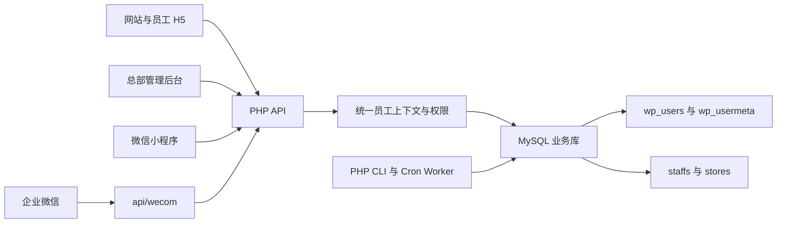
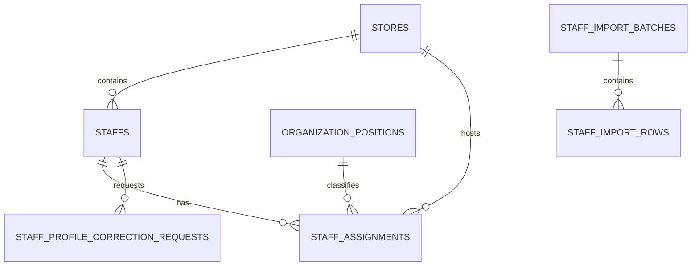

# 追光小牛企业内网架构

## 概述

追光小牛企业内网服务于青少儿体能培训业务，覆盖员工认证、学习考试、知识库、AI 演练、工作量填报、总部运营、制度通知、提醒和企业微信协作。系统同时提供浏览器 H5、管理后台和原生微信小程序入口。

应用采用直接部署结构。静态 HTML、CSS 和原生 JavaScript 负责网站与 H5，原生微信小程序负责移动端，PHP 文件直接提供 HTTP API 与后台 Worker，MySQL 保存 WordPress 身份数据和业务数据。

当前可确认的稳定入口记录在 `real_sync/ENTRY_GUIDE.md`：

- `/internal.html`：员工工作台
- `/mobile/login.html`：员工登录
- `/mobile/mine.html`：员工个人中心
- `/admin/dashboard.html`：总部后台

## 技术栈

| 层级 | 技术 | 说明 |
| --- | --- | --- |
| 网站与 H5 | HTML、CSS、原生 JavaScript | 页面直接部署到 Web 根目录 |
| 小程序 | 原生微信小程序 | 主要工程位于 `real_sync/mini-program/` |
| 后端 | PHP、PDO | API 文件按业务目录组织 |
| 数据库 | MySQL | 同库存放 WordPress 与企业内网业务表 |
| 身份 | WordPress 用户表、JWT、PHP Session | JWT 是移动端和 API 的主要凭据 |
| 后台任务 | PHP CLI、Cron | 同步、提醒、统计和异步分析 |
| 自动测试 | Node.js 内置测试运行器、PHP 脚本 | 新迁移使用 Node 契约测试 |

PHP、MySQL、WordPress 和 Web Server 的精确生产版本需从部署环境确认。

## 项目结构

```text
real_sync/
├── admin/                    # 总部和系统后台页面
├── api/                      # PHP API 与 Worker
│   ├── admin/                # 后台管理接口
│   ├── common/               # 员工上下文与权限公共层
│   ├── workload/             # 工作量填报、审核和统计
│   ├── wecom/                # 企业微信身份、同步和消息
│   └── ...                   # 学习、考试、知识、提醒等业务域
├── database/
│   ├── migrations/           # 版本化增量迁移
│   └── *.php                 # 历史导入脚本
├── mini-program/             # 主要微信小程序工程
├── mobile/                   # 员工 H5 与历史移动端工程
├── scripts/                  # 测试、审计、备份和维护脚本
├── wp-content/               # WordPress 主题内容
├── courses/ lessons/         # 培训内容
├── training/ skills/         # 训练与技能内容
├── internal.html             # 员工工作台入口
└── index.html                # 品牌网站入口
```

## 系统边界



## 身份与权限

身份主链为 `wp_users.ID -> staffs.user_id -> staffs.store_id -> stores.id`。WordPress 用户记录负责登录账号，`staffs` 保存员工业务身份、角色和门店归属。

`real_sync/api/common/context.php` 负责生成统一员工上下文，包含用户 ID、员工 ID、姓名、电话、规范化角色、门店、微信绑定、企业微信绑定和数据操作范围。`real_sync/api/admin/common.php` 在此基础上提供后台权限检查。

权限范围分为总部全局、店长所属门店和员工本人。系统兼容销售、教练、店长、运营、财务、管理员、负责人和普通员工等历史角色值。

后台员工与组织管理通过 `adminRequirePermission()` 检查具名权限点。总部运营 `operation` 和系统管理员 `admin` 共同拥有员工全量查看、新增、编辑、离职、恢复、密码重置、误建清理、组织维护、高权限角色管理和员工审计查看权限；`system.settings` 仅授予系统管理员。权限判定优先使用员工档案中的规范化系统角色，员工档案缺失时才回退到 WordPress 用户角色。

## 核心子系统

### 认证与账号

- 位置：`real_sync/api/auth-jwt.php`、`real_sync/api/auth/`
- 职责：账号密码登录、微信登录与绑定、企业微信登录与绑定、Token 验证和刷新
- 数据：`wp_users`、`wp_usermeta`、`staffs`、设备与登录审计表

员工 JWT 在签发时写入 `staffs.session_version`。每次受保护请求同时校验 WordPress 账号状态、员工启用状态、生命周期状态和令牌会话版本；任一状态变化造成版本不一致时，旧令牌无法通过认证。员工启停编辑和离职归档在各自事务中递增会话版本，恢复或重新启用只允许新签发的令牌访问。

`IdentityConsistencyService` 在同一事务中锁定员工、WordPress 账号和角色元数据，统一写入员工系统角色、`wp_capabilities`、`wp_user_level` 和会话版本。管理员映射为 WordPress `administrator`，店长映射为 `zgxn_store_manager`，其他业务角色映射为 `zgxn_staff`。员工编辑强制轮换会话版本，离职恢复复用恢复事务已经完成的轮换。

`PrivilegedRoleGuard` 保护涉及系统管理员的角色变化。另一名在职系统管理员通过确认接口签发 5 分钟 HMAC 令牌，令牌绑定请求人、审批人、目标员工、变更前后角色、目标会话版本、有效期和随机唯一标识。员工编辑或恢复事务锁定目标员工后重新校验令牌；审计仅保存审批标识和权限前后快照。停用、离职或降权管理员时，服务按稳定顺序锁定全部在职员工并统计规范化管理员角色，最后一个在职系统管理员会返回保护冲突。

`PasswordPolicy` 为员工创建、管理员密码重置和本人改密提供统一策略，默认至少 10 位并包含大写字母、小写字母、数字和特殊字符，最小长度可通过 `PASSWORD_MIN_LENGTH` 调整。管理员重置密码在事务中递增员工会话版本；本人改密同样轮换版本，并返回绑定新版本的替换 JWT 以延续当前登录。

### 工作量治理

- 位置：`real_sync/api/workload/`、`real_sync/api/admin/workload/`
- 客户端：`real_sync/mobile/workload-v2.html`、`real_sync/mini-program/pages/workload/`
- 职责：草稿、日报提交、凭证、审核、员工与门店统计
- 数据：日报、指标值、凭证和审核任务表

`WorkloadObligationService` 按上海业务日期读取当天生效的员工任职，只为启用门店和启用岗位中的销售、教练生成日报义务。周一义务写为 `exempt/weekly_rest_day/exempt`，周二至周日写为 `required/scheduled/missing`，截止时间统一为次日 `00:00:00`。候选任职、已有义务和幂等写入共享同一事务视图；同员工、门店和规范角色的重复任职会折叠，历史角色别名义务在重跑时沿用原角色值，已关联日报或已完成状态保持不变。

`real_sync/api/workload/obligation-worker.php` 提供 PHP CLI 入口，可接收 `YYYY-MM-DD` 业务日期；缺省日期取上海当天，并输出候选数、新增数、已存在数、应交数和豁免数的 JSON 汇总。

`WorkloadObligationBackfillService` 负责已结束业务日期的历史回填。服务先按日报保存的日期、门店、员工和原始角色建立已知义务，再按带生效区间的销售、教练任职补齐可确认缺交；当前门店或岗位字典状态不会覆盖历史任职事实。历史角色别名通过规范角色键折叠到已有义务，日报覆盖任职候选，所有新增记录标记 `source=backfill`。回填在一个事务内执行，重复运行沿用已有角色值，并保护已关联日报和 `corrected` 状态。

`real_sync/api/workload/obligation-backfill-worker.php` 提供单日或日期范围 CLI 入口，日期范围必须早于上海当天，输出日报快照、任职候选、日报覆盖、新增和已存在义务数量的 JSON 汇总。

`WorkloadReportStateService` 负责日报与义务状态机。员工保存链路先使用数据库 `UTC_TIMESTAMP()` 转换为上海时间校验业务日期，在同一 PDO 事务中锁定日报、写入项目值与审核任务、同步唯一义务，并在提交前再次校验截止时间。次日 `00:00:00` 起员工入口关闭；状态查询在锁定 Worker 尚未执行时也会将到期的 `missing` 或 `draft` 派生为 `locked_missing`。

`real_sync/api/workload/obligation-lock-worker.php` 将已到截止时间的应交 `missing` 和 `draft` 义务批量转换为 `locked_missing`。锁定日报通过 `real_sync/api/workload/correct-report.php` 进入门店范围授权的管理更正事务，事务更新日报与项目值、同步义务为 `corrected`，并向 `workload_report_corrections` 写入前后快照、更正原因和操作人。更正事务同时废止当前审核任务、保留版本历史及真实管理操作人，并按日报绑定规则为更正值创建新的 `pending` 审核任务。

`WorkloadSourcePolicyService` 统一登记来源校验与经营统计来源范围。初始生产来源 `h5`、`mini_program` 默认计入经营统计，合成来源保留在日报、凭证和审计链路中并从经营驾驶舱、总部、门店、员工经营下钻及后台汇总中排除。所有经营入口通过 `workload_source_policies.included_by_default` 读取同一策略。

`WorkloadMetricVersionService` 从 `workload_metric_versions` 按生效时间和 ID 确定当前口径，解析来源、义务和有效值策略，并为统计响应、权限隔离缓存键、导出口径说明和审计上下文提供同一版本元数据。日报保存时绑定当前 `metric_version_id`，经营查询响应同时披露版本编码、生成时间、筛选条件、来源范围和口径说明。

`WorkloadRoleRuleVersionService` 按岗位和业务日期的闭区间选择生效规则，同一生效日期按较大 ID 确定优先级。首个销售与教练版本保留至少四个正数项目，并统一校验岗位必填、零值、数值范围和凭证数量；模板接口展示同一版本的项目约束。日报保存时绑定 `rule_version_id`，后续凭证上传和待补凭证计算优先读取已绑定版本，使历史日报在规则升级后继续沿用提交时口径。

`WorkloadRoleRuleAdminService` 管理启用业务岗位的工作量标准生命周期。草稿可维护基本信息及项目规则，已发布版本通过复制生成新草稿并保留差异；发布事务锁定岗位字典和同岗位版本，确保闭区间互斥，并为每个发布版本创建独立日报模板，防止待生效配置提前改变现行填报项目。发布与停用均保存操作审计、幂等响应和岗位日期范围缓存失效信息；历史日报继续读取项目名称、单位和值类型快照。

`WorkloadAuditTaskService` 将每次提交产生的审核任务保存为不可变版本链。后台审核只允许当前 `pending` 任务迁移到 `approved`、`rejected` 或 `needs_resubmit`，驳回和补凭证动作保存必填意见及审核时凭证数量。已提交日报仅向本人当前 `needs_resubmit` 任务开放凭证补充；授权检查、日报与任务锁、数量校验和凭证写入共享同一事务。员工重新送审或管理更正时，服务将旧任务迁移为 `superseded` 并保留审核状态、意见、审核人和审核时间，再创建递增 `task_version` 的 `pending` 任务，通过 `previous_task_id` 关联前序版本；替换日志记录实际操作人和对应原因。员工重复重审请求返回同一当前后继任务。所有状态变化写入 `workload_audit_logs`，审核列表和经营统计默认过滤已废止版本；历史列表从最后一条迁移到 `superseded` 的日志恢复废止前状态，作为 `trace_status`。

`WorkloadEffectiveValueService` 统一生成单行和聚合 SQL，并提供 PHP 行级计算与四值聚合。`raw_value` 取日报项目原值；全量审核的 `pending`、`approved`、`rejected` 任务分别将原值计入 `pending_value`、`effective_value`、`rejected_value`，`needs_resubmit` 不计入三个状态值；非全量审核项目的有效值等于原值。规则优先读取日报绑定的 `workload_role_metric_rules`，未绑定历史日报回退到旧 `workload_metric_rules`。经营统计、明细、排名兼容字段和后台汇总沿用原始值、待审核值与有效值，审核列表额外返回驳回值并使用 `trace_status` 重放历史版本。

`WorkloadAnalyticsQueryService` 是新统计接口和导出的统一事实与聚合内核。服务规范化日期、门店、岗位、员工、项目、日报状态、审核状态和来源筛选，将请求筛选与员工本人、店长当前有效管理任职门店或总部全量权限取交集，再以参数化 SQL 返回 `business_date + store_id + staff_id + role_code + metric_code` 粒度记录。默认来源读取经营来源策略；显式来源必须已登记。每条事实包含日报状态、审核状态、凭证数以及原始值、待审核值、有效值和驳回值，当前审核任务按版本与 ID 唯一选取。聚合层只纳入已提交日报，按项目和日报 ID 去重，计算四值总量、项目选取率、有效选取率、零值率、员工覆盖率、门店覆盖率、全体员工人均、参与员工人均和每应交人日均值。比例与均值均披露分子、分母和值；样本少于 10 份已提交日报或 3 名已提交员工时返回 `low_sample=true`。统计组合响应复用 `WorkloadMetricVersionService` 的口径元数据，并将数据库生成时间同时作为 `data_cutoff_at`。

`WorkloadStoreAnalyticsService` 在统一事实内核上组合日报义务与门店项目矩阵。`GET /api/workload/analytics/store-completion.php` 先以同一筛选和权限范围读取 `required_status=required` 的历史义务快照，再按门店和日期统计五类完成状态；`submitted` 与 `corrected` 构成完成率分子，公休日通过周期日历展示并从义务分母排除。来源范围之外的已关联日报在经营完成口径中归入 `missing`，同时增加 `excluded_source_count` 并保留存储状态用于审计。项目矩阵按门店、岗位和项目返回四值、岗位应交人日均值、全部义务员工人均值、提交员工口径、义务员工覆盖率、员工单元格、低样本状态以及门店间有效值与原始值密集排名；无日报的适用项目和员工仍生成零值单元格。

`WorkloadMetricSelectionService` 在同一事实、义务和口径元数据上构建项目、门店与员工三层分析。`GET /api/workload/analytics/metric-selection.php` 按岗位和项目隔离聚合，项目层返回选取率、有效选取率、零值率、员工覆盖率、门店覆盖率、四值、三类均值、样本状态及覆盖和数值排名；门店层增加有效值、原始值和员工覆盖排名，以及全部门店均值和前 25% 有效值参考；员工层增加门店内排名、当前权限范围内全部门店同岗位排名及对应有效值均值。服务从应交义务和启用项目目录补齐无事实项目、门店和员工的零值行，并以 `has_pending_review` 标识存在待审核事实的统计单元。

`WorkloadStaffProfileService` 组合统一事实、日报义务、项目目录、凭证、当前审核任务和项目排名，形成员工周期画像。`GET /api/workload/analytics/staff-profile.php` 要求目标员工和日期范围，支持 `day`、`week`、`month` 三种趋势粒度；响应按历史日期、门店和岗位快照合并义务与日报，为每个适用项目补齐四值、凭证及审核信息。员工本人固定本人范围，店长只能读取当前或周期历史位于授权门店的员工，总部角色使用全量范围。画像同时复用项目排名服务返回门店内与全部可见门店同岗位排名和均值，并计算员工有效值前 25% 参考。对比层排除周一，向前解析四个具有相同营业日数的周期，返回上期值、变化量、变化率、可解释状态、过去四期均值和两期样本状态。

`WorkloadBusinessPeriodService` 统一解析 `day`、`business_week`、`month_to_date`、`full_month`、`quarter` 和 `custom` 六种营业日周期。周期固定排除周一，业务周为周二至周日；自然月和季度保留完整日历边界，自定义周期限制为 366 天。服务同时返回完整本期、语义上期和按两期较少营业日数截齐的本期与上期比较窗口，并披露截齐数量及两侧截断标志，使后续环比服务兼顾完整周期展示和等营业日比较。

`WorkloadComparisonService` 作为无数据库依赖的通用环比与基准内核，统一返回本期值、上期值、变化量、变化率、`comparable|new|flat|down_to_zero` 状态、过去四期均值、两期样本量和低样本标志。服务同时提供带分子分母的均值和前 25% 参考值；员工画像使用该服务生成项目环比及员工前 25% 参考，项目选取服务使用该服务生成全部门店均值、同岗位均值和门店前 25% 参考。

`WorkloadCrossAnalysisService` 在统一事实与日报义务上构建门店、项目、员工和时间二维矩阵。主维度和次维度可从 `store|metric|staff|time` 中选择且必须互异；时间维度支持日、周二至周日业务周、月和季度。事实提供四值、选取和样本，义务提供应交人日、完成率和义务员工覆盖率；项目维度按岗位适用项目补齐零值单元。矩阵单元返回有效值密集排名及通向最细事实接口的完整筛选参数，查询范围继续复用统一权限内核。

周期与交叉聚合集成测试使用同一内存事实集验证周一排除、跨月和跨季度周期对齐、低样本传播、上期为零的环比状态、历史门店快照及门店员工交叉单元守恒，作为交叉分析端点的跨服务回归门禁。

正确性属性 16 使用 128 个固定种子、每个 256 个随机周期场景，验证日、业务周、月累计、完整月、季度和自定义周期的比较窗口始终包含相同数量的营业日，并覆盖周一、闰年、跨月和跨季度边界。

正确性属性 17 使用 128 个固定种子数据集和全部 12 个互异主次维度组合，验证交叉矩阵单元汇总后的四项数值等于最细事实记录聚合值，同时验证重复的日报项目事实键只计入一次。

`WorkloadPermissionScopeService` 统一解析工作量数据范围和排名可见范围：普通员工返回本人范围，店长从当前有效的主/辅任职记录汇总授权门店，总部运营和具备全量查看权限的角色返回全部范围；系统管理员额外返回配置管理能力。统计查询服务通过适配层调用该服务，并将权限错误统一转换为工作量查询错误。

统计、项目选取、员工画像、门店分析、交叉分析和明细下钻均通过 `WorkloadAnalyticsQueryService::facts()` 获取权限过滤后的事实；明细服务只对过滤结果分页。权限响应同时提供 `can_export`，供标准导出入口复用同一范围契约。

权限矩阵集成测试覆盖员工本人、店长单店、多店授权、总部运营和系统管理员，并验证历史事实使用记录中的门店快照参与范围判断。

正确性属性 18 以固定种子生成员工、授权门店和全量事实，验证 `self`、`stores`、`all` 三种范围的每条事实可见性判定与权限矩阵一致。

`WorkloadExportService` 复用门店周期完成和项目选取统计服务生成同步 UTF-8 CSV。导出继承统计筛选、权限范围和口径版本，门店文件按日期、门店、岗位聚合日报义务状态，项目文件按岗位项目输出样本、选取、覆盖和数值指标。

同一导出服务还支持个人全数据和项目全维度事实明细，直接复用 `WorkloadAnalyticsQueryService::facts()`，保留日报、项目、凭证、审核和四类值字段，确保页面明细与导出使用相同权限和统计事实。

`WorkloadExportJobService` 管理超过 20,000 行的异步导出任务。任务保存发起人、筛选条件、权限范围哈希、口径版本、状态和有效期；CLI worker 使用行锁领取任务，在生成前重建当前员工上下文并校验权限哈希，完成后将文件写入受控目录。状态查询和下载阶段再次校验任务所有者、当前权限范围、有效期和规范化文件路径。

`WorkloadOperatingFunnelService` 复用统一事实和项目聚合内核构建销售漏斗与教练计划完成分析。`GET /api/workload/analytics/operating-funnel.php` 返回新增资源、实际邀约、实际到店、成交人数和新签金额五个阶段的四值及样本状态，并按统计截止日选择生效的项目关系版本。销售资源到邀约、邀约到店、到店成交，以及教练实际耗课除以计划耗课、实际沟通除以计划沟通均由关系明细确定分子和分母；结果同时披露有效值比率、原始值比率、低样本和待审核标志。分母为零时通过 `new` 或 `empty` 状态解释结果。

`scripts/workload_analytics_filter_aggregation.test.mjs` 为统计内核提供过滤与聚合守恒回归。测试验证九维筛选按交集组合、默认经营来源隔离、日报历史门店与岗位快照、全部审核状态的四值映射、空数据和低样本边界、按互斥门店分区后的可加字段守恒，以及重复日报事实按 `report_id` 去重。

`scripts/workload_store_required_detail_conservation.property.test.mjs` 验证正确性属性 4。门店应交汇总和下钻明细共享 `required_status=required` 的义务单元集合与日期、门店、员工、岗位、完成状态筛选；各门店 `required_count` 及其总和必须分别等于对应明细数量。公休日豁免和范围外历史快照对该汇总贡献为零。

`scripts/workload_completion_status_count_conservation.property.test.mjs` 验证正确性属性 5。测试将 `required_status=required` 的义务划分为 `missing`、`draft`、`submitted`、`locked_missing` 和 `corrected` 五个互斥完成状态桶，在随机状态转换和日期、门店、员工、岗位组合范围下持续验证五类计数之和等于应交义务数；公休日 `exempt` 义务从分母和状态桶中排除。

`scripts/workload_selection_rate_numerator.property.test.mjs` 验证正确性属性 6。统计内核先按指标保留已提交日报，再以 `report_id` 去重；两位小数舍入后 `raw_value > 0` 的日报构成项目选取率分子，因此该分子始终是已提交日报分母的子集。测试覆盖随机混合指标事实、草稿、无效事实、重复日报、指标隔离、舍入边界和空输入。

`scripts/workload_store_completion_analytics.test.mjs` 锁定门店周期完成端点的认证、GET 方法、结构化异常和审计契约，并以状态模型验证义务状态守恒及来源排除。测试同时检查门店项目矩阵的四值、岗位义务分母、员工交叉单元、覆盖率、零值补齐、下钻令牌和按项目隔离的双排名字段。

`scripts/workload_metric_selection_analytics.test.mjs` 锁定项目选取端点的认证、GET 方法、统一事实聚合复用和审计契约。测试同时验证项目五类比例与四值字段、适用项目和应交员工零值补齐、门店基准、项目隔离排名及员工门店内和全部门店同岗位双层排名。

`scripts/workload_staff_profile_analytics.test.mjs` 锁定员工画像端点的认证、员工参数、结构化异常和审计契约。测试验证统一事实与排名服务复用、义务和日报完整记录、凭证与审核意见、四值、项目零值补齐、日周月趋势、等营业日上期、过去四期均值、低样本状态及本人、授权门店和总部三类权限范围。

### 学习与能力建设

- 位置：`real_sync/api/learning/`、`knowledge/`、`exam/`、`pass/`、`drill/`
- 职责：课程学习、知识检索、考试、通关、AI 演练和进度统计

### 总部运营后台

- 位置：`real_sync/admin/`、`real_sync/api/admin/`
- 职责：员工、工作量、学习、考试、系统审计和安全管理
- 主要员工入口：`real_sync/admin/staffs.html`
- 员工新增服务：`real_sync/api/admin/services/StaffLifecycleService.php`
- 员工目录服务：`real_sync/api/admin/services/StaffDirectoryService.php`
- 员工关联检查服务：`real_sync/api/admin/services/StaffAssociationService.php`
- 高权限角色保护：`real_sync/api/admin/services/PrivilegedRoleGuard.php`
- 员工新增接口：`POST /api/admin/staff/create.php`
- 员工目录接口：`GET /api/admin/staff/list.php`、`GET /api/admin/staff/detail.php`

### 企业微信

- 位置：`real_sync/api/wecom/`
- 职责：部门与成员同步、身份绑定、候选匹配、一致性审计、消息日志与重试、加密回调
- 运行方式：HTTP 入口与 PHP CLI Worker

## 员工与组织数据模型

版本化迁移 `real_sync/database/migrations/202607240001_staff_organization.sql` 建立员工组织治理基础。



迁移扩展：

- `staffs`：生命周期、离职信息、会话版本和当前主岗位引用
- `stores`：稳定门店编码和负责人引用
- `organization_positions`：岗位编码、名称、适用系统角色、排序和状态
- `staff_assignments`：员工主岗与兼岗的生效区间历史
- `staff_import_batches`、`staff_import_rows`：可追踪、可重试的导入结果
- `staff_profile_correction_requests`：员工资料更正申请及处理状态

迁移通过 `information_schema` 条件补列和补索引，预置标准岗位，并将现有 `role`、`job_title`、`store_id` 映射为当前主岗位和首条任职记录。新表暂未配置显式外键，应用服务负责引用完整性和任职区间约束。

## 数据库演进

数据库结构通过版本化迁移运行器维护，部分历史模块仍保留请求期间结构初始化逻辑：

- `real_sync/database/migrations/` 中的版本化 SQL
- `real_sync/database/MigrationRunner.php` 中的版本记录、校验和、结构核验和差异输出
- `real_sync/scripts/migrate.php` 提供的 `apply`、`status`、`verify` 和 `rollback-plan` 命令
- 历史 API 中尚待后续迁移收口的结构初始化逻辑

运行器通过 `schema_migrations` 保存 `running`、`applied` 和 `failed` 状态。已执行迁移的 SHA-256 校验值变化会阻止继续执行；结构清单位于 `real_sync/database/migration_manifest.php`。保留式回滚计划恢复旧应用入口并保留增量表与字段。

工作量治理迁移 `real_sync/database/migrations/202607240002_workload_governance.sql` 在现有日报事实表之上增加以下数据基础：

- `workload_submission_obligations`：按日期、门店、员工和岗位固化日报义务。
- `workload_source_policies`：区分生产来源与合成来源。
- `workload_metric_versions`：保存统计口径及生效时间。
- `workload_role_rule_versions`、`workload_role_metric_rules`：保存岗位规则版本和项目级校验元数据。
- `workload_alert_rules`、`workload_alert_events`：保存预警规则与幂等事件。
- `workload_export_jobs`：保存异步导出任务、权限范围摘要和生命周期。
- `workload_report_corrections`：保存管理更正前后快照与操作人。

迁移为历史日报绑定初始口径与岗位规则版本，并先根据已有日报回填可确认的历史义务。周一历史日报义务标记为公休日豁免，其他历史日报按已知提交状态回填。迁移后由 `WorkloadObligationBackfillService` 使用历史日报快照和有效任职补齐历史范围，由 `WorkloadObligationService` 按业务日期增量生成当前义务；数据库唯一键 `(obligation_date, store_id, staff_id, role_code)` 提供最终幂等约束。

操作审计迁移 `real_sync/database/migrations/202607240003_admin_operation_audit.sql` 预先创建 `admin_operation_logs`，使员工新增事务写入审计时无需在事务期间首次创建表。

工号序列迁移 `real_sync/database/migrations/202607240004_staff_employee_number_sequence.sql` 创建 `staff_employee_number_sequences`。每个工号前缀对应一个事务锁定的序列值，避免并发创建读取相同的当前最大工号。

审核历史迁移 `real_sync/database/migrations/202607240005_workload_audit_task_history.sql` 为审核任务增加 `task_version`、`previous_task_id` 和 `superseded_at`，并建立报告指标历史、前序版本和当前审核积压索引。迁移保留现有任务并将其视为版本 1。

审核重审迁移 `real_sync/database/migrations/202607240006_workload_audit_resubmission.sql` 为审核任务增加 `evidence_count_at_review`，记录审核人员要求补凭证时的凭证数量。重审服务据此判断员工是否新增凭证；历史空基线任务使用审核时间作为兼容判断依据。

项目关系迁移 `real_sync/database/migrations/202607240007_workload_metric_relations.sql` 创建 `workload_metric_relation_versions` 和 `workload_metric_relations`。版本头使用闭区间生效日期和状态确定统计截止日口径，关系明细保存关系分组、岗位、分子项目、分母项目和排序。初始版本配置三段销售转化率及两项教练计划完成率，后续经营项目关系通过新增版本演进。

## 员工新增事务

`StaffLifecycleService::create()` 在单个 PDO 事务中完成以下流程：

1. 校验姓名、手机号、门店、岗位、角色、可选工号、账号、邮箱、入职日期，并通过 `PasswordPolicy` 校验初始密码。
2. 锁定并核验启用门店、启用岗位及岗位适用角色。
3. 缺少工号时锁定序列行，并按 `STAFF_EMPLOYEE_NO_PREFIX`、`STAFF_EMPLOYEE_NO_WIDTH` 和 `STAFF_EMPLOYEE_NO_START` 生成可用工号。
4. 检查员工与 WordPress 身份冲突；冲突异常携带字段集合和脱敏档案摘要。
5. 创建 WordPress 账号和 `staffs` 档案，通过 `IdentityConsistencyService` 写入统一 WordPress 角色元数据，再创建 `staff_assignments` 主任职。
6. 写入脱敏后的 `admin_operation_logs` 操作审计并提交。

任一步骤抛出异常时事务回滚。接口授权范围为总部运营和系统管理员角色。

## 员工目录查询

`StaffDirectoryService` 为新旧员工列表入口和员工详情提供统一查询。列表支持关键词、门店、主岗位、角色、生命周期、离职范围与分页；详情组合当前任职、完整任职历史、WordPress 账号状态、工作量与学习业务计数、设备、登录审计和状态相关操作。查询字段均为显式白名单，手机号、账号、设备标识和登录来源地址按访问角色返回原值或脱敏值。

后台员工一览 `admin/staffs.html` 直接调用 `api/admin/staff/list.php` 和 `api/admin/staff/detail.php`，门店与主岗位筛选分别读取组织字典接口。生命周期为空时列表显式传递 `include_offboarded=1`，使在职、停用和离职档案处于同一管理视图。页面使用三个轻量目录请求汇总生命周期数量，并通过数据健康接口展示异常总数；当前筛选结果使用主分页响应的总数。

桌面表格与 `760px` 以下员工卡片共用同一列表数组，字段和详情入口保持一致。加载、空结果、请求错误、详情加载和详情错误均提供稳定的 `data-testid` 与可访问状态区域，便于契约测试和回归验证。

新增员工入口使用三步抽屉收集基础资料、主门店与主岗位、系统角色、登录账号和初始密码。前端仅展示启用的组织字典，进入确认步骤前执行字段与密码规则校验，并以脱敏手机号和“密码已设置”状态生成确认摘要。提交期间锁定导航和关闭动作；`POST /api/admin/staff/create.php` 成功后立即确认创建结果，再独立刷新目录与摘要并打开新员工详情，避免刷新异常被误报为创建失败。

员工详情使用模态抽屉呈现基础资料、账号与绑定状态、当前及历史任职、工作量与学习业务摘要、设备登录和统一审计时间线。`StaffDirectoryService` 只返回目标员工最近 20 条操作审计的动作、操作人和时间，不返回前后快照。离职档案的编辑区保持只读；独立风险区接入密码重置、离职归档、恢复与误建清理资格检查，恢复只提供启用的门店和岗位，清理仅在零关联检查签发短时确认令牌后开放提交。所有写操作将事务成功与后续页面刷新分开处理，并使用提交锁防止重复请求。

## 员工批量导入

`StaffImportService` 使用 UUID `batch_key` 串行化同一批次请求，并在 `staff_import_batches`、`staff_import_rows` 中保存批次状态、文件摘要、逐行脱敏摘要、校验结果、员工 ID 和重试次数。每个待处理行独立调用 `StaffLifecycleService::create()`，因此账号、档案、主任职和操作审计沿用单员工创建事务；单行失败不会回滚其他成功行。

首次执行处理 `pending` 行，部分失败重试仅处理 `failed` 行，已经成功的员工保持原结果。完成批次重复请求直接返回原结果，处理中批次和行数变化的重试返回冲突。HTTP JSON、CSV/JSON 文件和 CLI 入口共用该服务；持久化摘要排除初始密码并脱敏手机号、账号和邮箱。

后台批量导入工作区在浏览器中读取 CSV 或 JSON，提供带 UTF-8 BOM 的 CSV 模板，并按中英文字段别名自动映射到员工创建字段。管理人员可调整映射并查看逐行格式预检查；全部预检查通过且总行数不超过 1000 时，页面以 JSON `records` 调用导入端点。批次结果同时提供桌面表格和窄屏卡片，展示每行成功、失败、重试次数与服务端校验说明；部分失败时页面保持相同记录顺序，并携带服务返回的 `retryable_batch_key` 重试原批次。

## 员工目录导出

`StaffDirectoryService::export()` 复用员工列表的关键词、门店、岗位、角色和生命周期筛选，以及相同的敏感字段策略。`GET /api/admin/staff/export.php` 以每页 100 行流式输出 UTF-8 CSV，固定字段白名单覆盖员工基础资料、当前组织、生命周期和账号状态，单次最多 20,000 行。CSV 单元格对 `= + - @` 公式前缀增加文本转义。

## 员工数据健康检查

`StaffDataHealthService` 实时读取员工、组织字典和 WordPress 身份数据，检查重复工号、重复手机号、同一账号关联多个员工、在职员工引用缺失或停用的门店与岗位、员工角色和 WordPress 能力不一致，以及员工档案与内部账号之间的孤立关系。`GET /api/admin/staff/data-health.php` 使用 `staff.audit_view` 具名权限，返回检查时间、健康状态、问题总数、分类计数和显式字段问题清单；手机号和账号按访问角色执行脱敏。检查过程只读，数据修复后的下一次请求会重新计算并关闭对应问题。

后台数据健康工作区将七类问题分别展示为分类计数与问题卡片。具有员工标识的问题可直接打开员工详情，其他孤立身份进入员工修复上下文；修复操作继续由现有员工和组织管理接口执行并记录审计。页面复用首页健康摘要的首次结果，并提供“重新检查”动作执行实时复检，明确显示检查时间、健康状态、加载与错误状态。

## 员工本人档案与更正申请

`StaffProfileService` 为 `GET /api/staff/profile.php` 提供本人姓名、工号、门店、主岗位、当前兼岗、入职日期和账号状态的只读投影。员工通过 `GET|POST /api/staff/profile-corrections.php` 查询自己的申请并提交姓名、手机号、门店、主岗位或入职日期更正；服务在事务中锁定员工，保存当前值与期望值快照，并对相同待处理变更保持幂等。总部运营和系统管理员通过 `GET|POST /api/admin/staff/profile-corrections.php` 分页查询及批准或驳回申请，处理状态、意见、人员、时间和操作审计对员工可追踪。审批只记录处理结论，实际档案变更继续使用员工编辑事务。

## 组织字典服务

`OrganizationService` 作为组织域服务入口，当前实现岗位与门店字典查询、创建、编辑和状态变更。岗位写入统一校验稳定编码、名称、适用系统角色、排序和状态；门店写入统一校验编码、名称、负责人、排序和状态。两类写操作都在事务内执行编码唯一性检查、行锁和操作审计。

岗位停用前同时检查 `staffs.primary_position_id` 指向的当前有效员工，以及 `staff_assignments` 中当前日期有效的任职。存在当前引用时服务返回引用冲突；已结束任职保留在历史表。员工新增服务仅接受 `organization_positions.status=1` 的岗位，因此停用岗位不会进入后续员工选择流程。

门店停用前同时检查 `staffs.store_id` 指向的在职员工，以及 `staff_assignments` 中属于在职员工的当前有效任职。服务通过 `manager_staff_id` 保存负责人稳定引用，并同步旧后台使用的 `manager_name`。员工创建和导入链路在事务内锁定启用门店，避免门店停用与员工写入并发穿透。

任职写入由 `OrganizationService::changePrimaryAssignment()`、`createSecondaryAssignment()` 和 `endSecondaryAssignment()` 负责。服务先锁定在职员工，再锁定启用门店、启用岗位和该员工全部任职记录。任职日期使用闭区间；生效日为 `E` 的主岗变化将覆盖 `E` 的旧主岗结束日设为 `E - 1`，并为新主岗创建从 `E` 开始的记录。若后续已有计划主岗，新记录结束于下一条主岗开始日前一天。

同日同内容的主岗变化和完全相同的兼岗创建返回幂等结果，同日不同主岗或相同职责的兼岗区间重叠返回冲突。已结束历史任职保持只读。当前或追溯生效的主岗变化会按当前日期有效主岗同步 `staffs.store_id`、`primary_position_id`、`role` 和兼容字段 `job_title`；未来生效变化保留现有快速字段。任职写操作保存变更原因、操作人员工 ID 和操作审计前后快照。

组织架构树由 `OrganizationService::getOrganizationTree()` 聚合。服务先读取一次数据库业务日期，再以该日期筛选启用门店、启用岗位、在职员工和闭区间内有效任职，构建“总部 → 门店 → 岗位 → 员工”层级。启用但暂无任职的门店保留为空节点；同一员工的主岗和多个兼岗按独立任职关系进入对应岗位节点。响应同时提供门店、岗位、员工任职平铺列表与去重人员、任职类型计数，不包含手机号、账号和微信绑定字段。

后台 `admin/staffs.html` 将组织域拆分为组织架构、门店设置和岗位设置三个工作区。组织架构工作区消费同一份 `tree`、`list` 和 `summary`，支持树形层级与平铺任职切换；门店和岗位工作区消费字典接口的稳定排序与引用摘要。两类设置共用可访问抽屉和提交锁，事务成功后依次刷新字典与组织树。停用动作先展示当前员工、有效任职和历史任职计数，当前引用由前端预检与后端 HTTP 409 共同阻断。桌面表格在 `760px` 以下切换为同数据源卡片，工作区标签保持横向滚动。

员工详情、新增员工和组织设置使用统一模态抽屉焦点模型。打开时记录触发控件并将焦点移入当前抽屉，Tab 与 Shift+Tab 在最上层可见抽屉内循环，Escape 按设置、新增、详情顺序关闭，关闭后将焦点返回原触发控件。抽屉均声明对话框标题、描述和模态语义；页面同时提供可见焦点、44px 触控目标、减少动效偏好、窄屏共享数据卡片，以及加载、空数据、错误和完成状态的稳定语义节点。

员工编辑由 `StaffLifecycleService::update()` 提供外层事务。服务锁定员工，校验离职只读、姓名、手机号、阶段、状态、手机号唯一性和必填编辑原因；组织字段变化时，在同一事务内调用支持事务复用的 `OrganizationService::changePrimaryAssignment()`。当前生效组织变化由任职服务同步快速字段，未来变化只创建计划任职。基础状态变化同步 `staffs.lifecycle_status` 和 WordPress `user_status`，员工编辑与任职变更分别记录审计快照。

离职归档由 `StaffLifecycleService::offboard()` 提供。服务要求离职日期、原因和明确确认，在单一事务中锁定员工与离职日有效任职，将离职日保存为最后在岗日并关闭延续中的主岗和兼岗，停用员工档案与 WordPress 账号，递增 `session_version`，撤销设备信任、小程序订阅和制度订阅。审计记录员工及任职前后快照、离职信息和各类撤销数量，任一步骤失败时整体回滚。

员工恢复由 `StaffLifecycleService::restore()` 提供。请求重新确认恢复日期、门店、主岗位、系统角色、账号启用状态、完整兼岗清单和原因；恢复日期晚于原离职日期且不能晚于当前日期。服务锁定离职员工和关联 WordPress 账号，恢复账号与生命周期，清空当前离职标记并递增 `session_version`，随后在同一事务中通过组织服务创建新的主岗及兼岗记录。历史任职保持不变，员工恢复审计保留离职快照和新任职结果。

误建清理预检由 `StaffAssociationService::inspectForPurge()` 提供。服务使用固定表名与字段白名单统计登录设备、工作量、学习通关、演练审核、通知消息、积分、组织外部引用和操作人历史；首条主任职作为建档身份基线，额外主岗或任何兼岗均属于阻断关联。可选业务表缺失标记为 `absent`，已存在表缺少预期字段或查询失败会使检查结果不完整并阻止签发。只有完整检查且全部阻断计数为零时，服务才签发有效期 5 分钟的 HMAC 确认令牌；令牌绑定操作者、员工、WordPress 账号、员工会话版本、关联摘要和随机唯一标识，后续清理事务必须重新校验。

受控清理由 `StaffLifecycleService::purgeMiscreated()` 提供。总部运营或系统管理员提交清理原因、明确确认和预检令牌后，服务在单一事务中锁定员工、WordPress 账号和任职记录，重新执行关联检查，再校验令牌签名、时效、操作者、目标账号、工号摘要、员工会话版本和最新关联摘要。通过后按子记录到主记录的顺序删除主任职、员工档案、WordPress 用户元数据和账号，并校验每类删除数量。操作审计在提交前保存员工、账号、任职、关联摘要、清理原因、删除数量和确认令牌唯一标识；完整令牌不会进入审计。关联新增、状态变化、令牌失效、删除计数异常或审计失败均触发整体回滚。

`scripts/staff_lifecycle_integration.test.mjs` 使用跨服务内存状态模型验证离职、恢复、关联预检与受控清理的组合行为。模型覆盖在职和停用员工离职、历史任职保留、零关联清理、业务关联转离职建议、令牌过期和状态失配，并通过确定性事务队列验证令牌签发后新增关联会阻断清理、同一令牌并发清理最多提交一次。

`scripts/staff_session_invalidation.property.test.mjs` 验证正确性属性 22。测试运行 128 组、每组 256 次固定种子的随机登录、停用、启用、离职、恢复和访问操作，并在每一步检查停用或离职时已经存在的全部令牌持续无权访问。

`scripts/staff_purge_association.property.test.mjs` 验证正确性属性 24。测试覆盖登录设备、工作量、学习通关、演练审核、通知消息、积分、其他业务和操作人历史八类阻断关联，运行 128 组、每组 256 份固定种子的随机计数组合；任一业务关联非零时，清理资格、离职建议和确认令牌结果始终保持一致。

`scripts/workload_synthetic_source_zero_contribution.property.test.mjs` 验证正确性属性 10。测试以 128 组固定种子、每组 256 次混合来源写入逐步核对默认经营合计，并以另 128 组纯合成来源数据集验证总计恒为零；合成日报仍保留在按来源审计结果中。测试同时核对迁移中的初始来源分类和全部经营统计入口共享的来源过滤契约。

`scripts/workload_effective_selection_numerator.property.test.mjs` 验证正确性属性 7。测试以 128 组固定种子、每组 256 份随机已提交日报逐步比较原始正数日报数与有效正数日报数，并覆盖审核模式、任务存在性、全部审核状态和两位小数舍入边界。生产契约检查同时约束 `WorkloadEffectiveValueService` 的 PHP 与 SQL 路径，使有效值只取舍入后的原始值或零，从而保持有效选取集合属于原始选取集合。

`scripts/workload_audit_value_traceability.property.test.mjs` 验证正确性属性 8。测试以 128 组固定种子、每组 256 步随机提交、审核、替换和重审操作，逐步核对任务版本、前序链、当前任务唯一性、废止日志以及四值映射。独立日志重放恢复历史任务的废止前状态，生产契约同时约束统一计算器的驳回值和审核列表的 `trace_status`。

## 后台任务

工作量治理新增统一预警编排：`WorkloadAlertService` 生成草稿、缺交、锁定缺交和审核积压事件，`WorkloadRecommendationService` 基于门店完成率、项目选取率和趋势生成带样本证据的建议，`alert-worker.php` 负责幂等计算、重试和运行日志。事件唯一范围约束避免重复通知，处理状态在重复计算时保留。

统计链路通过 `WorkloadAnalyticsCacheService` 使用口径、筛选和权限范围共同构造缓存键，并在日报、审核、更正与义务变化后按范围失效。全维度导出先计数，20,000 行以内使用流式 CSV，超过边界创建权限绑定的异步任务；生成和下载阶段均重新验证发起人和当前权限。

员工 H5 与普通微信小程序共用模板规则和日报状态语义，覆盖只读身份、完成进度、字段级校验、草稿恢复、凭证上传、操作互斥和本人档案。管理后台通过统一分析接口提供门店、项目、员工、审核和全维度五类视图，并提供组合筛选、异步状态、键盘焦点管理和趋势文本摘要。企业微信集成默认保持可恢复停用，配置状态仅系统管理员可读。

代码中可确认的后台任务包括企业微信成员同步、提醒任务、技能录音转写与分析、月度统计、数据导入、备份和审计。部分历史脚本包含固定生产路径，迁移环境前需逐项核对路径和配置来源。

## 架构约束

- 线上目录 `/www/wwwroot/122.51.223.46/` 是业务运行基线，本地开发在 `real_sync/` 完成。
- 数据库变更采用增量迁移，现有 H5、小程序和 API 字段保持兼容。
- 历史工作量中的门店和角色继续作为业务事实快照。
- 认证、角色和数据范围统一从员工上下文层读取。
- 密钥由部署环境提供，仓库文档和示例只使用占位符。
