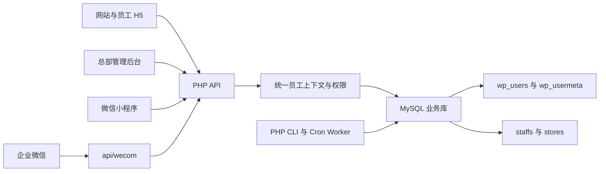
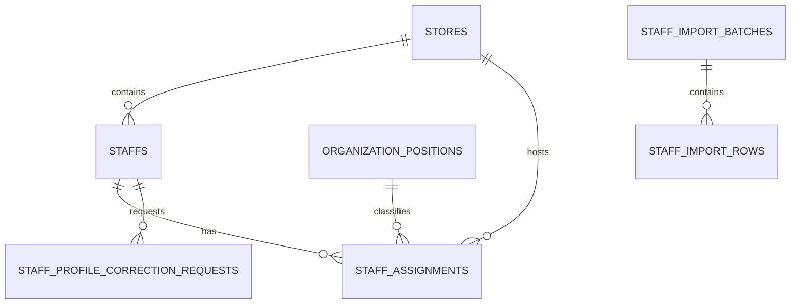

# 追光小牛企业内网架构

## 概述

追光小牛企业内网服务于青少儿体能培训业务，覆盖员工认证、学习考试、知识库、AI 演练、工作量填报、总部运营、制度通知、提醒和企业微信协作。系统同时提供浏览器 H5、管理后台和原生微信小程序入口。

应用采用直接部署结构。静态 HTML、CSS 和原生 JavaScript 负责网站与 H5，原生微信小程序负责移动端，PHP 文件直接提供 HTTP API 与后台 Worker，MySQL 保存 WordPress 身份数据和业务数据。

当前可确认的稳定入口记录在 `real_sync/ENTRY_GUIDE.md`：

- `/internal.html`：浏览器兼容启动、登录恢复和受控跳转入口
- `/mobile/login.html`：员工登录
- `/mobile/`：手机、平板和桌面可安装的员工 PWA 唯一启动入口
- `/admin/dashboard.html`：总部后台

## 技术栈

| 层级 | 技术 | 说明 |
| --- | --- | --- |
| 网站与 H5 | HTML、CSS、原生 JavaScript | 页面直接部署到 Web 根目录 |
| 小程序 | 原生微信小程序 | 主要工程位于 `real_sync/mini-program/` |
| 后端 | PHP、PDO | API 文件按业务目录组织 |
| 数据库 | MySQL | 同库存放 WordPress 与企业内网业务表 |
| 身份 | WordPress 用户表、JWT、PHP Session | JWT 是移动端和 API 的主要凭据 |
| 后台任务 | PHP CLI、Cron | 同步、提醒、统计和异步分析 |
| 自动测试 | Node.js 内置测试运行器、PHP 脚本 | 新迁移使用 Node 契约测试 |

PHP、MySQL、WordPress 和 Web Server 的精确生产版本需从部署环境确认。

## 项目结构

```text
real_sync/
├── admin/                    # 总部和系统后台页面
├── api/                      # PHP API 与 Worker
│   ├── admin/                # 后台管理接口
│   ├── common/               # 员工上下文与权限公共层
│   ├── workload/             # 工作量填报、审核和统计
│   ├── wecom/                # 企业微信身份、同步和消息
│   └── ...                   # 学习、考试、知识、提醒等业务域
├── database/
│   ├── migrations/           # 版本化增量迁移
│   └── *.php                 # 历史导入脚本
├── mini-program/             # 主要微信小程序工程
├── mobile/                   # 员工 H5 与历史移动端工程
├── scripts/                  # 测试、审计、备份和维护脚本
├── wp-content/               # WordPress 主题内容
├── courses/ lessons/         # 培训内容
├── training/ skills/         # 训练与技能内容
├── internal.html             # 浏览器兼容启动与受控跳转入口
└── index.html                # 品牌网站入口
```

## 系统边界



## 身份与权限

身份主链为 `wp_users.ID -> staffs.user_id -> staffs.store_id -> stores.id`。WordPress 用户记录负责登录账号，`staffs` 保存员工业务身份、角色和门店归属。

`real_sync/api/common/context.php` 负责生成统一员工上下文，包含用户 ID、员工 ID、姓名、电话、规范化角色、门店、微信绑定、企业微信绑定和数据操作范围。`real_sync/api/admin/common.php` 在此基础上提供后台权限检查。

权限范围分为总部全局、店长所属门店和员工本人。系统兼容销售、教练、店长、运营、财务、管理员、负责人和普通员工等历史角色值。

## 平台 API Kernel

`real_sync/api/kernel/` 是新端点和迁移端点的公共启动层。`PlatformRequestContext` 接收合法 `X-Request-ID` 或生成新请求 ID，并保存 HTTP 方法、URI、客户端、客户端版本、业务域和可选操作者标识；`PlatformApiResponse` 统一 HTTP 状态与 `code`、`message`、`data`、`request_id` 响应包络；`PlatformApiException` 保存稳定业务码、HTTP 状态和安全错误数据。

`api/kernel/bootstrap.php` 只加载核心类型并提供上下文与响应工厂，加载时不连接数据库、不启动 Session，也不读取部署密钥。历史端点继续使用既有公共入口，后续通过兼容控制器分批接入 Kernel。

`PlatformApiLogger` 将请求 ID、业务域、动作、客户端和操作者上下文写为结构化 JSON。`PlatformSensitiveData` 对手机号执行部分掩码，对凭据完整隐藏，对 OpenID、简历、录音、转写和供应商原始响应仅保留类型、SHA-256 与字节数。`PlatformExceptionMapper` 将受控业务异常、输入异常、领域异常和内部异常映射为稳定 HTTP 状态与业务码，内部异常只向客户端返回通用恢复消息。

`PlatformLegacyAuthAdapter` 复用 `appGetCurrentStaffContext()`、底层员工记录和 `adminPermissionsForRole()`，将历史身份转换为 `PlatformAuthContext`。统一上下文保存用户、员工、规范角色、当前门店、岗位、任职、会话版本、具名权限与 `all|stores|self` 数据范围，并提供门店范围交集、员工可见性、认证断言和权限断言；输出排除手机号、OpenID、密码和 Token。

`PlatformStateVersion` 提供乐观锁版本契约。缺少有效版本时抛出 HTTP 400，客户端版本与权威版本不一致时抛出 HTTP 409；冲突数据包含基础版本、当前版本、稳定对象标识、权威状态、恢复动作和可重试标记。成功状态变化通过 `advance()` 生成严格递增版本。固定种子属性测试持续验证任一角色可见数据位于服务端权限矩阵内，以及成功状态变化的版本单调性。

`PlatformApiCompatibility` 为渐进迁移提供兼容门面，在保留端点原有 `data` 业务字段的同时追加 Kernel、响应契约、端点和能力版本。首批接入覆盖员工数据健康、企业微信状态和公开平台能力版本；认证端点通过 `PlatformAuthContext` 复用原具名权限矩阵，统一错误响应、请求 ID 和结构化日志。

`PlatformBusinessDomainRegistry` 登记十三个已接入业务域的稳定功能 ID、代表端点、端点版本、历史消费者与能力元数据。历史 URL 继续作为兼容控制器，统一建立 Kernel 请求和认证上下文、执行方法与权限校验、记录结构化审计，再把业务处理委托给稳定领域服务；响应保留历史业务字段，并通过 `PlatformApiCompatibility` 附加迁移元数据。招聘域登记 `BIZ-010` 至 `BIZ-013`，代表入口为候选人列表。

`PlatformLegacyEndpointGovernance` 以冻结 catalog 管理 29 条历史 endpoint、method、consumer、domain 和 owner 基线。`platformApiContext()` 首次建立请求上下文时委托兼容层记录调用，稳定请求 ID 生成幂等收据，首次收据同步递增聚合计数；统计写入故障只产生脱敏结构化日志，主业务响应继续执行。健康检查将治理 schema 纳入 ready 与 dependencies，退役判断在 schema 差异存在时返回 `schema_not_ready` 阻断项。

历史入口退役采用独立审批状态机。入口需处于 `eligible`、完整观察窗调用量为零、替代入口健康、owner 明确，并具备已批准的双人审批、回滚计划和四项完整证据，方可进入 `deprecated`；审批读取使用行锁并校验终态，提交人与批准人必须分离。实际入口禁用或删除由后续独立收缩批次执行。

六域服务收口关键业务一致性边界：学习课时完成、课程进度与首次积分奖励共享事务和用户行锁；知识可见范围从服务端员工角色与阶段派生；考试草稿把状态版本保存在既有答案元数据中，显式旧版本冲突返回 HTTP 409；制度确认与阅读历史原子提交，站内通知提交后隔离企业微信派发故障。制度发送使用 `policy.notify_send` 具名权限，组织树继续使用 `organization.manage`。

第二批兼容迁移覆盖演练、技能复盘、提醒、企微与内容专题。提醒手工运行和企微手工同步统一写入 `platform_jobs`，由既有 `reminder.schedule.tick` 与 `wecom.members.sync` Handler 执行；查询动作继续沿用历史入口。技能录音由 `PlatformPrivateFileStorage` 写入 Web 根目录外私有存储，业务记录继续保留 `recording_url` 兼容字段，Worker 同时识别私有引用和历史 URL。招聘通过 Adapter 接入统一 AI、OCR、私有文件、任务队列和 outbox，并以具名审批和幂等事务闭环录用转员工。

`PlatformSyncProtocol` 定义多端共享的同步对象、确定性 ETag、A/B/C 陈旧度等级、授权范围摘要、HMAC 签名增量游标、墓碑和版本冲突结构。等级 A 的最大陈旧时间为 30 秒，覆盖提交、审核、联系、演练和上传；等级 B 为 5 分钟，覆盖工作量汇总、员工目录、候选人和待办；等级 C 为 30 分钟，覆盖课程、制度、知识和公开内容。游标绑定当前员工、会话版本、服务端数据范围和查询筛选，范围变化或签名异常要求客户端重新同步。

`PlatformSyncService` 与 `PlatformPdoSyncStore` 使用 `platform_sync_changes` 提供按 `(occurred_at, id)` 稳定排序的增量结果，活动状态进入 `items`，删除、撤销和权限失效进入 `tombstones`。`platform_sync_drafts` 按员工、业务域和稳定对象唯一保存跨设备草稿；客户端提交草稿版本和业务基础版本，服务在行锁事务中递增 `draft_version`，版本冲突返回当前服务端草稿供用户选择。草稿字段按业务域白名单过滤，单条上限 64KB，有效期最长 24 小时。

PWA `DraftStore` 将本地草稿按用户、员工、业务域、对象和 schema 版本组成隔离键，写入前按调用方批准字段裁剪，并将本地 TTL 限制在 24 小时。工作量 H5 以日报日期、门店和岗位组成稳定对象 ID，本地输入即时保存并串行同步服务端版本；网络恢复和会话恢复重新读取服务端草稿，其他设备的不同负载必须由用户选择当前版本或服务端版本。退出、会话撤销和会话版本变化发布 `app-auth:sensitive-clear`，统一清理带敏感草稿前缀的本地记录。Service Worker v5 仅把 DraftStore 运行时代码加入批准应用壳，草稿数据本身不进入 Cache Storage。

`PlatformHealthService` 与 `GET /api/platform/health.php` 提供分层健康检查。`check=live` 只检查应用进程；`check=ready` 检查数据库连通性和迁移 catalog/readiness；`check=dependencies` 追加 `platform_jobs` 队列、Worker 运行能力和外部依赖配置状态。队列检查返回 `oldest_pending_age_seconds`，`pending` 或 `retry_wait` 最老任务达到 300 秒时整体状态降级；仅部署 outbox 结构时队列标记为 `not_configured`。响应通过 Kernel 统一返回 `request_id`、健康状态和时间戳，敏感配置只以已配置布尔状态表示；阻断性检查失败返回 HTTP 503。

`scripts/platform_sli.mjs` 提供 Tier-1 合成旅程探测与 SLI 聚合。每次执行依次探测官网、合成登录、员工入口和核心 API，各旅程至少两次；探测结果区分超时、HTTP 5xx、响应结构和权威状态断言失败。可用分钟要求四条旅程各有至少两次成功，月度可用率使用自然月总分钟作为分母，计划维护分钟保留在分母中，目标值为 99.9%。

`scripts/platform_release_gate.mjs` 提供发布观察和停止判定。文档或静态资源、单业务域、共享平台批次分别要求 15、30、60 分钟观察；核心旅程连续两次失败、5 分钟 5xx 达到 2% 且样本不少于 20、P95 连续 15 分钟超过两倍基线且样本不少于 100、数据核对差异、任务最老积压超过 15 分钟、任务失败率达到 5% 或权限拒绝率超过三倍基线时，决策转为 `stop_and_evaluate_rollback`。证据固定包含批次范围、备份、验证、观察、决策和恢复信息。固定种子属性测试同时约束最低样本、精确窗口边界、连续失败重置、计划维护分母、低流量、多指标并发判定，以及相同输入的月度可用率和发布决策确定性。

`PlatformJobLease`、`PlatformJobRunner`、`PlatformPdoJobStore` 与 `PlatformRetryPolicy` 构成统一任务执行公共层。领取事务通过行锁选择可执行或租约过期任务，递增不可回退的 fencing token 和尝试次数，并在 `platform_job_runs` 保存本次 Worker 运行摘要。心跳、完成、重试和 dead-letter 提交同时校验任务、Worker、fencing token 与未过期租约；重领后旧执行者无法提交结果。重试采用有上限的指数退避，达到最大尝试次数或最终尝试租约过期时进入待人工恢复的 dead-letter 状态。

`PlatformJobQueue` 在调用方业务事务内保存规范 JSON、SHA-256 `payload_hash` 和稳定幂等键。`PlatformJobDispatcher` 从单一共享队列领取任务，通过 `api/platform/jobs/registry.php` 按 `job_type` 路由 Handler，并统一分类可重试、永久和租约丢失异常。Handler registry 覆盖提醒、企微、技能、演练治理、工作量导出和预警及 `recruitment.resume.process`；原领域 CLI 保留参数边界并收敛为事务入队 Adapter，`scripts/platform-job-worker.php` 负责统一消费和输出 JSON 运行摘要。

`PlatformOutboxService` 与 `PlatformPdoOutboxStore` 提供 transactional outbox 和副作用回执。业务服务先开启自身 PDO 事务，再调用 `enqueue()` 保存事件，使业务事实与待投递事件共享提交或回滚边界。事件和收据按稳定幂等键及规范 JSON 的 SHA-256 去重；同键同摘要重放返回首次结果，同键不同摘要抛出稳定冲突。副作用开始时把 outbox 和收据绑定到当前任务、Worker 与 fencing token，确认、失败和补偿提交同时校验该持久化租约身份；成功确认只写入一次并将事件标记为 `dispatched`。失败可进入自动恢复或人工 `recovery_required`，人工重放保留原事件键、载荷和摘要，补偿状态独立保存并保留原确认结果。

`PlatformFileAssetService` 与 `PlatformPdoFileAssetStore` 提供平台文件元数据和访问判定公共层。文件资产使用随机稳定键，统一保存分类、用途、所有者、业务对象、原始名称、实际 MIME、大小、SHA-256、存储驱动、相对存储键、留存策略、下载有效期和创建身份。分类策略区分 `public_static`、`controlled`、`temporary_export` 和 `sensitive_source`，分别限定公开或私有存储驱动、访问模式、大小上限及生命周期必填项。ACL 保存主体、`read|download|manage` 权限、可选业务范围、有效期、撤销状态和授权原因；访问决策依次检查资产状态、留存、下载期限、公开分类、所有者和与当前资产绑定的有效范围授权，并把允许或拒绝结果写入不含物理存储键的最小审计事件。`PlatformPrivateFileStorage` 承接实际 MIME 与 SHA-256 校验、Web 根目录外随机键、`0700/0600` 权限、规范路径解析、多对象流式计划和幂等留存清理；Drill 音频与招聘简历通过 Adapter 组合领域鉴权和平台文件策略。

全站升级正确性属性 7 由 Drill 下载组合链和私有存储边界矩阵共同验证。端点先建立认证上下文，服务随后检查对象、留存、真实录音授权和角色范围，再交给私有存储解析相对键；匿名主体、越权角色、无范围主体和到期对象均在路径解析前终止。路径层拒绝绝对路径、父目录、反斜杠、重复分隔符、点段、控制字符和越界符号链接，并在生成流式计划前解析全部分片。

`scripts/platform_job_recovery.property.test.mjs` 为任务正确性和恢复提供确定性状态模型。属性 9 使用 128 组固定种子、每组 256 次租约竞争、心跳、失败与提交操作，验证进程中断和重领后只有最新 fencing token 可提交；属性 10 以相同规模模拟副作用开始、外部执行、中断、重领和重复确认，验证同一幂等键只形成一次外部执行和一致确认结果。独立恢复序列验证有上限指数退避、dead-letter、迟到结果拒绝及人工重放保留事件身份和载荷，源码契约同时约束生产持久化的租约与 fencing 条件。

后台员工与组织管理通过 `adminRequirePermission()` 检查具名权限点。总部运营 `operation` 和系统管理员 `admin` 共同拥有员工全量查看、新增、编辑、离职、恢复、密码重置、误建清理、组织维护、高权限角色管理和员工审计查看权限；`system.settings` 仅授予系统管理员。权限判定优先使用员工档案中的规范化系统角色，员工档案缺失时才回退到 WordPress 用户角色。

## 核心子系统

### 认证与账号

- 位置：`real_sync/api/auth-jwt.php`、`real_sync/api/auth/`
- 职责：账号密码登录、微信登录与绑定、企业微信登录与绑定、Token 验证和刷新
- 数据：`wp_users`、`wp_usermeta`、`staffs`、设备与登录审计表

员工 JWT 在签发时写入 `staffs.session_version`。每次受保护请求同时校验 WordPress 账号状态、员工启用状态、生命周期状态和令牌会话版本；任一状态变化造成版本不一致时，旧令牌无法通过认证。员工启停编辑和离职归档在各自事务中递增会话版本，恢复或重新启用只允许新签发的令牌访问。

`PlatformSessionService` 与 `PlatformPdoSessionStore` 提供版本化会话公共层。版本化客户端使用 15 分钟访问 JWT 和 30 天会话族，刷新凭据为 256 位随机不透明值，数据库仅保存 SHA-256 摘要。每次刷新在 `platform_refresh_tokens` 行锁内将旧凭据原子标记为 `rotated` 并签发新凭据；已轮换凭据再次出现时，服务撤销整个会话族并写入 `platform_security_events`。访问 JWT 携带会话、会话族、客户端和员工会话版本，受保护请求同时核对 `platform_sessions` 的用户、版本、状态和到期时间，因此退出、令牌复用和会话族撤销会立即阻止后续访问。历史 JWT 缺少 `session_id` 时继续沿用原账号与员工会话版本验证路径。

PWA 密码登录通过 `client_type=pwa` 接入版本化会话。刷新凭据保存在 `Secure`、`HttpOnly`、`SameSite=Lax` 且 `Path=/api/auth/refresh.php` 的 Cookie；页面持有服务端签名并绑定会话 ID 的双提交 CSRF 值。`js/app-auth.js` 只在页面内存保存版本化访问 JWT，通过 Web Locks 串行化多标签刷新；BroadcastChannel 消息只包含 `session-updated`、`session-revoked` 事件和会话版本。同一标签内延迟返回的并发 401 会先比较请求使用的令牌与当前内存令牌，已有刷新结果时直接重放，避免再次轮换刷新凭据。缺少 PWA 会话 Cookie 的历史登录态继续使用持久 JWT 兼容路径。

PWA Manifest 使用 `/mobile/` 作为稳定应用 ID、作用域和启动路由。`mobile/index.html` 读取可选 `redirect`，由 `js/mobile-entry.js` 仅接受同源的工作量、演练、学习和个人中心白名单路径，非法目标回退到 `/mobile/mine.html`；`internal.html` 在登录恢复后通过同一解析器进入受控路由。工作量、演练、学习和个人中心四个核心页面加载 `css/mobile-shell.css`：小于 768 像素使用底部导航、安全区域和 44 像素触控目标，768 至 1023 像素使用平板浮动导航与双列内容，1024 像素及以上使用桌面侧栏和受限内容宽度。横屏且可用高度不超过 600 像素时，导航、操作栏和模态内容回流；页面允许浏览器缩放，并通过长内容换行和媒体最大宽度支持 200% 缩放。

PWA 核心交互优先使用原生按钮和链接。学习分类遵循 ARIA tablist、`aria-selected` 和 roving tabindex 模式，并支持左右方向键切换。修改密码、演练步骤和凭证预览等自定义模态统一提供 `role=dialog`、`aria-modal=true`、初始焦点、Tab 与 Shift+Tab 焦点循环、Escape 关闭以及触发元素焦点恢复。

PWA 业务请求统一进入 `js/api-client.js`。客户端将认证传输委托给 `AppAuth.authFetch()`，在其外层统一处理 15 秒默认超时、请求 ID、HTTP 与业务错误分类、幂等键和状态版本；条件读取使用按请求键隔离的内存 ETag，增量读取提升 `next_cursor`。HTTP 409 被转换为包含冲突类型、基础版本、当前版本、权威状态、恢复动作和可重试标记的结构化错误，业务页面只有在恢复回调明确批准时才使用新版本重试一次。

PWA Service Worker 使用 `zgxn-pwa-shell-v5` 版本化缓存和显式公共路径白名单。安装阶段只预缓存 `/mobile/` 应用壳、专用离线页、Manifest、图标及批准共享脚本和样式，其中包含受控草稿模块 `js/draft-store.js`；`/api/`、`/admin/`、上传目录、私有文件和未登记页面保持网络直连。批准页面导航采用网络优先并在断网时返回 `mobile/offline.html`，公共静态资源采用缓存优先。新 Worker 安装后保持 waiting，`js/mobile-pwa.js` 通过消息查询版本，在用户确认后发送 `SKIP_WAITING`；激活阶段只清理旧 `zgxn-pwa-shell-*` 缓存。Runtime 在受控刷新前保存当前位置，刷新或网络恢复后调用 `AppAuth.ensureAccessToken()` 重验会话，并发布 `pwa:session-restored` 与 `pwa:network-restored` 事件。

小程序通过 `client_type=mini_program` 接入同一版本化会话服务。已绑定员工登录后，`platform_sessions.identity_hash` 保存带 `wechat` 或 `wecom` 命名空间的微信身份 SHA-256 摘要，并同时绑定员工、设备 ID、客户端和 `session_version`；原始 OpenID 与企业微信成员标识保持在员工身份表中。`api/auth/mini-program-session.php` 在刷新和退出时核验设备、客户端、员工状态、微信身份摘要与当前会话版本，刷新继续使用单次轮换凭据。微信或企业微信绑定、重新绑定和解绑递增 `session_version`，使旧访问令牌与刷新会话失效。

小程序 `utils/auth.js` 保留 `token` 与 `jwt_token` 双写兼容，并在设备存储中维护刷新凭据、会话 ID、会话版本和认证状态。`utils/api.js` 是 `wx.request` 与 `wx.uploadFile` 的唯一网络边界，统一传播请求 ID、幂等键和状态版本；普通请求默认超时 15 秒，上传默认超时 60 秒。本地无 Token 的受保护请求在传输前进入受控重新认证；访问令牌到期或业务响应返回 401 时，进程内单飞 Promise 只执行一次刷新，各请求和上传只重放一次。刷新失败进入唯一 `reauthentication` 状态并通过一次 `wx.reLaunch` 返回登录页。登录和绑定显式跳过旧认证状态，上传通过微信文件信息接口计算 SHA-256 摘要并附加到表单；网络、超时、HTTP、业务冲突和响应协议错误进入稳定错误分类。退出立即清理本地凭据并异步撤销服务端会话族。

小程序腾讯云开发迁移在现有请求层下新增 `cloud`、`direct` 和 `shadow` transport。`cloudfunctions/api-proxy` 只接受 `business-domain-matrix.json` 登记的 `method + path + action` 固定路由，向 PHP 传播 `Authorization`、`X-Request-ID`、`Idempotency-Key` 和状态版本，并追加 HMAC 网关签名。`cloudfunctions/auth-proxy` 独立承接密码登录、微信登录、微信绑定、企微兼容登录绑定、设备会话刷新和退出；密码登录后的微信绑定使用短期一次性票据，客户端只保存不透明票据。

云媒体链路由小程序云存储、`cloudfunctions/media-ticket`、`cloudrun/media-adapter` 和 `api/cloud/media-ingest.php` 组成。小程序媒体工具生成受控云路径、上传文件、登记媒体票据、标准化历史 URL 与云媒体描述，并为音频提供云文件临时路径缓存。`media-ticket` 校验用途、业务对象、fileID、MIME、大小、SHA-256 和幂等键；`media-adapter` 支持可注入云文件流读取、真实 MIME 检测、大小限制、摘要校验、PHP 转发有限重试、工作量 `image_file`、演练音频和通用媒体适配。历史媒体按源 URL、版本和大小生成 `source_fingerprint`，ready 映射直接复用，failed 或 expired 映射进入可恢复任务状态；预热脚本只处理显式 JSON 清单并限制单次数量。

小程序导航由 `utils/navigation.js` 依据 `app.json` Tab 清单选择 `switchTab`、`navigateTo`、`redirectTo` 或 `reLaunch`，动态路由经过页面路径校验，Tab 查询参数通过一次性本地状态传递。公开能力端点 `1.3.0` 以显式白名单发布各功能最低客户端版本，`utils/capabilities.js` 在启动时生成可见功能映射；端点异常和字段缺失时只保留认证、工作量与个人资料核心能力。提醒授权作为可恢复增强能力提供稍后设置入口，状态读取失败不会形成永久登录阻断。

`scripts/check_miniprogram_contracts.mjs` 将小程序接入边界固化为七类静态契约：页面注册、导航与 Tab 一致性、统一请求层、设备会话、状态版本与冲突恢复、统一上传和能力版本。`scripts/platform_preflight.mjs` 以 `mini_program_contracts` 检查项执行该聚合器，任一契约漂移均成为发布前阻断项；微信开发者工具和真机验收继续作为独立发布条件。

小程序业务展示状态由 `utils/view-state.js` 统一表达。读取状态包含 `loading`、`empty`、`ready`、`error`、`offline` 和 `conflict`，写入状态包含 `idle`、`submitting`、`success`、`error`、`offline` 和 `conflict`；网络与超时错误映射为离线状态，409 映射为冲突状态，并携带恢复动作。`business-domain-matrix.json` 将首页、认证、档案、积分、排行、商城、打卡、知识、证书和反馈十域关联到已注册页面、明确入口、稳定 API 与状态证据。积分、排行、商城和打卡共享 `pages/points/index` 聚合页，写操作保留待处理操作和稳定幂等键，连接恢复时重试离线读取。

`IdentityConsistencyService` 在同一事务中锁定员工、WordPress 账号和角色元数据，统一写入员工系统角色、`wp_capabilities`、`wp_user_level` 和会话版本。管理员映射为 WordPress `administrator`，店长映射为 `zgxn_store_manager`，其他业务角色映射为 `zgxn_staff`。员工编辑强制轮换会话版本，离职恢复复用恢复事务已经完成的轮换。

`PrivilegedRoleGuard` 保护涉及系统管理员的角色变化。另一名在职系统管理员通过确认接口签发 5 分钟 HMAC 令牌，令牌绑定请求人、审批人、目标员工、变更前后角色、目标会话版本、有效期和随机唯一标识。员工编辑或恢复事务锁定目标员工后重新校验令牌；审计仅保存审批标识和权限前后快照。停用、离职或降权管理员时，服务按稳定顺序锁定全部在职员工并统计规范化管理员角色，最后一个在职系统管理员会返回保护冲突。

`PasswordPolicy` 为员工创建、管理员密码重置和本人改密提供统一策略，默认至少 10 位并包含大写字母、小写字母、数字和特殊字符，最小长度可通过 `PASSWORD_MIN_LENGTH` 调整。管理员重置密码在事务中递增员工会话版本；本人改密同样轮换版本。历史 JWT 客户端使用绑定新版本的替换 JWT 延续登录，版本化 PWA 会话完成服务端撤销和客户端清理后进入重新认证流程。

### 工作量治理

- 位置：`real_sync/api/workload/`、`real_sync/api/admin/workload/`
- 客户端：`real_sync/mobile/workload-v2.html`、`real_sync/mini-program/pages/workload/`
- 职责：草稿、日报提交、凭证、审核、员工与门店统计
- 数据：日报、指标值、凭证和审核任务表

`WorkloadObligationService` 按上海业务日期读取当天生效的员工任职，只为启用门店和启用岗位中的销售、教练生成日报义务。周一义务写为 `exempt/weekly_rest_day/exempt`，周二至周日写为 `required/scheduled/missing`，截止时间统一为次日 `00:00:00`。候选任职、已有义务和幂等写入共享同一事务视图；同员工、门店和规范角色的重复任职会折叠，历史角色别名义务在重跑时沿用原角色值，已关联日报或已完成状态保持不变。

`real_sync/api/workload/obligation-worker.php` 提供 PHP CLI 入口，可接收 `YYYY-MM-DD` 业务日期；缺省日期取上海当天，并输出候选数、新增数、已存在数、应交数和豁免数的 JSON 汇总。

`WorkloadObligationBackfillService` 负责已结束业务日期的历史回填。服务先按日报保存的日期、门店、员工和原始角色建立已知义务，再按带生效区间的销售、教练任职补齐可确认缺交；当前门店或岗位字典状态不会覆盖历史任职事实。历史角色别名通过规范角色键折叠到已有义务，日报覆盖任职候选，所有新增记录标记 `source=backfill`。回填在一个事务内执行，重复运行沿用已有角色值，并保护已关联日报和 `corrected` 状态。

`real_sync/api/workload/obligation-backfill-worker.php` 提供单日或日期范围 CLI 入口，日期范围必须早于上海当天，输出日报快照、任职候选、日报覆盖、新增和已存在义务数量的 JSON 汇总。

`WorkloadReportStateService` 负责日报与义务状态机。员工保存链路先使用数据库 `UTC_TIMESTAMP()` 转换为上海时间校验业务日期，在同一 PDO 事务中锁定日报、写入项目值与审核任务、同步唯一义务，并在提交前再次校验截止时间。次日 `00:00:00` 起员工入口关闭；状态查询在锁定 Worker 尚未执行时也会将到期的 `missing` 或 `draft` 派生为 `locked_missing`。

`real_sync/api/workload/obligation-lock-worker.php` 将已到截止时间的应交 `missing` 和 `draft` 义务批量转换为 `locked_missing`。锁定日报通过 `real_sync/api/workload/correct-report.php` 进入门店范围授权的管理更正事务，事务更新日报与项目值、同步义务为 `corrected`，并向 `workload_report_corrections` 写入前后快照、更正原因和操作人。更正事务同时废止当前审核任务、保留版本历史及真实管理操作人，并按日报绑定规则为更正值创建新的 `pending` 审核任务。

`WorkloadSourcePolicyService` 统一登记来源校验与经营统计来源范围。初始生产来源 `h5`、`mini_program` 默认计入经营统计，合成来源保留在日报、凭证和审计链路中并从经营驾驶舱、总部、门店、员工经营下钻及后台汇总中排除。所有经营入口通过 `workload_source_policies.included_by_default` 读取同一策略。

`WorkloadMetricVersionService` 从 `workload_metric_versions` 按生效时间和 ID 确定当前口径，解析来源、义务和有效值策略，并为统计响应、权限隔离缓存键、导出口径说明和审计上下文提供同一版本元数据。日报保存时绑定当前 `metric_version_id`，经营查询响应同时披露版本编码、生成时间、筛选条件、来源范围和口径说明。

`WorkloadRoleRuleVersionService` 按岗位和业务日期的闭区间选择生效规则，同一生效日期按较大 ID 确定优先级。首个销售与教练版本保留至少四个正数项目，并统一校验岗位必填、零值、数值范围和凭证数量；模板接口展示同一版本的项目约束。日报保存时绑定 `rule_version_id`，后续凭证上传和待补凭证计算优先读取已绑定版本，使历史日报在规则升级后继续沿用提交时口径。

`WorkloadRoleRuleAdminService` 管理启用业务岗位的工作量标准生命周期。草稿可维护基本信息及项目规则，已发布版本通过复制生成新草稿并保留差异；发布事务锁定岗位字典和同岗位版本，确保闭区间互斥，并为每个发布版本创建独立日报模板，防止待生效配置提前改变现行填报项目。发布与停用均保存操作审计、幂等响应和岗位日期范围缓存失效信息；历史日报继续读取项目名称、单位和值类型快照。

`WorkloadStandardImportParser` 将 CSV 和 XLSX 首个工作表映射为统一岗位标准字段。解析器限制文件为 5MB、数据为 10000 行，校验 UTF-8 BOM、重复表头和必需字段；XLSX 使用受限 ZIP/Open XML 读取，拒绝加密条目、超大条目和异常解压总量，无需额外 PHP ZIP 扩展。`WorkloadStandardImportService` 以文件 SHA-256 与 `Idempotency-Key` 复用预检批次，逐行保存字段摘要、校验错误和差异动作，并按岗位输出新增、修改、停用和保持不变集合。存在错误行的岗位保持阻断，其他岗位可在 `WorkloadRoleRuleAdminService::createImportedDrafts()` 的单一事务中生成草稿；发布沿用标准生命周期服务，支持未来日期和部分失败岗位重试。

`WorkloadAuditTaskService` 将每次提交产生的审核任务保存为不可变版本链。后台审核只允许当前 `pending` 任务迁移到 `approved`、`rejected` 或 `needs_resubmit`，驳回和补凭证动作保存必填意见及审核时凭证数量。已提交日报仅向本人当前 `needs_resubmit` 任务开放凭证补充；授权检查、日报与任务锁、数量校验和凭证写入共享同一事务。员工重新送审或管理更正时，服务将旧任务迁移为 `superseded` 并保留审核状态、意见、审核人和审核时间，再创建递增 `task_version` 的 `pending` 任务，通过 `previous_task_id` 关联前序版本；替换日志记录实际操作人和对应原因。员工重复重审请求返回同一当前后继任务。所有状态变化写入 `workload_audit_logs`，审核列表和经营统计默认过滤已废止版本；历史列表从最后一条迁移到 `superseded` 的日志恢复废止前状态，作为 `trace_status`。

`WorkloadEffectiveValueService` 统一生成单行和聚合 SQL，并提供 PHP 行级计算与四值聚合。`raw_value` 取日报项目原值；全量审核的 `pending`、`approved`、`rejected` 任务分别将原值计入 `pending_value`、`effective_value`、`rejected_value`，`needs_resubmit` 不计入三个状态值；非全量审核项目的有效值等于原值。规则优先读取日报绑定的 `workload_role_metric_rules`，未绑定历史日报回退到旧 `workload_metric_rules`。经营统计、明细、排名兼容字段和后台汇总沿用原始值、待审核值与有效值，审核列表额外返回驳回值并使用 `trace_status` 重放历史版本。

`WorkloadAnalyticsQueryService` 是新统计接口和导出的统一事实与聚合内核。服务规范化日期、门店、岗位、员工、项目、日报状态、审核状态和来源筛选，将请求筛选与员工本人、店长当前有效管理任职门店或总部全量权限取交集，再以参数化 SQL 返回 `business_date + store_id + staff_id + role_code + metric_code` 粒度记录。默认来源读取经营来源策略；显式来源必须已登记。每条事实包含日报状态、审核状态、凭证数以及原始值、待审核值、有效值和驳回值，当前审核任务按版本与 ID 唯一选取。聚合层只纳入已提交日报，按项目和日报 ID 去重，计算四值总量、项目选取率、有效选取率、零值率、员工覆盖率、门店覆盖率、全体员工人均、参与员工人均和每应交人日均值。比例与均值均披露分子、分母和值；样本少于 10 份已提交日报或 3 名已提交员工时返回 `low_sample=true`。统计组合响应复用 `WorkloadMetricVersionService` 的口径元数据，并将数据库生成时间同时作为 `data_cutoff_at`。

`WorkloadStoreAnalyticsService` 在统一事实内核上组合日报义务与门店项目矩阵。`GET /api/workload/analytics/store-completion.php` 先以同一筛选和权限范围读取 `required_status=required` 的历史义务快照，再按门店和日期统计五类完成状态；`submitted` 与 `corrected` 构成完成率分子，公休日通过周期日历展示并从义务分母排除。来源范围之外的已关联日报在经营完成口径中归入 `missing`，同时增加 `excluded_source_count` 并保留存储状态用于审计。项目矩阵按门店、岗位和项目返回四值、岗位应交人日均值、全部义务员工人均值、提交员工口径、义务员工覆盖率、员工单元格、低样本状态以及门店间有效值与原始值密集排名；无日报的适用项目和员工仍生成零值单元格。

`WorkloadMetricSelectionService` 在同一事实、义务和口径元数据上构建项目、门店与员工三层分析。`GET /api/workload/analytics/metric-selection.php` 按岗位和项目隔离聚合，项目层返回选取率、有效选取率、零值率、员工覆盖率、门店覆盖率、四值、三类均值、样本状态及覆盖和数值排名；门店层增加有效值、原始值和员工覆盖排名，以及全部门店均值和前 25% 有效值参考；员工层增加门店内排名、当前权限范围内全部门店同岗位排名及对应有效值均值。服务从应交义务和启用项目目录补齐无事实项目、门店和员工的零值行，并以 `has_pending_review` 标识存在待审核事实的统计单元。

`WorkloadStaffProfileService` 组合统一事实、日报义务、项目目录、凭证、当前审核任务和项目排名，形成员工周期画像。`GET /api/workload/analytics/staff-profile.php` 要求目标员工和日期范围，支持 `day`、`week`、`month` 三种趋势粒度；响应按历史日期、门店和岗位快照合并义务与日报，为每个适用项目补齐四值、凭证及审核信息。员工本人固定本人范围，店长只能读取当前或周期历史位于授权门店的员工，总部角色使用全量范围。画像同时复用项目排名服务返回门店内与全部可见门店同岗位排名和均值，并计算员工有效值前 25% 参考。对比层排除周一，向前解析四个具有相同营业日数的周期，返回上期值、变化量、变化率、可解释状态、过去四期均值和两期样本状态。

`WorkloadBusinessPeriodService` 统一解析 `day`、`business_week`、`month_to_date`、`full_month`、`quarter` 和 `custom` 六种营业日周期。周期固定排除周一，业务周为周二至周日；自然月和季度保留完整日历边界，自定义周期限制为 366 天。服务同时返回完整本期、语义上期和按两期较少营业日数截齐的本期与上期比较窗口，并披露截齐数量及两侧截断标志，使后续环比服务兼顾完整周期展示和等营业日比较。

`WorkloadComparisonService` 作为无数据库依赖的通用环比与基准内核，统一返回本期值、上期值、变化量、变化率、`comparable|new|flat|down_to_zero` 状态、过去四期均值、两期样本量和低样本标志。服务同时提供带分子分母的均值和前 25% 参考值；员工画像使用该服务生成项目环比及员工前 25% 参考，项目选取服务使用该服务生成全部门店均值、同岗位均值和门店前 25% 参考。

`WorkloadCrossAnalysisService` 在统一事实与日报义务上构建门店、项目、员工和时间二维矩阵。主维度和次维度可从 `store|metric|staff|time` 中选择且必须互异；时间维度支持日、周二至周日业务周、月和季度。事实提供四值、选取和样本，义务提供应交人日、完成率和义务员工覆盖率；项目维度按岗位适用项目补齐零值单元。矩阵单元返回有效值密集排名及通向最细事实接口的完整筛选参数，查询范围继续复用统一权限内核。

周期与交叉聚合集成测试使用同一内存事实集验证周一排除、跨月和跨季度周期对齐、低样本传播、上期为零的环比状态、历史门店快照及门店员工交叉单元守恒，作为交叉分析端点的跨服务回归门禁。

正确性属性 16 使用 128 个固定种子、每个 256 个随机周期场景，验证日、业务周、月累计、完整月、季度和自定义周期的比较窗口始终包含相同数量的营业日，并覆盖周一、闰年、跨月和跨季度边界。

正确性属性 17 使用 128 个固定种子数据集和全部 12 个互异主次维度组合，验证交叉矩阵单元汇总后的四项数值等于最细事实记录聚合值，同时验证重复的日报项目事实键只计入一次。

`WorkloadPermissionScopeService` 统一解析工作量数据范围和排名可见范围：普通员工返回本人范围，店长从当前有效的主/辅任职记录汇总授权门店，总部运营和具备全量查看权限的角色返回全部范围；系统管理员额外返回配置管理能力。统计查询服务通过适配层调用该服务，并将权限错误统一转换为工作量查询错误。

统计、项目选取、员工画像、门店分析、交叉分析和明细下钻均通过 `WorkloadAnalyticsQueryService::facts()` 获取权限过滤后的事实；明细服务只对过滤结果分页。权限响应同时提供 `can_export`，供标准导出入口复用同一范围契约。

权限矩阵集成测试覆盖员工本人、店长单店、多店授权、总部运营和系统管理员，并验证历史事实使用记录中的门店快照参与范围判断。

正确性属性 18 以固定种子生成员工、授权门店和全量事实，验证 `self`、`stores`、`all` 三种范围的每条事实可见性判定与权限矩阵一致。

`WorkloadExportService` 复用门店周期完成和项目选取统计服务生成同步 UTF-8 CSV。导出继承统计筛选、权限范围和口径版本，门店文件按日期、门店、岗位聚合日报义务状态，项目文件按岗位项目输出样本、选取、覆盖和数值指标。

同一导出服务还支持个人全数据和项目全维度事实明细，直接复用 `WorkloadAnalyticsQueryService::facts()`，保留日报、项目、凭证、审核和四类值字段，确保页面明细与导出使用相同权限和统计事实。

`WorkloadExportJobService` 管理超过 20,000 行的异步导出任务。任务保存发起人、筛选条件、权限范围哈希、口径版本、状态和有效期；CLI worker 使用行锁领取任务，在生成前重建当前员工上下文并校验权限哈希，完成后将文件写入受控目录。状态查询和下载阶段再次校验任务所有者、当前权限范围、有效期和规范化文件路径。

`WorkloadOperatingFunnelService` 复用统一事实和项目聚合内核构建销售漏斗与教练计划完成分析。`GET /api/workload/analytics/operating-funnel.php` 返回新增资源、实际邀约、实际到店、成交人数和新签金额五个阶段的四值及样本状态，并按统计截止日选择生效的项目关系版本。销售资源到邀约、邀约到店、到店成交，以及教练实际耗课除以计划耗课、实际沟通除以计划沟通均由关系明细确定分子和分母；结果同时披露有效值比率、原始值比率、低样本和待审核标志。分母为零时通过 `new` 或 `empty` 状态解释结果。

`scripts/workload_analytics_filter_aggregation.test.mjs` 为统计内核提供过滤与聚合守恒回归。测试验证九维筛选按交集组合、默认经营来源隔离、日报历史门店与岗位快照、全部审核状态的四值映射、空数据和低样本边界、按互斥门店分区后的可加字段守恒，以及重复日报事实按 `report_id` 去重。

`scripts/workload_store_required_detail_conservation.property.test.mjs` 验证正确性属性 4。门店应交汇总和下钻明细共享 `required_status=required` 的义务单元集合与日期、门店、员工、岗位、完成状态筛选；各门店 `required_count` 及其总和必须分别等于对应明细数量。公休日豁免和范围外历史快照对该汇总贡献为零。

`scripts/workload_completion_status_count_conservation.property.test.mjs` 验证正确性属性 5。测试将 `required_status=required` 的义务划分为 `missing`、`draft`、`submitted`、`locked_missing` 和 `corrected` 五个互斥完成状态桶，在随机状态转换和日期、门店、员工、岗位组合范围下持续验证五类计数之和等于应交义务数；公休日 `exempt` 义务从分母和状态桶中排除。

`scripts/workload_selection_rate_numerator.property.test.mjs` 验证正确性属性 6。统计内核先按指标保留已提交日报，再以 `report_id` 去重；两位小数舍入后 `raw_value > 0` 的日报构成项目选取率分子，因此该分子始终是已提交日报分母的子集。测试覆盖随机混合指标事实、草稿、无效事实、重复日报、指标隔离、舍入边界和空输入。

`scripts/workload_store_completion_analytics.test.mjs` 锁定门店周期完成端点的认证、GET 方法、结构化异常和审计契约，并以状态模型验证义务状态守恒及来源排除。测试同时检查门店项目矩阵的四值、岗位义务分母、员工交叉单元、覆盖率、零值补齐、下钻令牌和按项目隔离的双排名字段。

`scripts/workload_metric_selection_analytics.test.mjs` 锁定项目选取端点的认证、GET 方法、统一事实聚合复用和审计契约。测试同时验证项目五类比例与四值字段、适用项目和应交员工零值补齐、门店基准、项目隔离排名及员工门店内和全部门店同岗位双层排名。

`scripts/workload_staff_profile_analytics.test.mjs` 锁定员工画像端点的认证、员工参数、结构化异常和审计契约。测试验证统一事实与排名服务复用、义务和日报完整记录、凭证与审核意见、四值、项目零值补齐、日周月趋势、等营业日上期、过去四期均值、低样本状态及本人、授权门店和总部三类权限范围。

### 平台 AI 能力

`PlatformAiCapabilityGateway` 为 `text.generate`、`assessment.score`、`vision.extract`、`ocr.extract` 和 `speech.transcribe` 提供版本化公共契约。调用请求统一包含请求 ID、业务用途、数据分类、输入、首选供应商、总超时、最大尝试次数、幂等键、留存策略和审批上下文。供应商通过闭包注入并由能力路由选择，网关只在审批通过后执行；`timeout`、`transport_failed`、`rate_limited` 和 `provider_unavailable` 可在总预算内有限重试或切换到已审批 fallback。`image.generate` 保留在能力注册表中，并在任何审批或供应商路由前返回 `capability_unsupported`。

全站升级正确性属性 8 以五类已启用能力的穷举契约测试验证。每个成功结果通过请求 ID 关联唯一调用摘要，结果与摘要的能力类型、契约版本、处理版本、实际供应商和完成状态保持一致；审批决策同时接收用途、数据分类、留存策略和业务权限范围上下文。

`PlatformAiException` 将请求、审批、配置、认证、限流、超时、传输、供应商不可用、响应格式和内部故障映射为稳定错误码，同时标记 `retryable` 与 `recovery_required`。成功结果固定关联能力、契约版本、实际供应商、模型、处理版本、耗时、尝试次数和 fallback 状态。`api/ai-runtime.php` 是权威装配入口，注册 DeepSeek `text.generate` 和百度 `ocr.extract` 路由；根目录 `ai-runtime.php` 只保留直接访问拒绝与权威入口加载逻辑。体测、Drill v2 和招聘已通过业务 Adapter 迁移。招聘模型 Adapter 只调用 DeepSeek 文本能力，OCR Adapter 固定调用百度 OCR，敏感数据处理要求持久化审批标识。

`PlatformPdoAiInvocationStore` 将最终成功、失败、拒绝和 unsupported 状态写入 `platform_ai_invocations`。记录保存请求、能力、用途、数据分类、路由、模型、处理版本、错误分类、尝试、耗时、审批与留存元数据；输入和输出仅保存 SHA-256 与字节数，供应商错误仅保存 `PlatformSensitiveData` 生成的脱敏摘要。默认生命周期为 180 天，迁移提供请求、幂等键、能力状态、供应商状态和到期索引。

体测图片链路使用百度通用文字识别获取原始文字，再由 `ai_parse_fitness_ocr_text()` 按受控字段别名、数值和图片评级词执行确定性解析。该链路不调用文本模型或视觉 fallback；DeepSeek 只承担体测解读、运动规划和夏令营报告生成。体测 OCR 业务日志只保存 OCR 摘要与字节数。Drill v2 的 `DrillAiAdapter` 通过 `ai_gateway_text_generate()` 生成客户回应，并继续保存供应商、实际模型、提示版本、耗时和哈希响应引用。

### 学习与能力建设

- 位置：`real_sync/api/learning/`、`knowledge/`、`exam/`、`pass/`、`drill/`
- 职责：课程学习、知识检索、考试、通关、AI 演练和进度统计

销售演练 v2 当前建立了独立公共基础层。员工端 `api/drill/v2/_common.php` 复用统一员工上下文，输出 `code`、`message`、`data` 和 `request_id`；管理端 `api/admin/drill/v2/_common.php` 在同一身份基础上校验演练内容、知识、评分校准、计划发布、复核、辅导、全量统计和迁移管理八项具名权限。`DrillIdempotencyService` 以用户、动作和 `Idempotency-Key` 组成稳定身份，在自有事务内保存请求哈希与首次响应；相同请求重放首次结果，同键不同请求和处理中重放返回冲突。

销售演练内容域按训练域、流程版本、业务板块、场景稳定身份、场景版本、画像维度、评分规则稳定身份和评分规则版本分层。新签与续费使用独立训练域；新签初始发布流程包含八个有序板块，续费流程版本等待正式资料。场景与评分版本共享 `draft -> in_review -> published -> archived` 生命周期，只有草稿可修改，已发布内容通过递增版本修订。场景版本分别保存客户画像、目标、关键动作、标准表达、风险表达和提示策略，评分规则区分能力型、话术匹配和混合模式。发布快照保存规范化内容哈希、来源、审核与发布时间；`DrillContentVersionBinding` 在创建演练实例时锁定场景版本 ID、画像参数快照及其哈希、评分版本 ID，为后续实例表提供不可漂移的历史引用。

销售演练执行域从计划发布延伸到员工任务、演练实例、音频与转写、评分证据、结构化报告、复核、辅导和正式认证。发布批次锁定目标范围、有效复核人以及场景、画像、评分和资料版本快照；实例继续固化评分上下文与会话目标。参与者和评分对象分别建模，角色映射未确认时保持待确认状态，带教补充分段通过独立标记保留。评分、证据、转写分段、复核及认证使用带实例 ID 的复合外键，保证证据链属于同一次演练；活动辅导任务使用生成列唯一键限制每个员工任务仅保留一条进行中记录。`DrillMediaService` 为 PWA 与小程序提供同一音频资源、分片上传、授权读取、临时转写、最终合并和到期处理服务，写入 `drill_audio_assets`、`drill_audio_chunks` 与 `drill_transcripts`；`DrillMediaStorageAdapter` 将资产标记和分片委托给统一私有存储，以随机相对键保存到 `DRILL_MEDIA_STORAGE_ROOT` 或站点 `.private/drill-media/`。元数据访问返回受控下载 URL，不暴露物理键；下载请求再次校验员工身份、对象、角色范围、授权和留存期限，记录允许或拒绝审计后按分片顺序流式输出。真实录音复核进入转写和人工读取前校验告知授权、用途、访问范围、授权期限和留存期限；默认留存 180 天，治理 Worker 到期后执行物理清理并保留资源元数据、评分、复核和认证事实。最终转写按已接收分片序号重排，缺片时返回待重传序号，同序号不同内容按冲突处理。

`DrillPlanService` 负责计划草稿、场景编排、资料绑定、目标规则和事务发布。发布请求哈希同时覆盖时间窗、复核人、目标范围和计划定义，相同幂等键只重放同一请求；发布时锁定计划、流程、场景、画像、评分规则、知识映射、校准和参考资料快照，并以 `(publication_id, staff_id)` 为员工生成唯一任务。`DrillAssignmentService` 按 `assigned -> in_progress -> ai_evaluating -> awaiting_review -> passed` 主链处理任务，并保留重练、辅导和取消分支。前置条件策略按任务保存历史快照，可信事实从已通过任务、指定范围及评分版本的掌握度和有效员工阶段读取；达到发布时失败次数上限后任务进入辅导状态。

销售演练知识与成长域按稳定实体和不可变版本分层保存知识点、移动学习资源及参考资料。评分关键项通过映射版本连接知识点版本，知识点版本再连接已审核的移动资源版本；学习推荐同时锁定员工演练、评分结果、对话证据、评分版本、映射版本、知识点版本和资源版本。映射发布态要求可补强关键项与移动资源覆盖计数完整，缺失映射进入内容缺口。最近成绩与有效最佳成绩按员工、训练域、评分范围和当前评分版本唯一聚合，成长快照以全部必修板块最低分和完整流程成绩的共同门槛定级，并支持评分规则升级后的待重新评估状态和同员工、同训练域历史等级引用。

`DrillLearningPolicy` 统一处理学习内容状态、草稿结构、可补强关键项、映射输入、未达标关键项解析、发布目录过滤和内容缺口指纹。`DrillLearningService` 在自有事务中维护知识点、移动资源和映射版本；知识点与评分规则发布前均执行映射及移动资源完整性预检。准备学习只读取当前训练域的已发布映射，评分后推荐进一步锁定同次评分证据与评分时映射版本。资源或知识版本退役会为受影响的已发布映射建立内容缺口；同一映射身份只保留一个开放缺口。学习进度同时记录知识点版本、资源版本、映射版本和可选推荐来源，完成后返回原演练的再次练习上下文。

销售演练内容治理由 `DrillContentPolicy`、`DrillContentService`、`DrillRubricService` 和 `DrillReferenceMaterialService` 组成。策略层集中约束具名权限、流程板块顺序、训练域画像白名单、AI 候选人工审核、混合评分权重、评分上下文路由和参考资料发布资格；服务层以事务维护流程、画像、场景、评分规则及维度映射的草稿、审核、发布、修订和归档。`DrillNewSignContentPackage` 与 `DrillNewSignContentImporter` 将新签画像、实操录音评分、培训演练评分、FAB、定价、案例、参考资料和校准锚点登记为草稿或待审核内容，并把课包口径、品牌数字、效果表达、案例授权和资料有效期保存为发布阻断项。真实录音复核路由到 `new_sign_real_call_v1`，AI 对练和培训演示路由到 `new_sign_training_demo_v1`，组合外键继续约束新签与续费训练域隔离。

`202608210004_drill_persona_five_dimensions.sql` 为 `new_signing` 训练域幂等补齐年龄、核心诉求、沟通风格、当前状态和课程类型五维画像，共 19 个 active 值。迁移使用唯一键 upsert 恢复并同步标准字典，旧画像维度继续保留；migration catalog 的 `expected_zero` 数据检查逐项核对业务域、维度、值和 active 状态，差异会在发布 readiness 阶段阻断批次。

v2 与旧链并行期间，`scripts/drill-api-baseline.json` 固化 13 个旧端点的请求方法、动作、认证、输入输出 ID 空间、写入属性和已知风险，`snapshot-drill-api.mjs --check` 根据源代码信号检测意外漂移。基线明确区分话术模板、知识话术、录音、分析和旧反馈 ID，并持续暴露反馈断链、媒体物理路径与公开路径错位、重复积分及自由对练并发轮次风险，供后续迁移任务逐项处理。

### 总部运营后台

- 位置：`real_sync/admin/`、`real_sync/api/admin/`
- 职责：员工、工作量、学习、考试、系统审计和安全管理
- 主要员工入口：`real_sync/admin/staffs.html`
- 员工新增服务：`real_sync/api/admin/services/StaffLifecycleService.php`
- 员工目录服务：`real_sync/api/admin/services/StaffDirectoryService.php`
- 员工关联检查服务：`real_sync/api/admin/services/StaffAssociationService.php`
- 高权限角色保护：`real_sync/api/admin/services/PrivilegedRoleGuard.php`
- 员工新增接口：`POST /api/admin/staff/create.php`
- 员工目录接口：`GET /api/admin/staff/list.php`、`GET /api/admin/staff/detail.php`

### 企业微信

- 位置：`real_sync/api/wecom/`
- 职责：部门与成员同步、身份绑定、候选匹配、一致性审计、消息日志与重试、加密回调
- 运行方式：HTTP 入口与 PHP CLI Worker

## 员工与组织数据模型

版本化迁移 `real_sync/database/migrations/202607240001_staff_organization.sql` 建立员工组织治理基础。



迁移扩展：

- `staffs`：生命周期、离职信息、会话版本和当前主岗位引用
- `stores`：稳定门店编码和负责人引用
- `organization_positions`：岗位编码、名称、适用系统角色、排序和状态
- `staff_assignments`：员工主岗与兼岗的生效区间历史
- `staff_import_batches`、`staff_import_rows`：可追踪、可重试的导入结果
- `staff_profile_correction_requests`：员工资料更正申请及处理状态

迁移通过 `information_schema` 条件补列和补索引，预置标准岗位，并将现有 `role`、`job_title`、`store_id` 映射为当前主岗位和首条任职记录。新表暂未配置显式外键，应用服务负责引用完整性和任职区间约束。

## 数据库演进

数据库结构通过版本化迁移运行器和只读就绪门禁维护，部分历史模块仍保留请求期间结构初始化逻辑：

- `real_sync/database/migrations/` 中的版本化 SQL
- `real_sync/database/MigrationRunner.php` 中的版本记录、校验和、结构核验和差异输出
- `real_sync/database/migration_catalog.php` 中的固定 SQL 校验和、结构预期、数据核对策略和兼容版本要求
- `real_sync/database/MigrationReadiness.php` 中面向 API 与部署前门禁的只读差异检查
- `real_sync/database/ExpandMigrateContractValidator.php` 中的 N/N-1 静态兼容门禁
- `real_sync/database/MigrationReplayVerifier.php` 中的有界证据采集、回滚重放计划和一致性核对
- `real_sync/scripts/migrate.php` 提供的 `apply`、`status`、`compatibility`、`readiness`、`verify` 和 `rollback-plan` 命令
- `real_sync/scripts/migration-replay.php` 提供的 `dry-run`、`verify` 和 `rollback-plan` 机器可读证据命令
- 历史 API 中尚待后续迁移收口的结构初始化逻辑

运行器通过 `schema_migrations` 保存 `running`、`applied` 和 `failed` 状态。扩展 catalog 以 Adapter 方式复用冻结结构清单，并要求全部 41 个 SQL 文件匹配固定 SHA-256；文件漂移或目录与 catalog 数量不一致会阻止迁移。`ExpandMigrateContractValidator` 在部署前静态分析规范 SQL，阻断字段删除和重命名，要求新增字段提供默认值、可空保留语义或覆盖 N/N-1 的写入适配器；新状态语义必须声明确定性降级映射和兼容窗口内关闭的功能开关。`apply` 与 `readiness` 均执行该门禁，`compatibility` 单独输出机器可读证据。API readiness 只查询迁移历史和 `information_schema` 中的目标表、列与索引，不执行 DDL、迁移应用或业务表计数；版本化会话、平台同步、Admin 身份审计、企微投递、提醒投递、技能复盘、周年活动、暑期评估和工作量入口在目标结构未就绪时返回稳定结构错误。`202607310005` 至 `202607310014` 承接公共平台与非冻结模块的历史请求期 DDL，`202608020001` 承接工作量预警运行日志结构；平台任务、outbox、任务载荷摘要、文件资产结构和 AI 调用摘要均由迁移创建。部署前 CLI `readiness` 在兼容与结构检查通过后继续运行显式只读数据核对，重复值、无效引用或回填差异会阻止批次。`MigrationReplayVerifier` 在明确时间窗和最多 10,000 条记录的边界内读取 `platform_sync_changes`，并按可用性接入 `platform_outbox_events` 与 `platform_side_effect_receipts`；它核对业务写入、异步事件、外部副作用哈希和幂等身份，只生成重放动作且保持 `mutations_applied=false`。保留式回滚计划恢复旧应用入口、保留增量表与字段，并要求重放与核对完成后关闭兼容窗口。

销售演练基础迁移 `real_sync/database/migrations/202607270001_drill_api_foundation.sql` 创建 `drill_idempotency_keys`。唯一键 `(user_id, action, idempotency_key)` 提供最终请求身份约束，请求哈希用于冲突检测，首次业务响应用于安全重放。

销售演练内容域迁移 `real_sync/database/migrations/202607270002_drill_content_domain.sql` 创建十张增量表。训练域编码、域内流程版本、流程内板块编码与顺序、域内场景与评分规则编码、内容版本号和版本画像维度均有唯一约束；引用使用限制删除的外键，来源字段覆盖全部治理实体。`drill_legacy_content_mappings` 为后续旧数据迁移保存来源、审核状态、目标场景版本和迁移批次映射，当前迁移保持全部旧表可读。

销售演练执行域迁移 `real_sync/database/migrations/202607270003_drill_execution_domain.sql` 创建二十五张增量表。计划发布与员工任务使用稳定唯一身份，音频分片和对话轮次使用实例内序号唯一约束，评分证据与认证使用复合外键锁定同一实例。状态时间检查、乐观锁版本、发布及结果快照支持条件更新和历史追溯；全部新表保持旧演练表可读。

销售演练知识与成长域迁移 `real_sync/database/migrations/202607270004_drill_knowledge_growth_domain.sql` 创建十五张增量表，并为执行域补充评分规则稳定身份及参考资料、学习资源和校准版本外键。训练域与评分规则、演练与评分结果、评分证据与学习推荐均使用复合外键锁定同一上下文。发布映射覆盖计数、参考资料授权与有效期、成长等级共同门槛、当前等级唯一性及待重新评估状态由数据库约束表达；映射明细计数核验、发布版本写保护、有效最佳成绩选择和等级更新由后续领域服务在事务中维护。

销售演练学习服务迁移 `real_sync/database/migrations/202607270006_drill_learning_services.sql` 为内容缺口增加来源演练、稳定指纹和仅开放状态生效的生成列唯一键，并为学习进度增加映射版本、知识点及知识点版本引用。迁移将历史重复开放缺口保留首条并标记其余记录为已豁免，全部新增事实引用继续使用限制删除。

销售演练计划与任务服务迁移 `real_sync/database/migrations/202607270007_drill_plan_assignment_services.sql` 增加计划项资料绑定、可追加的任务前置条件快照、发布幂等键与请求哈希、任务当前演练的同任务复合外键及正式任务状态约束。迁移会清理旧版单任务唯一前置快照索引，恢复历史与状态查询索引，并优先按发布时计划快照回填历史任务策略。

工作量治理迁移 `real_sync/database/migrations/202607240002_workload_governance.sql` 在现有日报事实表之上增加以下数据基础：

- `workload_submission_obligations`：按日期、门店、员工和岗位固化日报义务。
- `workload_source_policies`：区分生产来源与合成来源。
- `workload_metric_versions`：保存统计口径及生效时间。
- `workload_role_rule_versions`、`workload_role_metric_rules`：保存岗位规则版本和项目级校验元数据。
- `workload_alert_rules`、`workload_alert_events`：保存预警规则与幂等事件。
- `workload_export_jobs`：保存异步导出任务、权限范围摘要和生命周期。
- `workload_report_corrections`：保存管理更正前后快照与操作人。

迁移为历史日报绑定初始口径与岗位规则版本，并先根据已有日报回填可确认的历史义务。周一历史日报义务标记为公休日豁免，其他历史日报按已知提交状态回填。迁移后由 `WorkloadObligationBackfillService` 使用历史日报快照和有效任职补齐历史范围，由 `WorkloadObligationService` 按业务日期增量生成当前义务；数据库唯一键 `(obligation_date, store_id, staff_id, role_code)` 提供最终幂等约束。

操作审计迁移 `real_sync/database/migrations/202607240003_admin_operation_audit.sql` 预先创建 `admin_operation_logs`，使员工新增事务写入审计时无需在事务期间首次创建表。

工号序列迁移 `real_sync/database/migrations/202607240004_staff_employee_number_sequence.sql` 创建 `staff_employee_number_sequences`。每个工号前缀对应一个事务锁定的序列值，避免并发创建读取相同的当前最大工号。

审核历史迁移 `real_sync/database/migrations/202607240005_workload_audit_task_history.sql` 为审核任务增加 `task_version`、`previous_task_id` 和 `superseded_at`，并建立报告指标历史、前序版本和当前审核积压索引。迁移保留现有任务并将其视为版本 1。

审核重审迁移 `real_sync/database/migrations/202607240006_workload_audit_resubmission.sql` 为审核任务增加 `evidence_count_at_review`，记录审核人员要求补凭证时的凭证数量。重审服务据此判断员工是否新增凭证；历史空基线任务使用审核时间作为兼容判断依据。

项目关系迁移 `real_sync/database/migrations/202607240007_workload_metric_relations.sql` 创建 `workload_metric_relation_versions` 和 `workload_metric_relations`。版本头使用闭区间生效日期和状态确定统计截止日口径，关系明细保存关系分组、岗位、分子项目、分母项目和排序。初始版本配置三段销售转化率及两项教练计划完成率，后续经营项目关系通过新增版本演进。

## 员工新增事务

`StaffLifecycleService::create()` 在单个 PDO 事务中完成以下流程：

1. 校验姓名、手机号、门店、岗位、角色、可选工号、账号、邮箱、入职日期，并通过 `PasswordPolicy` 校验初始密码。
2. 锁定并核验启用门店、启用岗位及岗位适用角色。
3. 缺少工号时锁定序列行，并按 `STAFF_EMPLOYEE_NO_PREFIX`、`STAFF_EMPLOYEE_NO_WIDTH` 和 `STAFF_EMPLOYEE_NO_START` 生成可用工号。
4. 检查员工与 WordPress 身份冲突；冲突异常携带字段集合和脱敏档案摘要。
5. 创建 WordPress 账号和 `staffs` 档案，通过 `IdentityConsistencyService` 写入统一 WordPress 角色元数据，再创建 `staff_assignments` 主任职。
6. 写入脱敏后的 `admin_operation_logs` 操作审计并提交。

任一步骤抛出异常时事务回滚。接口授权范围为总部运营和系统管理员角色。

## 员工目录查询

`StaffDirectoryService` 为新旧员工列表入口和员工详情提供统一查询。列表支持关键词、门店、主岗位、角色、生命周期、离职范围与分页；详情组合当前任职、完整任职历史、WordPress 账号状态、工作量与学习业务计数、设备、登录审计和状态相关操作。查询字段均为显式白名单，手机号、账号、设备标识和登录来源地址按访问角色返回原值或脱敏值。

后台员工一览 `admin/staffs.html` 直接调用 `api/admin/staff/list.php` 和 `api/admin/staff/detail.php`，门店与主岗位筛选分别读取组织字典接口。生命周期为空时列表显式传递 `include_offboarded=1`，使在职、停用和离职档案处于同一管理视图。页面使用三个轻量目录请求汇总生命周期数量，并通过数据健康接口展示异常总数；当前筛选结果使用主分页响应的总数。

桌面表格与 `760px` 以下员工卡片共用同一列表数组，字段和详情入口保持一致。加载、空结果、请求错误、详情加载和详情错误均提供稳定的 `data-testid` 与可访问状态区域，便于契约测试和回归验证。

新增员工入口使用三步抽屉收集基础资料、主门店与主岗位、系统角色、登录账号和初始密码。前端仅展示启用的组织字典，进入确认步骤前执行字段与密码规则校验，并以脱敏手机号和“密码已设置”状态生成确认摘要。提交期间锁定导航和关闭动作；`POST /api/admin/staff/create.php` 成功后立即确认创建结果，再独立刷新目录与摘要并打开新员工详情，避免刷新异常被误报为创建失败。

员工详情使用模态抽屉呈现基础资料、账号与绑定状态、当前及历史任职、工作量与学习业务摘要、设备登录和统一审计时间线。`StaffDirectoryService` 只返回目标员工最近 20 条操作审计的动作、操作人和时间，不返回前后快照。离职档案的编辑区保持只读；独立风险区接入密码重置、离职归档、恢复与误建清理资格检查，恢复只提供启用的门店和岗位，清理仅在零关联检查签发短时确认令牌后开放提交。所有写操作将事务成功与后续页面刷新分开处理，并使用提交锁防止重复请求。

## 员工批量导入

`StaffImportService` 使用 UUID `batch_key` 串行化同一批次请求，并在 `staff_import_batches`、`staff_import_rows` 中保存批次状态、文件摘要、逐行脱敏摘要、校验结果、员工 ID 和重试次数。每个待处理行独立调用 `StaffLifecycleService::create()`，因此账号、档案、主任职和操作审计沿用单员工创建事务；单行失败不会回滚其他成功行。

首次执行处理 `pending` 行，部分失败重试仅处理 `failed` 行，已经成功的员工保持原结果。完成批次重复请求直接返回原结果，处理中批次和行数变化的重试返回冲突。HTTP JSON、CSV/JSON 文件和 CLI 入口共用该服务；持久化摘要排除初始密码并脱敏手机号、账号和邮箱。

后台批量导入工作区在浏览器中读取 CSV 或 JSON，提供带 UTF-8 BOM 的 CSV 模板，并按中英文字段别名自动映射到员工创建字段。管理人员可调整映射并查看逐行格式预检查；全部预检查通过且总行数不超过 1000 时，页面以 JSON `records` 调用导入端点。批次结果同时提供桌面表格和窄屏卡片，展示每行成功、失败、重试次数与服务端校验说明；部分失败时页面保持相同记录顺序，并携带服务返回的 `retryable_batch_key` 重试原批次。

## 员工目录导出

`StaffDirectoryService::export()` 复用员工列表的关键词、门店、岗位、角色和生命周期筛选，以及相同的敏感字段策略。`GET /api/admin/staff/export.php` 以每页 100 行流式输出 UTF-8 CSV，固定字段白名单覆盖员工基础资料、当前组织、生命周期和账号状态，单次最多 20,000 行。CSV 单元格对 `= + - @` 公式前缀增加文本转义。

## 员工数据健康检查

`StaffDataHealthService` 实时读取员工、组织字典和 WordPress 身份数据，检查重复工号、重复手机号、同一账号关联多个员工、在职员工引用缺失或停用的门店与岗位、员工角色和 WordPress 能力不一致，以及员工档案与内部账号之间的孤立关系。`GET /api/admin/staff/data-health.php` 使用 `staff.audit_view` 具名权限，返回检查时间、健康状态、问题总数、分类计数和显式字段问题清单；手机号和账号按访问角色执行脱敏。检查过程只读，数据修复后的下一次请求会重新计算并关闭对应问题。

后台数据健康工作区将七类问题分别展示为分类计数与问题卡片。具有员工标识的问题可直接打开员工详情，其他孤立身份进入员工修复上下文；修复操作继续由现有员工和组织管理接口执行并记录审计。页面复用首页健康摘要的首次结果，并提供“重新检查”动作执行实时复检，明确显示检查时间、健康状态、加载与错误状态。

## 员工本人档案与更正申请

`StaffProfileService` 为 `GET /api/staff/profile.php` 提供本人姓名、工号、门店、主岗位、当前兼岗、入职日期和账号状态的只读投影。员工通过 `GET|POST /api/staff/profile-corrections.php` 查询自己的申请并提交姓名、手机号、门店、主岗位或入职日期更正；服务在事务中锁定员工，保存当前值与期望值快照，并对相同待处理变更保持幂等。总部运营和系统管理员通过 `GET|POST /api/admin/staff/profile-corrections.php` 分页查询及批准或驳回申请，处理状态、意见、人员、时间和操作审计对员工可追踪。审批只记录处理结论，实际档案变更继续使用员工编辑事务。

## 组织字典服务

`OrganizationService` 作为组织域服务入口，当前实现岗位与门店字典查询、创建、编辑和状态变更。岗位写入统一校验稳定编码、名称、适用系统角色、排序和状态；门店写入统一校验编码、名称、负责人、排序和状态。两类写操作都在事务内执行编码唯一性检查、行锁和操作审计。

岗位停用前同时检查 `staffs.primary_position_id` 指向的当前有效员工，以及 `staff_assignments` 中当前日期有效的任职。存在当前引用时服务返回引用冲突；已结束任职保留在历史表。员工新增服务仅接受 `organization_positions.status=1` 的岗位，因此停用岗位不会进入后续员工选择流程。

门店停用前同时检查 `staffs.store_id` 指向的在职员工，以及 `staff_assignments` 中属于在职员工的当前有效任职。服务通过 `manager_staff_id` 保存负责人稳定引用，并同步旧后台使用的 `manager_name`。员工创建和导入链路在事务内锁定启用门店，避免门店停用与员工写入并发穿透。

任职写入由 `OrganizationService::changePrimaryAssignment()`、`createSecondaryAssignment()` 和 `endSecondaryAssignment()` 负责。服务先锁定在职员工，再锁定启用门店、启用岗位和该员工全部任职记录。任职日期使用闭区间；生效日为 `E` 的主岗变化将覆盖 `E` 的旧主岗结束日设为 `E - 1`，并为新主岗创建从 `E` 开始的记录。若后续已有计划主岗，新记录结束于下一条主岗开始日前一天。

同日同内容的主岗变化和完全相同的兼岗创建返回幂等结果，同日不同主岗或相同职责的兼岗区间重叠返回冲突。已结束历史任职保持只读。当前或追溯生效的主岗变化会按当前日期有效主岗同步 `staffs.store_id`、`primary_position_id`、`role` 和兼容字段 `job_title`；未来生效变化保留现有快速字段。任职写操作保存变更原因、操作人员工 ID 和操作审计前后快照。

组织架构树由 `OrganizationService::getOrganizationTree()` 聚合。服务先读取一次数据库业务日期，再以该日期筛选启用门店、启用岗位、在职员工和闭区间内有效任职，构建“总部 → 门店 → 岗位 → 员工”层级。启用但暂无任职的门店保留为空节点；同一员工的主岗和多个兼岗按独立任职关系进入对应岗位节点。响应同时提供门店、岗位、员工任职平铺列表与去重人员、任职类型计数，不包含手机号、账号和微信绑定字段。

后台 `admin/staffs.html` 将组织域拆分为组织架构、门店设置和岗位设置三个工作区。组织架构工作区消费同一份 `tree`、`list` 和 `summary`，支持树形层级与平铺任职切换；门店和岗位工作区消费字典接口的稳定排序与引用摘要。两类设置共用可访问抽屉和提交锁，事务成功后依次刷新字典与组织树。停用动作先展示当前员工、有效任职和历史任职计数，当前引用由前端预检与后端 HTTP 409 共同阻断。桌面表格在 `760px` 以下切换为同数据源卡片，工作区标签保持横向滚动。

员工详情、新增员工和组织设置使用统一模态抽屉焦点模型。打开时记录触发控件并将焦点移入当前抽屉，Tab 与 Shift+Tab 在最上层可见抽屉内循环，Escape 按设置、新增、详情顺序关闭，关闭后将焦点返回原触发控件。抽屉均声明对话框标题、描述和模态语义；页面同时提供可见焦点、44px 触控目标、减少动效偏好、窄屏共享数据卡片，以及加载、空数据、错误和完成状态的稳定语义节点。

员工编辑由 `StaffLifecycleService::update()` 提供外层事务。服务锁定员工，校验离职只读、姓名、手机号、阶段、状态、手机号唯一性和必填编辑原因；组织字段变化时，在同一事务内调用支持事务复用的 `OrganizationService::changePrimaryAssignment()`。当前生效组织变化由任职服务同步快速字段，未来变化只创建计划任职。基础状态变化同步 `staffs.lifecycle_status` 和 WordPress `user_status`，员工编辑与任职变更分别记录审计快照。

离职归档由 `StaffLifecycleService::offboard()` 提供。服务要求离职日期、原因和明确确认，在单一事务中锁定员工与离职日有效任职，将离职日保存为最后在岗日并关闭延续中的主岗和兼岗，停用员工档案与 WordPress 账号，递增 `session_version`，撤销设备信任、小程序订阅和制度订阅。审计记录员工及任职前后快照、离职信息和各类撤销数量，任一步骤失败时整体回滚。

员工恢复由 `StaffLifecycleService::restore()` 提供。请求重新确认恢复日期、门店、主岗位、系统角色、账号启用状态、完整兼岗清单和原因；恢复日期晚于原离职日期且不能晚于当前日期。服务锁定离职员工和关联 WordPress 账号，恢复账号与生命周期，清空当前离职标记并递增 `session_version`，随后在同一事务中通过组织服务创建新的主岗及兼岗记录。历史任职保持不变，员工恢复审计保留离职快照和新任职结果。

误建清理预检由 `StaffAssociationService::inspectForPurge()` 提供。服务使用固定表名与字段白名单统计登录设备、工作量、学习通关、演练审核、通知消息、积分、组织外部引用和操作人历史；首条主任职作为建档身份基线，额外主岗或任何兼岗均属于阻断关联。可选业务表缺失标记为 `absent`，已存在表缺少预期字段或查询失败会使检查结果不完整并阻止签发。只有完整检查且全部阻断计数为零时，服务才签发有效期 5 分钟的 HMAC 确认令牌；令牌绑定操作者、员工、WordPress 账号、员工会话版本、关联摘要和随机唯一标识，后续清理事务必须重新校验。

受控清理由 `StaffLifecycleService::purgeMiscreated()` 提供。总部运营或系统管理员提交清理原因、明确确认和预检令牌后，服务在单一事务中锁定员工、WordPress 账号和任职记录，重新执行关联检查，再校验令牌签名、时效、操作者、目标账号、工号摘要、员工会话版本和最新关联摘要。通过后按子记录到主记录的顺序删除主任职、员工档案、WordPress 用户元数据和账号，并校验每类删除数量。操作审计在提交前保存员工、账号、任职、关联摘要、清理原因、删除数量和确认令牌唯一标识；完整令牌不会进入审计。关联新增、状态变化、令牌失效、删除计数异常或审计失败均触发整体回滚。

`scripts/staff_lifecycle_integration.test.mjs` 使用跨服务内存状态模型验证离职、恢复、关联预检与受控清理的组合行为。模型覆盖在职和停用员工离职、历史任职保留、零关联清理、业务关联转离职建议、令牌过期和状态失配，并通过确定性事务队列验证令牌签发后新增关联会阻断清理、同一令牌并发清理最多提交一次。

`scripts/staff_session_invalidation.property.test.mjs` 验证正确性属性 22。测试运行 128 组、每组 256 次固定种子的随机登录、停用、启用、离职、恢复和访问操作，并在每一步检查停用或离职时已经存在的全部令牌持续无权访问。

`scripts/staff_purge_association.property.test.mjs` 验证正确性属性 24。测试覆盖登录设备、工作量、学习通关、演练审核、通知消息、积分、其他业务和操作人历史八类阻断关联，运行 128 组、每组 256 份固定种子的随机计数组合；任一业务关联非零时，清理资格、离职建议和确认令牌结果始终保持一致。

`scripts/workload_synthetic_source_zero_contribution.property.test.mjs` 验证正确性属性 10。测试以 128 组固定种子、每组 256 次混合来源写入逐步核对默认经营合计，并以另 128 组纯合成来源数据集验证总计恒为零；合成日报仍保留在按来源审计结果中。测试同时核对迁移中的初始来源分类和全部经营统计入口共享的来源过滤契约。

`scripts/workload_effective_selection_numerator.property.test.mjs` 验证正确性属性 7。测试以 128 组固定种子、每组 256 份随机已提交日报逐步比较原始正数日报数与有效正数日报数，并覆盖审核模式、任务存在性、全部审核状态和两位小数舍入边界。生产契约检查同时约束 `WorkloadEffectiveValueService` 的 PHP 与 SQL 路径，使有效值只取舍入后的原始值或零，从而保持有效选取集合属于原始选取集合。

`scripts/workload_audit_value_traceability.property.test.mjs` 验证正确性属性 8。测试以 128 组固定种子、每组 256 步随机提交、审核、替换和重审操作，逐步核对任务版本、前序链、当前任务唯一性、废止日志以及四值映射。独立日志重放恢复历史任务的废止前状态，生产契约同时约束统一计算器的驳回值和审核列表的 `trace_status`。

## 后台任务

工作量治理新增统一预警编排：`WorkloadAlertService` 生成草稿、缺交、锁定缺交和审核积压事件，`WorkloadRecommendationService` 基于门店完成率、项目选取率和趋势生成带样本证据的建议，`alert-worker.php` 负责幂等计算、重试和运行日志。事件唯一范围约束避免重复通知，处理状态在重复计算时保留。`WorkloadAlertManagementService` 将查询筛选与统一权限范围取交集，返回规则依据、事实证据、影响范围和来源口径；处理动作锁定开放事件，保存最多 500 字意见、操作审计和精确缓存失效范围，重复处理返回幂等结果。

统计链路通过 `WorkloadAnalyticsCacheService` 使用口径、筛选和权限范围共同构造缓存键，并在日报、审核、更正与义务变化后按范围失效。全维度导出先计数，20,000 行以内使用流式 CSV，超过边界创建权限绑定的异步任务；生成和下载阶段均重新验证发起人和当前权限。

员工 H5 与普通微信小程序共用模板规则和日报状态语义，覆盖只读身份、完成进度、字段级校验、草稿恢复、凭证上传、操作互斥和本人档案。管理后台以六个顶层工作区形成业务闭环：数据驾驶舱内部保留门店、项目、员工和交叉分析视图；审核队列展示凭证、任务版本链和完整日志；经营漏斗展示生效关系版本、阶段四值、转化率、样本状态和双方事实下钻；预警建议展示依据、事实、范围和处理状态；岗位标准支持草稿项目维护、复制、差异预览、发布、停用和删除；导入记录支持 CSV/XLSX 预检、岗位差异及草稿确认。全部工作区共享筛选、权限、异步状态、响应式布局和键盘焦点管理。

企业微信成员同步、提醒任务、技能录音转写与分析、演练音频到期治理、工作量导出和工作量预警已接入统一平台队列。企业微信与提醒 Adapter 保留原参数契约，技能上传在创建复盘记录的同一事务主动入队，技能补捞 Worker 每次选择最早一条待处理记录，演练治理默认执行同步 dry-run 且仅在 `--apply` 时入队。工作量 `workload.export.process` 与 `workload.alert.run` Handler 通过薄 Adapter 调用既有导出服务和预警 Worker 服务，原 CLI 入口保持可用。技能录音和 SKILL 目录基于部署根目录解析，录音文件必须位于 uploads 根目录。

工作量平台边界由 `WorkloadPlatformAdapter`、`WorkloadPlatformFileAdapter` 和 `WorkloadPlatformJobAdapter` 构成。状态 Adapter 只查询真实表列 readiness，在业务事务内通过 `platform_sync_changes` 递增 `state_version` 并生成等级 A `submission` 同步对象；文件 Adapter 对新私有导出和历史导出路径执行临时导出、状态、到期与目录边界检查；任务 Adapter 复用现有导出权限重校验和预警编排。`my-report.php` 与 `save-report.php` 作为 Kernel 兼容入口保留原字段，显式版本参与乐观锁，缺失版本维持历史调用兼容。

## 全站功能资产基线

`scripts/platform_inventory.mjs` 读取全站升级功能矩阵，并递归扫描页面、PHP API、Worker、Cron、数据库迁移、PWA、小程序注册页面、文件处理和 AI 消费者。扫描器为每项代码资产生成由类型和相对路径确定的稳定 ID，并关联一个或多个组级功能 ID。

清单始终保留全部 89 个组级功能，包括规划能力和仓库外服务；`covered_group_count` 表示当前本地代码可提供证据的功能组数量。`ownership=parallel-change-frozen` 表示资产正由工作量或招聘并行任务维护，全站架构升级仅通过新增公共层或适配器接入该资产。

`scripts/platform_function_coverage.mjs` 在资产清单之上建立显式覆盖治理层。每个稳定功能 ID 都关联端面、当前与目标生命周期、自动测试、静态证据、生产路径及发布验证状态；验证器要求恰好 89 项，并与 inventory 执行双向 ID 和生命周期一致性检查。缺项、重复项、未知 ID、证据路径缺失、测试文件无效或外部边界未标记 `blocked_external` 都会成为发布阻断。`scripts/platform_preflight.mjs` 将该验证作为 `function_coverage` 检查项，并输出覆盖组数、测试文件数、生命周期和发布验证状态统计。

`scripts/platform_regression_preflight.mjs` 在平台预检之上建立最终回归编排层。阶段配置显式关联实施波次 0 至 6，runner 自行枚举全部 Node 测试和 PHP 文件，并串联迁移静态兼容、数据库 readiness dry-run、权限、同步、文件、任务、AI、历史入口、小程序十域、文档链接与补丁格式。报告固定使用 `passed`、`failed`、`blocked_external` 和 `approval_required` 阶段状态，任何关键本地失败都会形成非零退出码；波次摘要从关联阶段推导，外部数据库门禁和生产批准保持可见且不覆盖本地通过证据。数据库阶段清理连接环境，防止发布预检误连生产实例。

## 架构约束

- 线上目录 `/www/wwwroot/122.51.223.46/` 是业务运行基线，本地开发在 `real_sync/` 完成。
- 数据库变更采用增量迁移，现有 H5、小程序和 API 字段保持兼容。
- 历史工作量中的门店和角色继续作为业务事实快照。
- 认证、角色和数据范围统一从员工上下文层读取。
- 密钥由部署环境提供，仓库文档和示例只使用占位符。
