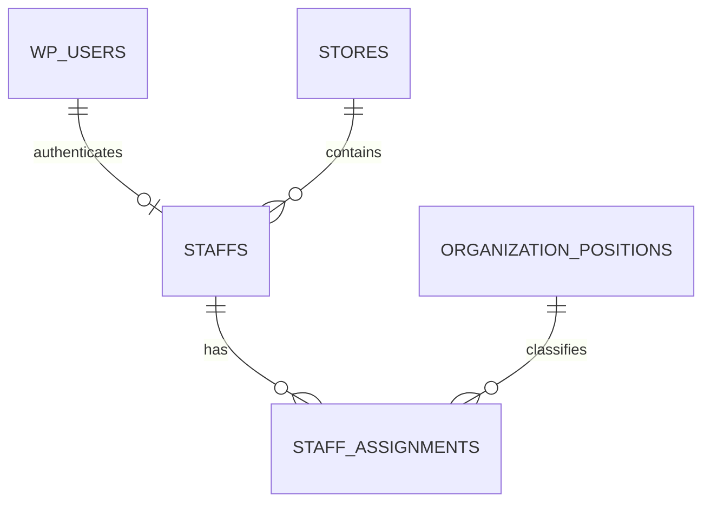
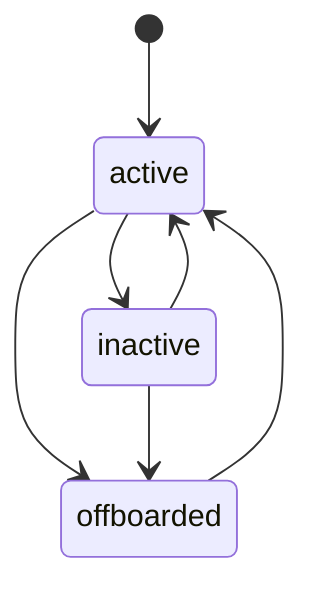

# 员工身份与任职

员工身份由登录账号、员工档案、门店归属、系统角色和业务岗位共同组成。登录账号负责认证，员工档案负责业务身份，任职记录负责保存门店与岗位随时间变化的历史。

## 代码位置

| 方面 | 位置 |
| --- | --- |
| JWT 认证 | `real_sync/api/auth-jwt.php` |
| 员工上下文 | `real_sync/api/common/context.php` |
| 后台授权 | `real_sync/api/admin/common.php` |
| 员工后台 | `real_sync/admin/staffs.html` |
| 员工接口 | `real_sync/api/admin/staff/` |
| 员工生命周期服务 | `real_sync/api/admin/services/StaffLifecycleService.php` |
| 员工目录服务 | `real_sync/api/admin/services/StaffDirectoryService.php` |
| 员工数据健康服务 | `real_sync/api/admin/services/StaffDataHealthService.php` |
| 员工本人档案服务 | `real_sync/api/admin/services/StaffProfileService.php` |
| 员工关联检查服务 | `real_sync/api/admin/services/StaffAssociationService.php` |
| 高权限角色保护 | `real_sync/api/admin/services/PrivilegedRoleGuard.php` |
| 组织服务 | `real_sync/api/admin/services/OrganizationService.php` |
| 岗位字典接口 | `real_sync/api/admin/organization/positions.php` |
| 门店字典接口 | `real_sync/api/admin/organization/stores.php` |
| 组织架构树接口 | `real_sync/api/admin/organization/tree.php` |
| 批量导入 | `real_sync/api/admin/staff-import.php` |
| 批量导入服务 | `real_sync/api/admin/services/StaffImportService.php` |
| 数据迁移 | `real_sync/database/migrations/202607240001_staff_organization.sql` |

## 数据关系

| 对象 | 关键职责 |
| --- | --- |
| `wp_users` | 登录名、密码哈希和账号状态 |
| `staffs` | 员工业务身份、当前角色、当前门店和当前主岗位 |
| `stores` | 门店字典、稳定编码和负责人 |
| `organization_positions` | 业务岗位字典 |
| `staff_assignments` | 主岗、兼岗和生效区间历史 |

## 生命周期

`staffs.lifecycle_status` 支持 `active`、`inactive`、`offboarded`。离职归档同时保存离职时间、原因和操作人。密码、角色、状态或离职变化时，业务服务递增 `session_version` 以撤销旧会话。

员工 JWT 携带签发时的 `session_version`。认证公共层在每次请求中对比员工当前版本，并同时检查 WordPress 账号、员工状态和生命周期；停用或离职事务递增版本后，之前签发的令牌持续失效，重新启用或恢复后需要重新登录获取当前版本令牌。

角色变更通过 `IdentityConsistencyService` 同步员工角色、WordPress 角色元数据和会话版本。密码创建、管理员重置和员工本人改密共用 `PasswordPolicy`；管理员重置撤销全部旧令牌，本人改密返回绑定新会话版本的替换令牌。

总部运营和系统管理员通过具名权限点共同管理全部员工、组织、角色、审计和受控误建清理。系统管理员额外拥有 `system.settings`；权限检查优先读取员工档案的系统角色，避免 WordPress 角色残留扩大权限。

涉及系统管理员的提升或降权通过 `PrivilegedRoleGuard` 执行二次确认。另一名在职系统管理员签发 5 分钟 HMAC 确认令牌，令牌绑定请求人、审批人、目标员工、角色变化、会话版本和有效期；编辑或恢复事务在角色同步前重新校验。权限前后列表、审批双方标识和确认 JTI 写入操作审计，完整令牌不进入日志。停用、离职或降权管理员时，事务锁定当前在职员工并统计规范化管理员角色，最后一个在职系统管理员保持受保护状态。

员工新增由 `StaffLifecycleService::create()` 实现。该事务通过 `PasswordPolicy` 校验初始密码，校验组织引用和身份唯一性，创建 WordPress 内部账号与员工档案，再通过 `IdentityConsistencyService` 写入统一 WordPress 角色元数据，最后创建首条主任职和脱敏操作审计。工号可由调用方明确提供，也可通过 `staff_employee_number_sequences` 在事务内生成。重复工号、手机号、用户名或邮箱产生结构化冲突异常，响应只暴露冲突字段和脱敏档案摘要。

后台新增员工抽屉将该事务组织为基础资料、组织与权限、账号确认三步。确认摘要隐藏初始密码并脱敏手机号，创建期间阻止重复提交；服务返回成功后页面刷新目录并直接加载新员工详情。兼岗在员工创建后通过详情中的任职管理补充，首条创建事务只建立主任职。

批量导入由 `StaffImportService` 编排。批次键全局唯一，同一员工可使用失败响应中的批次键重试相同行数；服务只重新处理失败行，成功行保持原员工 ID 和结果。每行复用 `StaffLifecycleService::create()` 的完整事务，批次层保存状态、脱敏输入摘要、校验结果和重试次数。初始密码不进入导入表，手机号、账号和邮箱摘要经过脱敏。

后台批量导入工作区支持 CSV/JSON 文件选择与拖放，提供 CSV 模板，并根据中英文字段名自动建立可调整映射。页面逐行预检查必填字段、手机号、门店与岗位 ID、角色和初始密码格式；服务端继续执行身份唯一性、组织有效性、角色适用性和完整创建事务。批次结果保留每行状态、重试次数和校验说明，失败行使用服务返回的原批次键再次处理，成功行保持稳定。

员工编辑由 `StaffLifecycleService::update()` 实现。基础资料、手机号唯一性、状态与组织变更共享一个员工级事务；门店、岗位或角色变化委托 `OrganizationService` 按生效日期更新主岗历史。离职档案保持只读，所有编辑要求原因并记录员工前后快照，组织变化额外保留任职审计快照。

离职归档由 `StaffLifecycleService::offboard()` 实现。离职日期表示最后在岗日；服务在事务内关闭覆盖该日且继续延伸的主岗和兼岗，设置 `lifecycle_status=offboarded`，停用 WordPress 账号并递增 `session_version`。设备登录记录同步撤销信任和活动状态，小程序与制度订阅同步关闭，员工、任职和撤销结果保存到操作审计。离职员工的历史任职和业务关联持续保留，并通过目录详情以只读方式查询。

员工恢复由 `StaffLifecycleService::restore()` 实现。恢复日期必须晚于原离职日期，账号状态明确恢复为启用，主岗位与全部兼岗均由管理人员重新确认。服务清空当前离职字段并创建从恢复日期开始的新任职记录，历史任职、工作量、学习和审计关联保持原状；`session_version` 再次递增，使离职前签发的凭据持续失效。

误建清理预检由 `StaffAssociationService::inspectForPurge()` 实现。服务通过固定白名单检查员工 ID 和关联账号 ID 在登录设备、工作量、学习通关、演练审核、通知消息、积分、组织引用和操作人历史中的引用。建档产生的一条主任职属于身份基线，额外主岗或任何兼岗均阻断清理。完整零关联检查会签发 5 分钟 HMAC 确认令牌，令牌绑定操作者、目标身份、`session_version`、关联摘要和随机唯一标识；业务关联、结构不兼容或查询错误会返回离职归档建议。

受控清理由 `StaffLifecycleService::purgeMiscreated()` 实现，仅限总部运营和系统管理员。服务在锁定目标身份后重新计算关联摘要，确认短时令牌仍绑定同一操作者、员工、账号、工号与会话版本，再删除主任职、员工档案、WordPress 用户元数据和账号。操作审计作为独立历史事实保留，并新增清理前身份快照、关联检查、清理原因、删除数量和确认唯一标识；业务关联及其历史记录不会进入删除范围。

员工目录由 `StaffDirectoryService` 提供。列表支持组织与生命周期组合筛选，详情返回当前任职、历史任职、账号状态、业务摘要和可用操作；手机号、账号与设备安全字段按角色执行脱敏。

后台员工一览将关键词、门店、主岗位、系统角色、生命周期和每页数量组合为统一目录查询。未选择生命周期时默认包含离职档案，保证归档员工仍可检索和查看历史详情。桌面表格与窄屏员工卡片使用同一批分页记录，当前结果及在职、停用、离职、数据异常摘要帮助管理人员快速判断目录范围与数据质量。

后台员工详情使用可访问模态抽屉，关闭后将焦点返回触发按钮。详情聚合账号绑定、当前与历史任职、业务计数、设备、登录审计及目标员工操作审计；离职档案仅展示只读资料。高风险区按生命周期开放密码重置、离职或恢复，并通过清理资格检查展示各业务类别阻断数；零关联结果签发的短时令牌只用于紧随其后的受控清理提交。

员工数据健康由 `StaffDataHealthService` 实时计算。重复工号、手机号和账号关联用于识别身份唯一性异常；在职员工引用缺失或停用的门店与岗位用于识别组织异常；员工角色和 WordPress 能力差异用于识别授权漂移；在职员工缺账号及带内部员工角色的账号缺档案用于识别孤立身份。检查结果不持久化，修复后的下一次检查直接反映最新状态。

后台数据健康工作区按重复工号、重复手机号、重复账号、无效门店、无效岗位、角色不一致和孤立身份七类组织问题。员工关联问题可打开详情，孤立身份可进入员工目录修复上下文；修复过程沿用受审计管理接口，随后通过实时复检确认问题关闭。

本人档案由 `StaffProfileService` 提供，员工身份直接取当前 JWT 关联档案，响应包含本人组织、当前兼岗和账号状态。档案更正申请仅接受姓名、手机号、门店、主岗位和入职日期，保存提交时当前值与期望值快照；员工可持续查看待处理、已批准或已驳回状态及管理意见。总部处理动作保存处理人员、意见、时间和审计，实际资料修改仍通过 `StaffLifecycleService::update()` 执行。

岗位字典由 `OrganizationService` 提供。岗位编码保持唯一并统一为小写稳定标识，岗位名称用于展示，`applicable_roles_json` 保存规范化后的系统角色集合。岗位按 `sort_order` 与 `id` 稳定排序。停用前检查当前员工和当前有效任职引用，已结束任职持续保留；停用岗位无法用于新员工创建。

门店字典同样由 `OrganizationService` 提供。门店编码统一为大写稳定标识，负责人通过 `manager_staff_id` 关联在职员工，同时维护旧后台使用的 `manager_name`。门店停用要求先处理当前在职员工的快速归属和有效主岗、兼岗任职，历史业务数据与已结束任职持续保留。

主岗和兼岗同样由 `OrganizationService` 管理。任职有效期采用包含开始日和结束日的闭区间。生效日 `E` 的主岗变化将覆盖 `E` 的旧主岗结束于 `E - 1`，并创建从 `E` 开始的新主岗；已有后续计划主岗时，新记录结束于下一条记录开始日前一天。当前日期最多允许一个有效主岗，员工可同时拥有多个职责组合不同的兼岗。

同日同内容的主岗请求和完全相同的兼岗请求保持幂等。同日不同主岗产生冲突；同一员工、门店、岗位和角色组合的兼岗区间禁止重叠。已结束历史任职保持只读。当前或追溯生效的主岗变化按当前有效记录同步 `staffs` 快速字段，未来主岗变化到生效前保持当前字段不变。

组织架构树以数据库当前日期对应的有效任职为事实源，并将同一员工的每条主岗或兼岗关系放入相应门店与岗位节点。启用空门店仍然可见，员工总数按员工 ID 去重，任职总数保留主兼岗关系数量。平铺员工项与树节点采用相同字段白名单，只包含组织展示需要的身份和任职字段。

后台组织架构工作区在同一份组织响应上提供树形和列表视图，列表明确展示门店、岗位、员工、任职类型、系统角色和生效区间。门店与岗位设置按 `sort_order` 展示，并在编辑或启停前呈现当前员工、有效任职和历史任职计数。当前引用要求先调整员工归属，历史引用作为只读事实持续保留。窄屏下表格转换为同数据源卡片，保持设置字段与操作能力一致。

员工列表通过 `formatStaff()` 固定投影 27 个响应字段，数据库查询新增的列和输入中的未知字段不会自动进入响应。`operation`、`admin`、`ceo` 角色可查看手机号、用户名和邮箱原值，其他已获总部访问权限的角色获得同名脱敏值。`scripts/staff_directory_field_allowlist.property.test.mjs` 使用随机角色、随机记录和额外敏感字段持续验证正确性属性 29。

## 不变量

1. 工号和已绑定 WordPress 用户在员工档案中保持全局唯一。
2. 岗位编码和门店编码保持全局唯一。
3. 员工任一业务日期最多对应一个有效主岗位。
4. 系统角色决定权限范围，业务岗位描述实际职责。
5. 历史业务数据继续使用当时保存的门店、角色快照或对应日期的任职记录。
6. 已结束任职不会被日常组织变更覆盖，追溯更正使用独立受控流程。
7. 任意已提交状态下至少保留一个在职系统管理员。

工号唯一性由三层机制共同保证：`staff_employee_number_sequences` 的前缀主键与事务行锁负责串行分配，创建服务跳过历史占用值并在写入前检查冲突，`staffs.employee_no` 唯一索引提供最终约束。`scripts/staff_employee_number.property.test.mjs` 使用随机创建序列持续验证正确性属性 19。

账号身份关系由 `staffs` 主键和 `uq_staffs_user_id` 唯一索引共同约束。`StaffLifecycleService` 在同一事务内先创建 WordPress 账号，再将账号 ID 写入新员工档案；异常会回滚整条创建链路。`scripts/staff_account_identity.property.test.mjs` 使用固定种子的随机绑定序列验证正确性属性 20，覆盖账号重复绑定、员工重复绑定、冲突不落库和事务回滚。

`scripts/organization_integration.test.mjs` 使用统一内存状态模型验证岗位、门店、主岗、兼岗和组织树之间的联动。场景覆盖当前引用阻止停用、调店和转岗关闭旧区间、快速字段随当前主岗变化、同日请求幂等或冲突、兼岗区间重叠检查，以及历史任职在旧门店停用后继续保留。

`scripts/staff_primary_assignment.property.test.mjs` 使用固定种子的随机变更序列验证正确性属性 21。每次创建、幂等返回、同日冲突或历史保护后，测试都会扫描业务日期域，确认同一员工有效主岗数量不超过一个，并核对生产服务的员工级行锁和前后区间边界契约。

`scripts/staff_assignment_history.property.test.mjs` 验证正确性属性 25。测试在随机主岗变更、兼岗创建和兼岗结束前后冻结所有已结束任职的完整快照，并持续逐字段比对，确保组织变化、字典状态变化和历史重试不会覆盖既有历史事实。

`scripts/staff_role_consistency.property.test.mjs` 验证正确性属性 23。测试使用固定种子执行 128 组、每组 256 次连续角色变化，逐次核对员工角色、WordPress 能力角色、WordPress 等级和会话版本；全部业务角色映射和三个事务失败注入点共同验证成功提交与完整回滚。

`scripts/staff_management_permission.property.test.mjs` 验证正确性属性 26。测试使用固定种子执行 128 组、每组 256 次员工管理动作，确认总部运营和系统管理员对任意门店、任意生命周期员工保持相同全量范围；系统设置作为管理员附加能力独立校验，14 个员工与组织端点同时核对具名权限契约。
