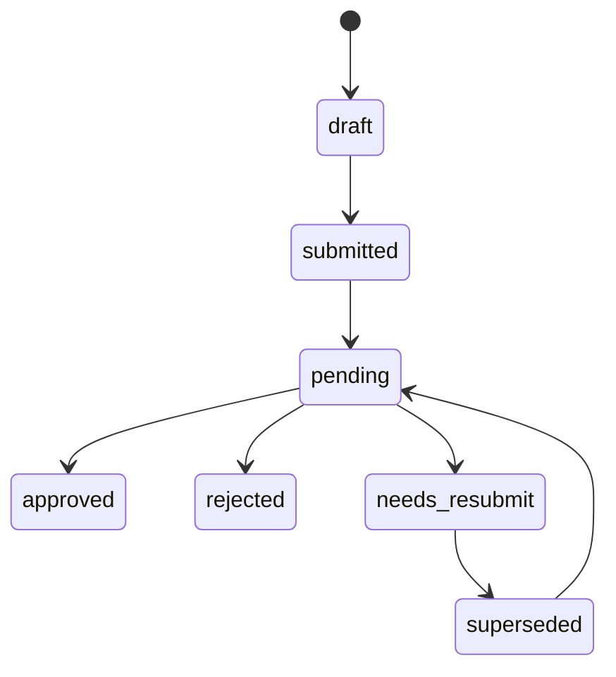
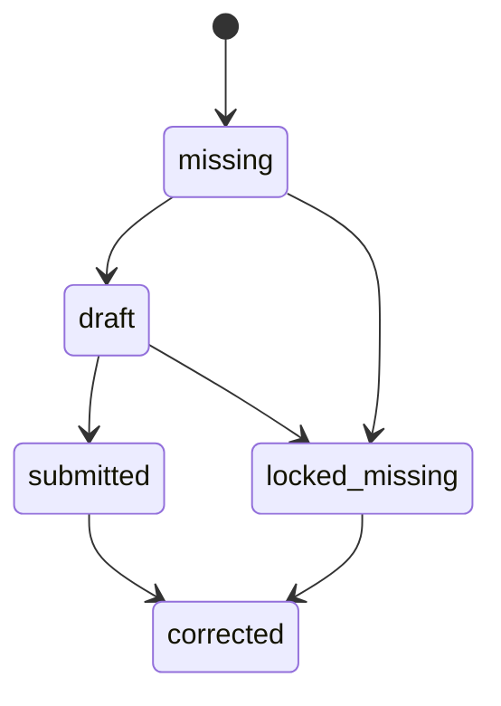

# 工作量日报

工作量日报记录员工在指定营业日、门店和岗位口径下填写的项目值、凭证、提交状态和审核状态。H5 与微信小程序共享 `/api/workload/` 业务接口。

## 代码位置

| 方面 | 位置 |
| --- | --- |
| H5 页面 | `real_sync/mobile/workload-v2.html` |
| 小程序页面 | `real_sync/mini-program/pages/workload/` |
| 员工接口 | `real_sync/api/workload/` |
| 后台接口 | `real_sync/api/admin/workload/` |
| 专题需求 | `.monkeycode/specs/2026-07-24-workload-governance-mini-program-launch/requirements.md` |
| 专题设计 | `.monkeycode/specs/2026-07-24-workload-governance-mini-program-launch/design.md` |

## 核心数据

| 表 | 内容 |
| --- | --- |
| `workload_daily_reports` | 日报主体、日期、人员、门店、角色、来源和状态 |
| `workload_daily_report_values` | 每个项目的填报值 |
| `workload_evidences` | 图片等业务凭证 |
| `workload_audit_tasks` | 审核任务版本、前序关联、处理状态、审核时凭证数量和废止时间 |
| `workload_submission_obligations` | 日期、门店、员工和岗位维度的应交责任与完成状态 |
| `workload_source_policies` | 生产来源与合成来源分类 |
| `workload_metric_versions` | 统计口径版本和生效时间 |
| `workload_role_rule_versions` | 岗位提交规则版本与最低正数项目数 |
| `workload_role_metric_rules` | 项目必填、数值、凭证、审核和统计规则 |
| `workload_metric_relation_versions` | 经营项目关系版本、生效日期和状态 |
| `workload_metric_relations` | 关系分组、岗位、分子项目和分母项目 |
| `workload_alert_rules`、`workload_alert_events` | 提醒预警规则与幂等事件 |
| `workload_export_jobs` | 导出任务状态、范围和结果元数据 |
| `workload_report_corrections` | 锁定日报管理更正的前后快照 |

## 关键规则

- 每周周一为统一公休日。
- 周二至周日在职销售、教练和已配置店长规则的店长进入应交范围。
- 营业日 24:00 截止，次日 00:00 锁定。
- 当前使用至少四个正数项目的过渡规则，后续由岗位规则版本替代。
- 统计按员工、店长所属门店和总部全量范围授权。
- 历史日报保存的门店和角色是统计事实快照。
- 历史回填优先根据已有日报建立已知义务，再按带生效日期的销售、教练任职补齐可确认缺交。
- 历史缺交和公休日标记使用 `source=backfill`，重复回填保护已关联日报和管理更正状态。
- 默认经营统计包含 `h5` 和 `mini_program`，合成来源由来源策略单独标记。
- 日报绑定提交时生效的统计口径版本和岗位规则版本。
- 店长每日线下运营动作按门店口径管理，门店点亮、收藏门店、9 图好评、3 图好评、上翻单数、上翻金额和视频号播放均要求拍照或截图凭证。
- 店长的门店点亮项可读取同店同日教练或销售上传的点亮凭证汇总；汇总达到每日 5 张时，店长页面提示该项已按门店完成口径达标，审核列表合并展示店长本人凭证和同店来源凭证，补凭证审核基线、待办和提醒的凭证缺口也按该合并凭证口径计数。
- 教练工作量说明展示“销售相关产出也计算工作量，4000 元为销售档位口径”，该说明由岗位规则版本的 `description` 下发到 H5 和微信小程序。
- 日报写入、项目值、审核任务和义务同步共享一个事务，提交前后均以数据库权威时间检查截止点。
- 每次重新提交创建递增版本的审核任务，旧任务迁移为 `superseded` 并保留审核意见、审核人和审核时间。
- 后台审核从 `pending` 进入 `approved`、`rejected` 或 `needs_resubmit`；驳回和补凭证状态保存审核意见，补凭证状态同时保存当前凭证数量。
- 已提交日报只向所有者的当前 `needs_resubmit` 任务开放对应项目凭证补充。
- 员工新增凭证并重新送审后，旧任务进入 `superseded`，新任务以递增版本进入 `pending`；重复送审沿用同一后继任务。
- 当前审核积压和经营统计只读取未废止任务，历史版本通过前序任务链及废止日志追溯；审核列表以 `trace_status` 返回历史任务的废止前状态。
- 原始值 `raw_value` 等于员工提交的 `numeric_value`；全量审核的 `pending`、`approved`、`rejected` 原值分别计入 `pending_value`、`effective_value`、`rejected_value`，`needs_resubmit` 不计入三个状态值；非全量审核项目的有效值等于原始值。
- 四值计算优先采用日报绑定的岗位项目规则版本，历史未绑定日报使用旧规则回退。驾驶舱、汇总、明细和有效值排名兼容字段沿用三值响应，审核列表同时返回四值。
- 统一统计事实粒度为 `business_date + store_id + staff_id + role_code + metric_code`，每条事实同时携带日报状态、审核状态、来源、凭证数和四值。
- 统计筛选统一覆盖日期、门店、岗位、员工、项目、日报状态、审核状态和来源，并与当前用户权限范围取交集。
- 普通员工范围固定本人，店长范围来自当前有效的主岗或兼岗管理任职门店，总部运营和系统管理员使用全量范围。
- 统计聚合只纳入已提交日报，并在每个项目内按日报 ID 去重；草稿不进入项目选取率、零值率和样本量分母。
- 项目选取率使用原始正数日报数除以已提交日报数，有效选取率使用有效正数日报数除以已提交日报数，零值率使用原始零值日报数除以已提交日报数。
- 项目选取率按指标和日报 ID 去重；原始正数日报是已提交日报的子集，因此选取率分子始终小于或等于分母，空分母的比率值为 `0.0`。
- 员工覆盖率使用原始值为正的员工数除以已提交员工数，门店覆盖率使用原始值为正的门店数除以已提交门店数。
- 全体员工人均、参与员工人均和每应交人日均值都以有效值总量为分子，分母依次为已提交员工数、原始值为正的员工数和调用方提供的应交人日数。
- 比例和均值同时返回分子、分母和值；比例保留 4 位小数，总值与均值保留 2 位小数，零分母返回 `0.0`。
- 样本少于 10 份已提交日报或 3 名已提交员工时标记 `low_sample=true`，结果与样本门槛仍完整披露。
- 统计响应统一披露口径版本、筛选条件、来源范围、权限范围和 `data_cutoff_at`；数据截止时间取数据库生成时间。
- 统计回归验证空数据、低样本边界、九维筛选交集、默认经营来源隔离、日报历史组织快照和全部审核状态四值映射；日报数、正数与零值计数及四值总量在互斥门店分区前后保持可加守恒，重复事实按日报 ID 去重。
- 门店应交汇总与下钻明细共享义务快照和筛选范围；每个门店的 `required_count` 及其总和等于对应 `required_status=required` 明细数量，`exempt` 义务不进入应交分母。
- 应交义务按 `missing`、`draft`、`submitted`、`locked_missing` 和 `corrected` 五种完成状态分区；任意日期、门店、员工和岗位范围内，五类计数之和等于 `required_status=required` 的义务数，`exempt` 不参与该分区。
- 门店周期完成率以 `submitted + corrected` 为分子、`required_status=required` 义务数为分母；周期日历展示周一公休日，公休日不进入应交分母。
- 门店项目矩阵以门店和项目为汇总单元，项目所属岗位的义务数作为每应交人日分母；矩阵返回四值、完成率、义务员工与提交员工两套人均和覆盖口径，并补齐全部应交员工的零值项目单元格。
- 门店项目排名在当前可见门店范围内按项目分别计算，`effective_value_rank` 使用有效值，`raw_value_rank` 使用原始值，相同值共享名次。
- 项目总览按岗位和项目隔离排名，分别返回门店覆盖、员工覆盖、有效值和原始值名次；无已提交事实的适用项目仍保留零值统计行。
- 门店项目排名同时返回全部门店有效值与原始值均值、前 25% 有效值参考，便于在同岗位同项目口径下比较门店表现。
- 员工项目排名包含门店内与当前权限范围内全部门店同岗位两层有效值和原始值名次，并返回两层有效值均值；全部应交员工均保留零值项目行。
- 排名统计通过 `has_pending_review` 标记待审核事实；解释排名时同时查看原始值、待审核值、有效值和该标志。
- 员工周期画像按业务日期、历史门店和历史岗位合并义务与日报，逐日返回备注、提交时间、全部适用项目、四值、凭证和当前审核意见；无日报或无项目事实的单元保留零值。
- 个人趋势支持日、业务周和自然月粒度，每个趋势周期继续使用统一项目聚合、应交人日和低样本口径。
- 个人对比以周二至周日为营业日集合，向前选择相同营业日数量的上期和过去四期；项目结果返回变化量、变化率、状态、四期均值及两期样本量。
- 个人排名复用可见范围内同岗位员工数据，返回历史门店内排名、全部可见门店排名、两层均值和前 25% 有效值参考。
- 销售基础漏斗固定展示新增资源、实际邀约、实际到店、成交人数和新签金额，阶段值同时披露原始、待审核、有效和驳回四值。
- 项目关系按统计截止日选择闭区间内生效版本；销售转化率、教练耗课计划完成率和沟通计划完成率都从版本明细读取分子与分母项目。
- 关系比率同时返回有效值与原始值口径、分子分母项目四值、样本量、低样本和待审核状态；零分母使用 `new` 或 `empty` 状态解释。
- 经营来源范围之外的已关联日报在周期完成经营口径中按 `missing` 计数，同时通过排除来源数量、原存储状态和来源范围标志保留审计信息。
- 锁定 Worker 将到期 `missing` 和 `draft` 义务转为 `locked_missing`；查询接口在 Worker 执行前也会派生相同状态。
- 锁定后的日报通过门店范围授权的管理更正入口处理，更正保存前后快照、原因和操作人，义务状态更新为 `corrected`；旧审核任务保留为 `superseded` 历史，更正后的全量审核正值进入新的 `pending` 任务并重新计算四值。

## 状态流

具体状态字段和转换以 `real_sync/api/workload/` 当前实现及专题后续迁移为准。

日报义务完成状态独立于审核状态：

员工状态查询返回 `completion_status`、`deadline_at`、`is_writable`、`audit_tasks`、`needs_resubmit_count` 和 `pending_items`。每个审核任务披露审核意见、凭证数量、补充状态及下一动作，使员工可区分等待审核、查看驳回、补充凭证和重新送审。周一返回 `exempt` 与 `is_weekly_rest_day=true`；营业日次日 `00:00:00` 起，员工写入权限关闭并提示进入管理处理流程。
