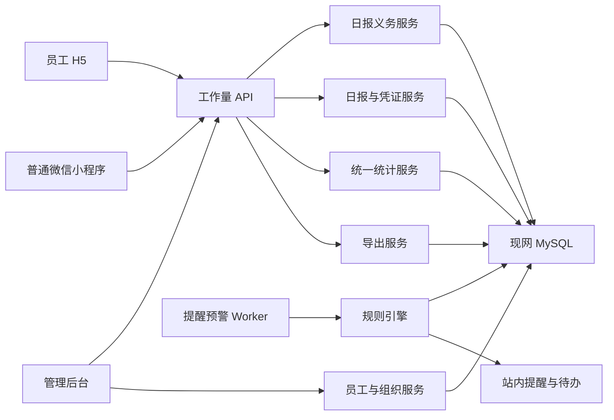

# 工作量治理、员工组织管理与普通微信小程序上线技术设计

Feature Name: `workload-governance-mini-program-launch`
Updated: 2026-07-24

## 1. 设计目标

本设计复用现有 `staffs`、`stores`、WordPress 账号体系、工作量核心表和 `/api/workload/*`，增加员工与组织全生命周期管理、日报义务快照、统一统计查询、标准导出、规则型提醒预警，并修复普通微信小程序提审阻断项。

设计优先级如下：

1. 固化日报应交分母和原始值、待审核值、有效值口径。
2. 统一后台页面、API 和导出的聚合逻辑。
3. 建立员工草稿闭环和管理预警闭环。
4. 完成小程序路由、隐私、域名和真机发布验收。
5. 将企业微信能力切换为可恢复停用状态。

### 1.1 已确认业务规则

- 每周周一为统一公休日，员工端关闭工作量日报填写入口，统计分母排除周一。
- 每周周二至周日，全部在职销售和教练每天生成一份日报义务。
- 日报截止时间为营业日 24:00，次日 00:00 后员工端进入锁定状态。
- 锁定日报通过管理更正流程处理，完整保留原值、新值、原因、操作人和时间。
- 当前提交规则保留至少四个正数项目，后续切换到带生效日期和版本的岗位必填规则。
- 单元、属性、集成、权限、前端、真机和回归测试全部属于必做范围。
- 项目定义为日报中的工作量指标。
- 员工查看本人，店长查看授权门店，总部运营和系统管理员查看全部门店；系统管理员维护规则与审计配置。

## 2. 现网事实与设计影响

| 事实 | 设计影响 |
| --- | --- |
| `hq-summary.php` 使用当前在职人数乘自然日计算应交数量 | 历史调店、入离职、休息日和跨店场景需要日报义务快照 |
| `dashboard.php` 以当前员工归属生成缺交清单 | 页面与历史事实可能发生漂移，需要统一读取义务单元 |
| 63 份草稿中 57 份已超过最近 7 个数据日 | 草稿需要到期状态、重复提醒控制和管理侧积压列表 |
| 1,377 条审核任务全部为 `pending` | 经营统计需要原始、待审核和有效三列，并优先处理审核积压 |
| 存在 `codex-smoke`、`debug`、`h5-e2e`、`live_check` 来源 | 默认经营统计需要来源分类和合成数据排除规则 |
| 小程序保存来源为 `mini_program`，现网尚无该来源日报 | 小程序工作量链路需要真机端到端验收 |
| 小程序存在 14 处未注册或层级不一致路由 | 路由静态检查必须成为上传前门禁 |
| 企业微信配置当前启用，现网未发现相关 cron | 停用需要配置、入口和 worker 三层确认 |
| 企业微信回调 POST 直接返回 `success` | 普通微信发布不依赖该回调，恢复企业微信事件能力时需要单独实现事件处理 |

## 3. 总体架构



核心约束：

- 所有经营统计经过统一统计服务读取。
- 所有比例同时返回分子、分母、结果和口径版本。
- 权限判断复用现有员工上下文和门店访问控制。
- H5 与小程序共享服务端提交规则。
- 导出查询复用统计筛选器和有效值计算器。

## 4. 数据模型

### 4.1 保留表

- `workload_daily_reports`
- `workload_daily_report_values`
- `workload_evidences`
- `workload_audit_tasks`
- `workload_metric_rules`
- `metric_definitions`
- `staffs`
- `stores`

### 4.2 日报义务表

新增 `workload_submission_obligations`：

| 字段 | 类型建议 | 说明 |
| --- | --- | --- |
| `id` | bigint unsigned | 主键 |
| `obligation_date` | date | 应交日期 |
| `store_id` | bigint unsigned | 应交门店 |
| `staff_id` | bigint unsigned | 应交员工 |
| `role_code` | varchar(32) | 应交岗位 |
| `required_status` | varchar(16) | `required`、`exempt` |
| `reason_code` | varchar(32) | 排班、调店、请假或人工调整原因 |
| `report_id` | bigint unsigned nullable | 对应日报 |
| `completion_status` | varchar(24) | `missing`、`draft`、`submitted`、`locked_missing`、`corrected` |
| `deadline_at` | datetime | 截止时间 |
| `completed_at` | datetime nullable | 完成时间 |
| `source` | varchar(16) | `generated`、`manual`、`backfill` |
| `created_at` | datetime | 创建时间 |
| `updated_at` | datetime | 更新时间 |

约束与索引：

- 唯一索引：`obligation_date, store_id, staff_id, role_code`。
- 查询索引：`obligation_date, store_id, completion_status`。
- 查询索引：`staff_id, obligation_date, completion_status`。
- `report_id` 建普通索引并保持单向关联，历史日报继续作为业务事实。

生成策略：

1. 周二至周日凌晨按在职状态、门店和岗位生成当天义务，周一生成公休日标记。
2. 管理人员可在授权范围内执行锁定日报更正，并记录原因和变更前后值。
3. 日报保存和提交后在同一事务内更新义务状态。
4. 首次迁移按历史日报回填已存在义务，历史缺交仅在可确认排班范围内回填。
5. 统计切换前执行新旧口径双算并保存差异报告。

### 4.3 来源分类配置

新增 `workload_source_policies`：

| 字段 | 说明 |
| --- | --- |
| `source_code` | 对应日报 `source` |
| `source_kind` | `production` 或 `synthetic` |
| `included_by_default` | 默认经营统计开关 |
| `description` | 来源说明 |
| `updated_at` | 更新时间 |

初始生产来源为 `h5`、`mini_program`。初始合成来源为 `codex-smoke`、`debug`、`h5-e2e`、`live_check`。

### 4.4 规则与预警表

新增 `workload_alert_rules`：规则编码、适用角色、指标类型、阈值、最小样本量、提醒时间、截止时间、严重级别、启用状态和版本。

新增 `workload_alert_events`：规则编码、业务日期、统计周期、门店、员工、岗位、指标、分子、分母、当前值、阈值、证据 JSON、状态、处理人、处理意见和时间戳。

唯一事件键使用 `rule_code, period_key, store_id, staff_id, role_code, metric_code`，重复计算执行幂等更新。

### 4.5 导出任务表

新增 `workload_export_jobs`：

- `export_type`
- `requested_by`
- `filters_json`
- `scope_hash`
- `status`
- `row_count`
- `file_path`
- `expires_at`
- `error_message`
- `created_at`
- `completed_at`

文件存储在现有站点受控数据目录中，下载接口每次校验用户权限和任务所有权。过期文件由维护任务清理，导出元数据保留用于审计。

### 4.6 口径版本

新增轻量表 `workload_metric_versions`：版本号、生效时间、来源策略、义务策略、有效值策略、说明和创建人。

所有统计响应和导出文件携带 `metric_version`。

### 4.7 岗位项目规则版本

扩展现有模板与 `workload_metric_rules`，为每个项目保存适用岗位、必填状态、是否允许零、最小值、最大值、最低正数项目数、凭证要求、审核方式、生效日期、停用日期、统计方向和目标值。

规则切换策略：

1. 首个版本保留最低四个正数项目。
2. 岗位必填版本配置完成后按生效日期启用。
3. 历史日报绑定提交时生效的规则版本。
4. 跨规则版本统计同时展示版本，并支持限定同一版本比较。

### 4.8 管理更正记录

新增 `workload_report_corrections`，保存日报、义务、原始快照、修改后快照、更正原因、申请人、操作人和时间。管理更正通过事务更新日报、义务和审核任务，并保留原审核历史。

## 5. 统一统计口径

### 5.1 日报完成状态

- 应交：`required_status = required` 的义务单元。
- 已提交：义务关联日报状态为 `submitted`。
- 草稿：义务关联日报状态为 `draft`。
- 缺交：截止时间前仍没有关联日报。
- 锁定缺交：次日 00:00 后义务状态仍为 `missing` 或 `draft`。
- 管理更正：管理人员通过授权流程处理锁定日报后的状态。

周期完成率：

```text
submitted_obligations / required_obligations
```

页面同时展示 `draft_count` 和 `missing_count`，两者保持互斥。

### 5.2 指标值

```text
raw_value = workload_daily_report_values.numeric_value
pending_value = full_audit AND audit_status = pending ? raw_value : 0
effective_value = full_audit ? approved_value : raw_value
```

全量审核规则下：

- `approved`：有效值等于原始值。
- `rejected`：有效值等于零。
- `pending`：待审核值等于原始值，已审核有效值等于零。

### 5.3 项目选取度

同岗位已提交日报作为统一分母：

```text
selection_rate = positive_raw_report_count / submitted_report_count
effective_selection_rate = positive_effective_report_count / submitted_report_count
zero_rate = zero_raw_report_count / submitted_report_count
staff_coverage = positive_staff_count / submitted_staff_count
store_coverage = positive_store_count / submitted_store_count
```

统计响应必须返回各公式中的计数。跨周期变化使用等长相邻周期，并返回两个周期的样本量。

### 5.4 样本门槛

初始建议使用以下条件生成经营建议：

- 已提交日报数至少 10。
- 已提交员工数至少 3。
- 两个比较周期均满足最低样本量。

低于门槛的数据仍可展示，并标记为 `low_sample`。

### 5.5 门店、项目、员工与时间统计立方体

统一事实粒度：

```text
business_date + store_id + staff_id + role_code + metric_code
```

支持以下交叉组合：

| 组合 | 输出重点 |
| --- | --- |
| 门店 × 项目 | 各门店项目总量、人均、覆盖率、有效值和排名 |
| 项目 × 员工 | 每个项目参与员工、员工值、环比和排名 |
| 门店 × 员工 | 门店内部员工完成率、人效和项目组合 |
| 门店 × 项目 × 员工 | 最细业务下钻与全维度导出 |
| 时间 × 门店 | 门店日、业务周、月和季度趋势 |
| 时间 × 项目 | 项目选取率、有效值和覆盖率趋势 |
| 时间 × 员工 | 个人连续趋势和异常变化 |

每个交叉单元统一返回：原始总值、待审核值、有效总值、应交人日、已提交人日、每应交人日均值、参与员工人均值、选取率、员工覆盖率、门店覆盖率、样本量和口径版本。

### 5.6 对比与环比

| 当前周期 | 上期规则 |
| --- | --- |
| 日 | 上一个营业日 |
| 业务周 | 上一个周二至周日 |
| 月累计 | 上月相同营业日数量 |
| 完整月 | 上一个完整自然月并排除周一 |
| 季度 | 上一个完整季度并排除周一 |
| 自定义周期 | 前一个等长营业日周期 |

```text
change_value = current_value - previous_value
change_rate = previous_value > 0 ? change_value / previous_value : comparison_state
```

`comparison_state` 使用 `new`、`flat`、`down_to_zero`。每次比较同时返回本期与上期的营业日数、应交人日、提交人日和样本量。

### 5.7 排名与基准

- 门店：全部门店排名、全部门店均值、过去四期自身均值和前百分之二十五参考值。
- 员工：门店内同岗位排名、全部门店同岗位排名、门店同岗位均值和全部门店同岗位均值。
- 项目：门店覆盖排名、员工覆盖排名、有效总值排名和环比增长排名。
- 排名默认使用有效值；审核待处理时同时展示原始值排名并标记审核状态。

### 5.8 填报状态区分

现有员工端会将全部项目提交为数值，未操作项目通常形成零值。岗位必填升级时为项目值增加填报状态：`positive`、`explicit_zero`、`not_applicable`。项目选取率使用 `positive`，必填完成率使用适用且完成填写的项目机会数。

### 5.9 经营漏斗

- 销售基础漏斗：新增资源、实际邀约、实际到店、成交人数、新签金额。
- 教练基础完成率：实际耗课除以计划耗课，实际沟通除以计划沟通。
- 体测、家长沟通、暑期营推荐、转介绍和续费之间的转化率由配置化项目关系启用，并保存关系版本。

## 6. API 设计

### 6.1 日报状态

`GET /api/workload/my-obligations.php`

参数：`date_from`、`date_to`。

响应：义务日期、门店、岗位、截止时间、日报 ID、完成状态、待补凭证数和下一提醒时间。

`POST /api/workload/save-report.php`

保留现有路径。保存或提交后更新关联义务，响应增加 `obligation_status`、`deadline_at` 和 `pending_requirements`。

### 6.2 统计查询

`GET /api/workload/analytics/store-completion.php`

- 筛选：日期范围、门店、岗位、来源范围。
- 返回：门店汇总、按日趋势、状态明细和下钻令牌。

`GET /api/workload/analytics/metric-selection.php`

- 筛选：日期范围、门店、岗位、指标、来源范围。
- 返回：样本量、选取率、有效选取率、覆盖率、总值和环比。

`GET /api/workload/analytics/staff-profile.php`

- 筛选：员工、日期范围、聚合粒度。
- 返回：义务、日报、指标、凭证审核和趋势。

`GET /api/workload/analytics/metric-detail.php`

- 筛选：日期范围、门店、岗位、员工、指标、日报状态、审核状态。
- 返回：分页全维度明细。

`GET /api/workload/analytics/cross-analysis.php`

- 筛选：主维度、次维度、日期粒度、门店、岗位、员工、项目、来源和审核状态。
- 返回：门店、项目、员工和时间的交叉矩阵、汇总、排名和下钻参数。

`GET /api/workload/analytics/comparison.php`

- 筛选：统计对象、当前周期、比较类型和指标集合。
- 返回：本期、上期、变化量、变化率、比较状态、样本量、均值、排名和前百分之二十五参考值。

公共响应元数据：

```json
{
  "metric_version": "2026-07-v1",
  "generated_at": "2026-07-24 12:00:00",
  "filters": {},
  "source_scope": ["h5", "mini_program"],
  "numerator": 0,
  "denominator": 0
}
```

### 6.3 导出

`POST /api/workload/exports.php`

请求字段：`export_type` 和与统计接口一致的筛选条件。

导出类型：

- `store_completion`
- `metric_selection`
- `staff_full_data`
- `metric_full_dimension`

`GET /api/workload/exports.php?id={job_id}` 返回任务状态。

`GET /api/workload/export-download.php?id={job_id}` 执行权限校验并下载结果。

20,000 行以内可直接流式生成 UTF-8 CSV。较大结果写入任务并由 CLI worker 生成。每类导出附带口径说明 CSV，避免引入新的运行时依赖。

### 6.4 提醒与预警

`GET /api/workload/alerts.php`：按权限返回员工提醒或管理预警。

`POST /api/workload/alerts.php?action=resolve`：记录处理状态和意见。

CLI：`api/workload/alert-worker.php`

执行阶段：

1. 生成或刷新当日义务。
2. 计算临近截止草稿和缺交提醒。
3. 计算锁定缺交、门店完成率和审核积压预警。
4. 计算满足样本门槛的项目建议。
5. 写入站内通知和首页待办。

## 7. 前端设计

### 7.1 H5 与小程序工作量页

页面增加统一状态区：

- 今日义务和截止时间。
- 当前状态标签。
- 草稿最后保存时间。
- 待填指标和待补凭证数量。
- 固定提交按钮。

离页策略：

- H5 使用 `beforeunload` 提供浏览器级提示，并在应用内导航时展示业务确认框。
- 小程序在返回按钮和业务跳转入口执行确认，在 `onHide`、`onUnload` 记录待恢复草稿状态。
- 首页和再次进入工作量页通过服务端义务状态恢复强提醒。

系统级关闭场景由服务端草稿状态、首页待办和定时提醒接续处理。

### 7.2 后台工作量中心

保留 `/admin/workload.html` 作为统一入口，增加五个视图：

1. 驾驶舱。
2. 门店周期完成。
3. 项目选取度。
4. 个人全数据。
5. 项目全维度与导出。

统计中心在五个视图之上提供统一筛选器：日期粒度、当前周期、对比周期、门店、岗位、员工、项目、日报状态、审核状态和数据来源。

主要数据表：

| 页面 | 行维度 | 列维度 | 下钻 |
| --- | --- | --- | --- |
| 门店经营交叉表 | 门店 | 项目与核心指标 | 员工、日期、项目明细 |
| 项目执行分析表 | 项目 | 门店、覆盖率、总量、人均、环比 | 员工与日报明细 |
| 员工个人对比表 | 员工 | 项目、本期、上期、均值、排名 | 日期与凭证明细 |
| 全维度矩阵 | 可选主维度 | 可选次维度 | 最细事实记录 |

凭证审核视图增加：待审核总数、最早等待时长、门店分布、指标分布和批量处理后的即时重算。

统计卡片固定展示：数据截止时间、生产来源范围、口径版本、分子和分母。

## 8. 小程序提审收口

### 8.1 已发现路由问题

`app.json` 当前需要注册以下已存在页面：

- `pages/wechat-bind/gate`
- `pages/reminder/gate`
- `pages/reminder/settings`

以下静态跳转需要改为 `app.json` 中的完整路径：

| 当前跳转 | 注册路径 |
| --- | --- |
| `/pages/drill/feedback` | `/pages/drill/feedback/feedback` |
| `/pages/drill/script-detail` | `/pages/drill/script-detail/script-detail` |
| `/pages/drill/doing` | `/pages/drill/doing/doing` |
| `/pages/skill/result` | `/pages/skill/result/result` |
| `/pages/skill/record` | `/pages/skill/record/record` |
| `/pages/skill/history` | `/pages/skill/history/history` |

新增静态检查脚本读取 `app.json`，扫描 JS、WXML 中的固定 `/pages/*` 路径，并在出现未注册路由时返回失败状态。

### 8.2 域名与隐私

代码侧 API 基址保持 `https://supercalf.com/api`。微信管理后台需要核验：

- request 合法域名：`https://supercalf.com`。
- uploadFile 合法域名：`https://supercalf.com`。
- downloadFile 合法域名：`https://supercalf.com`。
- web-view 业务域名：按页面实际入口配置 `supercalf.com`。
- HTTPS 证书链、TLS 版本和域名备案状态。

隐私验收覆盖 `wx.chooseMedia`、`wx.getRecorderManager`、图片上传、录音上传和订阅提醒授权。当前代码使用服务端语音转文字接口，现网工程没有声明 `WechatSI` 插件；普通微信首发按现有服务端能力验收，插件能力作为独立发布项管理。

### 8.3 真机矩阵

至少覆盖一个 iOS 设备和一个 Android 设备：

- 手机号登录和微信绑定。
- 首页待办和通知跳转。
- 日报草稿、离页、恢复、提交和重复提交。
- 相册与相机凭证上传、预览和审核回显。
- 课程、制度、通知、知识、考试和演练。
- 录音授权、弱网重试和上传失败提示。
- 登录过期、接口错误和退出登录。

### 8.4 发布门禁

发布清单全部通过后才进入上传和提审：

- 静态路由零错误。
- 页面基础文件完整。
- 开发者工具构建和代码质量检查通过。
- 普通微信生产账号端到端链路通过。
- 微信后台域名和隐私配置通过。
- 真机矩阵通过。
- 版本备份、回滚包和发布后回归清单就绪。

## 9. 企业微信停用方案

目标状态：代码和历史数据保留，运行入口关闭。

执行项：

1. 备份当前企业微信配置状态和相关运行文件校验值，配置值本身留在受控服务器配置中。
2. 将 `WECOM_ENABLED` 切换为关闭状态。
3. 确认同步 worker 和企业微信消息 worker 没有定时入口；当前 crontab 检查未发现相关任务。
4. 普通微信登录流程绕过企业微信绑定关卡并进入普通微信绑定或提醒关卡。
5. 后台企业微信入口显示“已停用”状态并限制到系统管理员。
6. 将 `/api/wecom/status.php` 的配置摘要置于管理权限之后。
7. 保留 `/api/wecom/callback.php` 文件；当前普通微信发布链路不调用该入口。
8. 回归原微信登录、H5 登录、站内提醒、通知、工作量和学习链路。

恢复条件：开启配置、设置可信来源、执行通讯录同步、验证消息 worker、完成企业微信真机登录与消息跳转。

## 10. 缓存与性能

- 31 天以内页面统计使用同步查询。
- 聚合查询统一按日期、权限范围、来源范围、门店、岗位、员工和指标构造缓存键。
- 首期可使用数据库聚合和短时文件缓存，缓存时长建议 60 秒。
- 日报保存、审核处理、义务调整后删除对应日期和权限范围的缓存索引。
- 导出采用游标或主键分页流式读取，控制 PHP 内存占用。
- 新索引上线前使用 `EXPLAIN` 验证查询计划。
- 生产数据增长后按月建立汇总快照，API 契约保持稳定。

## 11. 权限与审计

| 能力 | 员工 | 店长 | 总部运营 | 系统管理员 |
| --- | --- | --- | --- | --- |
| 查看本人数据 | 允许 | 允许 | 允许 | 允许 |
| 查看门店数据 | 本人范围 | 授权门店 | 授权范围 | 全部 |
| 查看总部汇总 | 本人统计 | 授权门店 | 全部门店 | 全部门店 |
| 查看员工排名 | 本人位置 | 授权门店 | 全部门店 | 全部门店 |
| 查看项目交叉统计 | 本人范围 | 授权门店 | 全部门店 | 全部门店 |
| 审核凭证 | 查看本人结果 | 查看授权门店状态 | 允许 | 允许 |
| 发起导出 | 本人范围 | 授权门店 | 允许 | 允许 |
| 修改规则 | 只读 | 只读 | 业务配置 | 允许 |
| 查看员工通讯录 | 本人 | 授权门店 | 全部 | 全部 |
| 新增与编辑员工 | 本人更正申请 | 授权门店基础资料 | 全部员工 | 全部员工 |
| 离职与恢复员工 | 无 | 无 | 全部员工 | 全部员工 |
| 维护门店与岗位 | 只读 | 只读 | 允许 | 允许 |
| 清理误建员工 | 无 | 无 | 允许 | 允许 |

审计事件至少包含：查询条件、导出任务、规则修改、义务调整、审核处理、预警处理和企业微信启停。

## 12. 正确性属性

1. 同一日期、门店、员工、岗位最多存在一个日报义务单元。
2. 同一日期、门店、员工、岗位最多存在一份日报主记录。
3. 草稿、已提交和缺交在同一义务单元上保持互斥。
4. 门店汇总应交数等于明细义务单元数。
5. 各状态数量之和等于应交数量。
6. 项目选取率的分子小于或等于分母。
7. 有效选取率的分子小于或等于原始选取率分子。
8. 全量审核指标的待审核值、已审核有效值和驳回值可从任务状态追溯。
9. 相同筛选条件下，页面合计与导出明细聚合结果一致。
10. 合成来源默认经营合计为零贡献，并可通过审计筛选查看。
11. 导出下载权限与发起时的数据权限保持一致，并在下载时再次校验。
12. 提醒和预警重复计算保持事件幂等。
13. 周一应交义务数等于零。
14. 周二至周日在职员工应交义务数等于当日在职适用员工数。
15. 日报到达次日 00:00 后员工提交状态保持锁定。
16. 环比周期包含相同营业日数量。
17. 门店、项目、员工和时间交叉表汇总值等于最细事实记录聚合值。
18. 员工、店长、总部和管理员查询及导出范围符合权限矩阵。
19. 同一工号最多对应一个员工档案。
20. 同一系统账号最多关联一个员工档案，且同一员工最多关联一个系统账号。
21. 任一业务日期上同一员工最多存在一个有效主岗位任职记录。
22. 离职归档或停用完成后，该员工的既有会话均无法继续访问受保护接口。
23. 系统角色变更后，员工角色、WordPress 角色和会话版本保持一致。
24. 受控误建清理仅对业务关联计数全部为零的员工成立。
25. 门店或岗位变更不会修改已结束的历史任职记录。
26. 总部运营和系统管理员的员工管理范围符合权限矩阵。
27. 相同员工、模板和日报数据在 H5 与小程序中产生一致的提交规则和状态。
28. 草稿保存、上传和提交的重复触发最多产生一次有效业务变更。
29. 员工列表响应字段始终属于当前角色允许的字段集合。
30. 同一批次和同一员工数据重复导入产生一致结果且不会创建重复档案。

## 13. 错误处理

| 场景 | 处理 |
| --- | --- |
| 义务生成失败 | 记录失败批次，保持上一状态，管理后台显示任务异常 |
| 日报保存成功且义务更新失败 | 同一事务回滚并返回明确保存失败 |
| 统计查询超时 | 返回可重试错误和查询追踪 ID |
| 导出任务失败 | 保存错误摘要，允许授权用户重新发起 |
| 提醒发送失败 | 保存通道状态，站内待办继续生效 |
| 审核任务缺失 | 将指标列入数据质量异常并保留原始值 |
| 路由检查失败 | 阻断小程序上传流程并输出文件与行号 |
| 域名或隐私检查失败 | 发布清单保持待处理状态 |
| 工号、手机号或账号冲突 | 返回冲突字段与脱敏员工摘要，保持当前事务未提交 |
| 门店或岗位已停用 | 拒绝建立新任职关系并返回可用选项 |
| 离职员工存在未完成交接 | 保存待处理状态并阻止账号恢复为在职状态 |
| 误建清理存在业务关联 | 转入离职归档流程并返回关联数量摘要 |
| 角色同步失败 | 回滚员工角色、WordPress 角色和会话版本变更 |
| 批量导入部分行无效 | 保存批次及逐行结果，允许修正失败行后按批次重试 |

## 14. 测试策略

### 14.1 数据与单元测试

- 义务唯一性、调店、跨店、入离职、经营日历和豁免规则。
- 周一免交、周二至周日应交、草稿、提交、24:00 锁定和管理更正状态转换。
- 原始值、待审核值、批准值和驳回值计算。
- 完成率、选取率、覆盖率和等长周期比较。
- 门店、项目、员工和时间交叉聚合、排名、均值、前百分之二十五与环比。
- 生产来源与合成来源隔离。
- 预警阈值、最低样本量和幂等更新。
- 员工唯一性、账号一对一、任职有效期、离职归档和受控清理。
- 门店、岗位、角色和 WordPress 角色一致性。
- 批量导入幂等、逐行错误和重复员工识别。

### 14.2 API 与权限测试

- 员工、店长、总部和管理员矩阵。
- 相同过滤器在统计和导出中的一致性。
- 越权员工、门店和导出任务访问。
- 20,000 行边界和大结果任务模式。
- 缓存命中、失效和权限隔离。
- 总部运营、系统管理员、店长和员工的组织管理权限矩阵。
- 密码重置、角色变更、停用和离职后的会话失效。

### 14.3 前端与小程序测试

- H5 与小程序草稿离页提示。
- 首页待办恢复和截止提醒。
- 凭证上传触发自动草稿后的明确状态。
- 全部静态路由自动检查。
- 开发者工具构建、预览和真机矩阵。
- 员工一览、新增抽屉、岗位与门店设置、离职确认、恢复和误建清理状态。
- H5 与小程序填写进度、行内错误、按钮防重、草稿恢复和移动端安全区。

### 14.4 现网回归

- 现有工作量模板、日报、门店汇总、总部汇总和审核接口。
- H5 登录、普通微信登录和绑定。
- 学习、制度、通知、考试、演练和站内提醒。
- 企业微信关闭状态下的旧业务链路。

## 15. 分阶段实施计划

### 阶段 0：基线与备份

- 固化周一公休、24:00 锁定、全体在职员工营业日应交、最低四个正数项目和权限矩阵。
- 备份工作量核心表、API、H5、小程序和后台文件。
- 保存当前统计基线和小程序路由检查结果。

验收：参数获得业务确认，备份可读取，回滚步骤完成演练。

### 阶段 1：数据基础与双算

- 创建义务、来源策略、口径版本表和必要索引。
- 创建岗位、任职历史、员工导入批次、信息更正申请和会话版本迁移。
- 将员工、账号、角色和门店变更收口到事务服务。
- 实现员工通讯录、组织架构、离职归档和受控误建清理 API。
- 生成当前及可确认历史义务。
- 实现统一有效值计算器。
- 实现岗位项目规则版本、管理更正记录和填报状态。
- 对现有驾驶舱与新口径执行双算差异报告。

验收：义务唯一性通过，合成来源隔离通过，新旧差异可解释。

### 阶段 2：统计与四类导出

- 实现四个 analytics 接口。
- 改造后台五个视图。
- 实现四类标准导出和审计日志。
- 将现有驾驶舱切换到统一统计服务。
- 实现门店、项目、员工、时间交叉分析、营业日环比、均值和排名。

验收：页面与导出抽样聚合一致，权限矩阵通过。

### 阶段 3：草稿强提醒与预警

- 改造 H5 和小程序工作量状态区及离页提示。
- 强化员工移动端身份展示、填写进度、行内校验、操作反馈和安全区适配。
- 实现义务待办、提醒规则、预警事件和 worker。
- 接入现有首页待办和站内通知。
- 上线审核积压视图和处理状态。

验收：草稿、缺交、24:00 锁定、管理更正和审核积压全链路通过。

### 阶段 4：小程序工程收口

- 修复并注册全部路由。
- 加入路由静态门禁。
- 完成隐私、域名、构建和真机验收。
- 使用普通微信生产账号提交 `mini_program` 来源日报并在后台核对。

验收：阻断项清零，端到端数据一致，版本达到可提审状态。

### 阶段 5：企业微信停用与发布

- 备份企业微信启用态。
- 关闭企业微信运行入口并收紧状态接口权限。
- 回归普通微信、H5、站内提醒和全部核心模块。
- 按小批次部署并执行发布后回归。

验收：企业微信运行通道关闭，普通微信业务链路完整，恢复清单可执行。

## 16. 部署与回滚

每阶段独立发布：数据库迁移、后端 API、后台页面、H5、小程序源码依次推进。

部署前：

- 记录表结构和数据计数。
- 备份本阶段涉及文件与表。
- 保存线上文件校验值。
- 验证迁移脚本可重复执行。

部署后：

- 执行 PHP 语法检查和 API 冒烟。
- 执行统计抽样对账和权限矩阵。
- 执行 H5 与小程序核心流程。
- 检查错误日志、慢查询和 worker 日志。

回滚顺序：

1. 关闭新入口和 worker。
2. 恢复上一版本文件。
3. 将页面读取切回旧统计接口。
4. 对仅新增表执行保留式隔离，数据迁移回滚按备份恢复。
5. 执行旧链路回归并记录结果。

## 17. 已确认与推荐参数

| 参数 | 结论 |
| --- | --- |
| 应交范围 | 周二至周日全部在职销售和教练 |
| 公休日 | 每周周一，免交并关闭填写入口 |
| 锁定时间 | 营业日 24:00 |
| 当前提交要求 | 至少四个正数项目 |
| 后续规则 | 按岗位配置必填项目并版本化 |
| 权限 | 员工本人、店长授权门店、总部全部、管理员全部及配置 |
| 员工排名 | 同时展示门店内排名和全部门店同岗位排名 |
| 测试范围 | 全部执行 |
| 首发导出 | UTF-8 CSV 明细与口径文件；多工作表 XLSX 作为后续增强 |

## 18. 员工与组织管理扩展

### 18.1 现状与边界

现有 `/admin/staffs.html` 已支持在职员工列表、详情编辑、密码重置、微信解绑和账号解锁。`/api/admin/staff-import.php` 已支持批量创建员工与 WordPress 账号，但尚未接入管理页面。当前角色定义散落、停用员工从主列表消失、角色修改未统一同步 WordPress、任职历史缺失，新增设计在保留现有入口和视觉语言的前提下收口这些能力。

核心决策：

- 总部运营和系统管理员共同管理全部员工、门店、岗位、角色、审计和受控误建清理；系统管理员额外维护系统配置。
- 管理员在创建员工时设置初始密码，密码使用统一强度规则校验。
- 页面“删除”动作默认进入离职归档；业务关联为零的误建记录可进入受控清理。
- 系统角色决定权限，业务岗位描述实际职责，两者分别配置并通过任职记录关联。
- 员工当前门店和岗位继续保留在 `staffs` 作为快速读取字段，历史统计读取任职记录或业务快照。

### 18.2 数据模型

扩展 `staffs`：

- `lifecycle_status`：`active`、`inactive`、`offboarded`。
- `offboarded_at`、`offboard_reason`、`offboarded_by`。
- `session_version`：密码、角色、状态或离职变化时递增。
- `primary_position_id`：当前主岗位快速引用。

新增 `organization_positions`：岗位编码、岗位名称、适用系统角色、排序、启用状态和时间戳。岗位停用后保留历史引用。

新增 `staff_assignments`：员工、门店、岗位、系统角色、任职类型、开始日期、结束日期、变更原因、操作人和时间戳。`assignment_type` 使用 `primary`、`secondary`，同一员工任一日期最多存在一个有效主岗位。

新增 `staff_import_batches` 与 `staff_import_rows`：保存文件摘要、请求人、批次状态、逐行原始摘要、校验结果、员工 ID 和重试次数。

新增 `staff_profile_correction_requests`：员工、字段变更摘要、申请原因、状态、处理人、处理意见和时间戳。

扩展 `stores`：门店编码、负责人、启用状态和排序。停用门店前检查当前有效任职记录。

唯一性与索引：

- `staffs.employee_no` 建立全局唯一索引。
- 规范化手机号建立条件唯一约束或事务级唯一校验。
- `staffs.user_id` 建立唯一索引。
- `organization_positions.position_code` 建立唯一索引。
- `staff_assignments` 按员工、生效区间、门店和岗位建立查询索引。

### 18.3 领域服务与事务

`StaffLifecycleService` 负责新增、编辑、停用、离职、恢复和误建清理资格检查。`OrganizationService` 负责门店、岗位和任职记录。`IdentityConsistencyService` 负责 `staffs.role`、WordPress 角色和 `session_version` 同步。`StaffImportService` 复用单员工创建服务，保证页面创建和批量导入使用同一校验。

新增员工事务顺序：校验唯一性与组织引用，创建或绑定 WordPress 账号，创建员工档案，创建主岗位任职，写入操作审计，提交事务。任一步骤失败时整体回滚。

离职归档事务顺序：锁定员工记录，保存离职信息，关闭当前任职，停用 WordPress 账号，递增会话版本，撤销设备信任和消息订阅，写入操作审计，提交事务。

误建清理先执行关联检查器，覆盖登录、设备、工作量、学习、审核、通知和消息。全部计数为零且二次确认令牌有效时执行账号清理；任一计数大于零时返回离职归档建议。

### 18.4 API 设计

- `GET /api/admin/staff/list.php`：分页返回在职、停用和离职员工，支持关键词、门店、岗位、角色和状态筛选。
- `POST /api/admin/staff/create.php`：创建员工、WordPress 账号和首条任职记录。
- `GET /api/admin/staff/detail.php`：扩展任职历史、账号状态、关联摘要和可用操作。
- `POST /api/admin/staff/update.php`：更新基础资料并将组织变化转为带生效日期的任职记录。
- `POST /api/admin/staff/offboard.php`：执行离职归档。
- `POST /api/admin/staff/restore.php`：重新确认组织与账号后恢复员工。
- `POST /api/admin/staff/purge-check.php`：返回误建清理关联检查和短时确认令牌。
- `POST /api/admin/staff/purge.php`：总部运营或系统管理员使用确认令牌清理无关联误建记录。
- `POST /api/admin/staff/reset-password.php`：复用统一密码策略并递增会话版本。
- `GET|POST /api/admin/organization/positions.php`：岗位查询、创建、编辑和停用。
- `GET|POST /api/admin/organization/stores.php`：门店查询、创建、编辑和停用。
- `GET /api/admin/organization/tree.php`：返回总部、门店、岗位和员工树。
- `GET /api/admin/staff/data-health.php`：返回重复标识、无效引用和角色不一致。
- `POST /api/staff/profile-corrections.php`：员工提交本人档案更正申请。

API 列表使用明确字段白名单。手机号、账号绑定和安全字段按照角色脱敏。所有写接口复用权限点、事务、审计和幂等请求键。

### 18.5 前端与 UI 结构

`/admin/staffs.html` 保持现有暖灰背景、白色卡片、品牌橙、深棕 Hero、20px 圆角和胶囊导航，重构为以下工作区：

1. 员工一览：关键统计、组合筛选、关键词、状态标签、分页和批量导入。
2. 员工详情：基础资料、账号安全、当前任职、任职历史、业务关联和审计时间线。
3. 新增员工抽屉：基础信息、组织岗位、系统角色、初始密码和确认摘要分步完成。
4. 组织架构：总部、门店、岗位和员工树，支持列表视图切换。
5. 门店与岗位设置：独立列表、启停状态、排序和引用数量。
6. 数据健康：重复账号、无效门店、无效岗位和角色不一致待办。

员工移动端保持现有橙色与暖灰视觉，优先强化身份只读卡、四项填写进度、待补凭证、行内错误、上传反馈、草稿恢复、按钮防重和底部安全区。详细规范保存于 `UI_DEVELOPMENT_PLAN.md`。

### 18.6 权限与安全

新增权限点：`staff.view_all`、`staff.create`、`staff.edit`、`staff.offboard`、`staff.restore`、`staff.reset_password`、`staff.purge`、`organization.manage`、`role.manage_privileged`、`staff.audit_view`。

总部运营和系统管理员拥有相同的全量员工与组织管理权限。系统管理员额外维护系统配置。高权限角色变更要求另一名授权管理人员二次确认，最后一个系统管理员保护和禁止自我提权在服务端执行。密码、Token、手机号和绑定标识继续使用现有审计脱敏能力。

### 18.7 兼容与迁移

迁移脚本先建立岗位字典并映射现有 `role`、`job_title`，再为当前员工生成首条主岗位任职记录。历史工作量已保存的门店和角色继续作为事实快照。运行时 DDL 迁移到版本化脚本，旧 API 在切换窗口读取新服务并保持响应兼容。

员工列表页面先接入新只读列表和详情，再启用新增、组织变更、离职、恢复和清理动作。批量导入复用新服务并保留逐行结果。

## 19. 岗位标准配置与后台闭环

### 19.1 岗位标准生命周期

岗位规则状态使用 `draft`、`scheduled`、`active` 和 `inactive`。草稿支持直接编辑和删除；已发布版本通过 `effective_to` 结束有效期，历史日报继续引用原 `rule_version_id`。编辑已发布标准时复制为新草稿，通过生效日期切换版本。

`WorkloadRoleRuleVersionService` 扩展为查询与校验服务，新增 `WorkloadRoleRuleAdminService` 负责草稿创建、项目编辑、差异计算、发布、停用和审计。岗位范围从固定 `sales`、`coach` 校验切换到启用的 `organization_positions.position_code`，岗位配置同时声明是否承担日报义务。

发布事务锁定岗位当前版本，校验日期区间互斥，结束被替换版本，激活新版本，写入审计并按岗位与日期范围失效统计缓存。被日报引用的版本保持只读。

### 19.2 批量导入

新增 `workload_standard_import_batches` 和 `workload_standard_import_rows`，保存文件摘要、幂等键、岗位、逐行字段摘要、校验结果、差异动作和目标规则版本。导入流程为上传、解析、预检、差异确认、创建草稿和发布。

Excel 与 CSV 使用统一规范字段：岗位编码、项目编码、项目名称、单位、必填、允许零值、最小值、最大值、目标值、凭证要求、最少凭证、最多凭证、审核方式、统计方向和排序。预检按岗位输出新增、修改、停用、保持不变和错误数量。每个岗位单独形成版本，错误岗位保持待修复状态。

### 19.3 管理 API

- `GET|POST /api/admin/workload/standards.php`：查询版本、创建草稿和更新基本信息。
- `POST /api/admin/workload/standard-items.php`：增加、编辑、排序和移除草稿项目。
- `POST /api/admin/workload/standard-delete.php`：删除未发布且未引用的草稿。
- `POST /api/admin/workload/standard-publish.php`：校验差异、生效日期和版本区间后发布。
- `POST /api/admin/workload/standard-disable.php`：设置已发布版本截止日期。
- `POST /api/admin/workload/standard-import.php`：上传文件并创建预检批次。
- `GET|POST /api/admin/workload/standard-import-batches.php`：查询差异、修复映射和确认生成草稿。

所有写接口要求 `workload.standard_manage` 权限、`Idempotency-Key`、事务和操作审计。发布与停用响应返回受影响岗位、版本、生效日期和缓存失效范围。

### 19.4 后台信息架构

`/admin/workload.html` 扩展为六个工作区：数据驾驶舱、审核队列、经营漏斗、预警建议、岗位标准和导入记录。数据驾驶舱继续包含门店、项目、员工和全维度视图。

岗位标准工作区提供岗位筛选、版本时间线、项目规则表、差异预览、草稿编辑、复制新版本、发布、停用和删除草稿。审核队列接入现有审核 API 与状态迁移服务。经营漏斗接入现有版本化漏斗 API。预警建议接入现有预警服务并支持状态处理。

### 19.5 测试与正确性

1. 同一岗位任一业务日期最多存在一个有效规则版本。
2. 已提交日报引用的规则版本在标准停用后保持可读取和可解释。
3. 未发布且未引用草稿删除后不影响任何日报、审核、统计和导出。
4. 相同文件摘要与幂等键重复导入最多生成一个批次和一组草稿。
5. 导入预检差异数量之和等于有效输入项目数量。
6. 手工创建与批量导入生成的同构标准通过相同服务校验后产生一致规则。

测试覆盖岗位标准服务单元测试、版本区间属性测试、导入幂等与差异守恒属性测试、配置 API 权限集成测试、后台配置交互测试，以及新标准发布后 H5、小程序、审核、统计和导出的端到端回归。

## 20. 参考

- `.monkeycode/docs/normalized-workload-ops-scope.md`
- `.monkeycode/docs/workload-system-phase2-master-plan-2026-05-09.md`
- `.monkeycode/docs/mini-program-reminder-and-data-consistency-2026-06-21.md`
- `.monkeycode/docs/wecom-final-12-percent-taskboard-2026-06-24.md`
- 现网 `/www/wwwroot/122.51.223.46/api/workload/save-report.php`
- 现网 `/www/wwwroot/122.51.223.46/api/workload/dashboard.php`
- 现网 `/www/wwwroot/122.51.223.46/api/workload/hq-summary.php`
- 现网 `/www/wwwroot/122.51.223.46/mini-program/app.json`
- 现网 `/www/wwwroot/122.51.223.46/mini-program/pages/workload/index.js`
- 现网 `/www/wwwroot/122.51.223.46/api/wecom/callback.php`
