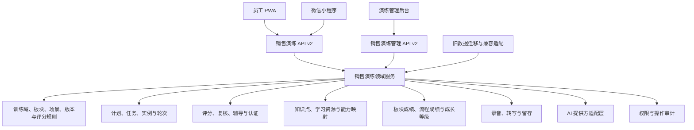
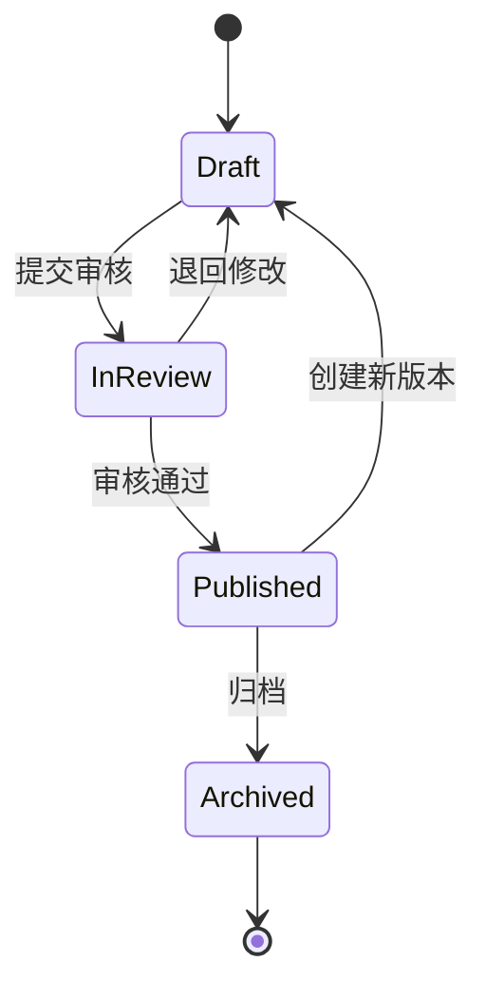
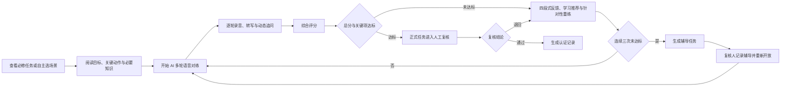

# 销售演练重构技术设计

Feature Name: sales-drill-rebuild
Updated: 2026-07-27

## 1. 设计目标

本设计将现有任务演练、话术知识库、录音分析和自由对练整合为一个版本化销售演练域。统一域以新签和续费为两个独立训练域，通过板块练习、完整流程、能力知识图谱和成长等级形成可持续校准的训练闭环。统一域同时服务 PWA、微信小程序和管理后台，并保留现有演练历史的可追溯性。

目标能力包括：

- 以新签和续费双训练域组织内容。
- 以业务板块专项练习和完整流程演练构成双层训练结构。
- 以演练场景版本作为内容与评分事实源。
- 以演练实例串联多轮对话、录音、转写、评分、复核和认证。
- 支持能力动作、标准话术匹配和混合评分。
- 支持全员自主练习与定向必修任务。
- 支持 AI 初评、指定复核人、三次未达标辅导和 180 天录音留存。
- 支持演练前学习、演练后精准推荐和内容缺口治理。
- 支持板块与完整流程双达标的 60、70、80、90 四级成长路径。
- 通过版本化 `/api/drill/v2/` 为 PWA 与小程序提供一致契约。

## 2. 现状与主要缺口

现有实现包含多组互相交叉的数据链：

| 业务链 | 主要数据 | 主要接口或页面 | 缺口 |
| --- | --- | --- | --- |
| 四步任务通关 | `drill_templates`、`drill_scripts`、`user_drill_tasks`、`drill_records` | `api/drill/list.php`、`detail.php`、`step.php` | 缺少完整后台编排和统一版本 |
| 话术分析 | `script_dimensions`、`script_knowledge`、`script_analysis_records` | `script-knowledge.php`、`analyze-script.php` | 与任务话术使用独立 ID 空间 |
| 录音反馈 | `drill_recordings`、`script_ai_feedback` | `upload-recording.php`、`recording-feedback.php` | 上传同时写新旧反馈，返回 ID 与详情查询参数不一致 |
| 自由对练 | `drill_conversations`、`drill_messages` | `free-chat.php`、小程序自由对练页 | 与任务、认证和复核链分离 |
| 后台 AI 对练 | 同一会话表 | `api/admin/ai-drill.php`、`ai-drill.html` | 管理权限端点承担员工演练逻辑 |

`upload-recording.php` 先按 `drill_scripts.id` 校验话术，再尝试以相同整数读取 `script_knowledge.id`。两个 ID 空间可能命中不同内容。接口返回 `script_analysis_records.id` 作为 `feedback_id`，现有反馈页又默认将该值作为 `drill_recordings.id` 查询，形成明确的结果断链。

## 3. 目标架构

### 3.1 分层原则

- 客户端只消费稳定的 v2 资源和状态，不感知旧表结构。
- 领域服务负责事务、状态机、权限、版本锁定和幂等。
- AI 适配层负责转写、客户回应和结构化评分，业务规则负责最终通过判定。
- 实时对话链负责分片转写和下一轮客户回应，演练完成链负责异步完整评分和学习推荐。
- 场景发布后形成不可变版本，任务和演练实例固定引用版本 ID。
- 评分项与知识点映射发布后形成不可变版本，历史报告固定引用评分时版本。
- 录音文件、转写文本、AI 原始结果和业务评分分别管理生命周期。

## 4. 业务流程

### 4.1 内容发布流程

已发布版本保持只读。新版本发布后进入新任务和自主练习目录，已生成任务继续引用原版本。

### 4.2 员工训练流程

自主练习在综合评分后直接完成并生成个人练习记录。正式认证必须完成人工复核。

### 4.3 双训练域与业务板块

新签与续费拥有独立的流程版本、业务板块、场景库、评分规则和成长等级。两个训练域共用演练实例、语音、评分、复核、学习推荐和移动端基础设施。

新签训练域首版采用以下八板块骨架：

| 顺序 | 阶段 | 主要训练目标 |
| --- | --- | --- |
| 1 | 线索准备 | 理解来源、客户背景和沟通目标 |
| 2 | 邀约确认 | 建立联系、说明到店价值、确认时间与准备事项 |
| 3 | 到店接待 | 破冰、建立信任、完成现场承接 |
| 4 | 需求诊断 | 识别家庭需求、决策链、时间与真实顾虑 |
| 5 | 体测与体验协同 | 完成前采、教练交接、体验观察与反馈承接 |
| 6 | 方案与价值呈现 | 基于需求和体验结果形成课程建议与价值表达 |
| 7 | 异议及签约交接 | 处理异议、推进决策、完成合同和服务交接 |
| 8 | 未成交跟进与转介绍 | 执行后续触达、复盘、再次邀约和转介绍沟通 |

续费板块由后续正式续费资料形成，经业务审核后发布为独立流程版本。正式任务固定引用训练域流程版本，避免板块调整改变历史演练语义。

### 4.4 成长路径与等级判定

完整流程演练始终开放，用于首次诊断、日常练习和正式认证。员工训练域等级同时受必修板块成绩与完整流程成绩约束。

| 分数区间 | 等级 | 认证条件 |
| --- | --- | --- |
| 0-59 | 待提升 | 任一必修板块或完整流程低于 60 |
| 60-69 | 入门 | 每个必修板块和完整流程均达到 60 |
| 70-79 | 初阶 | 每个必修板块和完整流程均达到 70 |
| 80-89 | 进阶 | 每个必修板块和完整流程均达到 80 |
| 90-100 | 优秀 | 每个必修板块和完整流程均达到 90 |

等级判定使用当前评分规则版本下各必修板块和完整流程的有效最佳成绩。成长页同时展示最近成绩、有效最佳成绩、历史趋势和距下一等级分差。评分规则升级后，历史等级保留原版本标识，当前等级进入待重新评估状态，直至员工产生新版本有效成绩。

### 4.5 评分校准流程

评分建设遵循“流程定义、关键动作、评分规则、样本试评、人工对照、版本发布”的顺序。业务流程和标准话术先形成审核版本，评分规则 v1 再依据可观察行为定义维度、关键项、证据要求、权重和阈值。试运行阶段持续比较 AI 初评与人工复核，所有权重及阈值调整创建新评分版本，已完成记录继续引用原版本。

### 4.6 新签内容包路由与报告

| 评分上下文 | 评分规则 | 评分对象 | 附加报告内容 |
| --- | --- | --- | --- |
| `real_call_review` | `new_sign_real_call_v1` | 真实接待顾问 | 告知授权状态、真实成交动作和后续训练任务 |
| `ai_roleplay` | `new_sign_training_demo_v1` | 参与 AI 家长模拟的员工 | 独立接待与独立谈单就绪度 |
| `training_demo` | `new_sign_training_demo_v1` | 培训讲解者或被带练者 | 培训传递风险、优秀话术、被带练者就绪度 |

内容包总分映射为独立评估等级：85 至 100 为优秀、70 至 84 为良好、60 至 69 为合格、低于 60 为不合格。该等级保存在评估报告中；成长等级继续使用 60、70、80、90 四级共同门槛计算。

培训演练就绪度由版本化规则判定。独立接待要求需求挖掘至少 10 分、FAB 价值转化至少 14 分、试关闭至少 6 分；独立谈单要求总分至少 70 分、异议处理至少 10 分、报价与谈判策略至少 7 分。任一核心维度低于该维度满分 50% 时，报告将就绪度标记为暂不可放单并列出具体阻断项。

结构化报告由固定字段和版本化扩展字段组成。固定字段包含基本信息、整体结论、八维分数、带时间戳证据、优势、优先改进项、SMART 训练任务、内容包评估等级和资料引用版本；培训演练扩展字段包含培训传递风险、优秀话术与就绪度。报告中的新话术仅作为候选内容，经过内容审核后才能进入已发布场景或学习资源。

## 5. 数据模型

### 5.1 内容域

| 表 | 用途 | 关键字段 |
| --- | --- | --- |
| `drill_training_domains` | 新签与续费训练域 | `id`、`domain_code`、`name`、`status` |
| `drill_process_versions` | 训练域流程不可变版本 | `id`、`domain_id`、`version_no`、`status`、`published_at` |
| `drill_process_stages` | 流程版本中的业务板块 | `id`、`process_version_id`、`stage_code`、`name`、`sort_order`、`required`、`status` |
| `drill_scenarios` | 场景稳定身份 | `id`、`scenario_code`、`domain_id`、`stage_id`、`difficulty`、`status` |
| `drill_scenario_versions` | 场景不可变版本 | `id`、`scenario_id`、`version_no`、`customer_profile_json`、`objectives_json`、`key_actions_json`、`standard_expressions_json`、`risk_expressions_json`、`prompt_policy_json`、`status`、`published_at` |
| `drill_rubrics` | 评分规则稳定身份 | `id`、`rubric_code`、`name`、`mode`、`status` |
| `drill_rubric_versions` | 评分规则不可变版本 | `id`、`rubric_id`、`version_no`、`dimensions_json`、`critical_items_json`、`score_policy_json`、`status` |
| `drill_rubric_dimension_mappings` | 能力维度到业务板块的版本化映射 | `rubric_version_id`、`dimension_code`、`process_stage_id`、`weight`、`status` |
| `drill_reference_materials` | FAB、定价和案例等资料稳定身份 | `id`、`domain_id`、`material_code`、`material_type`、`status` |
| `drill_reference_material_versions` | 参考资料不可变版本 | `id`、`material_id`、`version_no`、`content_json`、`source_json`、`valid_from`、`valid_until`、`status`、`content_hash` |
| `drill_legacy_content_mappings` | 旧内容迁移映射 | `source_type`、`source_id`、`scenario_id`、`scenario_version_id`、`review_status`、`migration_batch_id` |
| `drill_persona_dimensions` | 客户画像维度和值 | `id`、`dimension_code`、`value_code`、`name`、`status` |
| `drill_scenario_personas` | 场景版本锁定的画像组合 | `scenario_version_id`、`dimension_id`、`value_code`、`source` |

`mode` 支持 `capability`、`script_match` 和 `hybrid`。JSON 字段进入服务前必须通过显式结构校验，并在 API 响应中返回解析后的对象。

### 5.2 能力知识图谱

| 表 | 用途 | 关键字段 |
| --- | --- | --- |
| `drill_knowledge_points` | 可复用知识点 | `id`、`knowledge_code`、`name`、`status`、`published_version` |
| `drill_learning_resources` | 移动可学资源 | `id`、`resource_code`、`resource_type`、`title`、`mobile_url`、`status` |
| `drill_rubric_knowledge_links` | 评分项到知识点的版本化映射 | `rubric_version_id`、`criterion_code`、`knowledge_point_id`、`priority`、`mapping_version` |
| `drill_knowledge_resource_links` | 知识点到资源的版本化映射 | `knowledge_point_id`、`learning_resource_id`、`mapping_version`、`status` |
| `drill_learning_recommendations` | 一次评分产生的推荐快照 | `attempt_id`、`criterion_code`、`knowledge_point_id`、`learning_resource_id`、`evidence_json`、`mapping_version` |
| `drill_content_gaps` | 缺少学习资源的治理事项 | `criterion_code`、`knowledge_point_id`、`source_attempt_id`、`status`、`owner_staff_id` |
| `drill_learning_progress` | 员工知识点学习状态 | `staff_id`、`knowledge_point_id`、`resource_id`、`status`、`completed_at` |

评分报告只推荐已发布且包含移动版本的资源。评分关键项缺少有效映射时创建内容缺口，正式报告展示待补充状态。

### 5.3 计划与任务域

| 表 | 用途 | 关键字段 |
| --- | --- | --- |
| `drill_plans` | 训练计划 | `id`、`plan_code`、`name`、`plan_type`、`status`、`pass_policy_json`、`recording_retention_days` |
| `drill_plan_items` | 计划中的场景顺序 | `plan_id`、`scenario_version_id`、`rubric_version_id`、`sort_order`、`required` |
| `drill_plan_publications` | 一次计划发布快照 | `id`、`plan_id`、`target_scope_json`、`starts_at`、`due_at`、`published_by`、`published_at` |
| `drill_publication_reviewers` | 发布任务复核人 | `publication_id`、`reviewer_staff_id`、`priority`、`status` |
| `drill_assignments` | 员工必修任务 | `id`、`publication_id`、`staff_id`、`status`、`failed_attempts`、`current_attempt_id`、`due_at` |

`drill_assignments` 对 `publication_id + staff_id` 建立唯一约束，保证员工同时命中多个目标条件时只生成一个任务。

### 5.4 演练、等级与审核域

| 表 | 用途 | 关键字段 |
| --- | --- | --- |
| `drill_attempts` | 一次演练实例 | `id`、`assignment_id`、`staff_id`、`practice_type`、`evaluation_context`、`score_subject_key`、`status`、`scenario_snapshot_json`、`rubric_snapshot_json`、`calibration_version_id`、`started_at`、`completed_at` |
| `drill_attempt_participants` | 评分对象和录音参与者 | `attempt_id`、`participant_key`、`staff_id`、`role_code`、`is_score_subject`、`mapping_status` |
| `drill_attempt_reference_bindings` | 实例锁定的参考资料版本 | `attempt_id`、`material_version_id`、`purpose_code`、`content_hash` |
| `drill_turns` | 多轮对话 | `id`、`attempt_id`、`turn_no`、`speaker`、`input_type`、`content`、`audio_asset_id`、`transcription_status`、`created_at` |
| `drill_transcripts` | 录音转写及处理状态 | `id`、`attempt_id`、`audio_asset_id`、`transcript_type`、`provider`、`confidence`、`status`、`completed_at` |
| `drill_transcript_segments` | 带时间范围和角色的转写分段 | `id`、`attempt_id`、`transcript_id`、`segment_no`、`speaker_key`、`role_code`、`starts_ms`、`ends_ms`、`content`、`mapping_confidence`、`is_coach_supplement` |
| `drill_evaluations` | AI 与规则评分 | `id`、`attempt_id`、`source`、`total_score`、`dimension_scores_json`、`critical_results_json`、`evidence_json`、`suggestions_json`、`raw_response_ref`、`status` |
| `drill_evaluation_reports` | 结构化新签复盘报告 | `id`、`attempt_id`、`evaluation_id`、`evaluation_context`、`evaluation_grade`、`readiness_status`、`report_json`、`status` |
| `drill_report_action_items` | SMART 训练任务 | `report_id`、`dimension_code`、`action_text`、`success_criteria`、`due_at`、`retest_method`、`learning_resource_id`、`status` |
| `drill_review_tasks` | 人工复核 | `id`、`assignment_id`、`attempt_id`、`reviewer_staff_id`、`status`、`decision`、`comment`、`score_adjustment_json`、`reviewed_at` |
| `drill_coaching_tasks` | 三次未达标后的辅导 | `id`、`assignment_id`、`coach_staff_id`、`status`、`notes`、`reopened_at` |
| `drill_certifications` | 正式认证结果 | `id`、`assignment_id`、`attempt_id`、`plan_id`、`staff_id`、`reviewer_staff_id`、`certified_at`、`result_snapshot_json` |
| `drill_audio_assets` | 录音文件与留存 | `id`、`staff_id`、`storage_path`、`mime_type`、`duration_seconds`、`consent_basis`、`purpose_code`、`access_scope_json`、`retention_until`、`status`、`expired_at` |
| `drill_audio_chunks` | 当前轮录音分片 | `id`、`audio_asset_id`、`chunk_no`、`checksum`、`status`、`received_at` |
| `drill_mastery_scores` | 当前版本下的最近与最佳成绩 | `staff_id`、`domain_id`、`stage_id`、`score_scope`、`rubric_version_id`、`latest_score`、`best_score`、`best_attempt_id` |
| `drill_growth_levels` | 员工训练域等级快照 | `staff_id`、`domain_id`、`rubric_version_id`、`level_code`、`level_score`、`status`、`calculated_at` |
| `drill_rubric_calibrations` | 评分校准记录 | `rubric_version_id`、`sample_set_ref`、`human_comparison_json`、`change_summary_json`、`created_by` |

`score_scope` 区分 `stage` 和 `full_process`。`drill_growth_levels.level_score` 取全部必修板块最佳成绩和完整流程最佳成绩中的最小值，再映射为等级。`drill_evaluation_reports.evaluation_grade` 保存内容包评估等级，与 `drill_growth_levels.level_code` 独立计算。

新签内容包初始化两个评分规则稳定身份：`new_sign_real_call_v1` 服务 `real_call_review`，`new_sign_training_demo_v1` 服务 `ai_roleplay` 和 `training_demo`。两套规则共享需求挖掘、FAB 价值转化、案例植入、方案匹配与规划、报价与谈判策略、异议处理、试关闭、紧迫感制造八个维度，分别维护权重、证据要求、关键项和校准锚点。实例还需固定 `evaluation_context`、评分对象和评分校准版本。

参考资料以独立版本发布。品牌与课程 FAB、课包与定价、案例库分别保存来源、有效期、授权状态和内容哈希；相互冲突或缺少依据的条目停留在草稿或审核中。评分实例通过 `drill_attempt_reference_bindings` 锁定实际使用版本，确保历史报告可复现。

### 5.5 状态机

任务状态：

`assigned -> in_progress -> ai_evaluating -> awaiting_review -> passed`

未达标分支：

`ai_evaluating -> retry_available -> coaching_required -> in_progress`

人工退回分支：

`awaiting_review -> retry_available|coaching_required`

演练实例状态：

`created -> active -> turn_finalizing -> evaluating -> evaluated -> completed|failed`

录音复盘确认分支：

`evaluating -> speaker_confirmation_required -> evaluating`

单轮语音状态：

`created -> receiving_chunks -> partial_transcribing -> final_transcribing -> ready|transcription_failed`

所有状态变更使用条件更新或行锁，重复完成请求返回同一已提交结果。

## 6. 组件与职责

### 6.1 领域服务

- `DrillContentService`：训练域、流程、板块、场景、画像、版本、审核、发布和归档。
- `DrillReferenceMaterialService`：FAB、定价、案例资料的来源核验、版本、有效期、授权、发布和实例绑定。
- `DrillPlanService`：计划、场景编排、目标范围、复核人和发布快照。
- `DrillAssignmentService`：定向任务生成、状态和前置条件。
- `DrillAttemptService`：演练实例、轮次、暂停恢复和幂等完成。
- `DrillConversationService`：客户画像、对话上下文、下一轮回应和阶段推进。
- `DrillSpeakerMappingService`：说话人分段、角色映射、评分对象确认和带教补充标记。
- `DrillEvaluationService`：按评分上下文选择规则、双评分模式、结构校验、关键项判定和证据定位。
- `DrillEvaluationReportService`：内容包评估等级、结构化报告、就绪度和 SMART 训练任务。
- `DrillLearningService`：知识图谱映射、演练前学习、评分后推荐、学习进度和内容缺口。
- `DrillGrowthService`：最近成绩、有效最佳成绩、等级计算、重新评估和趋势。
- `DrillCalibrationService`：评分样本、人工对照、权重阈值变更和版本发布依据。
- `DrillReviewService`：复核任务、改分、退回、重新指派和认证。
- `DrillCoachingService`：连续失败计数、辅导任务和重新开放。
- `DrillMediaService`：音频校验、受控存储、访问授权和到期处理。
- `DrillAnalyticsService`：员工、门店、岗位、阶段和计划统计。
- `DrillMigrationService`：旧内容、任务和历史记录映射。

服务从 `api/common/context.php` 获取当前员工、员工 ID、岗位、门店和数据范围。管理操作通过具名权限执行。

### 6.2 AI 适配层

AI 适配层提供六个稳定能力：

1. `transcribeChunk()`：对当前录音分片生成临时转写。
2. `finalizeTranscription()`：合并分片并生成当前轮最终转写。
3. `mapSpeakers()`：生成带时间范围的转写分段、说话人候选和角色映射置信度。
4. `generateCustomerTurn()`：基于客户画像、场景目标和完整对话生成客户下一轮回应。
5. `evaluateAttempt()`：按评分上下文、评分对象和锁定规则返回结构化分数、关键项、证据和建议。
6. `generateScenarioDraft()`：根据受控画像维度和板块目标生成待审核候选场景。

客户端每 0.5 至 1 秒上传一个带连续序号和校验值的音频分片。后台接收分片后增量转写，员工结束当前轮时执行最终合并。后台取得最终转写后生成下一轮客户回应，目标体验为正常网络下约 2 至 4 秒完成轮次切换。演练结束后先完成说话人映射和评分对象确认，再异步执行完整评分、结构化报告和学习推荐。

`real_call_review` 进入评分前校验录音告知授权、用途、访问范围和留存期限。`training_demo` 将讲解者、被带练者和带教者分别建模；标记为 `is_coach_supplement` 的分段保留在报告证据中，计算被带练者成绩时从评分输入中排除。说话人或评分对象无法可靠确认时，实例进入 `speaker_confirmation_required`，由具备复核权限的人员确认后继续。

评分证据只引用锁定转写分段，包含 `segment_id`、原文、起止时间、说话人角色、维度、证据类型和规则版本。内容不足时输出 `insufficient_evidence`，报告生成器不得补写录音中未出现的表达。SMART 任务同时绑定待改进维度、具体动作、成功标准、截止时间、复测方式和已发布学习资源。

提供方、模型和超时从项目自身安全配置读取。业务表只记录提供方标识、模型标识、提示词版本、耗时和受控原始响应引用。AI 调用失败进入可重试状态，业务层仅使用完整有效的评分结果生成正式认证。

## 7. API 设计

### 7.1 员工 API

| 方法 | 路径 | 用途 |
| --- | --- | --- |
| `GET` | `/api/drill/v2/home.php` | 演练中心摘要和三个入口计数 |
| `GET` | `/api/drill/v2/catalog.php` | 新签、续费、业务板块、自主场景和筛选项 |
| `GET` | `/api/drill/v2/assignments.php` | 本人必修任务列表或详情 |
| `POST` | `/api/drill/v2/attempts.php` | 创建、恢复或结束演练实例 |
| `POST` | `/api/drill/v2/turns.php` | 提交文本轮次并获取客户回应 |
| `POST` | `/api/drill/v2/audio-chunks.php` | 幂等上传当前轮录音分片并启动临时转写 |
| `POST` | `/api/drill/v2/turns/finalize.php` | 完成当前轮最终转写并获取客户回应 |
| `GET` | `/api/drill/v2/attempt-status.php` | 查询转写与评分状态 |
| `GET` | `/api/drill/v2/results.php` | 本人结果列表或详情 |
| `GET` | `/api/drill/v2/progress.php` | 板块、完整流程、成长等级、趋势和下一目标 |
| `GET` | `/api/drill/v2/learning.php` | 演练前知识、结果推荐和本人学习记录 |

创建类请求接受 `Idempotency-Key`。`POST /api/drill/v2/attempts.php` 创建录音复盘时同时提交 `evaluation_context`、评分对象、参与者角色和录音授权元数据。响应统一返回 `code`、`message`、`data` 和 `request_id`。异步转写与评分返回 HTTP 202 和可轮询状态资源。

### 7.2 管理 API

| 方法 | 路径 | 用途 |
| --- | --- | --- |
| `GET|POST` | `/api/admin/drill/v2/domains.php` | 新签与续费训练域管理 |
| `GET|POST` | `/api/admin/drill/v2/stages.php` | 流程版本与业务板块管理 |
| `GET|POST` | `/api/admin/drill/v2/scenarios.php` | 场景草稿、审核、发布与归档 |
| `GET|POST` | `/api/admin/drill/v2/rubrics.php` | 评分规则与版本管理 |
| `GET|POST` | `/api/admin/drill/v2/reference-materials.php` | FAB、定价、案例资料审核和版本管理 |
| `GET|POST` | `/api/admin/drill/v2/knowledge-map.php` | 知识点、学习资源、评分项映射和内容缺口 |
| `GET|POST` | `/api/admin/drill/v2/calibrations.php` | 评分样本、人工对照和规则校准 |
| `GET|POST` | `/api/admin/drill/v2/plans.php` | 计划编排与发布 |
| `GET|POST` | `/api/admin/drill/v2/reviews.php` | 复核队列、结论与重新指派 |
| `GET|POST` | `/api/admin/drill/v2/coaching.php` | 辅导任务与重新开放 |
| `GET` | `/api/admin/drill/v2/analytics.php` | 训练统计和下钻 |
| `GET|POST` | `/api/admin/drill/v2/migrations.php` | 迁移预检、批次执行与结果 |

管理权限建议拆分为 `drill.content_manage`、`drill.knowledge_manage`、`drill.rubric_calibrate`、`drill.plan_publish`、`drill.review`、`drill.coaching`、`drill.analytics_all` 和 `drill.migration_manage`。参考资料沿用 `drill.content_manage`，真实录音和说话人确认沿用 `drill.review` 并叠加门店或总部数据范围。

## 8. 多端设计

### 8.1 PWA

PWA 采用统一移动 Web 外壳，一级入口为工作量、演练和我的。演练中心提供新签训练、续费训练、必修任务、自由练习和成长等级；学习内容从演练准备页、结果页和个人学习记录进入。语音层使用浏览器录音能力，录音权限失败时开放文本辅助输入。进行中的演练实例将最近完整轮次标识保存在本地，服务端保存权威状态。

Service Worker 缓存应用外壳、静态资源和只读目录摘要。录音上传、对话和评分请求保持在线执行。版本更新时提示员工刷新，进行中的演练通过服务端实例恢复。

### 8.2 微信小程序

小程序一级入口与 PWA 保持工作量、演练和我的三项结构。小程序录音分片上传至统一后台转写服务，`WechatSI` 仅作为兼容辅助能力。任务、场景、实例、反馈、学习和成长记录页面切换到 v2 API。小程序页面与 PWA 使用相同状态值、评分字段和错误码。

## 9. 迁移方案

### 阶段 A：只读盘点与映射

- 统计 `drill_templates`、`drill_scripts`、`user_drill_tasks`、`drill_recordings`、`script_ai_feedback`、`script_dimensions`、`script_knowledge`、`script_analysis_records`、`drill_conversations` 和 `drill_messages`。
- 按旧来源生成稳定迁移键，输出重复 ID、孤立引用和无法映射记录。
- 将旧七步曲、销售十问和现有话术放入待审核迁移批次。

### 阶段 B：新域建表与内容迁移

- 使用增量迁移创建 v2 表、索引和约束。
- 初始化新签与续费训练域和新签八板块骨架。
- 将审核通过的旧内容映射为场景与版本。
- 将冲突内容保存为待审核版本，保留原始来源摘要。

### 阶段 C：历史记录迁移

- 可完整映射的任务、录音和分析记录转换为只读历史演练实例。
- 无法完整映射的记录写入来源标识和只读摘要。
- 每批保存总数、成功数、待审核数、失败数和重试状态。

### 阶段 D：客户端切换

- 先切换后台内容和计划管理。
- 再切换 PWA 演练中心。
- 随后切换普通微信小程序。
- 切换期间保留旧 GET 端点和反馈查询适配器，旧写入入口进入受控冻结阶段。

### 阶段 E：旧链归档

- 对账新旧任务数、实例数、录音数、分析数和认证数。
- 通过回归与人工抽样后，将旧内容写入口设为只读。
- 旧表保留查询窗口和映射关系，后续按独立数据治理计划处理。

## 10. 正确性属性

1. 同一发布批次与员工最多存在一个有效必修任务。
2. 每个演练实例固定引用一组场景版本和评分规则版本。
3. 同一演练实例的轮次号严格递增且不重复。
4. 正式认证同时满足 AI 总分阈值、全部关键项和人工通过结论。
5. 同一必修任务连续三次未达标时恰好存在一个有效辅导任务。
6. 每个认证记录关联一个已完成演练实例和一个已完成复核任务。
7. AI 原分、人工调整值和最终认证快照可独立追踪。
8. 录音到期处理不改变演练得分、复核结论和认证结果。
9. 员工只能读取本人演练详情；复核人只能读取被指派任务；管理人员按门店或总部范围读取。
10. 迁移批次的成功、待审核、失败和跳过数量之和等于输入记录数。
11. 员工训练域等级等于当前评分版本下全部必修板块有效最佳成绩与完整流程有效最佳成绩所共同满足的最高门槛。
12. 每个评分后学习推荐关联评分关键项、对话证据、知识点、学习资源和映射版本。
13. 同一录音资源内的分片序号唯一，重复分片校验值一致时返回同一接收结果。
14. 客户画像生成的候选场景经过人工审核后才能进入正式任务和认证目录。
15. 新签和续费的流程版本、板块成绩和成长等级分别计算。
16. 每个新签评估上下文只引用其路由规则允许的评分规则版本。
17. 被带练者评分输入不包含标记为带教补充的转写分段，原始报告仍可追踪这些分段。
18. 每条评分证据关联同一演练实例内的转写分段、时间范围、说话人角色和评分规则版本。
19. 每个新签评估实例引用的参考资料版本在评分时已发布、处于有效期内且内容哈希保持不变。
20. 内容包评估等级只由内容包规则计算，成长等级只由当前评分版本下的板块与完整流程有效成绩计算。
21. `real_call_review` 只有在录音授权依据、用途、访问范围和留存期限完整有效时才能进入转写、评分和人工查看。
22. 每项 SMART 训练任务同时具备维度、具体行为、完成标准、截止时间、复测方式和已发布学习资源。

## 11. 错误处理

| 场景 | 处理 |
| --- | --- |
| 录音权限被拒绝 | 提示用途与授权方式，开放文本辅助输入 |
| 上传中断 | 保留本地录音和服务端实例，允许重复上传同一轮 |
| 转写失败 | 标记轮次 `transcription_failed`，允许员工重试或改用文本 |
| AI 客户回应失败 | 保留已完成轮次，返回可重试状态 |
| AI 评分结构异常 | 保存受控原始响应引用，进入评分待处理队列 |
| 复核人失效 | 阻止新指派，现有待办进入重新指派队列 |
| 场景版本归档 | 历史任务继续读取快照，新任务目录过滤归档版本 |
| 并发结束演练 | 通过幂等键和状态条件更新返回同一结果 |
| 录音到期 | 清理文件，保留元数据并显示已到期状态 |
| 音频分片乱序或重复 | 按分片序号重排，校验值一致时幂等接收，冲突时要求重传对应分片 |
| 最终转写超时 | 保留已接收分片和临时转写，允许继续查询或重新完成当前轮 |
| 学习资源缺少移动版本 | 创建内容缺口并在报告中显示待补充状态 |
| 当前评分版本缺少有效成绩 | 保留历史等级参考，当前等级显示待重新评估 |
| 真实录音授权缺失或失效 | 阻止转写、评分和人工播放，返回授权待补状态 |
| 说话人或评分对象无法确认 | 进入 `speaker_confirmation_required`，经有权限人员确认后继续 |
| 带教补充未完成标记 | 阻止被带练者评分，要求先完成角色与分段确认 |
| 参考资料冲突、过期或未发布 | 从评分上下文排除并创建内容审核事项 |
| 评分证据无法定位原文分段 | 将对应维度标记为证据不足并进入评分待处理队列 |

## 12. 测试策略

### 12.1 单元测试

- 场景和评分规则版本状态机。
- 双评分模式和混合权重计算。
- 总分与关键项通过判定。
- 连续三次未达标辅导触发。
- 180 天录音到期计算。
- 任务目标范围去重和复核人有效性。
- 成长等级门槛、双达标判定、最近成绩和有效最佳成绩更新。
- 评分项、知识点、学习资源映射版本和内容缺口生成。
- 音频分片序号、校验、幂等接收和最终合并。
- 新签评估上下文到两套评分规则的路由。
- 说话人角色、带教补充排除、内容包等级和培训就绪度判定。
- 参考资料状态、有效期、内容哈希和实例版本绑定。

### 12.2 属性测试

- 任务唯一性、轮次单调性、状态互斥和认证完整性。
- 随机评分与关键项组合下通过结论一致性。
- 随机迁移批次下数量守恒和幂等。
- 随机权限范围下演练记录可见性一致性。
- 随机板块成绩和完整流程成绩组合下等级等于最低能力门槛。
- 随机重复及乱序音频分片下最终分片集合和顺序一致。
- 随机评分项映射下推荐资源均属于评分时发布映射版本。
- 随机说话人分段下被带练者评分集合始终排除带教补充。
- 随机评分下内容包等级与成长等级分别遵循各自门槛。
- 随机参考资料版本组合下评分实例只绑定已发布且有效的版本。

### 12.3 集成测试

- 发布计划到员工任务生成。
- 语音上传、转写、多轮回应、评分和结果查询。
- 三次失败、辅导、重新开放和再次认证。
- AI 初评、人工改分、复核通过和认证生成。
- PWA 与小程序读取同一任务和结果。
- 旧 ID 映射、反馈兼容和历史只读查询。
- 分片上传、临时转写、最终转写、客户回应和异步完整评分。
- 评分关键项、知识推荐、移动学习完成和再次演练闭环。
- 评分规则升级、历史等级保留和当前等级重新评估。
- 真实录音授权、转写分段、说话人确认、实操评分和结构化报告。
- AI 角色扮演与培训带练的规则路由、核心维度门槛和就绪度阻断项。
- FAB、定价与案例资料审核发布、实例锁定和历史报告复现。

### 12.4 验收测试

- Android PWA、iPhone PWA 和微信小程序录音权限、上传、弱网恢复与播放。
- 员工、指定复核人、店长、总部运营和系统管理员权限矩阵。
- 新签与续费板块练习、完整流程诊断和完整流程认证。
- 60、70、80、90 等级双达标、最佳成绩定级和最近成绩趋势。
- 板块四段式反馈、完整流程板块表现和优先补强能力。
- 工作量、演练、我的移动导航及演练内移动学习。
- 内容审核发布、任务定向、复核改分、辅导和统计下钻。
- 录音用途说明、180 天留存提示和到期状态展示。
- 新签实操录音版与演练版八维评分、时间戳证据、SMART 任务和独立评估等级。
- 培训讲解者、被带练者和带教补充的说话人确认与评分对象隔离。

## 13. 部署与回滚

- 数据库只采用前向增量迁移，旧表在切换期保持可读。
- v2 API 与现有 API 并行部署，客户端按入口分批切换。
- 每个迁移批次在执行前生成计数快照和映射预览。
- 客户端回滚时恢复旧入口路由，新域数据保持只读保留。
- AI 提供方异常时暂停新评分并保留演练实例，恢复后从待处理队列继续。

## 14. 参考

- `real_sync/api/drill/`：现有任务、话术、录音、反馈和自由对练接口。
- `real_sync/mini-program/pages/drill/`：现有微信小程序演练页面。
- `real_sync/database/import_sales_seven_steps.php`：旧销售七步曲素材。
- `real_sync/database/import_sales_ten_questions.php`：旧销售十问素材。
- `real_sync/docs/追光小牛培训体系交付包_20260418/`：现行培训与岗位协同资料。
- `.monkeycode/docs/ARCHITECTURE.md`：员工身份、权限和系统边界。
- `.monkeycode/docs/INTERFACES.md`：认证、接口和数据范围约定。
- 用户提供的新签复盘 Skill：实操录音版、演练版、品牌与课程 FAB、课包与定价、案例库和评分校准锚点。
