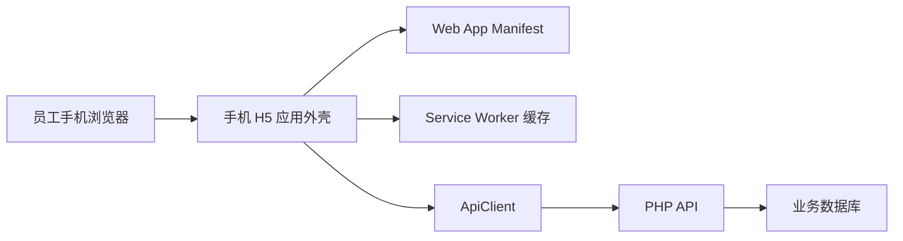

# 手机 H5 PWA 壳层设计

Feature Name: mobile-pwa-shell
Updated: 2026-07-29

## 描述

本设计为现有手机 H5 增加可安装、独立窗口、桌面图标、安装引导和受控离线外壳能力。业务页面、JWT 登录态、权限校验和 PHP API 保持现有职责。

## 架构

## 组件与接口

| 组件 | 职责 |
| --- | --- |
| `manifest.webmanifest` | 定义应用名称、起始页、独立窗口、主题色和图标。 |
| `js/mobile-pwa.js` | 注册 Service Worker，维护安装提示、独立窗口状态和网络状态。 |
| `sw.js` | 缓存应用外壳，保持 API 网络直连，提示新版本。 |
| `mobile/*.html` | 引用 Manifest、PWA 初始化脚本和移动安全区域配置。 |
| `assets/pwa/` | 提供安装图标。 |

## 正确性约束

- API 请求继续使用既有 `ApiClient`，缓存策略仅覆盖 GET 静态资源。
- 安装提示关闭状态以当前浏览器本地存储保存七天。
- 独立窗口状态由 `display-mode: standalone` 或 iOS `navigator.standalone` 判定。
- 新版 Service Worker 激活后清理此前 `zgxn-pwa-shell-` 前缀缓存。

## 错误处理

- Service Worker 注册失败时，应用保持浏览器 Web 页面可用。
- 浏览器缺少安装事件时，安装引导展示系统级操作说明。
- 离线状态下，页面通过已注册的在线事件恢复服务端刷新。

## 测试策略

- Node 静态测试验证 Manifest 字段、Service Worker 缓存边界、核心入口元数据和 PWA 初始化逻辑。
- 浏览器验收验证 Chrome Android 安装提示、iPhone 添加到主屏幕说明、独立窗口、离线外壳和更新提示。
- 回归验证覆盖已有演练、工作量、学习和个人中心页面语法。
