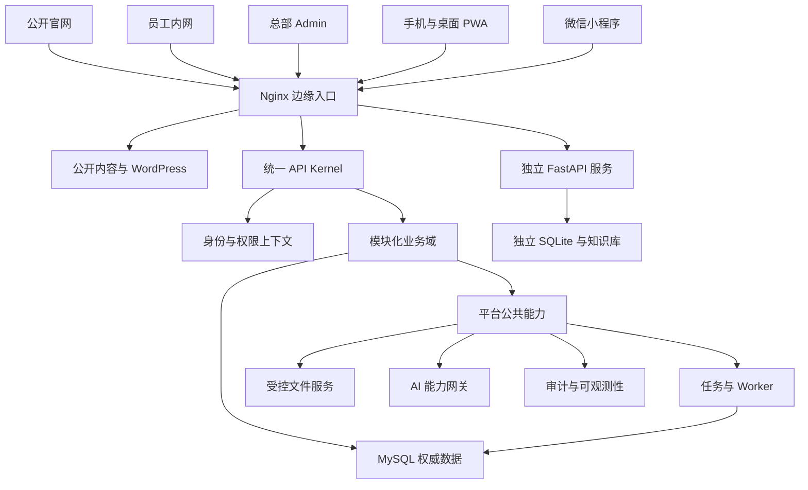
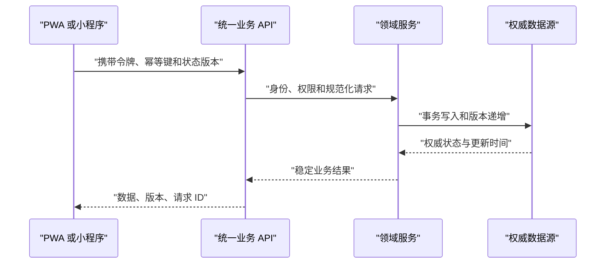
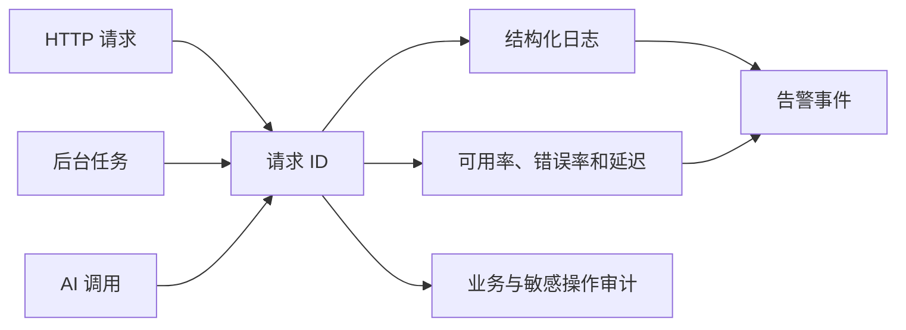

# 全站多端架构升级技术蓝图

Feature Name: `full-site-multi-client-architecture-upgrade`
Updated: 2026-07-31
Status: Ready for Approval

## 1. 设计目标

本蓝图以现有 PHP、MySQL、WordPress 身份、原生 JavaScript、PWA、微信小程序和独立 FastAPI 服务为基础，建立可持续演进的全站平台架构。目标架构采用模块化单体作为追光小牛业务主干，通过稳定公共层、领域服务、统一 API 和异步任务实现多端一致；`api.supercalf.com` 保持独立服务边界，通过统一资产和稳定性治理接入全站运维体系。

核心原则：

- 生产连续性优先，使用兼容门面和分批迁移。
- 业务事实保留单一权威来源，各端共享业务状态和权限语义。
- PWA 同时服务手机和桌面员工场景，总部 Admin 保持独立管理工作区。
- 小程序复用稳定 API，在 PWA 和公共层成熟后进入页面开发。
- AI、文件、Worker、审计和配置成为平台公共能力。
- 每个变更批次具备独立备份、验证、观察和回滚路径。

## 2. 现状基线

### 2.1 生产映射

| 边界 | 当前生产形态 | 蓝图定位 |
| --- | --- | --- |
| `supercalf.com` | Nginx 指向 `/www/wwwroot/122.51.223.46/`，承载官网、WordPress、企业内网、PHP API 和静态资产 | 公开官网与受保护业务共享边缘入口，按路由和权限隔离 |
| `api.supercalf.com` | Nginx 反向代理到 `127.0.0.1:8000` 的 FastAPI | 独立儿童成长 AI 服务，保持独立部署和数据边界 |
| PHP 业务 API | PHP 8.2 FPM，按 `api/` 业务目录部署 | 追光小牛模块化单体主干 |
| 业务数据库 | MySQL 同时承载 WordPress 身份和内网业务数据 | 领域所有权明确的共享关系数据库 |
| 后台任务 | Cron 调用 PHP CLI Worker | 统一任务契约、租约、运行记录和告警 |
| 私有文件 | 招聘使用 Web 根目录外私有目录，历史上传分布于 Web 根目录 | 统一受控文件服务和留存策略 |

生产主站和 API 服务当前均通过健康检查。主站存在大量历史文件差异，后续发布采用定向文件清单和无删除同步。

### 2.2 客户端和业务域

| 客户端 | 当前入口 | 目标职责 |
| --- | --- | --- |
| 公开官网 | `index.html`、门店、课程、新闻和 WordPress 内容 | 品牌、门店、课程、新闻和公开服务 |
| 员工内网 | `internal.html` | 浏览器兼容启动页、登录恢复和受控跳转入口 |
| 总部 Admin | `admin/` | 组织、工作量、演练、招聘、安全和系统治理 |
| Mobile H5/PWA | `mobile/`、`manifest.webmanifest`、`sw.js` | 手机与桌面可安装的员工应用 |
| 微信小程序 | `mini-program/` | 后续原生微信员工端 |
| 专题工具 | 体测、夏令营、周年庆、培训和 AI 页面 | 独立业务专题或历史兼容入口 |

主要业务域包括认证、员工组织、工作量、学习、知识、考试、通关、演练、招聘、企微、提醒、制度、积分、问卷、活动、统计、搜索、待办和上传。

## 3. 目标架构

### 3.1 边缘与入口层

Nginx 继续作为唯一公网边缘入口，负责 TLS、域名、静态资源、PHP 路由、FastAPI 反向代理和受保护路径。公开官网、员工业务和后台管理保持清晰 URL 边界：

- 公开入口：品牌、门店、课程、新闻和公开内容。
- 员工入口：`/internal.html`、`/mobile/` 及对应业务 API。
- 管理入口：`/admin/` 及 `/api/admin/`。
- 独立服务：`api.supercalf.com`。
- 受控资源：私有文件仅通过鉴权 API 读取。

### 3.2 统一 API Kernel

统一 API Kernel 是所有新端点和迁移端点的公共启动层，提供：

| 能力 | 统一行为 |
| --- | --- |
| 请求上下文 | 请求 ID、业务域、动作、客户端、版本和操作者 |
| 身份 | JWT、会话版本、员工状态和客户端身份 |
| 权限 | 具名权限、门店范围、员工本人范围和临时授权 |
| 输入 | HTTP 方法、JSON、表单、分页、文件和字段校验 |
| 输出 | HTTP 状态、`code`、`message`、`data`、`request_id` |
| 幂等 | `Idempotency-Key`、请求摘要、首次结果和冲突响应 |
| 错误 | 稳定错误分类、脱敏日志和用户恢复提示 |
| 审计 | 敏感读取、写入、高风险操作和权限拒绝 |

现有 `api/common/context.php`、`api/admin/common.php` 和 Drill v2 公共入口作为收口基础。历史接口通过兼容控制器逐步转交领域服务。

### 3.3 模块化业务域

每个业务域按控制器、应用服务、领域服务、数据访问和契约测试分层。域间协作使用稳定应用服务和审计事件，业务表保持明确所有者。

| 领域组 | 包含业务 | 优先级 |
| --- | --- | --- |
| 平台身份 | 认证、员工、组织、门店、岗位、任职、权限 | 波次 1 |
| 日常运营 | 工作量、审核、统计、导出、提醒、企微 | 波次 2 |
| 学习成长 | 学习、知识、考试、通关、演练、技能复盘 | 波次 3 |
| 人才管理 | 招聘、候选人、联系、录用转员工 | 波次 3 |
| 内容专题 | 制度、问卷、活动、体测、夏令营、培训 | 波次 4 |
| 公共服务 | 搜索、待办、通知、积分、文件、AI | 横向贯穿 |

## 4. 多端同步设计

多端同步以服务端权威状态为核心：

- 客户端本地仅保存应用外壳、用户偏好和明确允许的草稿。
- 核心业务对象返回稳定 ID、状态版本和更新时间。
- 写操作携带幂等键；状态机写入携带乐观锁版本。
- 冲突响应返回当前服务端状态和恢复动作。
- 上传采用摘要、分片或任务 ID 关联服务端状态。
- 通知和待办作为服务端投影，PWA 与小程序读取同一结果。

同步按业务对象分级：

| 等级 | 对象与流程 | 刷新机制 | 最大陈旧时间 |
| --- | --- | --- | --- |
| A | 提交、审核、联系、演练、上传 | 写后回读、窗口聚焦刷新、30 秒活动轮询 | 30 秒 |
| B | 工作量汇总、员工目录、候选人列表、待办 | 页面进入、窗口聚焦和 5 分钟校验 | 5 分钟 |
| C | 课程、制度、知识和公开内容 | 版本或 ETag 校验 | 30 分钟 |

列表接口使用稳定排序和增量游标；删除、撤销和权限失效通过墓碑状态进入增量结果。跨设备草稿优先保存服务端版本，客户端草稿携带基础版本；版本冲突时展示服务端版本与较新设备版本供用户确认。PWA 和小程序从后台恢复时先校验会话版本，再按对象同步等级刷新。

## 5. PWA 完善设计

当前 PWA 的作用域为 `/mobile/`，近期升级保留该路径并扩展为自适应员工应用。Manifest 的 `start_url` 和全部 PWA 内部导航均位于 `/mobile/`；`/internal.html` 作为浏览器兼容启动页，在登录恢复后跳转到 `/mobile/` 的受控路由。员工 PWA 覆盖手机和桌面浏览器，总部 Admin 继续服务管理场景。

### 5.1 应用壳

| 组件 | 目标职责 |
| --- | --- |
| Manifest | 手机与桌面安装、应用标识、快捷入口和显示模式 |
| Service Worker | 版本化应用壳、静态资源缓存、更新通知和旧缓存清理 |
| PWA Runtime | 安装提示、网络状态、独立窗口、版本和草稿恢复 |
| ApiClient | 认证、超时、请求 ID、错误分类、幂等和冲突处理 |
| Responsive Shell | 窄屏底部导航、宽屏侧栏或顶部导航、内容容器和状态区 |

### 5.2 设备布局

- 小于 768 像素：移动导航、单列卡片、安全区域和 44 像素触控目标。
- 768 至 1023 像素：平板导航和双列内容。
- 1024 像素及以上：桌面导航、分栏详情、表格和键盘操作。

### 5.3 缓存与更新

- 缓存应用外壳、公共脚本、样式、图标和明确的只读公共内容。
- `/api/`、用户文件、审计、候选人和员工数据保持网络访问。
- 草稿使用业务域、用户、对象和版本组成隔离键。
- 草稿仅保存业务批准字段，默认有效期为 24 小时；退出、会话撤销和权限变化触发敏感草稿清理。
- 新 Service Worker 进入等待态，用户确认后切换并刷新。
- 更新后重新验证会话和草稿版本。

### 5.4 客户端安全

- PWA 将短期访问令牌保存在页面内存；刷新凭据使用 `Secure`、`HttpOnly`、`SameSite=Lax` 且 `Path` 限制到认证刷新端点的 Cookie。
- 刷新端点同时校验 Origin、CSRF 请求头、令牌轮换状态和服务端会话版本；刷新令牌复用会撤销整个会话族。
- 多标签页通过 BroadcastChannel 传递会话版本和刷新协调事件，消息中不携带 Token 值。
- 小程序保存短期设备会话，服务端将其绑定到员工、微信身份、客户端和会话版本；重新绑定和异常设备变化要求重新认证。
- 受认证 API 响应、私有文件和敏感业务数据不进入 Service Worker 共享缓存。
- 用户退出、员工停用、权限撤销或会话版本变化后，清理授权状态和敏感本地数据。
- 用户输入和供应商返回内容按渲染上下文编码，并通过内容安全策略和 XSS 回归验证。

## 6. 小程序接入设计

小程序后续开发沿用同一 API 和状态机。当前阶段完成以下准备：

- 规范 Bearer Token、微信绑定和会话刷新。
- 统一 `/api/` 请求层、错误结构、幂等键和请求 ID。
- 统一上传摘要、进度和失败恢复。
- 固化页面注册、Tab 导航和普通导航约束。
- 定义订阅消息、录音、相册和文件选择适配器。
- 增加能力版本端点，供旧版客户端控制功能展示。

小程序阶段边界：

| 类别 | 波次 3 | 波次 6 |
| --- | --- | --- |
| 现网保活 | 保持已发布页面和接口可用 | 纳入常规发布治理 |
| 阻断缺陷 | 修复 Tab 跳转、登录和请求层阻断问题 | 持续修复 |
| 契约准备 | 固化身份、权限、上传、错误、幂等和能力版本 | 按稳定契约验收 |
| 新页面开发 | 冻结 | 开发、真机验收和灰度发布 |

## 7. 平台公共能力

### 7.1 AI 能力网关

统一能力接口：

| 能力 | 典型消费者 |
| --- | --- |
| `text.generate` | 报告、招聘语义分析、演练回应 |
| `assessment.score` | 演练、语音通关和技能复盘 |
| `vision.extract` | 体测图片和文档视觉提取 |
| `ocr.extract` | 体测和招聘简历 OCR |
| `speech.transcribe` | 演练、技能复盘和语音评测 |
| `image.generate` | 架构扩展点，本轮无生产消费者和供应商调用 |

网关负责请求上下文、供应商路由、模型版本、超时、重试、故障兜底、数据处理门禁、脱敏审计和调用指标。`api/ai-runtime.php` 作为兼容入口，逐步迁移体测、招聘、Drill v2、技能复盘和语音评测。根目录运行时副本在消费者迁移完成后进入兼容承接状态。

### 7.2 文件服务

文件服务统一处理用途、权限、实际类型、大小、SHA-256、存储位置、保留期限和访问审计。个人信息、简历、录音、工作量证据和导出文件逐步进入受控存储；公开品牌图片和课程静态资源继续由 Web Server 提供。

### 7.3 任务服务

统一任务契约包含任务类型、业务对象、幂等身份、状态、优先级、租约、fencing token、心跳、尝试次数、下一次执行时间、Worker、错误分类和运行摘要。Worker 提交结果时校验 fencing token，租约失效后拒绝迟到结果。消息、AI、文件和业务写入使用副作用幂等键；业务事务通过 transactional outbox 保存待投递事件。现有招聘 Worker 的租约模式作为基础，逐步覆盖工作量导出、提醒、企微、技能复盘、演练恢复和治理任务。

### 7.4 可观测性

核心指标包括入口可用率、API P50/P95/P99、HTTP 5xx、业务错误、数据库耗时、任务积压、任务失败、AI 供应商错误、存储容量、备份状态和业务成功率。

| SLI | 口径 | 目标或告警 |
| --- | --- | --- |
| 核心旅程可用率 | 官网、合成登录、员工入口和核心 API 每分钟各探测至少两次；四条旅程均成功形成一个可用分钟；计划维护计入总分钟 | 月度 99.9% |
| 核心读取延迟 | 按核心端点组统计服务端耗时 | P95 不高于 800 毫秒 |
| 核心写入延迟 | 按核心端点组统计服务端耗时 | P95 不高于 1500 毫秒 |
| 服务端错误率 | 5 分钟窗口 HTTP 5xx 除以总请求；最低样本 20 | 目标低于 1%，2% 触发发布停止评估 |
| 任务积压 | 各任务类型最老待处理任务年龄 | 5 分钟告警，15 分钟触发发布停止评估 |
| 数据恢复 | 核心数据库和受控文件备份与隔离恢复 | RPO 1 小时，RTO 2 小时 |

## 8. 功能治理矩阵

| 功能组 | 当前状态 | 目标处理 |
| --- | --- | --- |
| 官网、门店、课程、新闻 | 生产运行 | 保留并完善公开边界、性能和可用性 |
| 员工身份、组织和权限 | 已完成较强治理 | 作为平台统一上下文继续收口 |
| 工作量 | 新旧链并存，治理程度较高 | 保留领域服务，迁移旧入口和运行时 DDL |
| 销售演练 | v1 与 v2 并行 | 维持契约基线，逐步迁移 v1 |
| 招聘 | 基础闭环已部署 | 完善压缩包、OCR、AI、PWA 提醒和录用转员工 |
| 学习、知识、考试、通关 | 多套历史端点 | 建立领域契约并合并重复入口 |
| 企微、提醒、通知 | 已有 Worker 和接口 | 统一任务、消息状态和可观测性 |
| PWA | 手机壳已建立 | 扩展桌面体验、草稿恢复和版本治理 |
| 小程序 | 页面树和部分能力已存在 | 修正导航并在后续按稳定 API 完善 |
| 体测、夏令营和 AI 工具 | 独立专题运行 | 接入 AI 网关、统一日志和权限 |
| 文件和上传 | 私有与公开存储并存 | 按敏感级别迁移到受控文件服务 |
| FastAPI 儿童成长 AI | 独立生产服务 | 保持边界并纳入监控、备份和发布治理 |

完整实施前由自动化盘点脚本生成逐文件和逐端点功能登记清单，以上矩阵作为业务分组总览。

## 9. 数据模型与平台元数据

平台治理优先增加元数据和运行记录，避免复制领域业务事实：

| 模型 | 用途 |
| --- | --- |
| `platform_capability_registry` | 功能 ID、需求和设计关联、生命周期、治理分类、角色、客户端、入口、API、数据、权限、存储、任务、测试、生产路径、所有权、依赖、风险、波次和验证证据 |
| `platform_api_contract_versions` | API 契约版本、消费者和兼容状态 |
| `platform_job_runs` | Worker 与 Cron 运行摘要和告警关联 |
| `platform_service_health_events` | 服务健康、阈值和恢复事件 |
| `platform_release_batches` | 发布范围、备份、验证、观察和回滚记录 |
| `platform_ai_invocations` | AI 能力、供应商、模型、摘要、耗时和状态 |

元数据表采用增量迁移；实际字段在实施设计阶段根据已有审计和任务表复用情况确定。

功能生命周期统一使用 `planned`、`in_development`、`implemented`、`deployed`、`verified` 和 `deprecated`。每项同时保存治理分类“保留、完善、重构、补建、合并、兼容承接”，避免把交付状态与架构处置混为一类。

运行元数据按类型设置容量预算、索引和生命周期：请求级明细默认保留 30 天，任务与 AI 调用摘要保留 180 天，发布、审计和恢复证据按合规周期保留；清理任务只处理超过保留期且已归档的数据。具体期限在实施前由数据分类评审确认。

### 9.1 数据库演进协议

数据库变更采用 expand-migrate-contract：先增加兼容表、列和索引，再部署可同时理解新旧状态的应用，完成回填与双版本契约验证后切换写路径，历史结构收缩进入独立批准批次。兼容窗口内禁止删除或重命名生产字段，版本 N 与 N-1 必须通过双版本读写测试；新增列提供可保留数据的默认值或兼容写入适配器。N-1 无法表达的新状态和写入语义通过功能开关保持停用，直至回滚窗口结束。变更日志和 outbox 用于回滚后的数据重放、写入核对和副作用核对；N-1 停止写入并完成核对后，方可批准收缩批次。

## 10. 正确性属性

1. 同一用户、动作和幂等键只能产生一个已提交业务结果。
2. 任一客户端可见数据必须属于服务端计算的授权范围。
3. 同一业务对象的状态版本随成功状态变化单调递增。
4. 多端读取同一稳定 ID 和状态版本时获得相同业务状态。
5. 历史事实继续绑定写入时的组织、规则和处理版本。
6. 任一生产变更批次都具备可定位的备份、验证和回滚记录。
7. 敏感文件的物理读取必须经过当前身份、权限、范围和路径校验。
8. AI 业务结果必须关联能力类型、处理版本和可审计调用状态。
9. Worker 任务只有持有最新 fencing token 的执行者可以提交结果。
10. 同一副作用幂等键只能形成一次已确认外部或业务结果。
11. PWA 缓存中不包含受认证 API 响应和敏感业务文件。
12. 兼容窗口内的新数据可由新旧应用版本确定性解释。
13. 兼容窗口内版本 N 与 N-1 的写入均保留当前结构中的全部业务事实。

## 11. 错误处理

| 场景 | 处理 |
| --- | --- |
| 未认证或会话失效 | 返回 401、清理客户端授权状态并引导登录 |
| 权限或数据范围不足 | 返回 403、保存权限拒绝事件 |
| 状态版本冲突 | 返回 409、当前状态和恢复动作 |
| 重复写入 | 返回首次幂等结果或键冲突 |
| 数据库暂时错误 | 回滚事务、返回稳定错误码并记录告警上下文 |
| AI 或外部服务错误 | 按能力策略重试、故障兜底或进入待恢复状态 |
| Worker 超时 | 租约到期后受控重领，保留尝试历史 |
| PWA 离线 | 保留应用壳和草稿，恢复网络后重新校验服务端版本 |
| 发布指标越界 | 暂停后续波次并执行批次回滚计划 |

## 12. 测试策略

### 12.1 自动化门禁

- 功能登记清单完整性测试。
- API 契约快照和兼容控制器测试。
- 身份、角色、门店和员工范围属性测试。
- 数据迁移 dry-run、幂等、结构清单和回滚计划测试。
- PWA Manifest、Service Worker、缓存边界和响应式契约测试。
- 小程序页面注册、导航、请求层和能力版本测试。
- AI 网关路由、超时、重试、脱敏和审批门禁测试。
- Worker 租约、重试、积压和恢复测试。
- Worker fencing token、心跳、outbox 和副作用去重测试。
- 文件类型、路径、摘要、权限、留存和下载测试。
- 双版本读写、状态降级映射、数据回填和副作用补偿测试。
- 会话轮换、权限撤销、本地草稿到期、缓存清理和内容安全测试。
- PWA Cookie 属性、Origin 与 CSRF、令牌复用撤销、多标签协调和小程序设备会话测试。

### 12.2 客户端验收矩阵

| 客户端 | 最低验收范围 |
| --- | --- |
| 公开官网 | 首页、门店、课程、新闻、公开资源和错误页 |
| 内网桌面 | 登录、工作台、核心业务、退出和权限拒绝 |
| PWA 手机 | 安装、导航、离线壳、更新、草稿和弱网恢复 |
| PWA 桌面 | 安装、宽屏导航、键盘、分栏、更新和窗口恢复 |
| 总部 Admin | Dashboard、员工、工作量、演练、招聘和审计 |
| 微信小程序 | 后续阶段真机登录、Tab、业务状态、上传和订阅消息 |

### 12.3 稳定性验收

- 生产健康检查和关键用户旅程探测。
- API 延迟、错误率和数据库慢请求基线对比。
- Worker 队列积压、失败恢复和重复执行验证。
- 数据库备份恢复演练，验证 RPO 与 RTO。
- 发布观察窗口内的业务成功率和告警验证。

## 13. 实施波次

### 波次 0：基线与冻结

以功能矩阵组级 ID 为种子，生成页面、API、表、Worker、Cron、文件和 AI 调用子项；每个子项关联需求、设计、生产证据和目标波次。固化生产哈希、健康、性能、错误和备份基线。

### 波次 1：平台公共层

收口身份、权限、API Kernel、请求 ID、结构化错误、审计、配置加载和迁移门禁。建立兼容控制器规范。

### 波次 2：稳定性与运行治理

建立健康检查、指标、告警、任务运行记录、备份恢复验证和发布批次治理。迁移高风险运行时 DDL 和硬编码路径。

### 波次 3：PWA 与多端契约

升级手机与桌面 PWA 外壳、统一 ApiClient、状态版本、幂等、草稿恢复和能力版本。固化小程序接入契约，仅修复现网 Tab 跳转、登录和请求层阻断缺陷。

### 波次 4：AI、文件与异步能力

落地 AI 能力网关、受控文件服务和统一任务契约。优先迁移招聘、体测、Drill v2，再迁移技能复盘、语音评测和旧演练。

### 波次 5：业务域收口

按员工组织、工作量、演练、招聘、学习成长、企微提醒和内容专题逐域合并重复入口、迁移运行时结构并补齐跨域应用服务。

### 波次 6：小程序完善与长期治理

按稳定 API 完成小程序页面、真机验收、发布和多端一致性验证；持续关闭兼容入口和架构债务。

## 14. 发布和回滚

每个波次拆分为小型变更批次。发布顺序固定为：只读预检、备份、迁移 dry-run、应用同步、语法与契约检查、健康检查、角色旅程验证、观察窗口、批次关闭。文档或静态资源、单一业务域、共享平台或数据变更的最小观察窗口依次为 15、30、60 分钟。

回滚采用应用版本恢复和数据保留模式。数据库通过 expand-migrate-contract 保持 N 与 N-1 双版本读写，新语义在兼容窗口内受功能开关保护；Worker 先停止领取新任务，再等待租约收敛并恢复兼容应用。恢复 N-1 后通过变更日志与 outbox 重放和核对写入及外部副作用，随后验证官网、认证、员工工作台、PWA、Admin、核心 API、Cron 和数据一致性。

任一核心旅程连续两次失败、5 分钟 HTTP 5xx 达到 2% 且样本不少于 20、P95 连续 15 分钟超过发布前基线两倍且样本不少于 100、出现数据核对差异、任务最老积压超过 15 分钟、任务失败率达到 5% 或权限拒绝率超过同窗口基线三倍时，停止后续发布并进入回滚评估。发布负责人记录决策、恢复动作和关闭证据。

## 15. 本轮批准项

用户批准本蓝图后，下一阶段将生成逐项功能登记清单和可执行任务列表。实施从波次 0 开始，每个波次完成后提交验证证据，再进入下一波次。

## 16. 参考

- `.monkeycode/docs/INDEX.md`
- `.monkeycode/docs/ARCHITECTURE.md`
- `.monkeycode/docs/INTERFACES.md`
- `.monkeycode/docs/DEVELOPER_GUIDE.md`
- `.monkeycode/specs/2026-07-29-mobile-pwa-shell/requirements.md`
- `.monkeycode/specs/2026-07-31-resume-batch-screening/requirements.md`
- `real_sync/ENTRY_GUIDE.md`
- `real_sync/api/common/context.php`
- `real_sync/api/admin/common.php`
- `real_sync/api/ai-runtime.php`
- `real_sync/manifest.webmanifest`
- `real_sync/sw.js`
