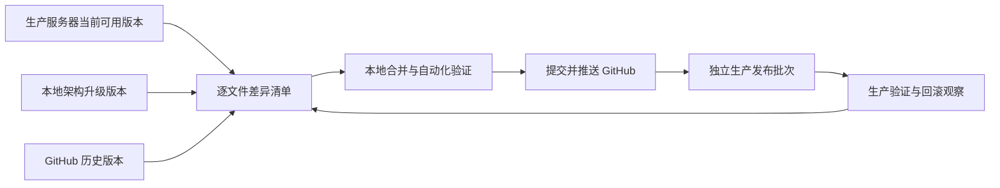

# 生产基线同步设计

Feature Name: production-baseline-sync
Updated: 2026-08-06

## 说明

当前服务器是可用业务版本，本地包含一部分已完成但未整体部署的架构升级代码，GitHub 落后于两者。同步过程分为“服务器回收、本地验证、GitHub 固化、独立发布”四步。

## 流程

## 规则

- 服务器当前正在使用且已验证的功能优先保留。
- 本地代码先通过自动化测试，再作为候选升级内容。
- GitHub 只接收已经核对和测试通过的本地版本。
- 生产发布只使用精确文件清单，所有文件先备份，发布后完成观察和回滚检查。
- 登录、PWA、工作量、体测和 AI 作为高影响模块，每次单独发布。
- 本轮工作只有在服务器正常运行、本地与服务器一致、GitHub 已推送相同确认版本时才可标记完成。

## 状态记录

每个文件或模块使用以下状态之一：

| 状态 | 含义 |
| --- | --- |
| `server_baseline` | 服务器当前可用功能，优先保留 |
| `local_candidate` | 本地已测试、等待生产验证的升级能力 |
| `github_synced` | 已推送到 GitHub 的确认版本 |
| `release_ready` | 已具备备份、验证与回滚信息 |
| `production_verified` | 已发布并完成生产验证 |

## 正确性要求

1. 已确认的服务器功能只能通过逐文件合并进入本地，发布过程保留原文件备份。
2. GitHub 提交必须对应一个本地测试结果和差异清单。
3. 每个生产发布批次都能依据备份清单恢复到发布前文件版本。
4. 未部署的本地架构升级不得被表述为生产已生效功能。

## 验证方式

- 每次同步前后生成服务器、本地、GitHub 三方差异清单。
- 本地运行受影响模块的 Node 测试、PHP 语法检查和现有预检。
- 生产发布后验证核心 HTTP 响应、授权会话旅程和规定观察窗口。
