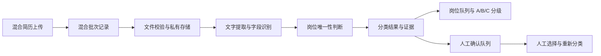

# 混合简历批量上传与自动岗位分类

Feature Name: mixed-resume-auto-classification
Updated: 2026-08-10

## Description

系统增加混合简历批次。招聘人员上传前无需选择单个岗位，系统保存所有文件后，先以文件名唯一岗位命中进行路由，再以确定性提取的当前或最近岗位名称唯一命中进行路由。岗位明确的简历直接进入对应岗位的 A/B/C 处理，岗位无法唯一判断的简历进入人工确认队列。

## Architecture

当前单岗位批次通过 `recruitment_resume_batches.requirement_id` 绑定岗位。混合批次需要允许批次级岗位为空，并在文件或文档级保存最终岗位归属。候选岗位集合来自当前账号可见的全部招聘岗位，批次创建时保存集合快照。岗位规则未发布时，简历先进入暂存状态，规则发布后再进入分类任务。原始文件继续使用 `RecruitmentPlatformFileAdapter` 和平台私有文件资产。

## Components and Interfaces

### Upload Page

- 增加“混合岗位批量上传”模式。
- 保留“指定岗位上传”模式，兼容当前工作方式。
- 混合模式显示候选岗位数量和岗位规则准备状态。
- 上传结果按文件显示：已归类、待确认、未归类、失败。
- 岗位规则未发布时显示“已暂存，等待岗位规则发布”，允许继续接收文件。

### Batch API

- `POST /api/admin/recruitment/batches.php`
  - `action=create_mixed`
  - `batch_note`
  - 可选 `candidate_position_ids`，缺省使用当前账号可见的全部招聘岗位
- `POST /api/admin/recruitment/upload.php`
  - 接收混合批次文件。
  - 保存文件时允许批次 `requirement_id` 为空。
- `GET /api/admin/recruitment/batches.php`
  - 返回混合批次标识、岗位分类汇总和待确认数量。

### Classification Service

新增 `ResumeClassificationService`，负责：

- 读取批次创建时冻结的候选岗位集合。
- 优先使用文件名唯一岗位命中，再使用当前或最近岗位名称唯一命中。
- 将包含通用岗位名称的专业方向名称归入该通用岗位，例如“体操教练”和“跑酷教练”归入“教练”。
- 在匹配前统一空格、标点、职务修饰词和已定义的岗位名称别名，例如“少儿体适能教练”“高级教练员”可匹配“儿童体能教练”“教练”。
- 生成排序后的候选岗位列表。
- 岗位明确时写入岗位归属并进入 A/B/C 分级；岗位无法唯一判断时写入待确认状态。
- 保存分类版本和可回放证据。

### Review API

- `GET /api/admin/recruitment/classifications.php`
  - 查询待确认和未归类简历。
- `POST /api/admin/recruitment/classifications.php`
  - 人工选择岗位。
  - 重新执行分类。
  - 要求幂等键和分类状态版本。

### Export API

- `POST /api/admin/recruitment/export.php`
  - 导出当前授权范围内有效等级为 A、B、C 的候选人。
  - 支持招聘需求和批次范围，覆盖预约队列与复核归档队列。
- 导出页面显示当前范围 A/B/C 候选人，并沿用现有下载授权和审计记录。

## Data Models

建议新增或扩展以下数据结构：

- `recruitment_resume_batches`
  - `intake_mode`: `single_requirement` 或 `mixed_requirements`
  - `candidate_scope_json`
  - `candidate_scope_hash`
  - `classification_status`
- `recruitment_resume_batch_requirements`
  - `batch_id`
  - `requirement_id`
  - `rule_status_snapshot`
  - `rule_version_id`
  - `classification_ready`
- `recruitment_resume_documents`
  - `assigned_requirement_id`
  - `classification_status`
  - `classification_version_id`
- `recruitment_resume_classification_versions`
  - `document_id`
  - `candidate_scope_hash`
  - `classifier_version`
  - `status`
  - `selected_requirement_id`
  - `confidence_level`
  - `reason_code`
- `recruitment_resume_classification_candidates`
  - `classification_version_id`
  - `requirement_id`
  - `rank_no`
  - `score`
  - `evidence_json`
- `recruitment_resume_classification_reviews`
  - `document_id`
  - `before_version_id`
  - `after_version_id`
  - `reviewer_staff_id`
  - `review_reason`

## Correctness Properties

1. 每个混合批次保存的候选岗位集合在批次创建时冻结，后续岗位配置变化不会改变历史分类依据。
2. 每个简历文档最多存在一个当前有效岗位归属。
3. 自动岗位归属必须关联唯一文件名证据或唯一当前或最近岗位名称证据；规则未发布的需求只产生待分类状态。
4. 岗位明确的简历进入对应岗位的匹配和 A/B/C 分级；待确认简历保持在人工确认队列。
5. 同一幂等键重复请求不会创建第二个批次、第二份文件记录或第二个当前分类结果。
6. 人工分类会保留历史自动分类结果和人工操作记录。

## Error Handling

| 场景 | 稳定错误码 | 用户提示 |
| --- | --- | --- |
| 没有可用岗位规则 | `RECRUITMENT_CLASSIFICATION_SCOPE_EMPTY` | 当前授权范围没有可用于分类的岗位规则 |
| 批次参数不完整 | `RECRUITMENT_MIXED_BATCH_INVALID` | 混合批次信息不完整，请重试 |
| 文件校验失败 | `RECRUITMENT_FILE_INVALID` | 显示具体文件名和失败原因 |
| 分类任务失败 | `RECRUITMENT_CLASSIFICATION_FAILED` | 简历已保存，可稍后重试分类 |
| 分类状态冲突 | `RECRUITMENT_CLASSIFICATION_CONFLICT` | 这份简历刚刚被其他人处理，请刷新后查看 |

“简历批次接口处理失败”当前属于通用兜底提示，无法直接说明是参数、权限、岗位审批、岗位规则或数据库问题。改造后接口会返回稳定错误码、失败阶段和可执行恢复动作。

## Test Strategy

- 上传页面契约测试：混合模式无需岗位下拉选择，指定岗位模式继续可用。
- 服务测试：候选岗位集合冻结、文件名唯一岗位路由、当前或最近岗位唯一路由、多岗位冲突和人工确认。
- 文件测试：混合批次内多文件逐份入库、失败文件重试和重复请求。
- 权限测试：混合批次、文档、分类结果和人工复核均执行岗位范围过滤。
- 数据库测试：分类版本不可覆盖历史版本，当前归属保持唯一。
- 回归测试：现有单岗位批次、导出、候选人列表、简历预览和录用转员工流程。
- 导出测试：A、B、C 候选人及复核归档 C 候选人均进入导出结果。

## References

- `real_sync/admin/recruitment-resumes.html`
- `real_sync/api/admin/recruitment/batches.php`
- `real_sync/api/admin/recruitment/upload.php`
- `real_sync/api/admin/recruitment/services/ResumeUploadService.php`
- `real_sync/api/admin/recruitment/services/ResumeReviewService.php`
- `real_sync/database/migrations/202607310001_recruitment_resume_screening.sql`
