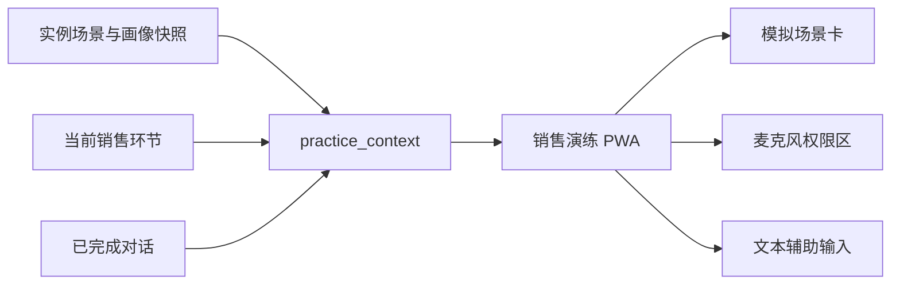

# 销售演练 PWA 引导演练技术设计

Feature Name: sales-drill-pwa-guided-practice
Updated: 2026-08-10

## 描述

本设计在现有演练实例恢复响应中追加只读 `practice_context`，由 PWA 在本地将上下文渲染为模拟场景卡。上下文直接来自已冻结的实例快照和已完成轮次，避免为展示内容新增写入、表结构或 AI 调用。

## 架构



## 组件与接口

| 组件 | 变更 |
| --- | --- |
| `DrillConversationService::resumeAttempt` | 返回当前环节、实例场景快照、客户画像快照和最近已完成轮次组成的 `practice_context`。 |
| `mobile/drill.html` | 渲染模拟场景卡；探测浏览器麦克风权限；在拒绝或不支持时显示系统设置指引并保留文本输入。 |
| `scripts/drill_conversation_services.test.mjs` | 校验恢复响应的上下文字段和快照来源。 |
| `scripts/drill_mobile_pwa.test.mjs` | 校验麦克风状态引导、文本辅助输入和模拟场景生成逻辑。 |

## 数据模型

`practice_context` 为读取模型，字段如下：

```text
scenario: title, objectives, standard_expressions, prompt_policy
persona: 实例 persona_snapshot_json
current_stage: stage_id, stage_code, name, status
recent_turns: 最近四条已完成轮次
```

PWA 优先使用场景或画像中已配置的开场问题；缺失时组合客户需求、当前状态和最近客户回应生成受控文本。参考表达来自已发布场景的 `standard_expressions`，缺失时使用当前目标的受控默认表达。

## 正确性属性

1. 同一实例的模拟场景只读取该实例创建时保存的场景和客户画像快照。
2. 模拟场景中的当前环节与 `stage_progress` 的 `active` 项一致。
3. 最近对话最多使用四条已完成轮次，避免客户端重复加载全部上下文用于场景摘要。
4. 权限拒绝、录音不支持和录音失败时，文本输入保持可操作。
5. 动态文本进入页面前经过既有 `esc` 转义。

## 错误处理

| 场景 | 页面行为 |
| --- | --- |
| Permissions API 不可用 | 显示点击开启麦克风的说明，录音按钮仍可触发浏览器授权。 |
| 麦克风权限被拒绝 | 展示浏览器网站设置指引与文本辅助输入。 |
| 录音设备不支持 | 展示设备不支持说明与文本辅助输入。 |
| 上下文缺少可选内容 | 使用受控默认表达并保持场景卡五项内容可见。 |
| 恢复响应读取失败 | 沿用既有权威状态恢复和本地草稿提示。 |

## 测试策略

- 运行 PHP 语法检查，覆盖修改后的演练服务。
- 运行 PWA 页面静态与渲染测试，覆盖权限提示、拒绝设置指引、文本输入和模拟场景字段。
- 运行对话服务契约测试，覆盖 `practice_context` 的快照、当前环节和最近轮次来源。

## 参考

- `../2026-08-09-sales-drill-experience-clarity/requirements.md`
- `../2026-08-08-sales-drill-conversation-expansion/design.md`
- `../../../real_sync/api/drill/v2/services/DrillConversationService.php`
- `../../../real_sync/mobile/drill.html`
