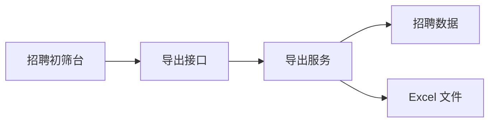

# 招聘简历跨批次导出设计

Feature Name: recruitment-export-scope
Updated: 2026-08-17

## Description

初筛台在导出请求中显式传递范围模式。全部批次范围省略 `batch_id`，当前批次范围保留已选批次。导出服务沿用现有权限过滤和日期筛选，并将录入时间写入 Excel。

## Architecture

## Components and Interfaces

- `admin/recruitment-resumes.html`：增加导出范围控件，全部批次为默认范围；候选人列表请求的 `page_size` 固定为 100。
- `api/admin/recruitment/export.php`：将 `scope_mode`、日期范围写入幂等请求和审计摘要。
- `RecruitmentExportService`：校验范围模式；只在当前批次模式传入有效 `batch_id`；将文档创建时间格式化为录入时间。

## Correctness Properties

- 全部批次导出始终受现有招聘权限范围限制。
- 当前批次导出始终受当前批次 ID 和现有招聘权限范围的交集限制。
- 日期范围比较使用文档录入时间，开始日和结束日均包含。
- Excel 列标题与每行字段数量保持一致。

## Error Handling

- 当前批次模式缺少有效批次时，接口返回可读参数错误。
- 结束日期早于开始日期时，接口返回可读参数错误。

## Test Strategy

- 静态契约测试覆盖范围参数、日期条件、录入时间列和 100 条分页参数。
- XLSX 测试覆盖新增列后的末列位置与行字段数量。
