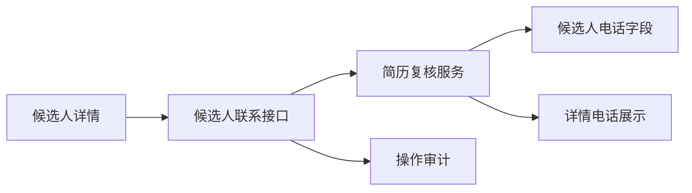

# 招聘简历手动补充电话设计

Feature Name: recruitment-manual-phone
Updated: 2026-08-17

## Description

在招聘初筛台候选人详情中增加手动补充电话区域。页面通过现有候选人联系接口提交手机号，服务层复用 `ResumeFieldNormalizer::protectPhone()` 保存敏感字段，并通过幂等记录和操作日志保证可追踪。

## Architecture

## Components and Interfaces

- `admin/recruitment-resumes.html`：渲染电话输入框，提交 `action=update_phone` 和 `application_id`。
- `api/admin/recruitment/candidate-contact.php`：沿用招聘联系权限和幂等请求，处理电话补充动作。
- `ResumeReviewService::updatePhone()`：校验手机号、加密电话、更新候选人和当前投递记录。
- `ResumeFieldNormalizer::protectPhone()`：生成电话密文、脱敏密文、查重哈希和密钥版本。

## Data Models

- `recruitment_candidates`：更新 `phone_ciphertext`、`phone_display_ciphertext`、`phone_lookup_hash`、`phone_confidence` 和 `phone_key_version`。
- `recruitment_applications`：更新 `extracted_profile_json.phone` 和 `information_status`。
- `admin_operation_logs`：记录 `resume.phone.update` 操作及脱敏电话。

## Correctness Properties

- 无效手机号不会写入数据库。
- 候选人电话字段与详情中的脱敏电话保持一致。
- 电话更新和当前投递详情更新在同一事务中完成。
- 重复提交同一个幂等键不会重复执行电话更新。

## Error Handling

- 手机号格式无效时返回可读参数错误。
- 候选人超出当前招聘权限范围时返回权限或资源错误。
- 敏感字段配置缺失时返回服务配置错误，并回滚事务。

## Test Strategy

- 静态契约测试覆盖详情页入口、请求动作和后端服务方法。
- PHP lint 覆盖新增接口和服务文件。
- 生产验证覆盖有效手机号保存、详情刷新和审计记录。
