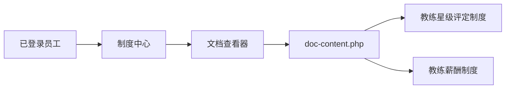

# 教练薪酬与星级评定制度发布

Feature Name: coach-compensation-star-rating
Updated: 2026-08-18

## Description

企业内网保持既有制度中心和文档查看器结构，仅更新两份 Markdown 制度正文及入口名称。

## Architecture

## Components and Interfaces

- `page-zhidu-biaozhun.php`：保留既有文档 ID，更新人员管理入口的名称和说明。
- `doc-content.php`：保留 `v4-02d` 和 `v4-02e` 的映射及登录检查。
- `docs/v4/02_人员管理体系/02D_教练星级晋升体系.md`：更新为星级评定制度。
- `docs/v4/02_人员管理体系/02E_薪酬结构.md`：更新为教练薪酬制度。

## Correctness Properties

- 文档 ID 与既有入口保持一致。
- 两份制度中的星级底薪保持一致：实习 2100 元、新星和一星 2500 元、二星 2700 元、三星 3000 元。
- 星级制度和薪酬制度中的出勤系数门槛保持一致。

## Error Handling

文档查看器沿用现有认证和不存在文档的 401、404 响应。

## Test Strategy

- 检查 PHP 语法。
- 检查 Markdown 文档存在、入口名称与文档 ID 映射。
- 在生产环境备份目标文件后上传，并通过受保护页面和文档接口回读验证。

## References

[^1]: 教练薪酬制度 v2.0，2026 年 H2 执行版。
[^2]: 教练星级评定制度，2026 年 H2 执行版。
