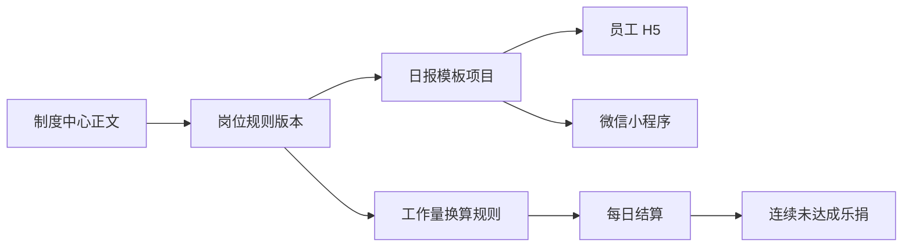

# 工作量管理标准 v4.0 更新设计

Feature Name: `workload-standard-v4`
Updated: 2026-08-18

## Description

以版本化岗位规则承载 v4.0 标准。制度正文更新为 `_private_docs` 可读文档，日报通过新生效日期选择岗位规则，历史日报继续读取自身绑定的 `rule_version_id`。

## Architecture

## Components and Interfaces

- `docs/v4/02_人员管理体系/02G_工作量管理标准.md`：更新制度正文。
- `database/migrations/202608180001_workload_standard_v4.sql`：关闭旧生效区间，创建 5 个新岗位规则版本、模板项目和换算规则。
- `WorkloadPenaltyService`：对 2026-08-18 起的教练和销售，仅在前一工作日也存在逾期差额时生成当天缺口乐捐。
- `mobile/workload-v2.html`：补齐教学主管和督导岗位选项。

## Data Model

新版本编码为：

- `workload-v4-20260818-coach`
- `workload-v4-20260818-sales`
- `workload-v4-20260818-manager`
- `workload-v4-20260818-teaching-supervisor`
- `workload-v4-20260818-supervisor`

教练和销售使用 `workload_daily_settlements` 与 `workload_penalty_records`；店长、教学主管和督导由现有管理岗结算例外继续跳过乐捐。

## Correctness Properties

- 同一岗位同一业务日期最多存在一个 active/scheduled 规则区间。
- 新版本的日报项目集合与 v4.0 制度正文一致。
- 销售成交金额 0、3999.99、4000 三个边界分别产生 0、1、2 点。
- 单日未达成不生成乐捐；连续第二日未达成只生成第二日缺口金额。
- 历史日报的规则快照和换算结果不因新版本发布而变化。

## Error Handling

- 缺少岗位指标定义时，迁移通过数据库约束和发布前 readiness 检查发现问题。
- 规则版本重复执行时使用 `ON DUPLICATE KEY UPDATE` 或 `INSERT IGNORE` 保持幂等。
- 乐捐判断缺少前一日结算记录时按单日未达成处理，避免无依据生成处罚。

## Test Strategy

- 静态契约检查迁移版本、岗位项目数量、换算边界和 H5 岗位选项。
- Node 内置测试覆盖迁移正文和乐捐服务关键条件。
- PHP lint 在具备 PHP 运行时的环境执行。
- 生产发布前备份 `_private_docs`、规则相关数据库表和受影响页面，发布后回读当前版本和三组成交边界。
