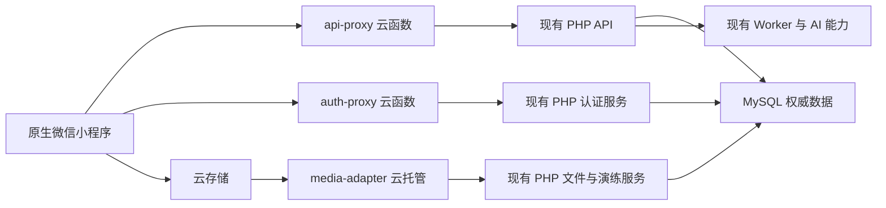
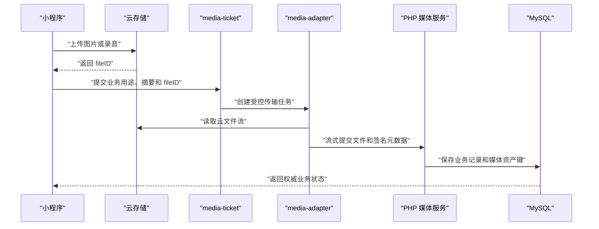

# 微信小程序腾讯云开发全量迁移技术设计

Feature Name: `mini-program-cloudbase-migration`
Updated: 2026-08-21
Status: Confirmed

## 1. 设计说明

本设计将腾讯云开发设置为微信小程序的统一服务入口，同时保留现有 PHP、WordPress 身份体系、MySQL、Worker、AI 服务和业务规则。小程序使用云函数完成普通请求与认证，使用云存储承接图片和录音，使用云托管完成媒体流式处理和较长耗时任务。官网、H5 和管理后台继续访问现有 PHP API，所有端共享 MySQL 权威业务数据。

设计覆盖需求文档中的 11 组需求，目标是分阶段开发和验证、生产一次切换、配置化快速回滚。

## 2. 设计原则

1. MySQL 和现有 PHP 领域服务继续解释业务事实、权限与事务结果。
2. 小程序页面继续通过 `utils/api.js` 这一处公共边界访问业务能力。
3. 云端只接受登记过的方法、路径、字段类型和超时策略。
4. 原请求 ID、访问令牌、幂等键和状态版本贯穿小程序、云开发和 PHP。
5. 媒体文件使用稳定资产键连接云存储与现有业务记录。
6. 开发迁移采用可独立验证的小批次，生产启用采用统一传输开关。
7. 日志保存业务定位所需的最小脱敏信息。

## 3. 当前基线与影响

| 当前事实 | 设计影响 |
| --- | --- |
| `app.json` 登记 32 个页面 | 页面、路由、API 和媒体能力需要形成完整机器清单 |
| `utils/api.js` 统一封装 `wx.request` 与 `wx.uploadFile` | 在公共层增加 transport，页面业务代码保持统一调用方式 |
| `app.js` 硬编码 `https://supercalf.com/api` | 配置改为云环境和传输模式，直连地址只服务回滚模式 |
| 设备会话具有单飞刷新、轮换和一次重放 | 云 transport 必须保持相同并发和错误语义 |
| 多个页面拼接绝对 API 地址 | 页面统一传递登记过的相对路径 |
| 工作量、课程、知识、积分、头像和演练包含外部媒体 URL | 普通请求迁移后仍需媒体解析与云存储镜像 |
| Drill v2 音频采用摘要、分片、幂等键和状态版本 | 云存储上传后继续保留领域状态机与摘要验证 |
| 密码登录后跨页暂存账号密码用于微信绑定 | PHP 增加一次性绑定票据，客户端只保存票据 |
| 微信开发者工具基础库为 `2.19.0` | 实施时升级到项目批准的稳定基础库并验证云开发 API |
| `project.config.json` 只有 `cloudfunctionTemplateRoot` | 增加实际 `cloudfunctionRoot` 与云环境配置 |

## 4. 总体架构



请求分为三条路径：

- 普通业务：小程序 -> `api-proxy` -> PHP API -> MySQL。
- 认证会话：小程序 -> `auth-proxy` -> PHP 认证服务 -> MySQL。
- 媒体业务：小程序 -> 云存储 -> `media-adapter` -> PHP 文件或演练服务 -> MySQL。

云开发数据库在本阶段不保存员工、业务状态或会话。路由登记保存在代码中，媒体映射保存在 MySQL 平台表中，避免产生第二套业务数据。

## 5. 小程序客户端设计

### 5.1 启动与配置

新增 `mini-program/config/cloud.js`：

```javascript
module.exports = {
  envId: 'configured-by-release-environment',
  transport: 'cloud',
  shadowSampleRate: 0,
  functionNames: {
    api: 'api-proxy',
    auth: 'auth-proxy',
    mediaTicket: 'media-ticket'
  }
};
```

`app.js` 在 `onLaunch` 首步调用 `wx.cloud.init({ env, traceUser: true })`。环境 ID 通过发布环境配置填入，代码仓库保留可识别占位值。`globalData.apiBase` 移入 direct transport 配置，业务页面停止读取该字段。

### 5.2 Transport 接口

`utils/api.js` 保留对页面公开的 `request()`、`uploadFile()`、`logoutSession()`、`createRequestId()` 和 `createIdempotencyKey()`。内部通过统一接口选择传输实现：

```javascript
transport.request({ routeId, path, method, data, headers, timeout })
transport.upload({ routeId, filePath, formData, headers, timeout })
transport.logout({ session, headers })
```

新增三个实现：

| Transport | 用途 | 用户响应来源 |
| --- | --- | --- |
| `cloud` | 默认生产路径 | 云开发路径 |
| `direct` | 迁移验证和回滚观察窗口 | 现有 HTTPS API |
| `shadow` | 云路径主响应与旧路径脱敏核对 | 云开发路径 |

`shadow` 只抽样 GET 和已明确为只读的请求。写操作、认证、文件上传和分配试卷等有副作用动作使用单一路径，避免重复业务结果。

### 5.3 云函数响应适配

`wx.cloud.callFunction` 返回函数结果，缺少原上游 HTTP 状态这一独立通道。云函数使用以下包络，cloud transport 再转换成现有 `utils/api.js` 可处理的响应对象：

```json
{
  "gateway_version": "1.0",
  "upstream_status": 200,
  "headers": {
    "content_type": "application/json"
  },
  "body": {
    "code": 0,
    "message": "success",
    "data": {},
    "request_id": "mp_xxx"
  }
}
```

cloud transport 映射规则：

- `upstream_status` -> `statusCode`。
- `body` -> `data`。
- 云调用网络错误 -> `network`。
- 云函数执行超时 -> `timeout`。
- 包络字段缺失 -> `protocol`。
- PHP 的 401、403、409、422 和 5xx 继续进入现有错误分类。

### 5.4 页面收口

以下页面中的绝对 URL 改为相对路径：

- 首页、制度搜索、制度列表、制度详情。
- 学习列表、学习详情、课时详情。
- 通知列表、通知详情。
- 通关地图、通关阶段、考试。
- 知识列表、知识详情。

`business-domain-matrix.json` 从十域扩展为 14 个迁移域，登记 32 个页面、route ID、方法、endpoint、认证要求、媒体字段、幂等要求和状态证据。云函数路由表由该矩阵的受控生成结果或同源静态清单校验，防止客户端声明任意上游 URL。

## 6. 云函数网关设计

### 6.1 `api-proxy`

职责：

- 校验网关事件版本、route ID、方法、路径参数和请求体大小。
- 从固定路由表选择 PHP endpoint、超时、认证和字段规则。
- 传播请求 ID、Bearer Token、幂等键和状态版本。
- 对 PHP 响应执行大小限制、JSON 解析和稳定包络转换。
- 保存路由、耗时、状态分类和脱敏错误日志。

路由条目示例：

```javascript
{
  id: 'workload.saveReport',
  method: 'POST',
  upstreamPath: '/workload/save-report.php',
  auth: true,
  timeoutMs: 15000,
  idempotency: true,
  maxBodyBytes: 262144
}
```

上游 origin 由云函数环境变量提供，客户端事件中不接收 origin、host 或完整 URL。路径参数使用路由专属 serializer 生成，动态值经过类型和长度校验。

### 6.2 `auth-proxy`

认证路由独立部署，覆盖：

- 账号密码登录。
- 微信登录。
- 微信绑定。
- 企业微信兼容登录与绑定。
- 设备会话刷新。
- 设备会话退出。

`auth-proxy` 采用独立日志策略，密码、微信 code、绑定票据、访问令牌和刷新令牌仅在内存中转，日志保存请求 ID、动作、结果分类、员工摘要和耗时。

初始迁移继续将 `wx.login` code 转发给 `auth-jwt.php?action=wxlogin`，由现有 PHP 完成 `jscode2session` 和员工映射。该路径保持现有身份规则，也允许后续在独立规格中改为云函数微信上下文签名。

### 6.3 PHP 可信网关签名

云函数向 PHP 追加：

- `X-Cloud-Gateway-Version`
- `X-Cloud-Gateway-Timestamp`
- `X-Cloud-Gateway-Nonce`
- `X-Cloud-Gateway-Signature`

签名输入为方法、路径、请求体 SHA-256、时间戳、nonce 和请求 ID 的规范字符串，使用环境密钥计算 HMAC-SHA256。PHP 的 `GatewaySignature` 校验时间窗口、签名和 nonce 重放。Bearer Token 和现有 PHP 权限仍负责员工授权，网关签名只证明请求来自批准的云入口。

direct 回滚窗口中的历史客户端继续使用原认证和权限规则。需要云网关专属能力的新增 endpoint 要求有效网关签名。

### 6.4 超时与重试

| 请求类型 | 云函数超时预算 | 自动重试 |
| --- | ---: | --- |
| 普通读取 | 12 秒 | 客户端按现有恢复动作重试 |
| 普通写入 | 15 秒 | 仅携带稳定幂等键时重试 |
| 登录与刷新 | 12 秒 | 刷新由单飞流程控制 |
| AI 或媒体处理 | 转云托管任务 | 按任务策略有限重试 |

云函数向 PHP 传递剩余超时预算。PHP 在预算内返回稳定错误或任务标识。AI 评分、媒体复制和大文件处理进入云托管或现有 Worker。

## 7. 登录与会话设计

### 7.1 双登录

账号密码登录和微信登录继续签发同一 `session_type=device` 会话，客户端继续保存：

- `token`
- `refresh_token`
- `session_id`
- `session_version`
- `device_id`
- `session_type`

微信登录继续根据 `staffs.openid` 关联员工。账号密码继续验证 WordPress 用户并关联 `staffs.user_id`。两种登录都使用现有员工状态、角色、门店和会话版本检查。

### 7.2 一次性绑定票据

密码登录成功且当前微信身份待绑定时，PHP 返回：

```json
{
  "bind_required": true,
  "bind_ticket": "opaque-random-value",
  "bind_ticket_expires_in": 300
}
```

数据库只保存票据 SHA-256、员工 ID、会话 ID、到期时间、消费时间和创建请求 ID。绑定事务锁定票据与员工记录，完成微信身份唯一性校验、写入 OpenID、消费票据和递增 `session_version`。同一票据重放返回稳定已消费结果或绑定冲突。

客户端以 `pendingWechatBindTicket` 替换 `pendingWechatBind` 中的账号密码，页面跳转和本地存储均只接触短期不透明票据。

### 7.3 会话刷新

现有单飞 Promise、刷新令牌轮换、旧令牌复用撤销和每请求一次重放规则保持不变。变化仅发生在传输层：刷新请求由 `auth-proxy` 转发，cloud transport 将上游 401 映射回现有刷新逻辑。

## 8. 媒体设计

### 8.1 新媒体上传



云存储路径由客户端媒体工具生成：`{environment}/{business-domain}/{staff-id-hash}/{yyyy-mm}/{uuid}.{ext}`。服务端根据真实 MIME 决定最终类型，客户端扩展名只作为展示输入。

### 8.2 媒体适配服务

`media-adapter` 使用云托管，负责：

- 校验来自云函数的内部调用凭据。
- 流式读取云存储，限制文件大小和处理时长。
- 计算 SHA-256 并与客户端及 PHP 声明值核对。
- 转发工作量 `image_file`、演练音频和后续登记媒体。
- 保存任务状态、重试次数和最后稳定错误分类。
- 对成功任务返回 PHP 业务记录和媒体资产键。

工作量图片保持 5MB 上限。演练音频按现有领域上限和留存策略执行。大文件全程流式处理，避免 Base64 带来的体积增长。

### 8.3 历史媒体按需镜像

新增 MySQL 表 `platform_cloud_media_mappings`：

| 字段 | 说明 |
| --- | --- |
| `asset_key` | 稳定媒体资产键，唯一 |
| `business_domain` | 工作量、学习、知识、积分、档案或演练 |
| `business_object_type` | 业务对象类型 |
| `business_object_id` | 业务对象 ID |
| `source_fingerprint` | 历史路径和版本生成的摘要 |
| `cloud_file_id` | 云文件标识 |
| `sha256` | 文件内容摘要 |
| `mime_type` | 实际 MIME |
| `size_bytes` | 文件大小 |
| `status` | pending、ready、failed、expired |
| `last_error_code` | 稳定错误分类 |
| `created_at`、`updated_at` | 时间戳 |

首次访问历史媒体时，`media-ticket` 查询映射。ready 映射直接返回云文件；缺少映射时创建幂等镜像任务。客户端显示加载状态并轮询短期任务；常用课程、知识和积分图片可在切换前按访问统计预热。

### 8.4 媒体字段解析

新增 `utils/media.js`，页面只接收标准媒体描述：

```json
{
  "asset_key": "knowledge-audio-123",
  "file_id": "cloud://...",
  "media_type": "audio",
  "status": "ready"
}
```

图片组件使用批准的云文件地址。音频通过 `wx.cloud.downloadFile` 获取本地临时路径后交给 `wx.createInnerAudioContext`。临时路径按资产键和当前小程序进程缓存，退出登录时清理索引。

## 9. 业务模块迁移映射

| 业务模块 | 页面数 | 云端入口 | 媒体与特殊能力 |
| --- | ---: | --- | --- |
| 入口与协议 | 3 | `api-proxy` | 统一协议状态键 |
| 认证与绑定 | 2 | `auth-proxy` | `wx.login`、绑定票据 |
| 制度与通知 | 5 | `api-proxy` | 通知 ID 修正、已读与确认 |
| 学习、知识、考试、通关 | 8 | `api-proxy` | 课程图片、示范音频、WechatSI |
| AI 演练 | 7 | `api-proxy`、`media-adapter` | 录音、分片、AI 任务、音频播放 |
| 积分 | 1 | `api-proxy` | 商品图片、签到与兑换幂等 |
| 工作量 | 3 | `api-proxy`、`media-adapter` | 图片凭证、日报状态版本 |
| 提醒 | 2 | `api-proxy` | `wx.requestSubscribeMessage` |
| 个人中心 | 1 | `api-proxy`、`auth-proxy` | 头像、改密、退出 |

## 10. 已知业务偏差修正

迁移前建立定向测试并修正以下偏差：

1. 制度详情确认动作使用通知记录 ID，制度 ID 作为关联字段传递。
2. 学习页与通关页统一使用 `stage_id`。
3. 协议状态统一为带版本的 `agreement_accepted_v1`，旧状态在读取时执行一次迁移。
4. 微信绑定流程使用绑定票据。
5. 知识示范音频接入 `utils/media.js` 和统一播放器状态。
6. 考试分配从 GET 写行为改为 POST，并要求 `Idempotency-Key`。
7. `business-domain-matrix.json` 中演练反馈 endpoint 修正为完整 `/drill/v2/results.php`。

## 11. 安全设计

- 云函数路由使用代码白名单和固定上游 origin，客户端无法指定 Host。
- 云函数和 PHP 之间使用 HMAC 签名、时间窗口与 nonce 重放保护。
- 员工授权继续由 Bearer Token、设备会话、员工状态和服务端权限决定。
- 账号密码、微信 code、Token、OpenID 和文件内容从日志字段中排除。
- 云存储使用按业务用途设置的最小读取规则，业务媒体通过员工授权后的票据访问。
- 云托管内部入口校验调用身份、任务票据、业务用途和到期时间。
- 文件执行真实 MIME、大小、SHA-256、路径、所有权和留存校验。
- 影子核对保存字段差异摘要，排除敏感业务值和原始媒体。
- 环境 ID、上游地址和签名密钥通过受控环境配置提供。

## 12. 正确性属性

1. 相同员工、相同输入和相同权威版本经 direct 与 cloud transport 获得相同业务码和业务数据。
2. 任一写请求的相同幂等键与相同请求摘要最多形成一个权威业务结果。
3. 任一写请求的相同幂等键与不同请求摘要返回稳定冲突。
4. 任一成功业务写入只提交到现有 MySQL 权威数据模型。
5. 任一受保护请求的返回数据均位于服务端员工权限范围内。
6. 任一刷新凭据在成功轮换后只拥有一次有效消费结果。
7. 任一绑定票据只绑定一个员工、一个会话并拥有一次有效消费结果。
8. 任一 ready 媒体映射的 SHA-256 与云存储文件内容一致。
9. 任一演练音频提交的分片集合、摘要和状态版本满足现有 Drill v2 契约。
10. 任一回滚动作保留已提交 MySQL 业务事实和可被 N-1 客户端读取的兼容字段。

## 13. 错误处理

| 场景 | 客户端结果 | 服务端处理 |
| --- | --- | --- |
| 云调用网络失败 | `network`，允许用户重试 | 记录云调用请求 ID |
| 云函数超时 | `timeout`，保留稳定幂等键 | 记录上游阶段和耗时 |
| PHP 401 | 单飞刷新并重放一次 | 保持会话轮换审计 |
| PHP 403 | 展示权限说明 | 记录脱敏拒绝事件 |
| PHP 409 | 展示权威状态和恢复动作 | 保留当前版本 |
| 路由登记缺失 | `validation` | 记录 route ID 和客户端版本 |
| 云文件上传失败 | 保留本地业务草稿 | 允许重新上传 |
| 媒体转发失败 | 展示任务恢复状态 | 有限重试后进入可恢复失败 |
| 历史媒体镜像中 | 展示加载状态 | 幂等任务继续执行 |
| AI 演练处理超时 | 展示处理中或恢复入口 | 交给既有 Worker 状态机 |
| 影子结果差异 | 用户继续使用云结果 | 保存脱敏差异并触发发布门禁 |

## 14. 可观测性

统一日志字段：

- `request_id`
- `gateway_version`
- `route_id`
- `business_domain`
- `transport_mode`
- `upstream_status`
- `error_category`
- `duration_ms`
- `retry_count`
- `client_version`
- `staff_hash`

指标至少覆盖云函数调用量、成功率、P50/P95 延迟、PHP 4xx/5xx、认证刷新失败率、媒体任务积压、历史媒体镜像成功率、影子差异率和核心业务成功率。

## 15. 测试策略

### 15.1 自动测试

- 使用 Node.js 内置测试验证 transport、响应包络、路由白名单、请求头和错误映射。
- 使用固定 PHP 响应 fixture 比较 direct 与 cloud transport 契约。
- 使用现有认证契约测试扩展绑定票据、云转发、刷新轮换和退出。
- 使用媒体 fixture 覆盖 512B、5MB 边界、真实 MIME、错误摘要、重复任务和失效文件。
- 使用 Drill v2 固定种子测试覆盖幂等键、分片顺序、摘要和状态版本。
- 扩展 `check_miniprogram_contracts.mjs` 验证 32 页、相对路径、transport、媒体工具和云配置。
- 扩展平台预检，将云开发契约作为小程序发布阻断阶段。

### 15.2 开发者工具与真机

- 微信开发者工具验证云环境、云函数调用、云存储上传下载、WechatSI 和隐私声明。
- iOS 与 Android 覆盖双登录、绑定、刷新、退出和弱网恢复。
- 按 14 个迁移域覆盖 32 个页面进入、读取、提交、冲突和返回导航。
- 验证工作量图片、知识音频、课程媒体、商品图片、头像和演练录音。
- 在观察窗口验证云路径默认模式和 direct 回滚模式。

## 16. 实施波次与切换

| 波次 | 内容 | 完成门槛 |
| --- | --- | --- |
| 0 | 契约、页面、endpoint 和媒体基线 | 机器清单与 fixture 固定 |
| 1 | transport 与 `api-proxy` | 普通 GET/POST 契约通过 |
| 2 | `auth-proxy` 与绑定票据 | 双登录和会话回归通过 |
| 3 | 只读业务域 | 首页、制度、通知、学习、知识、通关读取通过 |
| 4 | 普通写业务域 | 进度、考试、积分、档案和日报写入通过 |
| 5 | 云存储与媒体适配 | 新媒体和历史媒体通过 |
| 6 | Drill v2 | 音频、状态、AI 恢复和幂等通过 |
| 7 | shadow 核对 | 核心只读差异率达到批准阈值 |
| 8 | 生产一次切换 | 全量门禁通过并具备回滚配置 |

生产切换将已验证的所有业务域一起把默认 transport 设为 `cloud`。旧合法域名、direct transport 和上一小程序版本在批准观察窗口内保留。观察完成后，域名配置收口作为独立发布动作执行。

## 17. 回滚设计

回滚只切换客户端传输配置或恢复上一批准小程序版本。数据库采用 expand-migrate-contract：先新增绑定票据和媒体映射结构，再迁移读取与写入路径，观察窗口内保留兼容字段。

回滚步骤：

1. 停止后续发布动作并保存当前请求、错误、差异和任务快照。
2. 将默认 transport 恢复为上一批准模式或恢复上一小程序版本。
3. 保持云函数与媒体任务只读查询能力，完成在途任务核对。
4. 核对认证、工作量、考试、积分、演练和媒体业务事实。
5. 验证旧客户端可读取迁移期间生成的兼容记录。
6. 保存回滚原因、影响范围、恢复结果和下一次发布前置项。

## 18. 文件改动范围

小程序修改：

- `mini-program/app.js`
- `mini-program/project.config.json`
- `mini-program/utils/api.js`
- `mini-program/utils/auth.js`
- `mini-program/utils/drill-v2.js`
- `mini-program/business-domain-matrix.json`
- `mini-program/release-check.config.json`
- 使用绝对 `apiBase` 的页面及媒体消费页面

小程序新增：

- `mini-program/config/cloud.js`
- `mini-program/utils/transports/cloud.js`
- `mini-program/utils/transports/direct.js`
- `mini-program/utils/transports/shadow.js`
- `mini-program/utils/media.js`
- `mini-program/cloudfunctions/api-proxy/`
- `mini-program/cloudfunctions/auth-proxy/`
- `mini-program/cloudfunctions/media-ticket/`

云托管新增：

- `cloudrun/media-adapter/Dockerfile`
- `cloudrun/media-adapter/src/server.js`
- `cloudrun/media-adapter/src/upstream.js`
- `cloudrun/media-adapter/src/media.js`

PHP 与数据库新增或修改：

- `api/auth-jwt.php`
- `api/cloud/GatewaySignature.php`
- `api/cloud/media-ingest.php`
- 对应媒体读取与登记 Adapter
- 绑定票据和 `platform_cloud_media_mappings` 增量迁移

测试与门禁修改：

- `scripts/check_miniprogram_contracts.mjs`
- `scripts/platform_preflight.mjs`
- 新增 cloud transport、网关路由、认证、媒体和影子核对测试

## 19. 外部配置

实施准备阶段需要填写：

- 云开发生产与测试环境 ID。
- 云开发地域和资源规格。
- 云函数固定 PHP 上游地址。
- 云网关 HMAC 密钥和轮换版本。
- 云托管服务名与内部调用凭据。
- 云存储读写规则和生命周期。
- 媒体预热范围与观察窗口阈值。
- 微信订阅消息模板和隐私声明审批结果。

## 20. 需求追踪

| 需求 | 设计章节 |
| --- | --- |
| 需求 1 全功能迁移 | 5、9、16、18 |
| 需求 2 单一权威数据 | 2、4、6、7、8 |
| 需求 3 云开发入口 | 5、6、11 |
| 需求 4 双登录 | 6.2、7 |
| 需求 5 权限与契约 | 5.3、6、11、12 |
| 需求 6 媒体迁移 | 8、13、15 |
| 需求 7 微信能力 | 5、7、8、9 |
| 需求 8 可靠性 | 6.4、13、14 |
| 需求 9 切换与回滚 | 5.2、16、17 |
| 需求 10 缺陷收口 | 10 |
| 需求 11 验证门禁 | 12、15、16 |

## 21. 参考资料

- `.monkeycode/specs/2026-08-20-mini-program-cloudbase-migration/requirements.md`
- `.monkeycode/docs/ARCHITECTURE.md`
- `.monkeycode/specs/2026-07-31-full-site-multi-client-architecture-upgrade/design.md`
- `.monkeycode/specs/2026-07-24-workload-governance-mini-program-launch/design.md`
- `real_sync/mini-program/utils/api.js`
- `real_sync/mini-program/app.js`
- `real_sync/mini-program/project.config.json`
- `real_sync/mini-program/business-domain-matrix.json`
- 微信开放文档，云开发 API：https://developers.weixin.qq.com/miniprogram/dev/framework/app-service/api
- 微信开放文档，云开发基础能力：https://developers.weixin.qq.com/miniprogram/dev/wxcloudservice/wxcloud/basis/capabilities.html
- 微信开放文档，Cloud SDK：https://developers.weixin.qq.com/miniprogram/dev/wxcloudservice/wxcloud/reference-sdk-api/Cloud.html
- 腾讯云开发，文件存储迁移：https://docs.cloudbase.net/storage/migrate-cos
