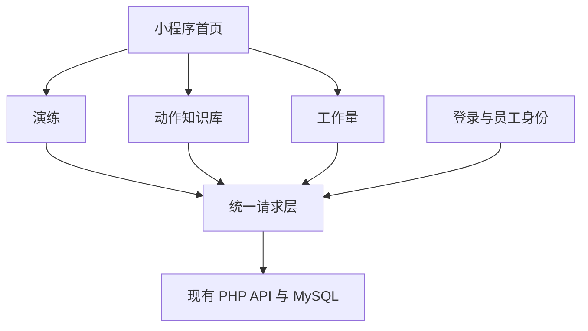

# 小程序核心功能范围设计

Feature Name: `mini-program-core-scope`
Updated: 2026-08-22

## 描述

通过收敛 `app.json` 页面注册、首页入口、个人中心入口、启动请求和课程页快捷入口，将微信小程序调整为三项核心业务：演练、动作知识库、工作量。保留认证与员工身份相关基础能力，历史制度页面文件继续留在代码仓库中供其他端使用。

## 架构

页面注册范围分为三层：

- 核心业务：演练页面、动作知识库页面、工作量页面。
- 基础支撑：首页、登录、协议、微信绑定、员工档案和我的页面。
- 范围外：制度、通知、学习课程、考试、通关、积分和提醒页面不再注册为小程序入口。

## 组件与接口

| 组件 | 文件范围 | 职责 |
| --- | --- | --- |
| 核心页面清单 | `mini-program/app.json` | 注册核心业务和基础支撑页面 |
| 首页工作台 | `mini-program/pages/index/` | 展示三项核心入口和工作量摘要 |
| 演练模块 | `mini-program/pages/drill/` | 任务、自由练习、录音、反馈 |
| 动作知识库 | `mini-program/pages/knowledge/` | 搜索、筛选、详情和媒体查看 |
| 工作量模块 | `mini-program/pages/workload/` | 日报、凭证、管理视图和员工详情 |
| 统一请求层 | `mini-program/utils/api.js` | 认证、请求 ID、错误、重试和传输模式 |

## 数据与接口边界

- 核心页面继续使用既有 API 和统一请求层。
- 首页移除制度通知请求，保留工作量待办和核心入口。
- 首页待办类型移除制度类型映射。
- 学习页若保留为历史文件，不进入 `app.json`，核心入口直接指向动作知识库和演练。
- 范围收敛只改变小程序入口，不删除制度 API、数据库表或服务端数据。

## 正确性约束

1. `app.json` 中注册的每个页面都必须同时存在 `.js`、`.json`、`.wxml` 和 `.wxss` 文件。
2. `tabBar.list` 只能包含工作量、演练和我的。
3. 首页源码不得包含制度入口、制度接口或制度通知请求。
4. 核心模块页面必须继续通过统一请求层访问后端。
5. 范围外页面不被首页、导航或核心业务页面引用为用户入口。

## 错误处理

- 未登录时进入登录页，登录成功后回到核心业务入口。
- 核心 API 失败时沿用加载中、空数据、错误、离线和冲突状态。
- 历史制度入口被访问时由页面注册和导航白名单共同阻断。

## 测试策略

- 静态检查 `app.json` 页面注册、Tab 导航和页面文件完整性。
- 检查首页、学习入口、个人中心不包含制度入口或制度请求。
- 运行演练、知识库和工作量现有定向契约测试。
- 在微信开发者工具中验证首页、三项核心 Tab、登录、核心列表、详情、提交和返回流程。
