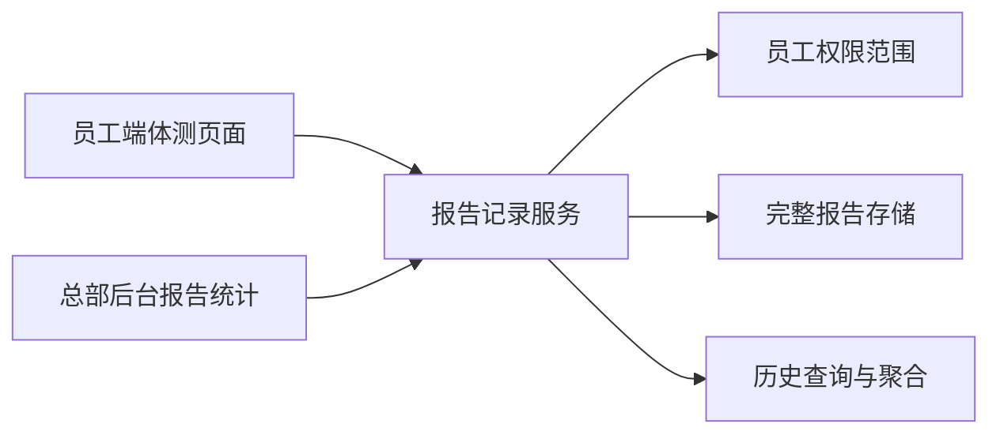

# Fitness Report Center

Feature Name: fitness-report-center
Updated: 2026-08-29

## Description

将体测报告记录从简单 JSON 摘要升级为带权限范围的报告记录服务，并为员工端历史查询和总部后台统计提供统一数据源。本期不建设学员指标变化趋势。

## Architecture

## Components and Interfaces

- `api/records/index.php`
  - 保存新报告完整数据。
  - 按当前用户权限过滤列表和详情。
  - 返回摘要记录与完整记录的数据完整性标识。
- `fitness-assessment-app.html`
  - 保存完整报告上下文和正文。
  - 历史页增加筛选、列表和详情查看。
- `api/admin/fitness-reports.php`
  - 提供后台统计摘要、门店聚合和教练聚合。
  - 复用既有管理员权限和员工门店范围。
- `admin/fitness-reports.html`
  - 提供日期、门店和教练筛选及统计表格。

## Data Models

报告记录字段包含：稳定 ID、创建用户 ID、教练、门店、学员、年龄、体测日期、年龄组、体测项目 JSON、图片评级 JSON、教练情况 JSON、目标 JSON、报告正文、生成模式、报告状态和创建时间。

## Correctness Properties

1. 查询结果始终属于当前用户授权范围。
2. 报告生成次数与报告记录数量一一对应。
3. 去重学员数按稳定学员标识独立计算。
4. 旧摘要记录不会被伪装为完整报告。
5. 门店和教练聚合使用与总数相同的日期和权限过滤条件。

## Error Handling

- 未登录返回 `401`。
- 越权详情返回 `403`。
- 非法日期和分页参数返回 `400`。
- 存储不可用返回 `503` 或现有记录保存错误。
- 旧记录缺少完整字段时返回 `data_completeness=summary`。

## Test Strategy

- Node 静态契约测试覆盖完整保存字段、查询筛选、详情和统计元数据。
- PHP lint 覆盖记录接口、后台统计接口及权限公共层。
- 使用脱敏 JSON fixture 验证日期过滤、门店范围、教练范围、去重学员数和兜底数量。
- 线上部署后执行未登录保护、管理员列表、店长范围和教练范围验证。

## References

- `real_sync/api/records/index.php`
- `real_sync/fitness-assessment-app.html#L2991-L3168`
- `real_sync/api/admin/common.php`
