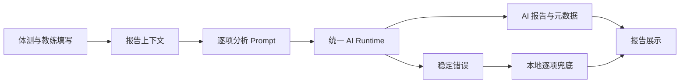

# Fitness Report Quality Optimization

Feature Name: fitness-report-quality
Updated: 2026-08-29

## Description

本次改造集中在员工端体测报告链路。前端继续负责收集数据和展示 HTML，后端继续通过统一 AI Runtime 调用 DeepSeek；改造报告上下文、生成约束、故障状态和本地兜底内容，降低模板化报告比例并提升数据解释能力。

## Architecture



## Components and Interfaces

- `fitness-assessment-app.html`
  - 扩展报告 prompt，要求逐项引用数值、评级和训练含义。
  - 增加 AI/兜底状态字段和可见提示。
  - 改进 `generateLocalAnalysis()`，使用真实体测数据和教练目标生成兜底内容。
- `api/ai-services.php`
  - 保留 `POST action=plan` 兼容接口。
  - 成功响应增加 `content_present` 与 `content_length` 元数据。
  - 保留既有 `request_id` 和稳定 HTTP 错误行为。
- `api/ai-runtime.php`
  - 保留模型配置来源和统一调用审计。
  - 将运动规划输出预算提升到适合完整报告的范围，由业务入口传入。

## Data Models

前端报告上下文包含：儿童基本信息、当前年龄组体测项目、数值、单位、评级、图片评级、BMI、教练观察、训练重点、目标、周期和课程限制。

计划接口成功响应：

```json
{
  "content": "<h4>...</h4>",
  "content_present": true,
  "content_length": 2400
}
```

## Correctness Properties

1. 每个有效体测项目最多出现一次于逐项数据表中。
2. 体测数据缺失时，报告不会生成虚构数值。
3. AI 返回空内容时，页面状态必须为兜底状态。
4. 教练明确输入的课程限制优先于默认课程推荐。
5. 成功响应中的 `content_length` 等于服务端实际返回字符串的字符长度。

## Error Handling

- AI 请求失败：保留错误分类和 request ID，前端显示“当前为本地分析版”状态。
- AI 返回空内容：按失败处理并生成兜底报告。
- 体测数据不完整：报告标明缺失项，基于已有数据继续生成。
- 服务端元数据异常：不影响报告正文返回。

## Test Strategy

- 静态检查 prompt 包含逐项分析、数值、评级、训练含义和目标约束。
- Node 定向测试验证报告上下文构造和本地兜底关键字段。
- PHP lint 检查 `api/ai-services.php` 与 `api/ai-runtime.php`。
- 手工回归覆盖 AI 成功、AI 失败、空响应、部分体测数据和课程限制五类场景。

## References

- `real_sync/fitness-assessment-app.html#L1810-L2288`
- `real_sync/api/ai-services.php#L223-L243`
- `real_sync/api/ai-runtime.php#L168-L203`
