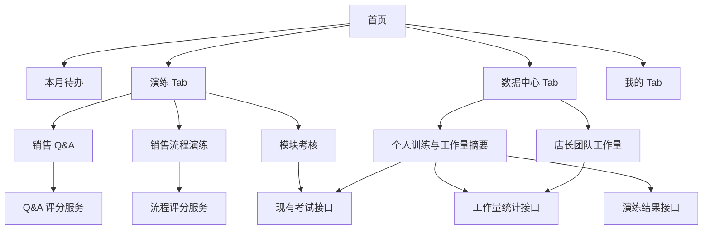

# 小程序体验升级技术设计

Feature Name: mini-program-experience-upgrade
Updated: 2026-08-29
Status: Confirmed

## 描述

本设计调整当前微信小程序的信息架构，并复用已有工作量、演练、考试、待办和统一请求能力。底部导航调整为工作量、演练、数据中心、“我的”四个 Tab；“我的”页面保留个人资料、账号操作，并增加数据中心、演练历史、考核历史和收藏入口。工作量模块只做入口兼容验证，不改业务逻辑。

## 架构



页面通过 `mini-program/utils/api.js` 访问后端，统一复用认证、请求 ID、幂等键、重试和错误分类。AI 评分通过现有演练 AI 适配服务调用，页面只接收结构化评分结果，不读取运行环境密钥。Q&A 和销售流程使用独立评分提示和结果维度。Q&A 从独立题库出题，逐题作答、即时逐题评分，结束时以平均分给出总分与等级。

## 组件与接口

| 组件 | 设计变更 |
| --- | --- |
| `mini-program/app.json` | 将 Tab 调整为工作量、演练、数据中心、“我的”；新增数据中心和必要的演练子页面路由。 |
| `mini-program/pages/index/` | 保留首页待办，扩展事项类型映射和入口卡片，兼容待办为空、失败和未登录状态。 |
| `mini-program/pages/drill/list/` | 重构为演练首页，展示销售 Q&A、销售流程演练和考核入口，并保留已有任务列表与自由练习能力。 |
| `mini-program/pages/drill/qa/` | 新增销售 Q&A 页面：选择篇目与题数、逐题作答、即时评分展示、完成总分与等级、历史记录与明细。 |
| `mini-program/pages/drill/flow/` | 新增销售流程阶段列表、过程记录、继续练习和综合评分结果页面。 |
| `mini-program/utils/drill-v2.js` | 新增 `loadQaCatalog`、`createQaSession`、`loadQaSession`、`submitQaAnswer`、`loadQaHistory`、`loadQaDetail` 客户端方法。 |
| `api/drill/v2/qa/` | 新增 Q&A 端点：`catalog.php`（篇目清单）、`sessions.php`（POST 幂等创建会话 / GET 会话状态与当前题）、`submit.php`（提交回答并评分）、`history.php`（历史）、`detail.php`（明细）。 |
| `mini-program/pages/exam/` | 复用已有考试页面能力，补充从考核列表进入的模块和试卷参数。 |
| `mini-program/pages/data-center/` | 新增个人数据摘要和店长团队工作量视图，根据角色展示不同数据块。 |
| `mini-program/pages/mine/` | 保留现有个人资料和账号操作，增加数据中心、演练历史、考核历史和收藏入口。 |
| `api/todos/my.php` | 复用首页待办数据；需要确认返回数据是否包含本月事项和稳定跳转路径。 |
| `api/drill/v2/services/DrillQaService.php` | 新增 Q&A 业务核心：`catalog`、`createSession`（`ORDER BY RAND()` 抽题）、`sessionState`、`submitAnswer`（AI 逐题评分 → 写答案 → 推进索引或完成算平均分与等级）、`history`、`detail`。 |
| `api/drill/v2/services/DrillAiAdapter.php` | 新增 `scoreQaAnswer()`：`qa_evaluation` 操作，返回 `total_score`、`dimension_scores`（keyword_coverage/concept_coverage/accuracy/completeness）、`feedback`、`suggestions`、`reference_highlights`。 |
| `database/migrations/202608290001_drill_qa_bank.sql` | 新增 `drill_qa_sections`、`drill_qa_questions`、`drill_qa_sessions`、`drill_qa_answers` 四张表。 |
| `database/import_data/drill-qa-bank.v1.json` | 题库种子：4 篇目 72 题（品牌 5、课程&专业 38、基础规则 5、销售 24），旧口径已更新为官网现行值。 |
| `database/import_drill_qa_bank.php` | 幂等导入脚本，迁移未执行时按 SQL 自动建表，按 `section_code + question_no` 幂等 upsert。 |
| `api/exam/` | 复用 `index.php`、`resume.php`、`save.php`、`submit.php` 的试卷详情、分配、暂存和提交能力；新增按 `course_id` 关联销售模块的列表与个人历史查询。 |
| `api/workload/` | 复用个人、门店汇总和员工明细接口作为数据中心数据源。 |
| `scripts/check_miniprogram_contracts.mjs` | 增加新 Tab、页面注册、请求层使用和工作量冻结范围检查。 |

## 试卷盘点门禁

实施考核页面前，读取并整理现有试卷数据，至少生成以下字段：试卷 ID、`course_id`、关联课程名称、模块编码、试卷名称、基础/专业类型、启用状态、题量、考试时长、及格线、适用角色、是否已有员工端访问权限。销售模块使用 `course_id` 关联课程名称；基础/专业类型由后台配置映射表提供，试卷标题只作为盘点校验信息。盘点结果用于确定小程序考核列表的数据筛选条件，缺失字段进入待确认清单。

## 数据模型

数据中心采用聚合读取模型，不新增第一期业务事实表：

```text
personal_summary: period, workload, drill, exam, updated_at
manager_summary: period, store_scope, workload_totals, staff_items, updated_at
qa_score: attempt_id, question_id, answer, total_score, dimensions, advice, status, created_at
flow_score: attempt_id, stages, total_score, strengths, advice, status, created_at
exam_summary: exam_id, module_code, score, passed, submitted_at, status
todo_item: id, title, priority, type, route, due_at, status
```

评分结果需要带有明确状态：`pending`、`completed`、`retryable`、`failed`。Q&A 评分维度为核心关键词覆盖、核心概念覆盖、答案准确性和答案完整性；销售流程评分维度为需求挖掘、方案匹配、异议处理和推进成交。AI 服务失败时保留原始练习提交记录，重试操作使用新的请求 ID 和原幂等业务键策略。

Q&A 题库独立于知识库话术卡片，题目以《追光小牛儿童运动Q&A》培训手册为源。会话创建时按篇目或全部随机抽题并冻结题目清单，逐题提交后写入答案记录，全部作答后以 `AVG(score)` 计算总分，等级规则为 90+ 优秀、75+ 良好、60+ 合格、其余待提升。Q&A 单局题数上限 50、默认 10。

数据中心默认查询当前月份，并允许在有数据权限的月份范围内切换。切换月份通过统一查询参数传递，后端重新执行员工或店长范围校验。

## 正确性属性

1. `app.json` 中每个底部 Tab 页面都已注册，Tab 导航使用 `utils/navigation.js` 的 `switchTab` 语义。
2. 工作量页面及其 API 契约在本轮代码变更中保持行为一致。
3. 普通员工的数据中心查询只返回当前员工范围；店长团队数据由后端角色和门店范围校验。
4. Q&A 评分和流程评分均能关联到唯一练习实例或提交记录。
5. AI 失败时员工回答和流程阶段状态仍可恢复。
6. 考核列表只展示盘点后确认启用且当前员工有权访问的试卷，并携带 `course_id` 对应的销售模块信息。
7. 首页待办请求失败不会阻断工作量、演练和数据中心入口。
8. 所有新增写请求携带幂等键，所有受保护读取复用统一认证刷新队列。

## 错误处理

| 场景 | 页面行为 |
| --- | --- |
| 未登录访问受保护数据 | 使用统一认证状态进入登录流程，页面保持可恢复。 |
| 待办读取失败 | 展示首页待办错误状态和重试按钮，保留其他首页入口。 |
| AI 评分超时或服务错误 | 保存回答或阶段进度，显示“评分暂不可用”和重试入口。 |
| 录音权限被拒绝 | 保留文本提交路径，并展示权限设置说明。 |
| 试卷无权访问或已下架 | 从考核列表隐藏；深链进入时展示原因并返回列表。 |
| 数据中心某数据块失败 | 独立显示该数据块错误状态，其他数据块继续呈现。 |
| 统计接口返回空数据 | 展示统计周期、空状态和对应业务入口。 |

## 测试策略

- 运行小程序路由、Tab 清单和统一请求层静态契约检查。
- 为演练首页验证销售 Q&A、销售流程演练、考核三个入口和继续练习入口。
- 为 Q&A 和流程评分验证提交、成功结果、AI 失败重试、文本兜底和幂等行为。
- 为考试接入验证试卷筛选、暂存恢复、提交结果、权限和下架场景。
- 为数据中心验证员工与店长角色边界、统计周期、空数据、局部失败和跳转。
- 为首页待办验证本月事项展示、跳转、空状态、错误重试和未登录零请求。
- 运行现有工作量契约与回归测试，确认冻结模块无行为回归。
- 在微信开发者工具和真机分别验证底部 Tab、录音权限、长文本输入和弱网恢复。

## 分阶段实施

1. 盘点现有考试试卷和相关接口，形成接入清单。
2. 调整信息架构和 Tab 路由，新增数据中心骨架，保持工作量模块冻结。
3. 将演练首页拆分为销售 Q&A、销售流程演练和考核入口。
4. 接入现有 AI 评分服务并补充结构化评分结果展示。
5. 接入确认后的试卷和考试结果。
6. 接入个人与店长数据聚合，完善“我的”入口。
7. 完成契约测试、真机验证和发布前门禁。

## 参考

- `.monkeycode/docs/模块/微信小程序.md`
- `.monkeycode/docs/mini-program-reminder-and-data-consistency-2026-06-21.md`
- `.monkeycode/specs/2026-08-10-sales-drill-pwa-guided-practice/requirements.md`
- `.monkeycode/specs/2026-08-10-sales-drill-pwa-guided-practice/design.md`
- `real_sync/mini-program/app.json`
- `real_sync/mini-program/pages/index/index.js`
- `real_sync/mini-program/pages/drill/list/list.js`
- `real_sync/mini-program/pages/exam/exam.js`
- `real_sync/mini-program/utils/api.js`
