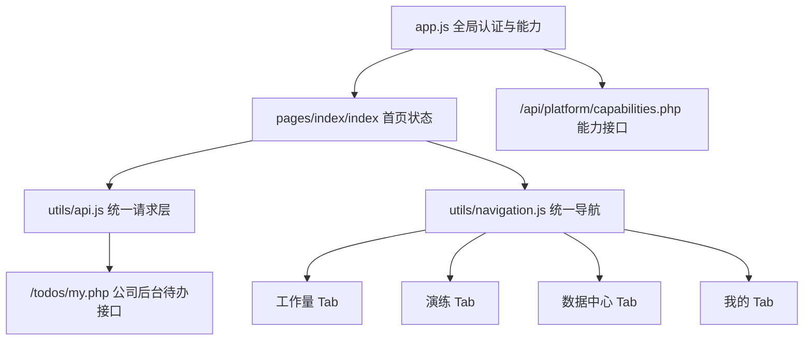
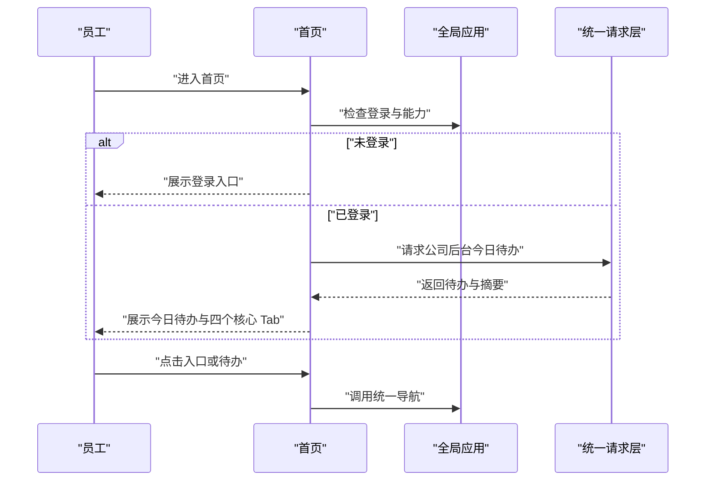

# 小程序首个业务页面技术设计

Feature Name: mini-program-home-entry
Updated: 2026-08-31
Status: Draft

## 描述

将 `pages/index/index` 规划为登录后的“今日工作台”。第一期通过现有认证状态、公司后台统一发布的待办接口和统一导航组成可恢复的首页状态，首屏最多展示三条今日待办，底部统一提供四个核心 Tab。

## 架构

首页保持现有页面边界。认证、能力、请求错误和导航语义由公共模块提供，首页只负责组合数据和渲染状态。

## 组件与接口

### 首页状态

保留现有字段，并按展示职责整理：

- `isLoggedIn`：登录状态。
- `userInfo`：姓名、岗位、门店等身份摘要。
- `todos`：经过展示字段转换并截取前三条的待办列表。
- `todoSummary`：待处理和紧急数量摘要。
- `todosLoading`：待办请求状态。
- `homeState`：`loading`、`empty`、`ready`、`error` 或 `offline`。
- `features`：能力端点解析后的入口白名单。
- `messageEntry`：企业微信消息入口参数。

### 待办接口

- 请求路径：`/todos/my.php`。
- 调用方式：`app.request`。
- 未登录状态：页面先清空待办并返回登录入口。
- 发布来源：公司后台统一发布任务，员工端按服务端权限范围接收任务。
- 展示范围：第一期最多展示三条；首页按服务端统一待办转换展示类型，使用待办自身的 `route`、`action_text` 和截止时间字段。
- 排序规则：优先沿用服务端返回顺序，并在接口契约中明确排序口径。
- 错误处理：通过 `view-state.js` 生成错误或离线状态，并提供 `retryHome`。

### 导航

- 首页底部提供工作量、演练、数据中心、我的四个自定义入口，点击后使用 `navigation.open` 切换到对应 Tab 页面。
- 待办和企业微信消息使用服务端或消息参数提供的稳定路径。
- 首页不直接调用 `wx.request`，也不自行读取刷新凭据。

## 页面数据流

## 正确性约束

1. 未登录状态下首页不发起受保护待办请求。
2. 首页入口的可见性由能力解析结果决定。
3. Tab 入口与 `app.json.tabBar.list` 保持一致。
4. 所有待办点击路径经过统一导航工具处理。
5. 待办请求失败时，首页仍保留可用入口和重试动作。
6. 首页最多渲染三条待办。
7. 首页结构对不同员工角色保持一致。

## 错误处理

| 场景 | 处理 |
| --- | --- |
| 未登录 | 展示登录入口，清空受保护数据 |
| 待办加载中 | 展示加载状态，保留静态入口 |
| 待办为空 | 展示周期和空状态 |
| 请求失败 | 展示错误信息和重新加载 |
| 网络离线 | 使用统一离线状态和恢复动作 |
| 能力接口异常 | 使用保守能力集合，保留认证、工作量、知识、演练和个人资料核心入口 |
| 路由缺失 | 由统一导航展示页面暂不可用反馈 |

## 测试策略

- 静态契约：检查首页事件、页面注册、入口路由和受保护请求模式。
- 状态覆盖：覆盖未登录、加载中、已加载、空待办、错误和离线状态。
- 数据转换：验证最多三条、优先级、类型名称、摘要数量和稳定路由映射。
- 后台任务：验证公司后台发布的任务按员工权限进入首页。
- 导航回归：验证四个 Tab、待办路径和企业微信消息路径。
- 真机验证：覆盖窄屏、长标题、无待办、网络恢复和登录后返回首页。

## 参考文件

- `real_sync/mini-program/pages/index/index.js`
- `real_sync/mini-program/pages/index/index.wxml`
- `real_sync/mini-program/pages/index/index.wxss`
- `real_sync/mini-program/app.json`
- `real_sync/mini-program/utils/api.js`
- `real_sync/mini-program/utils/navigation.js`
- `real_sync/mini-program/utils/view-state.js`
- `real_sync/mini-program/utils/capabilities.js`
