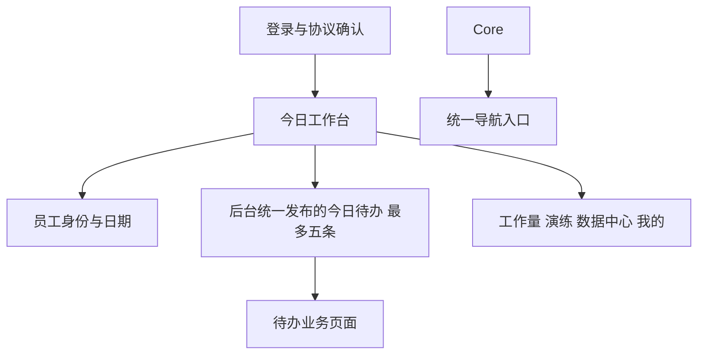

# 小程序首个业务页面规划

Feature Name: mini-program-home-entry
Updated: 2026-08-31
Status: Draft

## 当前实现基线

- 首页通过 `app.request` 调用 `/todos/my.php`。
- 首页将返回数据过滤为 `type === 'workload'` 后渲染。
- 首页通过 `features.knowledge` 和 `features.drill` 控制两个快捷入口。
- 首页工作量、演练和知识库入口已经复用统一导航工具。
- `app.json` 的实际底部导航为工作量、演练、数据中心、我的四项。

## 产品定位

首个业务页面承担“今日工作台”角色。首屏直接回答“今天要处理什么”，底部统一提供四个核心功能入口。

## 推荐信息架构

## 首屏布局

### 1. 身份区

- 使用简洁问候语和当前日期。
- 展示姓名、岗位、门店。
- 保留企业微信消息进入提示。
- 点击身份区进入“我的”。

### 2. 今日待办区

- 进入首页后的第一内容区直接展示今日待办。
- 使用一张主卡片展示待处理总数和当前日期。
- 最多展示五条，由服务端返回顺序确定展示顺序。
- 待办项显示类型、标题、优先级、截止时间和动作文字。
- 点击待办项进入服务端提供的稳定路径。
- 待办为空时显示当前周期和轻量空状态。

### 3. 统一核心功能入口

- 底部固定展示工作量、演练、数据中心、我的四个 Tab。
- 四个入口采用统一结构和统一文案层级。
- 各角色采用统一首页结构，任务内容由后台发布范围和能力权限决定。

### 5. 底部导航区

- 工作量、演练、数据中心、我的保持固定顺序。
- 首页作为普通页面保留独立入口，底部 Tab承担长期业务模块切换。
- 所有页面跳转复用 `utils/navigation.js`。

## 页面状态

| 状态 | 页面表现 |
| --- | --- |
| 未登录 | 展示登录入口、品牌信息和公开说明，不请求受保护数据 |
| 加载中 | 展示身份骨架、待办加载占位和可见核心入口 |
| 已加载 | 展示身份、最多五条今日待办和四个核心 Tab |
| 空待办 | 展示当前周期、空状态和核心入口 |
| 待办失败 | 展示失败原因、重试按钮和核心入口 |
| 局部失败 | 失败卡片独立展示，其他数据块保持可用 |
| 离线恢复 | 按统一请求层错误分类展示恢复操作 |

## 视觉方向

- 延续现有米白背景、品牌橙色和深色文字。
- 首屏采用“今日待办主卡片加统一 Tab 导航”的节奏，突出当天任务。
- 今日待办使用较强对比度，底部四个 Tab 保持统一视觉和交互。
- 文案优先使用行动词，例如“去填报”“开始演练”“查动作”。
- 适配手机窄屏和长文本，点击目标保持小程序常用触控尺寸。

## 实施顺序

1. 盘点现有首页待办返回字段、后台发布范围、企业微信跳转参数和能力字段。
2. 明确服务端排序是否满足优先级和截止时间展示要求。
3. 重构 `pages/index/index.wxml` 与 `index.wxss` 的信息层级。
4. 在 `index.js` 统一处理最多五条待办、刷新状态和导航。
5. 补充首页静态契约、状态覆盖和四 Tab 导航回归测试。
6. 在微信开发者工具和真机验证窄屏、弱网、未登录和企业微信入口。

## 参考代码

- `real_sync/mini-program/pages/index/index.js`
- `real_sync/mini-program/pages/index/index.wxml`
- `real_sync/mini-program/pages/index/index.wxss`
- `real_sync/mini-program/app.json`
- `real_sync/mini-program/utils/navigation.js`
- `real_sync/mini-program/utils/view-state.js`
- `real_sync/mini-program/utils/capabilities.js`
- `real_sync/mini-program/utils/api.js`
