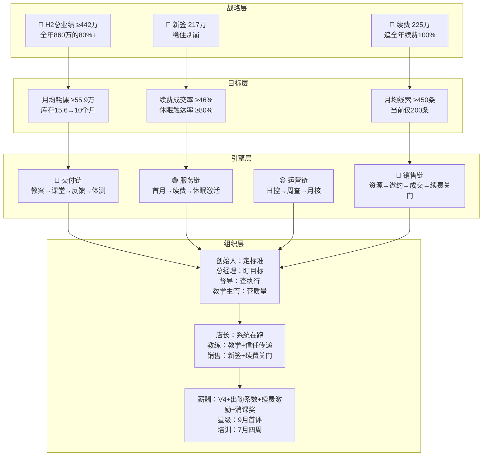
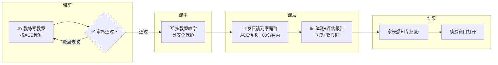
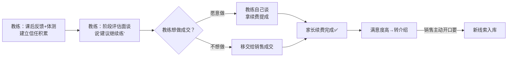
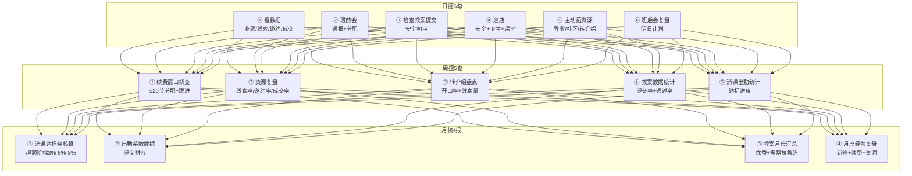
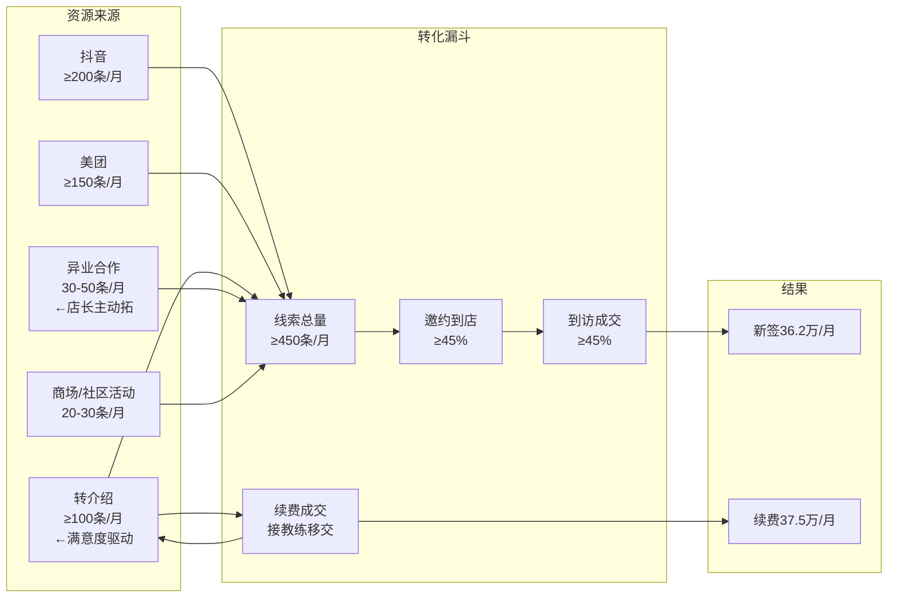
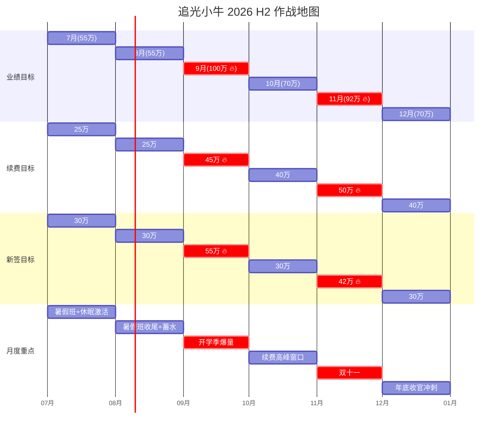
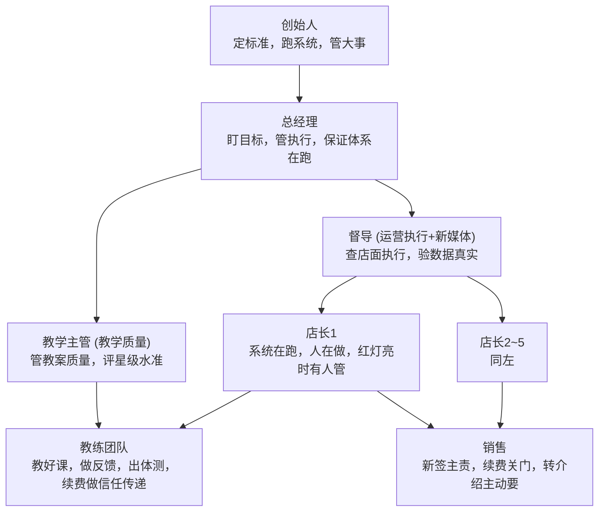
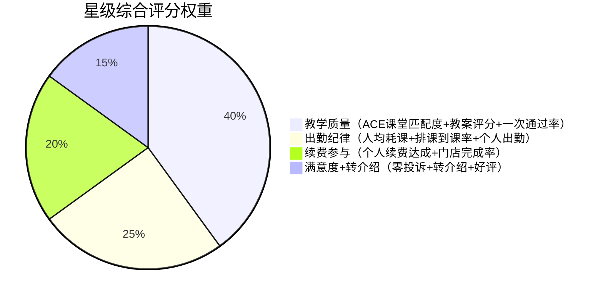

# 追光小牛 2026 H2 总纲 · 从战略到执行全景

> ⚡ 本文档是H2方案的总缆。一本看完，知道全年要什么、每月打什么、每周做什么、每天跟什么。
> 
> 版本：v1.0 | 2026年7月1日执行

---

## 一、H2 战略全景 · 一张图看全



---

## 二、H2 四大引擎 · 闭合驱动

### 2.1 交付链 · 教案→课堂→反馈→体测



### 2.2 续费引擎 · 信任→移交→成交→转介绍



### 2.3 运营引擎 · 店长日周月工作流



### 2.4 销售链 · 五条线拉资源



---

## 三、每月作战地图（7-12月）

### 3.1 业绩-资源-重点 三维联动



### 3.2 营销活动-蓄水-执行 联动节奏

| 月份 | 业绩目标 | 核心营销活动 | 蓄水动作 | 续费重点 | 新签重点 | 消课重点 |
|:---:|:---:|:---|---:|:---:|:---:|:---:|
| **7月** | 55万 | 暑假班开营<br>休眠激活→回归 | 暑假班线索蓄水<br>抖音/美团稳量 | 休眠会员回访<br>窗口期自然续费 | 暑假班转化学员 | 暑假班全天排课<br>月均55.9万目标 |
| **8月** | 55万 | 暑假班二期<br>开学季预热 | **蓄水黄金期**<br>暑假班家长→转介绍蓄水 | 暑假班结课体测<br>→续费预埋 | 转介绍爆发<br>抖音线索蓄水 | 暑假班收尾<br>体测报告输出 |
| **9月** | **100万🔥** | **开学季大促** | 7-8月蓄水放量<br>转介绍裂变 | 续费全面爆发<br>≥45万 | 全年最大获客窗口<br>**55万目标** | 持续消课<br>保持节奏 |
| **10月** | 70万 | 转介绍推动月 | 9月新签会员→满意度→转介绍 | 续费窗口集中<br>≥40万 | 转介绍+抖音稳量 | 会员出勤率管理 |
| **11月** | **92万🔥** | **双十一活动** | 9-10月续费会员→口碑传播 | 双十一续费<br>**≥50万🔥** | 续费转介绍双驱动<br>**42万目标** | 冲刺消课达标奖 |
| **12月** | 70万 | 年底收官+下年蓄水 | 年底老会员回馈<br>寒假班预热 | 续费最后冲刺<br>≥40万 | 寒假班预售 | 全年周转10个月<br>✅达标验收 |

### 3.3 每月需要多少资源

| 月份 | 月业绩 | 新签(元) | 需单数 | **需线索(条)** | 现有(条) | 缺口 |
|:---:|:---:|:---:|:---:|:---:|:---:|:---:|
| 7月 | 55万 | 30万 | 67单 | **331条** | ~200 | **-131** 🔴 |
| 8月 | 55万 | 30万 | 67单 | **331条** | ~200+暑假班蓄水 | **可补** 🟡 |
| 9月 | **100万** | **55万** | **122单** | **602条** 🔥 | ~350 | **-252** 🔴🔴 |
| 10月 | 70万 | 30万 | 67单 | **331条** | ~350 | ✅ |
| 11月 | **92万** | **42万** | **93单** | **460条** | ~400 | **-60** 🟡 |
| 12月 | 70万 | 30万 | 67单 | **331条** | ~400 | ✅ |

> **核心结论**：7月暑期开始蓄水，9月开学季是全年最关键的获客窗口，资源必须在7-8月蓄满。

---

## 四、组织架构与岗位定位



### 各岗一句话定位

| 岗位 | 一句话定位 |
|:---|:---|
| **创始人** | 定标准，跑系统，管大事 |
| **总经理** | 盯目标，管执行，保证体系在跑 |
| **督导** | 查店面执行，验数据真实，管新媒体运营 |
| **教学主管** | 管教案质量，抓课堂执行，做教练培训，评星级水准 |
| **店长** | 系统在跑、人在做、红灯亮时有人管 |
| **教练** | 教好课，做反馈，出体测，续费做信任传递 |
| **销售** | 新签主责，续费关门，转介绍主动要 |

---

## 五、薪酬驱动逻辑

```mermaid
flowchart TD
    subgraph "收入 = 五层结构"
        A["V4底薪（保底）<br/>实习2100→三星3000"]
        B["课时费×出勤系数<br/>V4单价×0.80~1.10"]
        C["业绩提成（新签+续费合并）<br/>2%-6%阶梯"]
        D["续费激励<br/>续费金额×2%，不设门槛"]
        E["消课达标奖<br/>超额3%-5%-8%阶梯"]
    end

    subgraph "做与不做，月差2,090元"
        F["不管出勤不续费<br/>≈8,840元"]
        G["达标出勤+续费<br/>≈9,980元"]
        H["出勤好+续费好+门店超额<br/>≈10,930元 ✅"]
    end

    A & B --> F
    A & B & C & D & --> G
    A & B & C & D & E --> H
```

### 出勤系数怎么算

| 等级 | 排课到课率 | 人均耗课达成率 | 最终出勤系数 | 教练感知 |
|:---:|:---:|:---:|:---:|:---:|
| ⚪ 好 | ≥80% | ≥100% | **1.10** | 涨10% |
| 🟢 达标 | 70-79% | 80-99% | **1.00** | 持平 |
| 🟡 一般 | 60-69% | 60-79% | **0.90** | 降10% |
| 🔴 差 | <60% | <60% | **0.80** | 降20% |

---

## 六、星级评定总览

| 升星路径 | 月均耗课 | 出勤率 | 续费业绩 | 资历 | 考核 | H2状态 |
|:---|:---:|:---:|:---:|:---:|:---:|:---:|
| 实习→新星 | ≥50节 | — | — | — | 实操+体测解读 | ✅ 开放 |
| 新星→一星 | ≥150节 | ≥70% | 有续费记录(1单) | — | 理论+体能+实操 | ✅ 开放 |
| 一星→二星 | ≥200节 | ≥75% | 有续费记录 | 急救证 | 理论+体能+实操 | ✅ 开放 |
| 二星→三星 | ≥250节 | ≥80% | **≥3万/季** | 急救证+6证之一 | +演讲 | ✅ 开放 |
| 三星→四星 | — | — | — | — | — | ⏸ 暂闭 |
| 四星→五星 | — | — | — | — | — | ⏸ 暂闭 |

### 综合评分权重



---

## 七、H2 倒计时推演

### 从9月开学季倒推

```
9月要冲100万
  └─ 需要7-8月蓄水转介绍 + 线索储备 + 暑假班满意度
      └─ 7月休眠激活 + 暑假班开打
          └─ 7月第一周：公布薪酬方案 + 培训 + 分配休眠名单
              └─ 7月1日：服务承诺已执行
```

### 从11月双十一倒推

```
11月要冲92万
  └─ 需要9-10月续费会员满意度高 → 转介绍
      └─ 需要暑假班+开学季的教学品质到位
          └─ 教案自主化从7月就开始跑
```

---

## 八、一张表看全：H2全部文件索引

| 序号 | 文件名 | 谁用 | 一句话内容 |
|:---:|:---|---|:---|
| 01 | 追光小牛H2升级方案.md | 全员 | 本总纲文档，一本看完H2全貌 |
| 02 | 追光小牛_教练教案制作指引.md | 教练 | 怎么写教案（ACE标准+六大原则） |
| 03 | 追光小牛_教案审核打分表.md | 教学主管 | 怎么审教案（90分制打分表） |
| 04 | 追光小牛_课后反馈指导.md | 教练 | 课后反馈ACE话术 |
| 05 | 追光小牛_H2会员服务手册.md | 教练+店长 | 会员六阶段全生命周期服务标准 |
| 06 | 追光小牛_H2销售执行手册.md | 销售 | 续费关门+转介绍+五条线拉资源 |
| 07 | 追光小牛_H2门店运营手册.md | 店长 | 日周月工作流+六步闭环+数据检查 |
| 08 | 追光小牛_H2岗位职责说明书.md | 全员 | 7岗定位+H2协作关系 |
| 09 | 追光小牛_H2绩效考核方案.md | 全员 | 各岗月度/季度KPI+考核标准 |
| 10 | 追光小牛_H2教练薪酬方案（初稿）.md | 教练 | 收入公式+出勤系数+续费激励+消课奖 |
| 11 | 追光小牛_H2教练星级评定方案.md | 教练 | 星级全览+综合评分+评定流程 |
| 12 | 追光小牛_H2各岗位日常工作跟踪.md | 全员 | 日周月每岗检查清单 |
| 13 | 追光小牛_H2 7月培训计划.md | 全员 | 7月四周培训安排+考核 |
| 14 | 追光小牛_7月过渡期执行计划.md | 全员 | 7月四周执行周历 |
| 15 | 追光小牛_教练岗位手册（转正）.md | 教练 | 转正教练岗位操作手册 |
| 16 | 追光小牛_教练岗位手册（未转正）.md | 实习教练 | 实习教练工作标准+转正条件 |
| 17 | 追光小牛_销售岗位手册（转正）.md | 销售 | 销售岗位操作手册 |
| 18 | 追光小牛_销售岗位手册（未转正）.md | 实习销售 | 实习销售工作标准+转正条件 |
| 19 | 追光小牛_店长岗位手册.md | 店长 | 店长岗位操作手册 |
| 20 | 追光小牛_督导岗位手册.md | 督导 | 督导岗位操作手册 |
| 21 | 追光小牛_教学主管岗位手册.md | 教学主管 | 教学主管岗位操作手册 |
| 22 | 追光小牛H2_创始人岗位手册.md | 创始人 | 创始人岗位操作手册 |

---

## 九、落地原则

> 1. **续费不是终点，是教学品质的自然结果。**
> 2. **教练不是被逼着续费的，是被激活去做专业事的。**
> 3. **店长不是做最多事的人，是确保系统在跑的人。**
> 4. **资源不是等来的，是店长每天主动找来的。**
> 5. **消课不是目的，打开续费窗口才是。**
> 6. **薪酬不是成本，是驱动行为的工具。**

---

> 📅 执行起点：2026年7月1日（已执行）
> 📅 首轮关键节点：7月休眠激活 → 9月星级首评 + 开学季100万 → 11月双十一92万
> 📅 最终交付：12月底库存周转≤10个月 + 全年完成率80%+
