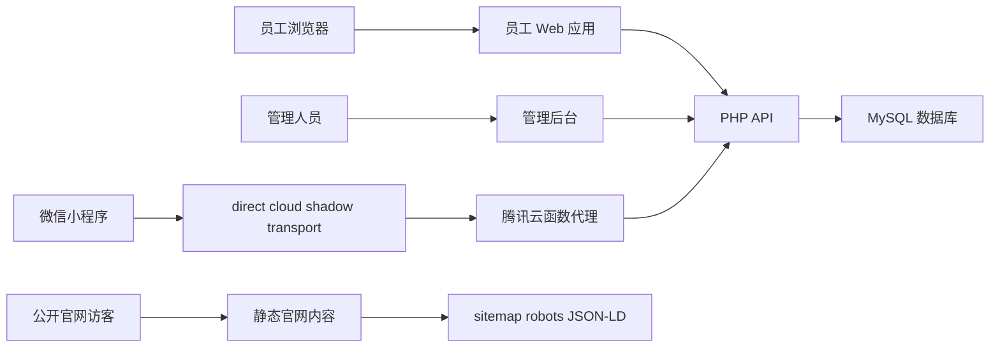
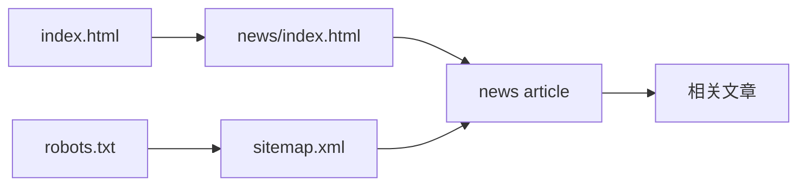
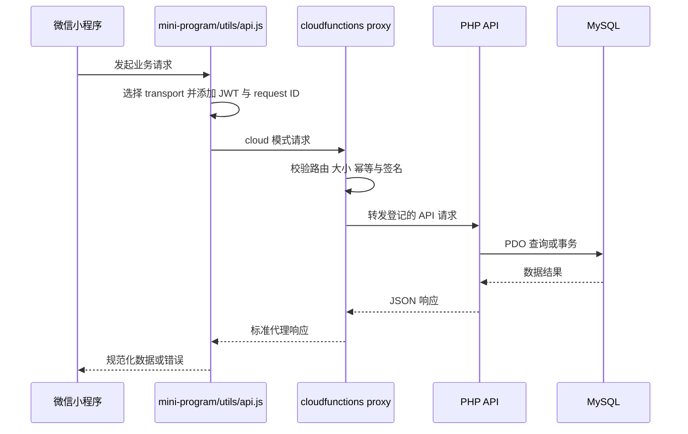

# 追光小牛数字平台架构

## 概述

本仓库同时承载追光小牛公开官网和内部运营平台。公开侧提供品牌、课程、门店和资讯内容；内部侧覆盖员工工作台、学习考试、AI 演练、工作量、制度知识库、管理后台和微信小程序。

系统采用多入口架构。浏览器页面以静态 HTML、CSS 和原生 JavaScript 为主，通过同源 `/api/` PHP 接口访问后端；微信小程序可直接访问 PHP API，也可经腾讯云函数代理转发。服务端使用 MySQL 数据库，并通过版本化 SQL migration 管理业务结构。

公开内容模块保持纯静态交付，通过 `index.html`、`news/`、`courses/`、`stores/`、`sitemap.xml` 和 `robots.txt` 形成搜索与 AI 检索入口。内部应用具有 JWT、会话、角色权限、幂等键、状态版本和审计等平台能力。

## 技术栈

| 层级 | 技术 |
|------|------|
| Web 页面 | HTML5、CSS、原生 JavaScript、PWA Service Worker |
| 服务端 | PHP、PDO |
| 数据存储 | MySQL、WordPress 兼容用户表、版本化 SQL migration |
| 小程序 | 微信小程序原生 WXML/WXSS/JavaScript |
| 云端适配 | Node.js 腾讯云函数、Cloud Run media adapter |
| 测试 | Node.js `.test.mjs`、PHP CLI 验证脚本 |
| 公开发现 | Schema.org JSON-LD、Open Graph、sitemap、robots |

## 项目结构

```text
real_sync/
├── index.html                 # 公开官网首页
├── news/                     # 公开资讯与专题文章
├── courses/                  # 公开课程页面
├── stores/                   # 贵阳门店页面
├── assets/                   # 公开静态资源
├── internal.html             # 员工工作台主入口
├── mobile/                   # 员工移动 Web 页面
├── admin/                    # 总部运营与系统管理页面
├── training/                # 培训课程与考试页面
├── training-center/         # 培训中心页面
├── mini-program/            # 微信小程序
├── api/                     # PHP HTTP API
├── database/                # migration 与数据库工具
├── cloudfunctions/          # 小程序 API、认证和媒体云函数
├── cloudrun/                # 媒体适配服务
├── scripts/                 # 自动化检查、迁移和测试
├── docs/                    # 业务与教学资料
├── sitemap.xml              # 公开 URL 清单
└── robots.txt               # 搜索与 AI 爬虫规则
```

## 主要子系统

### 公开官网

- 位置：`index.html`、`news/`、`courses/`、`stores/`、`assets/`
- 目的：向家长公开品牌、课程、门店、ACE 教学与选择指南。
- 特征：静态 HTML；文章使用 canonical、Open Graph、Article、FAQPage 和 BreadcrumbList JSON-LD。
- 发现入口：`news/index.html`、`sitemap.xml`、`robots.txt`。

### 员工 Web 应用

- 位置：`internal.html`、`mobile/`、根目录业务页面。
- 核心入口：`/mobile/login.html`、`/internal.html`、`/mobile/mine.html`。
- 能力：学习、考试、制度、知识、AI 演练、工作量、个人档案。
- 认证：浏览器保存 JWT，页面通过 `Authorization: Bearer` 调用同源 API。

### 管理后台

- 位置：`admin/`、`admin-upload.html`、`stats-center.html`。
- 核心入口：`/admin/dashboard.html`。
- 能力：员工组织、学习、工作量、招聘、审计、系统健康、权限和运营管理。

### PHP API 与数据平台

- 位置：`api/`、`database/`。
- 入口：按业务域拆分的 `.php` 文件，公共配置位于 `api/config.php`。
- 数据：PDO 连接 MySQL，migration 覆盖组织、工作量、演练、招聘、文件、作业、同步、企微与审计。
- 平台能力：JWT、角色权限、幂等键、状态版本、操作日志、任务队列和 outbox。

### 微信小程序与云适配

- 位置：`mini-program/`、`cloudfunctions/`、`cloudrun/`。
- 小程序业务域由 `mini-program/business-domain-matrix.json` 登记。
- `mini-program/utils/api.js` 在 direct、cloud、shadow 三种 transport 中选择。
- `api-proxy` 和 `auth-proxy` 使用路由白名单、请求大小限制、HMAC 网关签名和幂等检查转发到 `https://supercalf.com/api`。
- `media-ticket` 与 `media-adapter` 支持媒体上传和适配链路。

## 架构关系



## 关键流程

### 公开内容发现



### 小程序 API 请求



## 设计决策

- 公开内容采用静态 HTML，降低公开页面运行依赖并提升抓取稳定性。
- 内部 Web 页面与 PHP API 使用同源路径，简化认证和浏览器请求配置。
- 小程序使用业务域矩阵登记路由，云函数只转发白名单中的路径。
- 数据库变更使用 expand-migrate-contract 相关验证与版本化 migration。
- 写请求广泛使用 request ID、幂等键和状态版本控制重复提交与冲突。

## 无法从仓库确认

- 生产 Web 服务器和 PHP-FPM 的具体部署编排。
- 生产 MySQL 实例规格、备份周期与高可用拓扑。
- 云函数和 Cloud Run 当前生效的环境 ID、版本与流量比例。
