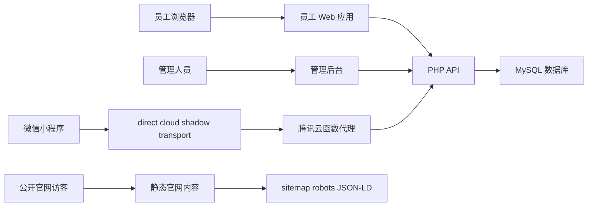
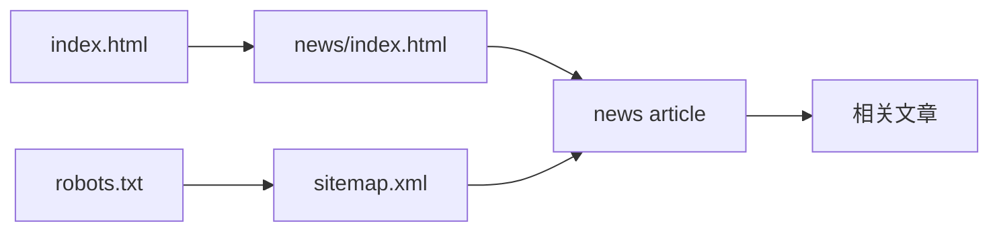
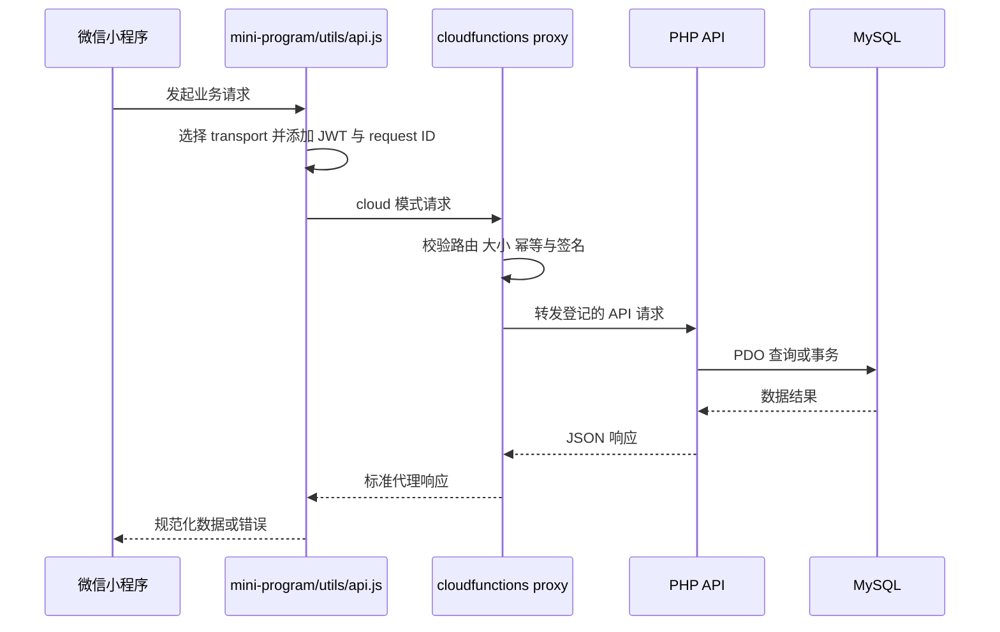
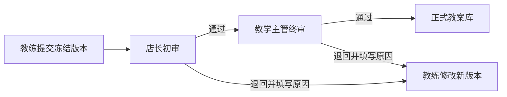

# 追光小牛数字平台架构

## 概述

本仓库同时承载追光小牛公开官网和内部运营平台。公开侧提供品牌、课程、门店和资讯内容；内部侧覆盖员工工作台、学习考试、AI 演练、工作量、制度知识库、管理后台和微信小程序。

系统采用多入口架构。浏览器页面以静态 HTML、CSS 和原生 JavaScript 为主，通过同源 `/api/` PHP 接口访问后端；微信小程序可直接访问 PHP API，也可经腾讯云函数代理转发。服务端使用 MySQL 数据库，并通过版本化 SQL migration 管理业务结构。

公开内容模块保持纯静态交付，通过 `index.html`、`news/`、`courses/`、`stores/`、`sitemap.xml` 和 `robots.txt` 形成搜索与 AI 检索入口。内部应用具有 JWT、会话、角色权限、幂等键、状态版本和审计等平台能力。

## 技术栈

| 层级 | 技术 |
|------|------|
| Web 页面 | HTML5、CSS、原生 JavaScript、PWA Service Worker |
| 服务端 | PHP、PDO |
| 数据存储 | MySQL、WordPress 兼容用户表、版本化 SQL migration |
| 小程序 | 微信小程序原生 WXML/WXSS/JavaScript |
| 云端适配 | Node.js 腾讯云函数、Cloud Run media adapter |
| 测试 | Node.js `.test.mjs`、PHP CLI 验证脚本 |
| 公开发现 | Schema.org JSON-LD、Open Graph、sitemap、robots |

## 项目结构

```text
real_sync/
├── index.html                 # 公开官网首页
├── news/                     # 公开资讯与专题文章
├── courses/                  # 公开课程页面
├── stores/                   # 贵阳门店页面
├── assets/                   # 公开静态资源
├── internal.html             # 员工工作台主入口
├── mobile/                   # 员工移动 Web 页面
├── admin/                    # 总部运营与系统管理页面
├── training/                # 培训课程与考试页面
├── training-center/         # 培训中心页面
├── mini-program/            # 微信小程序
├── api/                     # PHP HTTP API
├── database/                # migration 与数据库工具
├── cloudfunctions/          # 小程序 API、认证和媒体云函数
├── cloudrun/                # 媒体适配服务
├── scripts/                 # 自动化检查、迁移和测试
├── docs/                    # 业务与教学资料
├── sitemap.xml              # 公开 URL 清单
└── robots.txt               # 搜索与 AI 爬虫规则
```

## 主要子系统

### 公开官网

- 位置：`index.html`、`news/`、`courses/`、`stores/`、`assets/`
- 目的：向家长公开品牌、课程、门店、ACE 教学与选择指南。
- 特征：静态 HTML；文章使用 canonical、Open Graph、Article、FAQPage 和 BreadcrumbList JSON-LD。
- 发现入口：`news/index.html`、`sitemap.xml`、`robots.txt`。

### 员工 Web 应用

- 位置：`internal.html`、`mobile/`、根目录业务页面。
- 核心入口：`/mobile/login.html`、`/internal.html`、`/mobile/mine.html`。
- 能力：学习、考试、制度、知识、AI 演练、工作量、个人档案；知识中心在 `/knowledge/` 提供桌面列表，在 `/knowledge/detail.html` 提供桌面详情。
- 认证：浏览器保存 JWT，页面通过 `Authorization: Bearer` 调用同源 API。
- 页面壳：加载 `internal-auth.js` 的员工页面由该脚本注入唯一 `#mcOpsShell`，并加载 `assets/internal-ops.css`。脚本按路径为页面标记 `home`、`policy`、`knowledge`、`drill`、`learning`、`tools`、`mine` 或 `admin` 中心；共享样式据此统一卡片、筛选、列表、状态、弹层和表单表面。知识详情、教案编辑、教案审核、管理仪表盘和员工管理分别使用稳定的 `internal-*` body 类限定复杂页面样式，详情、表格、业务表单和抽屉继续保留原业务节点与事件。桌面端使用 218 像素石墨侧栏，980 像素及以下切换为横向中心导航；原业务 DOM 和移动端底部导航保持独立。
- 工作台：`internal.html` 使用企业运营控制台结构，顶部命令栏承载日期、全局搜索与管理入口，主体聚合内容收录概览、今日工作、员工账号、六大中心和业务工具。登录表单及搜索函数继续使用原有客户端合同。

### 管理后台

- 位置：`admin/`、`admin-upload.html`、`stats-center.html`。
- 核心入口：`/admin/dashboard.html`。
- 能力：员工组织、学习、工作量、招聘、审计、系统健康、权限和运营管理。

### PHP API 与数据平台

- 位置：`api/`、`database/`。
- 入口：按业务域拆分的 `.php` 文件，公共配置位于 `api/config.php`。
- 数据：PDO 连接 MySQL，migration 覆盖组织、工作量、演练、招聘、教案、文件、作业、同步、企微与审计；教案创建、Office 原始文件上传、XLSX/DOCX 结构化解析和 ACE 规则检查位于 `api/lesson-submissions/`。
- 平台能力：JWT、角色权限、幂等键、状态版本、操作日志、任务队列和 outbox。
- 积分兑换与每日签到的事务逻辑分别由 `PointsExchangeService` 和 `DailyCheckinService` 承载，端点通过统一幂等执行器持有事务；考试提交、教案创建和教案导出采用相同事务边界。

### 微信小程序与云适配

- 位置：`mini-program/`、`cloudfunctions/`、`cloudrun/`。
- 小程序业务域由 `mini-program/business-domain-matrix.json` 登记。
- `mini-program/utils/api.js` 在 direct、cloud、shadow 三种 transport 中选择。
- `api-proxy` 和 `auth-proxy` 使用路由白名单、请求大小限制、HMAC 网关签名和幂等检查转发到 `https://supercalf.com/api`。
- `media-ticket` 与 `media-adapter` 支持媒体上传和适配链路。

## 架构关系



## 关键流程

### 公开内容发现



### 小程序 API 请求



### 教案两级审核



## 设计决策

- 公开内容采用静态 HTML，降低公开页面运行依赖并提升抓取稳定性。
- 内部 Web 页面与 PHP API 使用同源路径，简化认证和浏览器请求配置。
- 小程序使用业务域矩阵登记路由，云函数只转发白名单中的路径。
- 数据库变更使用 expand-migrate-contract 相关验证与版本化 migration。兼容性校验器独立报告字段修改、数据写入、状态回填和潜在表重写风险；存在风险的 migration 必须在 catalog 声明兼容窗口、写适配器、预计影响行数、锁风险、执行策略及 rollback 或 forward-fix，缺项会生成带版本、SQL 风险类型、目标和语句序号的阻断问题。`MigrationRunner::apply(true)` 先通过 `information_schema` 只读检查历史表，再生成结构与行数的前后快照，历史表缺失时返回 `history_table_absent` 并保持数据库原值。
- 临时数据库回放由 `scripts/migration_mysql.integration.php` 执行。入口只接受名称匹配 `mc_migration_test_[a-z0-9_]+`、显式确认且初始为空的专用 MySQL 数据库；受版本控制的旧版 baseline 提供组织、工作量、知识与教案版本、积分、课程和学习进度历史数据。harness 依次验证 dry-run 数据库指纹不变、68 个 migration 首次 apply、结构与数据 readiness、关键回填及复合外键，并要求二次 apply 全部返回 `already_applied`。runner 对两个历史 `row_number` 保留字和两个员工外键列宽问题应用版本限定的执行期适配，原 migration 文件及 checksum 保持不变。
- 写请求广泛使用 request ID、幂等键和状态版本控制重复提交与冲突。
- 教案 XLSX 解析使用 PHP 原生 `ZipArchive` 与 XML 能力，保留 Sheet、单元格、合并区域和字段位置引用；旧版 XLS 返回明确解析错误并进入手工录入路径。
- 教案 DOCX 解析使用 PHP 原生 `ZipArchive` 与 XML 能力，保留标题、段落、列表、表格及其段落/表格位置引用；旧版 DOC 返回明确解析错误并进入手工录入路径。
- 教案解析失败时写入失败运行记录并创建 `manual_template` 版本，状态保持 `parse_failed`；作者通过手工录入接口后进入 `editable`。
- 手工录入回退通过 `manual-entry.php` 复用教案权限、审计和状态版本机制，原始 Office 文件与失败原因保持可追溯。
- 教案详情和草稿服务通过 `LessonDraftService` 读取版本历史，并以 `status_version` 乐观锁创建新草稿版本；提交或审核状态下的版本保持只读。新建教案页通过共享 `InternalAuth.adaptUserIdentity()` 固定展示认证作者姓名，创建接口继续以服务端认证 `staff_id` 写入 `author_staff_id` 和 `created_by`。
- 教案 ACE 检查由 `LessonAceRuleChecker` 以确定性规则执行，覆盖基本信息、三维目标、课程环节与时长、安全、器材、升降阶、助教分工和课后反思；结果包含字段路径、严重级别、优先级、修复动作和规则依据。
- 教案知识卡优化由 `LessonKnowledgeMatcher` 读取启用且已发布知识卡的 active 当前版本，按年龄、课程线、训练项目、课堂阶段、器材和风险评分；建议同时固定教案版本、知识卡 ID 和知识卡版本 ID，并保留匹配理由。`LessonSuggestionService` 处理教练的采纳或忽略决定，采纳生成新草稿版本，两个决定均写入处理人、时间和审计日志。
- `202609040002_lesson_version_relations.sql` 为主记录的当前及批准版本、建议、审核任务、导出和审计记录建立 `(submission_id, version_id)` 归属约束，并为知识卡建议建立 `(knowledge_item_id, knowledge_version_id)` 归属约束；跨教案和跨知识卡版本引用由数据库拒绝。
- `202609040002_lesson_version_relations.sql` 在下一个发布窗口内允许 N/N-1 读取端忽略 `knowledge_version_id`，并允许 N-1 写入端暂时写入 `NULL`；应用前使用 `source_type = 'knowledge_card' AND knowledge_version_id IS NULL` 统计精确回填量，先验证教案与知识版本归属，再在批准窗口执行。`MODIFY COLUMN` 可能重建 `lesson_suggestions` 并持有 metadata lock，回填只锁定命中的知识卡建议；失败后通过新增 forward-fix migration 回填剩余空值、修复归属数据并重试约束。
- 知识分类的版本化数据源位于 `database/knowledge_taxonomy_mapping.v1.json`。激活版本 `taxonomy-2026-09-04-v1` 定义 `professional`（专业知识）和 `sales`（销售知识）两条主线、稳定子分类、二期导入包八个 domain code 的确定映射，以及七类导入内容的审核复核基线。`api/knowledge/KnowledgeTaxonomy.php` 严格加载唯一激活版本，为知识列表筛选、分类清单和详情分类提供主线、子分类、领域映射及版本号；导入检查、分类审核报告和发布门禁读取同一数据源。版本化领域映射优先于旧内容启发式分类，历史 `domain_code = sales` 和 `content_type = script` 继续进入销售知识。
- 桌面知识中心通过 `knowledge/knowledge.js` 调用 `/api/knowledge/list.php`，支持双主线、主题关键词、内容类型、收藏、最近浏览和分页；数据库内容进入 `/knowledge/detail.html`，迁移期静态内容根据 `content-index.json` 中已发布记录进入各自规范路径。预览环境在数据库不可用时只展示该已发布静态清单。
- 迁移期静态来源由根目录 `content-index.json` 登记，覆盖动作库、培训卡片、培训资料、静态教案和体测工具；`api/search/search-service.php` 在数据库统一索引结果之外读取该清单和 `lessons/manifest.json`。数据库知识列表和详情通过当前 active 版本返回 `version_id`，教案知识匹配器绑定对应 active 知识版本。
- 员工知识发现面的数据库数据源由 `EmployeeKnowledgeVisibilityQuery::fromCurrentVersion()` 统一定义，原子封装主记录启用、已发布、当前版本归属同一知识卡和版本状态为 `active` 四项条件。知识列表的计数与结果、知识详情与相关内容、全局搜索、教案知识建议及兼容智能教案入口共同复用该数据源；详情相关内容返回当前 `version_id`，标题、摘要、内容类型和领域字段使用当前版本优先值，媒体字段继续读取知识主记录。组件只生成固定表名和经过校验的别名，各消费者继续管理字段投影、业务筛选和 PDO 参数，管理审核和固定历史版本读取保持独立查询语义。
- 教案导出由 `LessonExportService` 从结构化版本生成现代 XLSX 或 DOCX，Excel 固定输出基本信息、课程流程、安全与器材、ACE反思四个 Sheet；导出文件使用私有随机存储名，`lesson_exports` 保存版本、格式、状态和完成时间，下载接口复用权限和私有文件流。
- 教案上传和导出的私有存储命名空间分别使用 `lesson-submissions/submission-{id}` 与 `lesson-exports/submission-{id}`，满足每个目录段以字母开头的存储边界约束。
- 教案提交由 `LessonSubmissionReviewService` 在 ACE 校验通过且当前版本建议已处理后执行；服务按门店选择启用店长，使用事务冻结版本、创建 `store_review` 初审任务、推进教案状态版本并记录提交审计，状态冲突和无店长均返回明确业务错误。
- 审核查询由 `LessonReviewQueryService` 按 `reviewer_staff_id` 隔离任务，详情聚合审核版本、原始文件、建议、版本快照、审核历史和导出记录。`LessonReviewDecisionService` 校验任务归属、角色阶段、版本和状态，店长通过后创建教学主管任务，教学主管通过后在同一事务内固定批准版本并写入正式库发布状态，任一阶段退回均要求原因并保留审计记录。
- 正式教案库由 `LessonLibraryQueryService` 提供列表和详情读取。两个查询共同要求主记录为 `approved`、正式库状态为 `published`，并通过 `(submission_id, approved_version_id)` 关联已提交且不可变的批准版本；列表支持分页、课程线、班级和关键词筛选，详情只返回该批准版本及 `/lesson-library.html?id={submission_id}` 稳定规范路由。员工页面 `lesson-library.html` 通过 `js/lesson-library.js` 消费列表与详情接口，提供筛选、分页、加载、空结果和错误状态；学习中心直接进入该规范入口。`LessonArchiveService` 由教学主管权限触发，使用事务和 `status_version` 将主状态及正式库状态切换为 `archived`，持续保留批准版本、原发布时间与发布人、审核任务和导出关系，并写入绑定批准版本与操作人的归档审计。`PlatformBusinessDomainRegistry` 在 `lesson_review` 域登记正式库页面和脚本消费者，并向批准、列表、详情和归档端点统一提供批准版本发布、正式库读取及规范路由能力元数据。
- `lesson_lifecycle_e2e.test.mjs` 通过临时 SQLite 文件数据库组合生产教案服务，并启动受控 PHP HTTP 入口发送真实 multipart DOCX 上传。测试依次执行创建、上传、解析、编辑、提交、店长通过、教学主管通过、正式库列表与详情、归档，固定验证 `draft/v1` 至 `archived/v7` 状态链、批准版本展示和归档后的历史引用保留；审核服务在 MySQL 使用 `FOR UPDATE`，在 SQLite 测试驱动下复用事务与乐观状态版本约束。
- `lesson_approved_version_consistency.property.test.mjs` 通过内存 SQLite 组合生产审核决定与正式库查询服务，以 256 个确定性样本验证教学主管任务 `version_id`、审核响应及主记录 `approved_version_id`、正式库列表和详情版本始终相等；其中 85 个样本在批准后将 `current_version_id` 指向后续草稿，继续证明正式库固定读取不可变批准版本。
- 旧智能教案入口 `smart-lessons-api.php` 从当前 `knowledge_item_versions` 读取已发布动作、游戏、安全和教学计划，随后使用 `lessons/manifest.json` 登记的静态周教案补充；完整内置 ACE 模板负责最终降级，持续输出月主题、2 至 8 周计划和单节课样稿。
- 1417 张知识卡通过 `scripts/build_knowledge_card_classification_report.py` 生成确定性的仓库分类审核报告。报告绑定隔离包、源报告和 taxonomy 文件摘要，逐卡列出过渡分类、映射目标、内容类型复核基线、分类差异和人工确认原因，并把生产数据库状态标记为 `not_evaluated`。当前报告包含 1417 条待审核记录、1404 条分类差异、0 条映射缺口、1136 条适龄确认、1137 条场景确认和 1417 条关联内容确认。`scripts/knowledge_card_release_gate.php` 以 `knowledge-card-release-gate.v2` 输出只读机器报告，分别检查记录数、过渡分类、映射完整性、目标环境 current version、审核记录和员工可见数量，并保留治理元数据、来源哈希、隔离状态及版本前置条件检查。仓库包与审核报告提供仓库状态，完整 release evidence 或独立 `knowledge_database` JSON 提供目标环境状态。
- 知识卡领域初分由 `scripts/inspect_knowledge_cards.py` 按标题、正文、subjects、来源和内容类型的有序关键词规则完成，未命中时使用内容类型默认领域，并在报告中保留 `domain_mapping_reason`；适龄等事实字段缺失时进入人工确认。
- 全局搜索由 `api/search/search-service.php` 聚合统一内容索引、数据库业务表和迁移期静态清单；同义词扩展、分类内去重和统一结果字段在服务层完成。零结果查询写入 `search_query_logs`，管理端通过 `/api/admin/search/no-results.php` 查询治理数据。
- 管理中心通过 `api/admin/knowledge/index.php` 和 `KnowledgeOperationService` 统一处理内容目录筛选、批次质量、来源、版本、关系、审核、发布、回滚与审计；所有写操作复用管理权限和事务边界。
- 统一上线前由 `scripts/unified_release_gate.mjs` 汇总页面契约、API、知识卡隔离包、静态契约测试和只读发布门禁。门禁分别报告仓库知识包与集成数据库知识状态，并读取符合 `scripts/release-evidence.schema.json` 的证据文件，校验代码摘要、migration 集合、测试总数、四类角色浏览器流程、数据库验证、知识数量、员工可见数量、current version 数量、审核记录数量、taxonomy mapping 版本、静态资源发布号和有效时间。员工可见数量必须等于目标环境知识总量，否则数据库知识状态返回 `knowledge_visible_records_incomplete`。统一门禁把同一 evidence 通过标准输入交给知识卡门禁，两个层级使用相同目标环境计数。`--integration-verified` 与当前有效的数据库及浏览器证据共同构成集成验证结果；任一必需检查失败时 `ready_for_release` 保持 `false`。
- 员工页面视觉通过 `internal-auth.js` 和独立 `assets/internal-ops.css` 渐进接入。共享页面壳只负责六中心导航、当前中心、身份展示与设计令牌，页面业务结构、认证恢复和 API 调用继续由原页面脚本负责。

## 无法从仓库确认

- 生产 Web 服务器和 PHP-FPM 的具体部署编排。
- 生产 MySQL 实例规格、备份周期与高可用拓扑。
- 云函数和 Cloud Run 当前生效的环境 ID、版本与流量比例。
