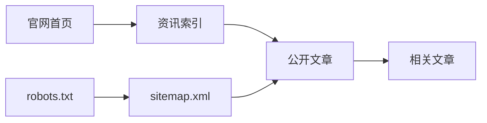

# 公开内容契约

公开内容契约是官网文章为访客、搜索引擎和 AI 检索服务提供的一组稳定页面约定。

## 页面要求

- 稳定 slug 和唯一 canonical URL。
- 独立 title、description、H1、发布日期和直接答案。
- Open Graph 文章元数据。
- Article、FAQPage 和 BreadcrumbList JSON-LD。
- FAQ 结构化数据与页面可见问答一致。
- 返回资讯索引和相关文章的内部链接。
- 窄屏设备保持正文、卡片和链接可读。

## 发现关系

## 关键位置

- 页面：`news/*.html`
- 共享样式：`assets/public-insights.css`
- 索引：`news/index.html`
- 发现：`sitemap.xml`、`robots.txt`
