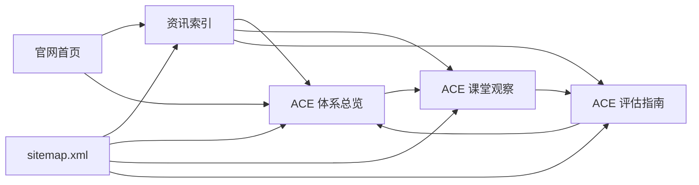

# ACE 官网内容专题

Feature Name: ace-content-hub
Updated: 2026-08-24

## Description

在现有静态官网中新增 ACE 内容专题。专题通过总览、课堂观察和评估指南三篇文章建立由定义到应用再到结果解读的完整内容路径，并通过资讯索引、首页入口和 sitemap 形成可抓取的内部链接网络。

## Architecture

官网继续采用静态 HTML 架构。新增页面复用现有品牌色、导航和正文宽度，并为 ACE 内容增加定义卡片、边界提示、步骤卡片和相关文章区域。

## Components and Interfaces

### 资讯索引

- 路径：`news/index.html`
- 提供 ACE 专题置顶区域和现有公开资讯列表。
- 输出 CollectionPage、ItemList 和 BreadcrumbList JSON-LD。

### ACE 体系总览

- 路径：`news/ace-framework.html`
- 回答“ACE 是什么”“三个维度分别看什么”“ACE 如何使用”等核心问题。
- 以正式执行标准中的 Athletic、Cognitive、Engagement 为唯一公开术语。

### ACE 课堂观察

- 路径：`news/ace-classroom-observation.html`
- 说明课堂观察信号、判断顺序、教学调整和家长反馈结构。
- 将观察描述限定在真实课堂行为与教学安排范围内。

### ACE 评估指南

- 路径：`news/ace-assessment-guide.html`
- 区分基础体测、课堂观察和阶段复评。
- 说明完整评估输出与医疗、康复、心理、教育诊断边界。

### 导航入口

- 首页 `index.html` 在资讯卡片顶部新增三篇 ACE 文章。
- 首页资讯区域的主按钮链接到 `/news/`。
- `sitemap.xml` 新增四个公开 URL，并更新首页最近修改日期。

## Data Models

每篇 ACE 文章的元数据包含：

| 字段 | 用途 |
|------|------|
| headline | 页面标题与 Article 标题 |
| description | 搜索摘要和 Open Graph 摘要 |
| datePublished | 首次发布日期 |
| dateModified | 最近修改日期 |
| canonical | 页面唯一规范 URL |
| faq | 页面可见问答和 FAQPage 实体 |
| relatedArticles | ACE 专题内部链接 |

## Correctness Properties

1. 所有公开 ACE 定义统一为 Athletic、Cognitive、Engagement。
2. 每个 canonical URL、结构化数据 URL 与 sitemap URL 完全一致。
3. FAQPage 中的问答与页面可见问答逐项一致。
4. ACE 文章均包含课堂观察与专业诊断的边界说明。
5. 新增站内链接均对应公开静态文件或站点根路径。

## Error Handling

- 链接校验发现缺失目标文件时，发布流程应阻止交付并修正链接。
- JSON-LD 解析失败时，应修正对应脚本块后重新执行静态检查。
- HTML 语法检查发现未闭合标签时，应在预览前完成修正。
- 权威资料出现术语差异时，公开页面采用正式 ACE 落地执行标准的定义。

## Test Strategy

1. 解析新增 HTML 中的全部 JSON-LD，验证 JSON 格式有效。
2. 检查每页 title、description、canonical、H1、发布日期和 FAQ。
3. 遍历新增页面与首页新增链接，验证本地目标文件存在。
4. 解析 sitemap.xml，验证 XML 格式和四个新增 URL。
5. 启动静态预览服务，访问首页、资讯索引和三篇文章并检查响应状态。
6. 在桌面与窄屏预览中检查卡片布局、正文宽度和导航可用性。

## References

[^1]: `docs/v4/05_教学标准体系/05A_ACE落地执行标准.md` - ACE 正式定义与执行要求。
[^2]: `docs/knowledge/09A_ACE教学理论.md` - 课堂观察与教学调整资料。
[^3]: `docs/knowledge/09F_体测与评估.md` - 体测、课堂观察、阶段评估和沟通边界。
[^4]: `news/curriculum-standard-3.0.html` - 现有官网文章页面模式。
