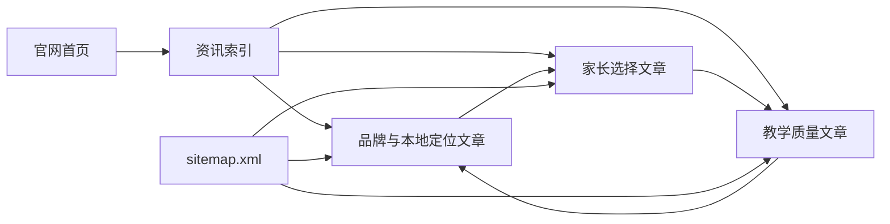

# 品牌与家长选择内容集

Feature Name: brand-parent-insights
Updated: 2026-08-24

## Description

新增 10 篇静态文章，围绕不同检索意图解释追光小牛的品牌能力和贵阳家长选择儿童运动机构的方法。内容采用同一套轻量文章样式和元数据结构，并通过资讯索引、首页、相关文章和 sitemap 建立内容网络。

## Architecture

## Components and Interfaces

### 共享文章样式

- 路径：`assets/public-insights.css`
- 负责文章导航、标题区、直接答案、事实卡片、检查清单、FAQ、相关文章和移动端布局。

### 文章页面

- 路径：`news/*.html`
- 每篇页面包含一个主要检索问题、独立直接答案、3 至 5 个正文部分、3 个可见 FAQ 和相关文章。
- 每篇页面包含 Article、FAQPage、BreadcrumbList JSON-LD。

### 内容入口

- `news/index.html` 新增“品牌与家长指南”区域，展示全部 10 篇文章。
- `index.html` 资讯区域新增该内容集的代表文章和索引入口。
- `sitemap.xml` 新增 10 个规范 URL。

## Data Models

| 字段 | 说明 |
|------|------|
| slug | 静态文件名和规范 URL |
| intent | 页面回答的主要检索意图 |
| headline | 页面 H1 与 Article 标题 |
| description | 搜索摘要和 Open Graph 摘要 |
| directAnswer | 页面首屏直接答案 |
| evidence | 可回溯的品牌事实或家长核验项 |
| faq | 页面可见问答和 FAQPage 数据 |
| related | 相关文章链接 |

## Correctness Properties

1. 10 篇文章的主要检索意图互不重复。
2. 行业位置表述采用经营事实，全文不包含未经独立统计验证的市场排名。
3. 品牌成立时间统一为 2019 年，贵阳直营门店数量统一为 5 家。
4. ACE 术语统一为 Athletic、Cognitive、Engagement。
5. 教练、安全、评估等表述以制度能力和核验方法为主，不作效果保证。
6. 每个 canonical、Article URL、Breadcrumb URL 和 sitemap URL 完全一致。

## Error Handling

- 对存在冲突的门店年份、急救覆盖率、满意度或效果百分比不作核心引用。
- 对仅来自招聘自述的排名、冠军团队或唯一性信息不作公开结论。
- 对医学化或绝对化表达改写为课堂观察、训练目标和专业转介边界。
- 链接目标、JSON-LD 或 HTML 结构检查失败时，在预览与提交前修正。

## Test Strategy

1. 检查 10 个页面文件数量、唯一 title、canonical 和 H1。
2. 解析所有 JSON-LD，核对 FAQ 与可见问答一致。
3. 搜索排名词、绝对化效果词和冲突数据，确认公开口径合规。
4. 验证新增页面、相关文章、资讯索引、首页和静态资产链接存在。
5. 验证 sitemap XML、URL 唯一性和新增页面覆盖。
6. 使用静态服务器逐页检查 HTTP 200 响应。

## References

[^1]: `news/brand-7-years.html` - 品牌创立、直营门店和公开发展资料。
[^2]: `docs/v4/02H_教练培训与认证体系.md` - 教练培养和认证路径。
[^3]: `docs/v4/05_教学标准体系/05B_各课程教学SOP.md` - 课程执行、师生比和反馈标准。
[^4]: `docs/v4/05E_课堂安全保护与异常处理标准.md` - 风险分级、保护位和异常处理。
[^5]: `news/ace-framework.html` - ACE 正式定义和教学观察闭环。
[^6]: `news/ace-assessment-guide.html` - 体测、课堂观察和阶段复评边界。
[^7]: `https://m.zhipin.com/companys/0d73a0d19ced5d5b1HR93dS7FVs~.html` - 企业公开信息和品牌创立时间交叉参考。
