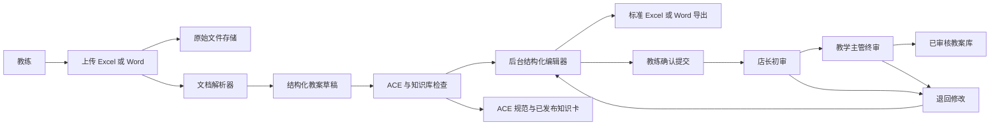
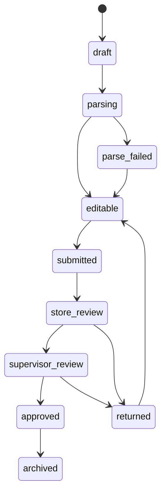

# 教案上传、优化与审核设计

Feature Name: smart-lesson-review
Updated: 2026-09-03

## Description

系统接收教练上传的 Excel 或 Word 教案，保存原始文件并解析为统一的结构化教案。系统依据 ACE 教学框架、教学 SOP、已发布知识卡和现有静态教案库生成优化建议，教练在后台编辑器中完成修改并导出标准文件，随后提交店长初审和教学主管终审。

## Recommended Editing Approach

结构化编辑器是最快的修改方式：

1. 上传文件后自动提取文本、表格和字段。
2. 页面展示“原始资料信息 + 结构化教案 + 优化建议”。
3. 教练直接编辑字段、采纳建议、补充缺项。
4. 系统保存草稿版本并生成标准 Excel/Word 文件。
5. 教练确认导出结果后提交审核。

原始文件继续保留，用于追溯和人工比对。直接在线修改原始 Office 文件需要浏览器 Office 编辑能力、格式兼容处理和并发锁定，实施成本与维护风险更高，作为后续增强方向。

## Architecture

### Status Flow

## Components and Interfaces

### 1. Upload and Metadata Component

- 页面：新增教案提交页，可复用现有后台认证和文件存储能力。
- 必填元数据：门店、姓名、课程线、班级/级别、日期、标题。
- 文件限制：`.xlsx`、`.xls`、`.docx`、`.doc`；大小限制沿用后台统一配置，并在接口层再次校验。
- 安全处理：随机存储名、MIME 与扩展名校验、路径隔离、上传人权限校验。

### 2. Parser Component

- Excel 解析：读取工作簿、Sheet 名、单元格、合并单元格和表格行；支持按 Sheet 名和表头识别基本信息、课程流程、器材、安全和反思。
- Word 解析：读取标题、段落、列表和表格；按标题和字段关键词识别教案区块。
- 解析结果：统一转换为结构化教案 JSON，并保留原始位置引用，例如 Sheet、行列、段落或表格编号。
- 解析失败：生成可编辑空模板，保留原文件并允许手工录入。

### 3. Optimization Component

- 规则检查：必填字段、ACE 三维目标、流程时间、器材、安全、升降阶、助教分工和课后反思。
- 知识检索：读取 `knowledge_items` 已发布内容，优先匹配年龄、课程线、训练项目、课堂阶段、风险等级和关键词。
- 匹配边界：仅使用启用、已发布且存在当前版本的动作、游戏和安全知识卡；建议绑定教案版本，并引用知识卡 ID、编号和标题。
- 匹配输出：课程环节最多返回动作、游戏建议各 2 条，同时根据命中知识卡补充安全、器材和升降阶建议；重复优化复用同版本、同知识卡、同字段和同类型建议。
- 参考资料：生成链路依次使用当前已发布知识卡、`lessons/manifest.json` 登记的静态教案和内置 ACE 默认模板；任一资料源不可用时保持月计划、周计划与单节课结构完整。
- 输出：问题清单、建议文本、推荐知识卡、建议优先级和依据说明。

### 4. Structured Editor

编辑器按 ACE 教案模板分区：

- 基本信息
- A/C/E 目标和主攻维度
- 重点学员关注
- 身体安全与心理安全
- 器材清单
- 热身、技能教学、游戏/竞赛、放松总结
- 动作分层、降阶和助教分工
- 课后 ACE 反思

编辑器提供草稿保存、建议采纳、建议忽略、缺项定位、版本比较和确认提交。

### 5. Review Component

- 教练提交后按门店找到店长，创建店长初审任务。
- 店长通过后创建教学主管终审任务。
- 任一审核人退回时必须填写原因，教练修改后形成新版本并重新进入对应审核阶段。
- 审核页面显示结构化内容、导出文件、原始文件摘要、优化建议处理状态和版本差异。

### 6. Export Component

- Excel 导出：生成标准工作簿，建议分为“基本信息”“课程流程”“安全与器材”“ACE反思”四个 Sheet。
- Word 导出：按现有 ACE 教案模板生成可打印文档。
- 导出内容必须来自当前结构化版本，并记录导出格式、版本号和生成时间。

## Data Models

建议新增以下业务表，具体字段按现有 migration 规范落地：

| Entity | Purpose |
|------|------|
| `lesson_submissions` | 教案主记录、门店、作者、当前状态和当前版本 |
| `lesson_source_files` | 原始 Excel/Word 文件元数据和存储位置 |
| `lesson_versions` | 结构化教案 JSON、版本号、编辑人和提交时间 |
| `lesson_parse_runs` | 解析状态、解析器版本、错误和位置映射 |
| `lesson_suggestions` | 优化建议、规则类型、知识卡引用和处理结果 |
| `lesson_review_tasks` | 店长/教学主管审核任务及处理结果 |
| `lesson_exports` | 导出文件、格式、版本和生成状态 |
| `lesson_audit_logs` | 上传、保存、确认、提交、审核、退回和导出事件 |

核心状态：`draft`、`parsing`、`editable`、`parse_failed`、`submitted`、`store_review`、`supervisor_review`、`returned`、`approved`、`archived`。

## Interfaces

建议按现有 `/api/` 业务域增加接口：

- `POST /api/lesson-submissions/create.php`：创建元数据和上传任务。
- `POST /api/lesson-submissions/upload.php`：上传并保存原始文件。
- `GET /api/lesson-submissions/detail.php?id=...`：读取教案、版本和建议。
- `POST /api/lesson-submissions/parse.php`：执行或重试解析。
- `POST /api/lesson-submissions/draft.php`：保存结构化草稿。
- `POST /api/lesson-submissions/validate.php`：检查当前版本或编辑中内容的 ACE 必填项与确定性规则。
- `POST /api/lesson-submissions/optimize.php`：生成或刷新优化建议。
- `POST /api/lesson-submissions/submit.php`：教练确认并提交审核。
- `GET /api/lesson-reviews/list.php`：读取当前审核人的任务。
- `POST /api/lesson-reviews/decision.php`：通过或退回审核任务。
- `POST /api/lesson-submissions/export.php`：生成 Excel 或 Word 文件。

所有写接口复用 JWT、角色权限、幂等键、状态版本、操作日志和统一错误响应。

## Correctness Properties

1. 每个审核任务必须绑定一个不可变的结构化版本。
2. 店长审核通过后，教案必须进入教学主管审核状态。
3. 教学主管批准的版本必须与最终教案库版本一致。
4. 退回操作必须包含审核意见，并保持原提交版本可追溯。
5. 导出文件必须对应明确的结构化版本。
6. 原始文件、解析结果、建议、编辑版本和审核记录必须通过教案主记录关联。
7. 解析失败必须保留原始文件并提供手工录入路径。

## Error Handling

- 文件格式错误：提示支持的扩展名，记录失败原因。
- 文件损坏或无法解析：保留原文件，状态设为 `parse_failed`，允许手工创建结构化草稿。
- 必填信息缺失：阻止提交并定位缺失字段。
- 建议服务失败：保留已解析草稿，显示规则检查结果，并允许继续人工修改。
- 审核任务冲突：使用状态版本控制，提示页面刷新并重新读取当前任务。
- 导出失败：保留结构化版本，记录错误并允许重试。

## Test Strategy

- Excel 解析测试：单 Sheet、多 Sheet、合并单元格、常见表头、空 Sheet、异常格式。
- Word 解析测试：标题、段落、列表、表格、空文档和混合内容。
- 结构映射测试：解析结果到 ACE 字段的映射、缺项识别和位置引用。
- 建议测试：年龄、课程线、风险等级和知识卡匹配结果。
- 版本测试：保存、比较、提交锁定、退回后新版本和批准版本。
- 审核测试：店长通过、店长退回、主管通过、主管退回、重复提交和并发处理。
- 导出测试：结构化版本导出 Excel/Word 后关键字段一致。
- 权限测试：教练只能处理自己的草稿，店长只能处理对应门店任务，教学主管处理授权范围内任务。

## References

- `追光小牛体系升级/手册/追光小牛_教练教案与教学计划编写规范.md`
- `docs/v4/05_教学标准体系/05B_各课程教学SOP.md`
- `smart-lessons.html`
- `smart-lessons-api.php`
- `api/knowledge/list.php`
- `api/upload.php`
