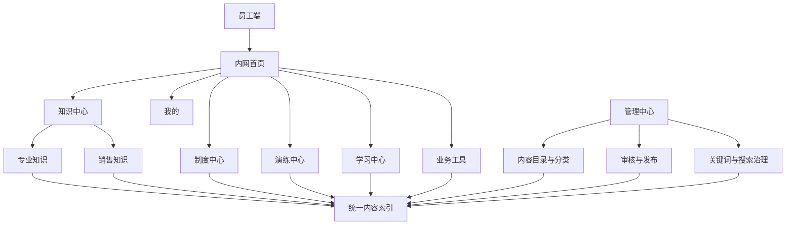

# 内网知识中心升级重构

Feature Name: internal-knowledge-hub-upgrade  
Updated: 2026-09-04

## Description

内网采用“六个一级中心 + 知识双主线”的信息架构。员工端负责清晰展示制度、知识、演练、学习、业务工具和个人空间；管理中心负责统一内容目录、版本、发布、关联和搜索治理。动作库、游戏库、话术、课程、教案和体测说明共享内容索引，并按照员工权限消费已发布版本。本次 1417 张隔离知识卡与入口、分类、搜索、管理能力完成整体验收后统一上线。

## Architecture



员工首页只呈现功能中心及其说明。内容操作入口位于所属中心内部，页面文案保持职责描述型表达。

## Components and Interfaces

### 1. 员工端入口层

- `internal.html`：维护六个一级中心和统一首页说明。
- `internal-auth.js`：提供跨页面一致的内部导航、认证和当前中心标识。
- `/knowledge/`：知识中心规范入口，兼容现有 `/mobile/knowledge.html`。
- `/learning/`：学习中心规范入口，兼容现有 `/mobile/learning.html`。
- `/search.html`：跨中心搜索入口。

### 2. 知识中心

- 专业知识和销售知识作为固定一级分类。
- `KnowledgeListService` 继续提供权限过滤、分页、收藏、最近浏览和学习进度。
- `knowledge_items` 保存统一内容主记录，`knowledge_item_versions` 保存版本。
- 动作、游戏、话术、案例和教案参考通过 `content_type`、`domain_code`、`category_id` 和 `canonical_url` 进入统一目录。

### 3. 管理中心

- 内容目录：创建、导入、分类、标签和关联。
- 发布审核：isolated、draft、reviewing、published、archived。
- 搜索治理：同义词、别名、关键词优先级和无结果词。
- 数据分析：浏览、收藏、学习完成、搜索和内容使用关联。

### 4. 搜索接口

保留 `/api/search/global.php` 作为统一入口，扩展搜索分类和结果契约：

```json
{
  "content_type": "action",
  "title": "动作名称",
  "summary": "内容摘要",
  "center": "知识中心",
  "category": "专业知识",
  "canonical_url": "/knowledge/detail.html?id=1",
  "matched_fields": ["title", "tags"],
  "version_id": 12
}
```

搜索实现采用数据库内容优先、迁移期静态内容索引补充的方式。每个静态来源记录 `source_type`、`source_path` 和 `canonical_url`，便于逐步迁移。

### 5. 兼容入口

现有缺失的中文目录入口补齐为规范跳转页：

- `/知识库/` → `/knowledge/`
- `/新员工学习/` → `/learning/`
- `/knowledge.html` → `/knowledge/`
- `/learning.html` → `/learning/`

跳转页保留查询参数，旧路径持续可用，首页和统一导航使用规范路径。

## Employee Navigation Contract

一级中心固定为：制度中心、知识中心、演练中心、学习中心、业务工具和我的。“我的”作为个人入口展示收藏、最近浏览、学习记录、演练记录和个人任务。

知识中心固定采用两条主线：

- 专业知识：儿童发展、运动与体能、感统、动作与游戏、教学法、ACE、体测与评估、安全、教练成长和教案参考。
- 销售知识：首次接待、需求分析、体测沟通、体验课、家长沟通、异议处理、成交、续费、话术和案例。

动作库、游戏库、体测解读和教案参考属于专业知识，同时可以通过中心内快捷入口访问。

## Data Models

统一内容索引至少包含：

```text
id
center_code
primary_category
content_type
title
summary
body
tags
source_type
source_path
canonical_url
status
publication_status
domain_code
target_roles
target_stages
version_id
updated_at
```

分类约束：

- `center_code`: policy、knowledge、drill、learning、tool、mine。
- `primary_category`: professional、sales，知识中心使用双主线。
- `content_type`: knowledge_card、action、game、script、case、training、lesson、fitness_guidance 等。
- `publication_status`: isolated、draft、reviewing、published、archived。

## Correctness Properties

1. 每个员工端入口拥有一个规范路径和一个所属中心。
2. 员工列表、全局搜索和教案建议只读取已发布版本。
3. 同一内容的列表、详情、搜索和关联结果使用同一个 `version_id`。
4. 专业知识和销售知识覆盖所有已发布知识卡，并保留原始内容类型。
5. 旧路径跳转后保留原查询参数和目标业务语义。
6. 搜索结果中的规范路径可以在路由清单或静态文件中验证。
7. 管理员下线内容后，员工发现入口同步移除，历史记录保持可追溯。

## Error Handling

- 分类缺失：管理中心提示待补字段并保持 isolated。
- 内容未发布：员工端返回空结果或明确的不可用状态。
- 搜索分类异常：保留其他分类结果，并记录异常分类。
- 规范路径缺失：搜索结果返回所属中心恢复入口。
- 静态来源暂不可用：显示数据库已发布内容并记录来源错误。

## Test Strategy

- 入口契约测试：验证六个中心、规范路径、旧路径跳转和统一导航。
- 内容分类测试：验证专业/销售双主线和动作、游戏、话术、教案类型映射。
- 发布边界测试：验证 isolated、draft、published、archived 的员工可见性。
- 搜索契约测试：验证分类覆盖、同义词、结果字段、规范路径和无结果词记录。
- 数据关联测试：验证知识卡与动作、演练、培训、教案的版本关联。
- 页面预览测试：验证首页、知识中心、学习中心、搜索页及关键静态资源返回 200。

## Audit-First Implementation Order

统一上线前先完成审计发现的基础链路修复。P0 修复项包括制度可见性、知识卡版本发布、当前版本归属约束、教案版本关联、小程序页面注册和云代理路由；P1 项目包括统一搜索索引、文档注册表、规范入口、学习副作用接口和统一认证；P2 项目包括 PWA 缓存、离线状态、凭证存储和静态清单治理。完整审计记录位于 `audit.md`。

## Rollout Plan

1. 修复审计 P0 项，确保员工可见性、版本、数据库约束和小程序联动正确。
2. 修复审计 P1 项，建立规范入口、统一搜索索引和学习接口契约。
3. 完成审计 P2 项，统一 PWA、离线状态、缓存和静态来源治理。
4. 修复规范入口和首页导航，建立六中心目录。
5. 建立统一内容索引和专业/销售分类映射。
6. 将动作、游戏和静态专题内容纳入迁移索引。
7. 扩展全局搜索并补齐搜索结果规范路径。
8. 在管理中心开放分类、发布、关联、关键词和数据分析。
9. 完成 1417 张隔离知识卡的分类、字段补全、关联和审核。
10. 在预发布环境完成页面、接口、权限、搜索、内容数量和关联链路验收。
11. 通过统一发布门禁后，一次性切换员工端入口、知识卡和搜索索引。
12. 上线后根据搜索无结果词和员工使用数据调整分类与排序，调整内容通过新版本发布。

## Unified Release Gates

- 所有一级入口可访问，并指向唯一规范路径。
- 专业知识和销售知识分类覆盖全部待上线内容。
- 1417 张知识卡完成必填字段、关键词、来源、版本和发布状态检查。
- 动作、游戏、体测解读、教案参考均可从专业知识和全局搜索访问。
- 制度、知识、演练、学习、业务工具和我的入口在员工端职责清晰。
- 管理中心可以查询、审核、发布、下线和追踪内容版本。
- 全局搜索结果字段完整，结果路径可访问，重点业务关键词有命中结果。
- 员工权限、管理员权限和未发布内容边界测试全部通过。
- 预发布环境页面、接口和关键静态资源验收通过。

## References

- `internal.html`：员工内网首页。
- `internal-auth.js`：内部认证和跨页面导航。
- `mobile/knowledge.html`：当前员工知识库页面。
- `api/knowledge/KnowledgeListService.php`：知识卡列表服务。
- `api/search/search-service.php`：全局搜索服务。
- `action-library/index.html`：当前静态动作和游戏库。
- `training-center/index.html`：当前培训资料中心。
