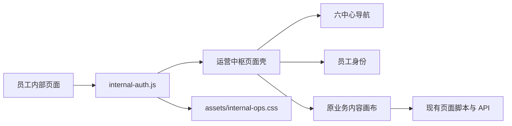

# 员工内网企业运营中枢视觉系统

Feature Name: intranet-operations-design-system  
Updated: 2026-09-04

## Description

全站视觉系统通过 `internal-auth.js` 加载独立的 `assets/internal-ops.css`，以低侵入方式为员工页面增加方案 D 页面壳。页面壳统一导航、身份与当前中心，业务页面保留原有 DOM、接口和事件处理。内网首页使用真实工作台结构承载中心入口、任务与工具。

## Architecture



## Components and Interfaces

### 共享设计令牌

- 石墨：`#202124`
- 暖白画布：`#f4f0e8`
- 面板白：`#fbf9f5`
- 信号橙：`#e85d2a`
- 边框：`#c9c1b7`
- 成功：`#198038`
- 风险：`#b42318`

### 页面壳

- `internal-auth.js` 创建唯一 `#mcOpsShell`。
- `.mc-persistent-staff-nav` 保留既有导航合同。
- 桌面端页面壳宽度为 218 像素。
- 移动端页面壳转为顶部横向导航。
- 当前中心同时输出 `.current` 与 `aria-current="page"`。
- 身份区复用认证结果中的姓名、角色和门店字段。

### 首页工作台

- 工作台内容区包含问候、指标、今日任务、门店动态、六中心入口和业务工具。
- 登录表单和账号状态保留现有元素 ID 与函数接口。
- 全局搜索保留 `globalSearchInput` 与 `doGlobalSearch()`。
- 管理入口保留 `adminLink` 权限显示逻辑。

## Data Models

视觉升级不新增服务端数据模型。页面壳只消费当前认证结果：

```text
staff_name | display_name | nickname | username
role
store_name
is_admin | is_hq
```

## Correctness Properties

1. 每个内部页面最多存在一个 `#mcOpsShell`。
2. 六大中心及内网首页中最多存在一个当前导航项。
3. 页面壳加载不会替换业务内容节点。
4. 移动端既有 `.mobile-shell-nav` 节点保持存在。
5. 无本地存储能力时页面壳仍可加载。

## Error Handling

- `document.body` 尚未创建时，页面壳在 `DOMContentLoaded` 后初始化。
- 共享样式加载失败时，浏览器继续呈现页面原有样式。
- 身份字段缺失时，身份区显示“员工账号”和“内网成员”。
- URL hash 变化时重新计算导航当前态。

## Test Strategy

- 契约测试验证共享样式注入、唯一页面壳、六中心路径、当前态和身份区。
- 既有入口、移动端壳、知识中心、学习中心和认证测试验证业务合同。
- JavaScript 语法和 `git diff --check` 验证静态质量。
- 本地预览验证首页、六中心入口和静态资源 HTTP 200。
