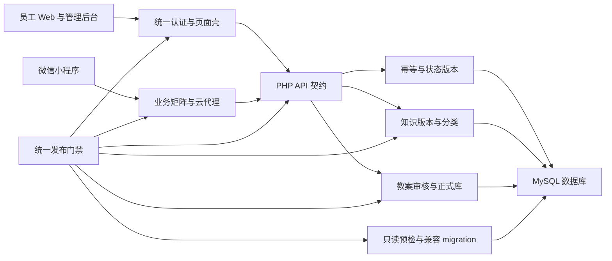

# 全面上线修复技术设计

Feature Name: release-readiness-remediation  
Updated: 2026-09-04

## Description

本设计以统一发布门禁为终点，把修复分成契约基线、认证壳、API 响应与幂等、migration 安全、知识治理、教案发布、小程序同步、页面覆盖和集成放行九个批次。每个批次先建立可失败的契约测试，再完成最小代码修复，并通过批次检查点后进入下一批。

## Architecture



## Repair Sequence

| 批次 | 目标 | 依赖 | 独立回滚点 |
|------|------|------|------------|
| R0 | 固定契约基线与门禁输出 | 无 | 测试和门禁脚本变更 |
| R1 | 认证身份、权限导航和资源版本统一 | R0 | `internal-auth.js`、共享样式及页面引用 |
| R2 | API 成功响应和副作用幂等 | R0 | API 端点、幂等组件及新增表 |
| R3 | migration dry-run 与兼容性校验 | R0 | runner、validator 和 migration contract |
| R4 | 知识分类、当前版本与关联可见性 | R2、R3 | taxonomy、查询服务及分类映射数据 |
| R5 | 教案批准版本与正式教案库 | R1、R2、R3、R4 | 教案发布服务、库接口及路由 |
| R6 | 小程序方法、矩阵和代理同步 | R2 | 客户端、两份矩阵和代理白名单 |
| R7 | 活跃内网页面认证覆盖 | R1 | 页面清单、认证引用和受控路由 |
| R8 | 集成证据与统一放行 | R1-R7 | 门禁聚合逻辑和证据清单 |

## Components and Interfaces

### 1. Release Contract Registry

- 扩展 `scripts/unified_release_gate.mjs`，将页面文案检查、数据库集成和浏览器集成拆成独立命名检查。
- 新增机器可读 release evidence 输入，记录代码版本、数据库 migration 集合、测试时间、角色流和静态资源版本。
- 门禁根据被验证文件的摘要判断证据是否仍适用。
- 门禁同时报告仓库隔离包状态和集成环境数据库状态。

### 2. Unified Authentication Shell

- `requirePageAuth()` 成功后始终把 `result.user` 交给统一页面壳。
- `__SKIP_AUTO_INTERNAL_AUTH__` 只控制自动调用时机，手动认证页面继续执行身份和导航渲染。
- 共享身份适配器按 `staff_name`、`display_name`、`nickname`、`username` 顺序生成显示名。
- 权限导航由单一函数根据服务端用户能力字段生成；页面保留业务级按钮的服务端权限校验。
- 活跃内部页面清单成为认证覆盖和资源版本检查的数据源。

### 3. API Response Contract

- `jsonSuccess()` 作为旧式 PHP API 的成功出口。
- 平台 API 继续使用 `platformApiResponse()`，两类接口共享 HTTP 状态和业务码语义。
- `api/admin/knowledge/index.php` 的读取与写入成功分支返回业务码 `0`。
- 契约测试直接启动端点级 PHP harness，断言 HTTP 状态、业务码和响应结构。

### 4. Idempotency Service

- 复用平台 request context，增加统一的幂等执行器。
- 幂等记录以 actor、operation、business scope 和 key hash 建立唯一约束。
- request fingerprint 保存规范化请求摘要，response snapshot 保存首次完成响应。
- 状态采用 `processing`、`completed`、`failed`；并发请求通过唯一键和行锁收敛。
- 积分兑换、考试提交、教案创建和教案导出接入统一执行器。
- 每日签到使用用户与业务日期唯一约束作为最终数据库保护。

建议的数据结构：

```text
platform_idempotency_records
id
actor_type
actor_id
operation
business_scope
idempotency_key_hash
request_fingerprint
status
http_status
response_json
created_at
completed_at
expires_at
UNIQUE actor operation business_scope idempotency_key_hash
```

### 5. Migration Safety

- `MigrationRunner::apply(true)` 通过 `information_schema` 读取历史表存在性和当前快照。
- dry-run 路径跳过 `ensureHistoryTable()`、写入 migration 状态及所有业务 SQL。
- `ExpandMigrateContractValidator` 对 `MODIFY COLUMN`、数据写入、状态回填和大表变更生成结构化 issue。
- migration catalog 为每个相关版本声明兼容窗口、写适配器、数据回填策略、锁风险和回滚或 forward-fix。
- 临时 MySQL 验证依次执行 baseline、dry-run 快照比较、apply、verify、二次 apply 和关键数据断言。

### 6. Knowledge Visibility and Taxonomy

- 提取统一知识可见性 SQL 构造器，列表、详情、相关内容、搜索和教案匹配共同使用。
- 可见性要求主记录启用、发布，当前版本属于同一知识卡且状态为 `active`。
- 建立版本化 domain-to-taxonomy mapping，覆盖导入包的八个 domain code 与员工端分类。
- 1417 张知识卡先生成分类差异报告，再进入管理审核；发布动作保存分类版本和审核记录。
- release gate 分别验证记录数、过渡分类数、未映射数、current version 完整性和员工可见数量。

建议的数据结构：

```text
knowledge_taxonomy_mappings
mapping_version
source_domain_code
primary_category
subcategory_code
status
created_at
UNIQUE mapping_version source_domain_code
```

### 7. Approved Lesson Library

- 新增教案发布服务，在教学主管批准事务中固定 `approved_version_id` 并写入正式库可见状态。
- 正式教案列表和详情只读取 `approved` 主记录及其 `approved_version_id`。
- `lesson-library.html` 指向规范教案库入口，批准版本拥有稳定 canonical route。
- 归档保留主记录、批准版本、审核任务、导出与审计引用，同时退出活跃发现。
- 教案作者展示使用共享身份适配器；服务端 ownership 持续使用认证 staff ID。

### 8. Mini-Program Contract Synchronization

- 会话刷新统一为 PHP 端点实际支持的 HTTP 方法，客户端和两份业务矩阵同步更新。
- endpoint normalization 使用 method、path 和排序后的 action query 形成唯一键。
- 合同测试扫描小程序 API 调用，并与源矩阵、部署矩阵和代理 allowlist 比较。
- 重复 endpoint 作为门禁错误输出，`/todos/my.php` 保留单一登记。

### 9. Protected Page Inventory

- 建立活跃页、归档页和公开页三类页面清单。
- `training-cards/workspace/`、`lessons/` 和 `mobile/workload-v2.html` 逐页确认所属类型。
- 活跃内部页加载统一认证壳；归档内容通过所属中心的认证容器访问。
- 所有活跃页引用同一 `internal-auth.js` 和 `internal-ops.css` release identifier。
- 契约测试验证认证壳、规范返回入口、唯一页面壳和资源版本。

## Audit Traceability

| 审计项 | 修复主题 | Requirements | 批次 |
|--------|----------|--------------|------|
| 263 | 统一发布门禁失败 | 10.1-10.5 | R0、R8 |
| 264 | 手动认证页面身份和导航刷新 | 2.1-2.5 | R1 |
| 265 | 知识管理成功响应 HTTP 状态 | 3.1-3.4 | R2 |
| 266 | 关键副作用数据库级幂等 | 4.1-4.5 | R2 |
| 267 | 批准教案进入正式教案库 | 7.1-7.5 | R5 |
| 268 | migration dry-run 写入历史表 | 5.1、5.2 | R3 |
| 269 | migration 兼容性规则缺口 | 5.3-5.5 | R3 |
| 270 | 1417 张知识卡过渡分类和隔离状态 | 6.4-6.6 | R4 |
| 271 | 相关知识 current active 版本约束 | 6.1、6.2 | R4 |
| 272 | 小程序会话刷新方法分歧 | 8.1、8.2 | R6 |
| 273 | 内网页面认证壳覆盖缺口 | 9.1、9.2、9.5 | R7 |
| 274 | 教案作者显示字段分歧 | 7.4 | R1、R5 |
| 275 | 导入 domain code 与 taxonomy 分歧 | 6.3-6.5 | R4 |
| 276 | 小程序业务矩阵重复 endpoint | 8.2-8.4 | R6 |
| 277 | 统一认证脚本缓存版本分歧 | 9.3、9.4 | R1、R7 |

## Data Migration Strategy

1. 先创建幂等记录表、签到唯一业务键和 taxonomy mapping 表，保持现有读取路径。
2. 回填知识分类映射和教案正式库状态，输出影响行数与异常清单。
3. 双读验证新旧结果数量和版本 ID，应用代码切换到新查询。
4. 保留旧字段和旧入口一个兼容窗口，门禁持续比较结果。
5. 兼容窗口结束后通过独立 contract migration 收口旧结构。

每个 migration 包含基线条件、预计影响行数、锁风险、批处理策略、失败恢复和 forward-fix。生产 apply 需要独立授权和备份标识。

## Correctness Properties

1. 认证成功后页面壳显示的身份来源于本次认证结果。
2. 同一用户权限集合在首页、中心页和管理页生成同一导航集合。
3. 成功 API 响应同时满足 HTTP 2xx 和业务码 `0`。
4. 同一幂等作用域内的重复请求最多产生一个已提交业务结果。
5. dry-run 前后的 schema 摘要和业务表行摘要相等。
6. 每个员工可见知识条目拥有一个属于自身的 current active 版本。
7. 列表、详情、搜索、相关内容和教案建议对同一知识条目返回同一版本 ID。
8. 正式教案库版本等于教学主管批准任务绑定的版本。
9. 两份小程序业务矩阵的 normalized endpoint 集合相等且集合内元素唯一。
10. 每个活跃内部页面加载统一认证壳和同一静态资源发布号。
11. `ready_for_release=true` 蕴含全部必需检查通过且集成证据匹配当前变更摘要。

## Error Handling

- 身份字段缺失：页面显示稳定账号标识，记录缺失字段并保留服务端 staff ownership。
- 幂等处理中：返回可重试状态和原 request ID；完成状态直接重放快照。
- 幂等指纹冲突：返回 HTTP 409 和稳定错误码。
- dry-run 历史表缺失：报告 `history_table_absent` 并继续只读分析。
- migration 风险声明缺失：兼容性门禁返回具体版本、SQL 类型和缺失声明。
- taxonomy 映射缺失：知识卡保持审核状态并输出 source domain code。
- 批准教案发布失败：审核事务整体回滚，审核任务保持可处理状态。
- 矩阵差异：输出 source、deployed、proxy 三方差集和重复键。
- 页面清单分类缺失：页面覆盖门禁返回文件路径并阻断放行。

## Test Strategy

- 契约测试：身份回填、角色导航、HTTP 状态、业务码、端点矩阵和资源版本。
- 单元测试：显示名适配、endpoint normalization、request fingerprint、taxonomy mapping 和 migration SQL 分类。
- 属性测试：幂等重复序列、知识版本一致性、矩阵集合一致性和 dry-run 零变化。
- 数据库集成测试：临时 MySQL 执行 migration baseline、dry-run、apply、verify、replay 和并发唯一约束。
- API 集成测试：积分兑换、签到、考试提交、教案创建、导出和知识管理成功/冲突路径。
- 自动化浏览器测试：普通员工、店长、教学主管与总部管理员的登录恢复、身份、权限入口和核心页面流程。
- 教案端到端测试：创建、上传、解析、编辑、建议、提交、两级审核、正式库展示和归档。
- 知识端到端测试：分类、审核、发布、列表、搜索、详情、相关内容和下架。
- 小程序契约测试：refresh 方法、业务矩阵、代理 allowlist 和客户端调用一致性。

## Rollback Strategy

- R1 页面壳：恢复上一静态资源发布号和页面引用，保留认证 API。
- R2 API 与幂等：通过 feature flag 切回旧处理器；幂等表保留审计数据。
- R3 migration 工具：恢复 runner 和 validator；已执行 schema 采用对应 forward-fix。
- R4 知识治理：恢复上一 mapping version 和查询 feature flag；已发布版本通过下架流程收口。
- R5 教案正式库：关闭正式库发现开关，保留批准版本和审核记录。
- R6 小程序：恢复上一矩阵版本、代理配置和客户端 transport 配置。
- R7 页面覆盖：恢复上一页面资源引用和活跃页清单。
- R8 门禁：保留上一稳定门禁脚本作为对照，正式放行继续要求当前门禁通过。

## Release Gates

- 静态语法、相关契约测试和 `git diff --check` 全部通过。
- P0 对应单元、属性和集成测试全部通过。
- migration dry-run 快照差异为零，apply、verify 和 replay 通过。
- 1417 张知识卡分类、版本和发布状态报告通过审批口径。
- 四类角色自动化浏览器流程通过。
- 教案批准版本在正式教案库可检索并可追溯。
- 小程序客户端、两份矩阵、代理和 PHP 路由集合一致。
- 统一发布门禁输出 `ready_for_release=true`。

## References

- `服务器现网全面审计与API专项问题清单_2026-05-15.md` 第 263 至 277 项。
- `.monkeycode/specs/2026-09-04-internal-knowledge-hub-upgrade/requirements.md`
- `.monkeycode/specs/2026-09-04-internal-knowledge-hub-upgrade/design.md`
- `.monkeycode/specs/2026-09-04-intranet-operations-design-system/requirements.md`
- `.monkeycode/specs/2026-09-04-intranet-operations-design-system/design.md`
- `.monkeycode/specs/2026-09-03-smart-lesson-review/requirements.md`
- `.monkeycode/specs/2026-09-03-smart-lesson-review/design.md`
