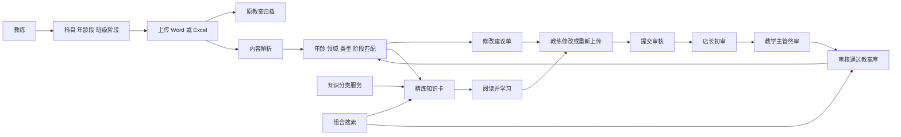

# 教练教案精进与知识中心一体化设计

Feature Name: coach-growth-lesson-knowledge
Updated: 2026-09-05

## Description

本设计把教案工作台和知识中心做成一个连续工作流。教练上传教案后，系统先识别教案上下文，再给出基于知识卡的可解释建议；教练阅读精炼知识卡并处理建议，完成修改后重新上传；审核通过后，教案和所使用的知识卡关系一起沉淀。

第一阶段采用“原教案 + 修改建议单 + 修改后教案”的形式。这个形式可以适应多科目、多种原有表格和不同课程结构。第二阶段根据第一阶段积累的数据，抽取通用字段并建设科目模板。

## Architecture

## User Experience

### 1. 教练上传工作台

页面分成四个连续区域：

1. **课程信息**：科目、年龄段、班级阶段、课程目标、日期和标题。
2. **文件上传**：上传 Word 或 Excel，显示文件名、上传进度、解析状态和错误恢复入口。
3. **教案反馈**：按课程环节列出问题和建议，每条建议显示原内容、原因、建议、知识卡和处理按钮。
4. **知识学习侧栏**：显示与当前环节最相关的 3-5 张精炼卡片，卡片包含概念、应用、注意点和适用年龄；点击后在侧栏或详情页阅读。

教练可以在页面内处理建议，也可以下载《教案修改建议单》。建议单不改写原始文件，避免破坏科目原有格式。教练完成原教案修改后重新上传，系统将新文件与原教案和建议处理记录关联。

### 2. 修改建议单

建议单使用稳定结构，不依赖统一教案模板：

| 字段 | 内容 |
|---|---|
| 环节位置 | 原文件 Sheet、表格行、段落或系统识别的课程环节 |
| 当前内容 | 原教案中的相关文字或结构化摘要 |
| 发现的问题 | 缺项、年龄不匹配、动作难度、游戏适配、安全或时间问题 |
| 修改建议 | 教练可直接执行的调整方式 |
| 知识卡依据 | 卡片标题、类型、年龄、来源和详情链接 |
| 教练处理 | 采纳、忽略、待处理 |
| 修改后内容 | 教练填写的最终修改说明 |

建议单可导出为 Word；Excel 来源也可以附加一个“修改建议”Sheet，原始 Sheet 保持不变。

### 3. 知识中心

知识中心的专业板块展示所有已发布专业内容，并按以下分类组织：

- 儿童发展
- 运动与体能
- 感统
- 动作与游戏
- 教学法
- 体测与评估
- 安全与急救
- 教练成长
- 教案参考

动作卡和游戏卡保留独立的 `content_type`，同时归入“动作与游戏”；感统课程相关卡归入“感统”；体测解读归入“体测与评估”；安全卡归入“安全与急救”。知识卡详情固定展示“概念、应用、注意点、适配年龄”，并展示关联动作、游戏、教案和安全卡。

现有知识卡经过批量字段检查和分类映射后直接设为员工可见。系统记录分类结果和来源，方便后续修订；本轮流程不创建知识卡审核待办。

## Presentation and Delivery Contract

### Knowledge Card Format

知识卡在列表、教案反馈侧栏和详情页使用同一套字段顺序。卡片结构固定为：

1. 标题和一句话摘要。
2. 专业分类、内容类型、适配年龄和班级阶段。
3. **概念**：这项知识解决什么教学问题。
4. **应用**：教练在课堂中如何使用，优先使用步骤或短句。
5. **注意点**：安全、难度、儿童差异和使用边界。
6. 关联动作卡、游戏卡、感统知识卡、教案参考和安全卡。
7. 来源、版本和“查看详情”入口。

列表卡只展示标题、摘要、分类、类型、年龄和匹配原因；完整内容在详情页或侧栏展开。每张卡只能有一个主分类，同时保留内容类型，避免“游戏卡被显示成普通知识”的理解错误。年龄字段使用统一格式，例如“3-4 岁”；未知年龄统一显示“全年龄段，需教练现场评估”。

### Modification Suggestion Document Format

修改建议单是第一阶段的正式交付物，采用固定结构：

**封面和说明**

- 文档名称：`教案修改建议单`。
- 教案标题、科目、年龄段、班级阶段、教练、上传时间和建议生成时间。
- 使用说明：建议单用于辅助修改，原教案内容保持不变。
- 建议总数、待处理数、已采纳数和已忽略数。

**建议记录**

每条建议使用一个编号和一个完整区块，字段顺序固定为：

| 顺序 | 字段 | 展示要求 |
|---|---|---|
| 1 | 教案位置 | 标明 Sheet、行列、段落或课程环节 |
| 2 | 当前内容 | 保留原文摘要，超长内容折叠或分页 |
| 3 | 发现的问题 | 使用明确短句，说明缺项或风险 |
| 4 | 判断理由 | 说明年龄、科目、阶段或教学标准依据 |
| 5 | 修改建议 | 给出可执行的动作、游戏、时间或安全调整 |
| 6 | 知识卡依据 | 显示卡片标题、类型、适配年龄和详情入口 |
| 7 | 教练处理 | 采纳、忽略、待处理三选一 |
| 8 | 修改后内容 | 为教练预留填写区域 |

**结尾检查表**

- 课程信息是否完整。
- 年龄和班级阶段是否匹配。
- 动作和游戏是否适合本节课。
- 安全、器材和时间是否完整。
- 教练是否处理所有建议。
- 是否已重新上传修改后的教案。

**导出规则**

- Word 导出使用标题层级、编号建议、固定字段表格和建议之间的分页控制。
- Excel 导出保留原始 Sheet，在末尾新增独立的“修改建议”Sheet；建议 Sheet 固定列顺序与上表一致，启用自动换行、冻结首行、筛选和适当列宽。
- 页面和文件均使用统一的状态名称：待处理、已采纳、已忽略。
- 颜色只用于状态识别，正文保持高对比度；所有颜色信息同时提供文字状态，保证打印和无障碍阅读。
- 导出文件记录教案版本、建议生成时间、导出格式和生成记录，文件名包含教案标题、版本号和日期。

### Feedback Workspace Layout

桌面端使用“左侧原始资料、中间修改建议、右侧知识卡”的三栏结构；窄屏使用“原始资料 -> 修改建议 -> 知识卡”的纵向顺序。建议处理按钮固定显示在每条建议的底部，知识卡详情使用展开面板或独立详情页，避免长文本挤压建议内容。

## Combination Search

### Query Understanding

搜索服务将输入拆成多个条件：

| 条件 | 示例 | 匹配字段 |
|---|---|---|
| 年龄 | `3-4岁`、`3至4岁`、`幼儿` | `target_age_min`、`target_age_max`、年龄标签 |
| 内容类型 | `游戏`、`动作`、`安全` | `content_type` |
| 专业领域 | `感统`、`体能`、`体测` | `domain_code`、分类编码 |
| 班级阶段 | `初级`、`中级`、`高级` | `target_stages` |
| 关键词 | `平衡`、`跳跃`、`接力` | 标题、摘要、正文、标签 |

例如 `3-4岁游戏` 会产生“年龄 3-4 岁 + 内容类型 game”的组合条件；`感统体操动作` 会产生“感统领域 + 动作类型 + 体操关键词”的组合条件。排序优先级为精确组合命中、年龄命中且类型命中、类型命中、领域命中、关键词命中。

### Result Presentation

每个结果显示标题、卡片类型、专业分类、适配年龄、班级阶段、匹配原因和详情路径。结果页提供相关内容区域：同一年龄段的动作卡、游戏卡、安全卡、感统知识卡和教案参考。没有精确组合结果时，系统继续展示最接近的结果，并说明放宽了年龄、类型或领域中的哪一项。

## Data Model

优先复用现有教案和知识卡表，仅补充组合匹配所需的治理字段：

| Entity | Key fields | Purpose |
|---|---|---|
| `lesson_submissions` | subject, age range, class stage, current version | 教案主记录和上下文 |
| `lesson_source_files` | original file, type, storage path | 保存原始文件 |
| `lesson_versions` | structured data, source version, status | 保存修改后版本 |
| `lesson_suggestions` | issue, recommendation, card id, decision | 保存反馈和教练处理结果 |
| `knowledge_items` | center, category, content type, age, stage, status | 统一知识内容索引 |
| `knowledge_item_versions` | version, concept, application, attention points | 保存知识卡内容版本 |
| `lesson_knowledge_matches` | lesson version, card id, match dimensions, score | 记录教案与知识卡匹配依据 |
| `lesson_feedback_exports` | lesson version, format, file path | 保存修改建议单导出记录 |

知识卡发布策略：已有知识卡以已审核内容进入 `published`，分类结果直接决定专业板块归属；后续新增或修改知识卡再沿用管理审核流程。

格式相关字段建议：

- 知识卡版本保存 `concept`、`application`、`attention_points` 和 `age_label`。
- 建议记录保存 `display_order`、`source_location`、`issue_summary`、`reason`、`recommendation`、`card_snapshot` 和 `decision`。
- 导出记录保存 `format_version`，保证未来调整格式后仍能还原历史建议单。

## Interfaces

- `POST /api/lesson-submissions/create.php`：提交课程上下文并创建教案记录。
- `POST /api/lesson-submissions/upload.php`：保存原始 Word 或 Excel 文件。
- `POST /api/lesson-submissions/feedback.php`：解析教案并生成修改建议。
- `GET /api/lesson-submissions/detail.php?id=...`：读取原稿、建议、知识卡和版本。
- `POST /api/lesson-submissions/suggestion-decision.php`：保存采纳、忽略或待处理结果。
- `GET /api/lesson-submissions/feedback-export.php?id=...`：下载修改建议单。
- `POST /api/lesson-submissions/resubmit.php`：上传教练修改后的教案。
- `POST /api/lesson-submissions/submit.php`：提交审核。
- `GET /api/knowledge/search.php`：执行年龄、类型、领域、阶段和关键词组合搜索。
- `GET /api/knowledge/detail.php?id=...`：读取知识卡及关联内容。

所有写接口复用现有认证、角色权限、幂等键、状态版本和审计机制。

## Core Correctness Properties

1. 原始教案内容保持可下载、可追溯，系统反馈不会覆盖原文件。
2. 每条建议绑定一个教案版本和一个明确的知识卡来源或规则来源。
3. 教练重新上传的修改稿与原教案、建议单和审核记录保持关联。
4. 审核任务绑定不可变的提交版本，审核中的版本保持锁定。
5. 已有知识卡完成分类字段检查后都能从专业知识板块、详情页和搜索进入。
6. `3-4岁游戏` 等组合搜索同时使用年龄和内容类型条件。
7. 搜索结果、知识卡详情和教案建议使用同一知识卡版本。
8. 审核通过的教案版本与教案库展示版本一致。

## Error Handling

- 文件无法解析：保留原文件，生成可下载的错误说明，并开放手工反馈入口。
- 知识卡匹配失败：保留规则检查结果，展示同领域通用卡片，并允许教练继续修改。
- 精确组合无结果：展示最近匹配结果和放宽条件说明。
- 建议导出失败：保留线上建议内容，允许再次生成文件。
- 审核冲突：提示当前版本已变化，重新加载任务后再操作。
- 体测、招聘或教案接口失败：展示具体恢复动作并保留可恢复表单数据。

## Rollout Plan

1. 先核验体测评估、招聘、教案上传和教案审核现有链路。
2. 上线课程上下文字段和教练上传工作台。
3. 上线修改建议单、知识卡侧栏和教练处理记录。
4. 完成现有知识卡分类、年龄字段补全和专业板块全量展示。
5. 上线组合搜索，并用“3-4岁游戏”“感统体操动作”等真实查询验收。
6. 根据真实教案积累通用字段，再规划第二阶段科目模板。

## Test Strategy

- 上传测试：课程上下文、Word/Excel、失败恢复和原文件留存。
- 反馈测试：动作、游戏、感统、安全和年龄匹配建议。
- 工作流测试：教练处理建议、重新上传、店长审核、主管审核和退回。
- 知识展示测试：专业分类、知识卡字段、关联内容和全量可见性。
- 搜索测试：年龄表达、类型表达、组合条件、同义词、无精确结果和排序。
- 格式测试：知识卡字段顺序、长文本换行、未知年龄提示、Word 分页、Excel 独立建议 Sheet、状态文字和导出文件名。
- 后台验收：体测评估、招聘、教案上传和教案审核的页面、接口、权限和错误恢复。
- 回归测试：运行完整 Node 测试套件、PHP/JavaScript 语法检查和预览页面检查。

## References

- `.monkeycode/specs/2026-09-03-smart-lesson-review/requirements.md`
- `.monkeycode/specs/2026-09-03-smart-lesson-review/design.md`
- `.monkeycode/specs/2026-09-04-internal-knowledge-hub-upgrade/requirements.md`
- `.monkeycode/specs/2026-09-04-internal-knowledge-hub-upgrade/design.md`
- `database/knowledge_taxonomy_mapping.v1.json`
- `api/search/search-service.php`
- `lesson-submission.html`
- `lesson-review.html`
- `knowledge.html`
