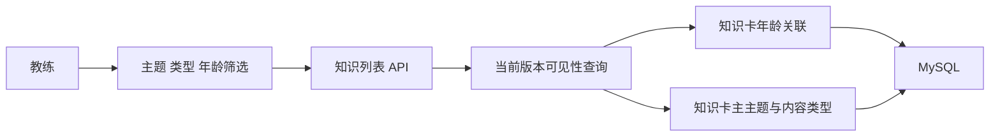

# 知识中心精准分类与适龄检索技术设计

Feature Name: knowledge-taxonomy-precision
Updated: 2026-09-06

## Description

本设计将知识中心的分类拆分为内容类型、专业主题和适配年龄三个独立维度。系统以内容类型支持“游戏”和“动作”的直接查找，以主专业主题解释卡片的教学目的，以多值年龄关联支持跨年龄卡片在每个覆盖年龄段中被检索。

## Architecture



旧的 `age_group` 原始文本和 `domain_code` 保留作为来源证据。标准化字段用于员工筛选，审核状态用于控制未经确认的推断结果。

## Components and Interfaces

### 1. Taxonomy Source

更新 `database/knowledge_taxonomy_mapping.v1.json`：

- 将 `action_game` 拆为 `action` 和 `game` 两个专业子分类。
- 保留内容类型与专业主题的独立映射。
- 增加年龄代码、显示名称和排序。

### 2. Age Normalization

新增版本化 migration 和标准化服务：

- 年龄关联表保存 `knowledge_item_id`、`knowledge_version_id`、`age_code`、`source_text`、`confidence` 和 `review_status`。
- 年龄范围按区间覆盖规则拆成标准年龄代码。
- `原文未说明`、教案说明文本和低置信度推断进入待审核状态。
- 原始 `age_group` 字段保持不变，支持回溯和重新计算。

### 3. Classification Review

新增只读审计报告和管理端复核数据：

- 报告每张卡的内容类型、主主题、年龄标准化结果、来源文本和置信度。
- 管理员确认后写入标准化结果和审核记录。
- 已发布卡片修改分类时创建新映射版本或分类审计记录。

### 4. Employee API

`GET /api/knowledge/list.php` 支持：

- `primary_category`
- `subcategory_code`
- `content_type`
- `age_code`
- 现有关键词、收藏、最近浏览和分页参数

接口返回 `age_codes`、`age_labels`、`content_type`、`primary_category`、`subcategory_code` 和 `classification_review_status`。

当 `content_type=game` 且 `age_code=age_3_4` 时，查询必须同时满足游戏类型和年龄关联命中。

### 5. Employee UI

知识中心展示三个并列筛选维度：

- 专业主题：儿童发展、运动与体能、感统、动作、游戏、教学法、体测与评估、安全、教练成长、教案参考。
- 内容类型：知识卡、动作、游戏、话术、案例、教案参考。
- 适配年龄：标准年龄代码。

卡片显示主主题、内容类型和适配年龄。无标准年龄的卡片显示“全年龄段，需教练现场评估”。

## Data Models

```sql
knowledge_item_age_ranges(
  id,
  knowledge_item_id,
  knowledge_version_id,
  age_code,
  source_text,
  confidence,
  review_status,
  reviewed_by,
  reviewed_at,
  created_at
)
```

唯一约束为 `(knowledge_item_id, knowledge_version_id, age_code)`。员工查询只读取当前 active 版本的年龄关联。

标准年龄代码为 `age_0_3`、`age_3_4`、`age_4_5`、`age_5_6`、`age_6_9`、`age_9_12`、`age_12_plus` 和 `age_all_review`。

## Correctness Properties

1. 游戏筛选结果的 `content_type` 必须全部为 `game`。
2. 年龄筛选结果必须存在对应当前版本的 `age_code` 关联。
3. 一张卡只能有一个主专业主题。
4. 原始年龄文本必须在标准化后继续可追溯。
5. 待审核年龄结果不能伪装成已确认的具体年龄。
6. 列表、详情、全局搜索和教案知识匹配必须读取同一套当前版本分类和年龄数据。

## Migration Strategy

1. 创建年龄关联表和索引，不改写原始年龄字段。
2. 对已发布卡片生成标准化候选结果和审计报告。
3. 自动确认结构清晰且区间可解析的年龄范围。
4. 将原文未说明、教案说明和低置信度结果放入审核队列。
5. 先切换 API 到年龄关联查询，再切换员工端筛选器。
6. 分类或年龄结果异常时，通过审核记录和旧字段回退到上一映射版本。

## Error Handling

- 年龄代码无效时返回参数错误并保留当前列表。
- 标准化数据缺失时显示待确认状态，不阻断无年龄筛选的列表。
- 分类映射版本无效时阻断发布门禁并保留当前生产映射。
- 数据库筛选失败时记录 request ID 和 SQL 诊断信息，员工端显示可重试提示。

## Test Strategy

- 单元测试覆盖年龄区间拆分、中文年龄表达、空值和重叠区间。
- API 契约测试覆盖游戏、动作、主题、年龄和组合筛选。
- 数据审计测试覆盖 1647 张卡的数量守恒、主分类唯一性和原文可追溯性。
- 浏览器契约测试覆盖“游戏 -> 年龄 -> 详情”的完整路径。
- 发布前使用生产只读查询验证各标准年龄段结果和待审核数量。

## References

- `database/knowledge_taxonomy_mapping.v1.json`
- `api/knowledge/KnowledgeTaxonomy.php`
- `api/knowledge/KnowledgeListService.php`
- `knowledge/knowledge.js`
- `knowledge/detail.js`
