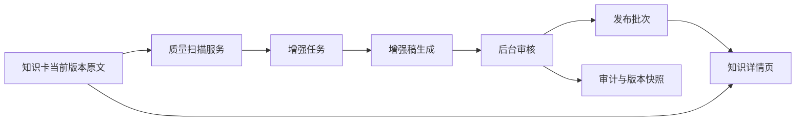

# 知识卡内容增强设计

Feature Name: knowledge-content-enrichment
Updated: 2026-09-08

## Description

知识卡增强功能读取 `knowledge_item_versions.content` 的完整原文，生成结构化增强稿。增强稿独立保存、独立审核和独立发布，原始正文保持可见、可核对和可回退。

## Architecture

增强内容通过独立表保存，关联知识ID和源版本ID。详情接口同时返回原文、发布稿、增强状态和审计元数据；员工端只读取已发布增强稿。

## Components and Interfaces

- `KnowledgeEnrichmentScanner`：扫描完整正文并输出缺失字段、任务类型、风险初判和源哈希。
- `KnowledgeEnrichmentTemplate`：按内容类型定义必需字段和输出顺序。
- `KnowledgeEnrichmentService`：创建任务、保存增强稿、执行幂等校验和状态迁移。
- `KnowledgeEnrichmentReviewService`：提供原文与增强稿对照、字段编辑、通过、退回和审计。
- `KnowledgeEnrichmentReleaseService`：执行批次校验、发布、回退和发布报告。
- `GET /api/admin/knowledge-enrichment/index.php`：后台任务、详情和审计读取。
- `POST /api/admin/knowledge-enrichment/index.php`：生成、编辑、审核、发布和回退操作。
- `GET /api/knowledge/detail.php`：在现有详情响应中增加发布稿和增强状态字段。

## Data Models

`knowledge_enrichment_records` 保存：

- `id`、`knowledge_item_id`、`source_version_id`、`source_content_sha256`
- `content_type`、`task_type`、`missing_fields_json`、`risk_flags_json`
- `enriched_content_json`、`enriched_content_sha256`
- `enrichment_status`、`review_status`、`release_batch_id`
- `reviewed_by`、`reviewed_at`、`review_note`、`created_at`、`updated_at`

状态集合：`scanned`、`draft`、`needs_review`、`approved`、`published`、`rejected`、`stale`、`failed`。

发布读取规则：当前版本存在且哈希一致的 `published` 增强稿优先；其余情况读取当前版本原文。历史详情按指定版本读取对应原文和对应增强稿。

## Correctness Properties

1. 每条增强记录必须关联一个存在的知识ID、版本ID和64位正文SHA256。
2. 源版本ID或正文SHA256变化后，旧增强稿不能保持可发布状态。
3. 员工端只能读取 `published` 状态的增强稿。
4. 发布批次中的每条记录必须通过版本、哈希、引用和审核状态校验。
5. 回退操作必须保留增强稿、审核记录和发布批次审计。
6. 原文读取结果在增强任务创建、审核和回退前后一致。

## Error Handling

- 原文为空：创建 `source_missing` 风险并进入人工处理。
- 源版本失效：将增强稿置为 `stale`，详情页回退原文。
- 生成失败：保存失败原因和重试次数，员工端继续读取原文。
- 引用缺失：阻止审核通过并返回字段级错误。
- 发布校验失败：阻止单条记录进入批次，报告具体知识ID和失败原因。
- 并发编辑：使用状态版本返回冲突错误，要求重新读取当前稿件。

## Test Strategy

- PHP 单元测试覆盖扫描规则、状态机、哈希校验、回退和发布门禁。
- Node 契约测试覆盖后台接口、详情接口、前台增强状态和安全渲染。
- 属性测试覆盖版本变化、正文变化、重复扫描、批次顺序变化和回退幂等性。
- 100张混合内容类型试点覆盖动作、感觉统合、体能、教学方法、儿童发展和家长沟通卡。
- 生产只读验证检查员工可见性、发布批次计数、原文回退和移动端布局。

## References

- `api/knowledge/detail.php`：现有知识详情及完整正文读取逻辑。
- `api/knowledge/EmployeeKnowledgeVisibilityQuery.php`：员工端当前版本可见性边界。
- `api/admin/knowledge/index.php`：现有知识治理和审计入口。
- `database/knowledge_reviewed_taxonomy.v1.json`：现有版本化知识分类快照。
