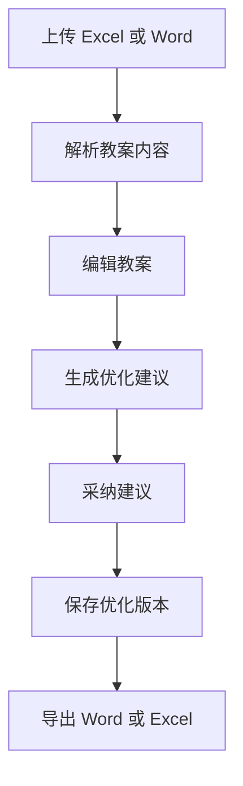

# 教案上传与优化技术规划

Feature Name: lesson-upload-optimization
Updated: 2026-09-08

## 设计原则

模块先独立完成教案上传和优化闭环，内部数据保留版本与状态，为后续审核后台提供扩展接口。用户界面只展示教练完成任务所需的信息。

## 模块流程

## 组件

- `LessonSubmissionService`：处理上传、格式校验、解析和教案主体状态。
- `LessonWorkbookParser`：解析 Excel 文件。
- `LessonWordParser`：解析 Word 文件。
- `LessonKnowledgeMatcher`：根据教案内容生成动作、游戏和安全建议。
- `LessonDraftService`：保存结构化教案版本。
- `LessonSuggestionService`：处理建议采纳和忽略。
- `LessonExportService`：导出当前版本和独立建议报告。

## 页面

教练页面保留以下区域：

- 上传文件。
- 教案正文编辑区。
- “开始优化”按钮。
- 优化建议列表。
- “采纳”按钮。
- 保存和导出按钮。

知识卡编号、内部匹配维度、审核台和工作量数据暂不展示。

## 数据边界

- 原始文件作为不可变来源文件保存。
- 结构化教案以版本形式保存。
- 优化建议绑定具体版本。
- 采纳建议创建新版本。
- 导出始终读取当前版本。

## 接口规划

- `create.php`：创建教案记录。
- `upload.php`：上传原始文件。
- `parse.php`：解析文件。
- `detail.php`：读取当前教案。
- `draft.php`：保存教案版本。
- `optimize.php`：生成优化建议。
- `suggestion-decision.php`：采纳或忽略建议。
- `export.php`：生成导出文件。

## 后续扩展接口

当前版本保留教案状态和版本字段，后续可以增加：

- `submit.php`：提交店长审核。
- 店长审核和教学主管审核接口。
- 审核台按门店、教练和日期查询。
- 教案完成情况与工作量系统的事件对接。

## 验证策略

- 验证 Excel、Word、`.xls` 和 `.doc` 的上传与解析。
- 验证建议数量、建议类别和可执行内容。
- 验证采纳后目标字段变化并生成新版本。
- 验证原始文件和原始版本保持可读取。
- 验证导出的 Word、Excel 与当前版本一致。
